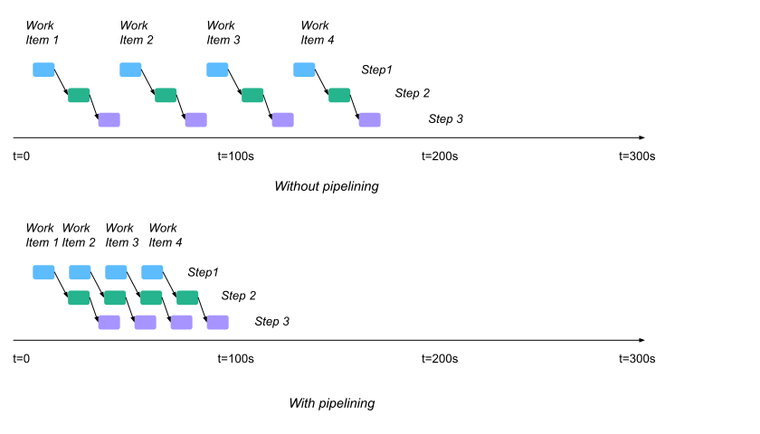

Pattern: Using pipelining to increase throughput
================================================

If you have multiple work items and each requires several steps to complete,
you can use the `pipelining <https://en.wikipedia.org/wiki/Pipeline_(computing)>`__ technique to improve the cluster utilization and increase the throughput of your system.

.. note::

  Pipelining is an important technique to improve the performance and is heavily used by Ray libraries.
  See :ref:`Ray Data <data>` as an example.

Example use case
----------------

A component of your application needs to do both compute-intensive work and communicate with other processes.
Ideally, you want to overlap computation and communication to saturate the CPU and increase the overall throughput.

Code example
------------

.. literalinclude:: ../doc_code/pattern_pipelining.py

In the preceding example, a worker actor pulls work off of a queue and then does some computation on it.
Without pipelining, the code calls :func:`ray.get() <ray.get>` immediately after requesting a work item, so it blocks while that RPC is in flight, causing idle CPU time.
With pipelining, the code instead preemptively requests the next work item before processing the current one, so it can use the CPU while the RPC is in flight which increases the CPU utilization.
