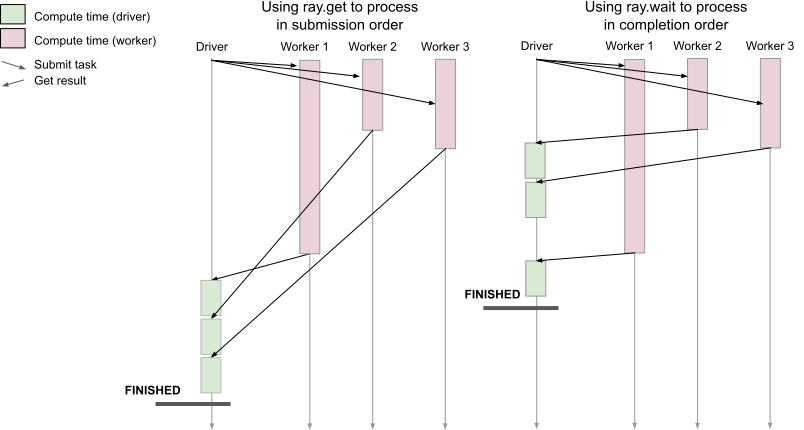

Anti-pattern: Processing results in submission order using ray.get increases runtime
====================================================================================

**TLDR:** Avoid processing independent results in submission order using :ref:`ray.get() <ray-get-ref>` since results may be ready in a different order than the submission order.

A batch of tasks is submitted, and we need to process their results individually once they’re done.
If each task takes a different amount of time to finish and we process results in submission order, we may waste time waiting for all of the slower (straggler) tasks that were submitted earlier to finish while later faster tasks have already finished.

Instead, we want to process the tasks in the order that they finish using :ref:`ray.wait() <ray-wait-ref>` to speed up total time to completion.

    Processing results in submission order vs completion order

Code example
------------

.. literalinclude:: ../doc_code/anti_pattern_ray_get_submission_order.py
    :language: python
    :start-after: __anti_pattern_start__
    :end-before: __anti_pattern_end__

Other ``ray.get()`` related anti-patterns are:

- :doc:`unnecessary-ray-get`
- :doc:`ray-get-loop`
