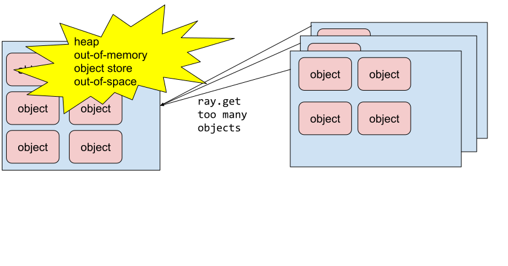

Anti-pattern: Fetching too many objects at once with ray.get causes failure
===========================================================================

**TLDR:** Avoid calling :ref:`ray.get() <ray-get-ref>` on too many objects since this will lead to heap out-of-memory or object store out-of-space. Instead fetch and process one batch at a time.

If you have a large number of tasks that you want to run in parallel, trying to do ``ray.get()`` on all of them at once could lead to failure with heap out-of-memory or object store out-of-space since Ray needs to fetch all the objects to the caller at the same time.
Instead you should get and process the results one batch at a time. Once a batch is processed, Ray will evict objects in that batch to make space for future batches.

    Fetching too many objects at once with ``ray.get()``

Code example
------------

**Anti-pattern:**

.. literalinclude:: ../doc_code/anti_pattern_ray_get_too_many_objects.py
    :language: python
    :start-after: __anti_pattern_start__
    :end-before: __anti_pattern_end__

**Better approach:**

.. literalinclude:: ../doc_code/anti_pattern_ray_get_too_many_objects.py
    :language: python
    :start-after: __better_approach_start__
    :end-before: __better_approach_end__

Here besides getting one batch at a time to avoid failure, we are also using ``ray.wait()`` to process results in the finish order instead of the submission order to reduce the runtime. See :doc:`ray-get-submission-order` for more details.
