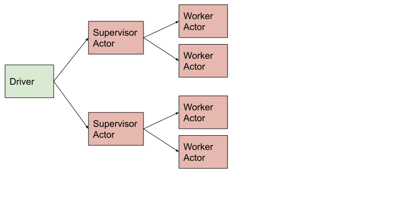

Pattern: Using a supervisor actor to manage a tree of actors
============================================================

Actor supervision is a pattern that a supervising Ray actor manages a collection of Ray worker actors.
The supervisor delegates tasks to subordinates and handles their failures.
This pattern simplifies the driver since it only needs to manage a few supervisors instead of a lot of worker actors
and doesn't need to deal with failures from worker actors directly.
Furthermore, multiple supervisors can act in parallel to parallelize more work.

    Tree of actors

.. note::

    - If the supervisor dies (or the driver), the worker actors are automatically terminated thanks to actor reference counting.
    - Actors can be nested to multiple levels to form a tree.

Example use case
----------------

You want to do data parallel training and train the same model with different hyperparameters in parallel.
For each hyperparameter, you can launch a supervisor actor to do the orchestration and it will create worker actors to do the actual training per data shard.

Code example
------------

.. literalinclude:: ../doc_code/pattern_tree_of_actors.py
    :language: python
