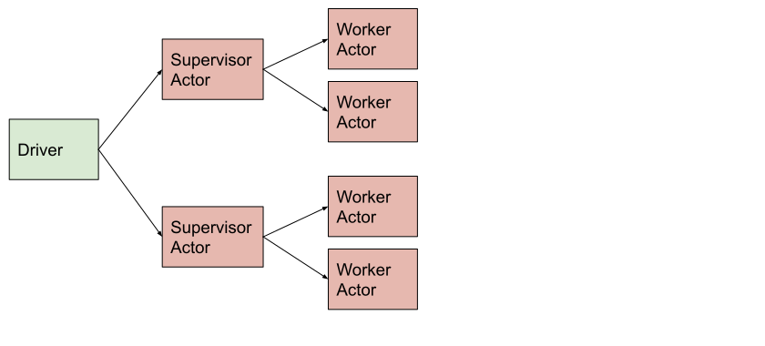

Pattern: Using a supervisor actor to manage a tree of actors
============================================================

In this pattern, a collection of Ray worker actors is managed by a supervisory Ray actor.
A single call to the supervisor actor triggers the dispatch of multiple method calls to child actors.
The supervisor can process results or update child actors prior to returning.

    Tree of actors

.. note::

    - If the supervisor dies (or the driver), the worker actors are automatically terminated thanks to actor reference counting.
    - Actors can be nested to multiple levels to form a tree.
    - Multiple supervisor actors can be used to form a forest.

Example use case
----------------

You want to train 3 models at the same time, while being able to checkpoint/inspect its state.

For example, Ray Tune uses this pattern to run each trail.

Code example
------------

.. literalinclude:: ../doc_code/pattern_tree_of_actors.py
    :language: python
