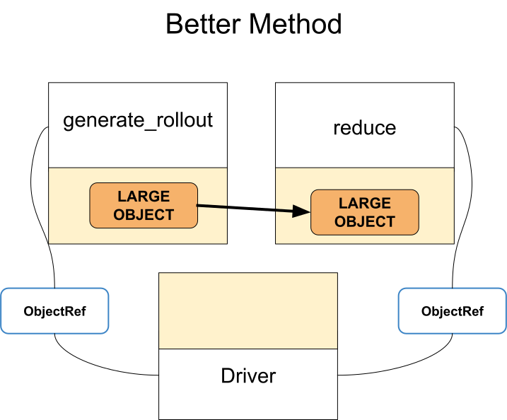

Anti-pattern: Calling ray.get unnecessarily harms performance
=============================================================

**TLDR:** Avoid calling :ref:`ray.get() <ray-get-ref>` unnecessarily for intermediate steps. Work with object references directly, and only call ``ray.get()`` at the end to get the final result.

When ``ray.get()`` is called, objects must be transferred to the worker/node that calls ``ray.get()``. If you don't need to manipulate the object, you probably don't need to call ``ray.get()`` on it!

Typically, it’s a best practice to wait as long as possible before calling ``ray.get()``, or even design your program to avoid having to call ``ray.get()`` at all.

Code example
------------

**Anti-pattern:**

.. literalinclude:: ../doc_code/anti_pattern_unnecessary_ray_get.py
    :language: python
    :start-after: __anti_pattern_start__
    :end-before: __anti_pattern_end__

.. figure:: ../images/unnecessary-ray-get-anti.svg

**Better approach:**

.. literalinclude:: ../doc_code/anti_pattern_unnecessary_ray_get.py
    :language: python
    :start-after: __better_approach_start__
    :end-before: __better_approach_end__

Notice in the anti-pattern example, we call ``ray.get()`` which forces us to transfer the large rollout to the driver, then to *reducer* after that.

In the fixed version, we only pass the reference to the object to the *reducer*.
The ``reducer`` implicitly calls ``ray.get()`` once to fetch the actual rollout data and pass it to ``reduce()``, which means the data is passed directly from ``generate_rollout()`` to ``reduce()``, avoiding the driver.
