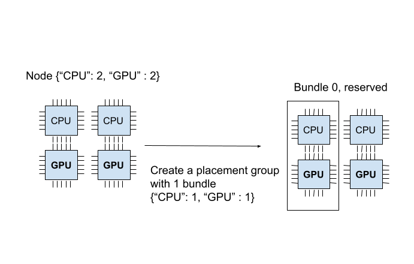
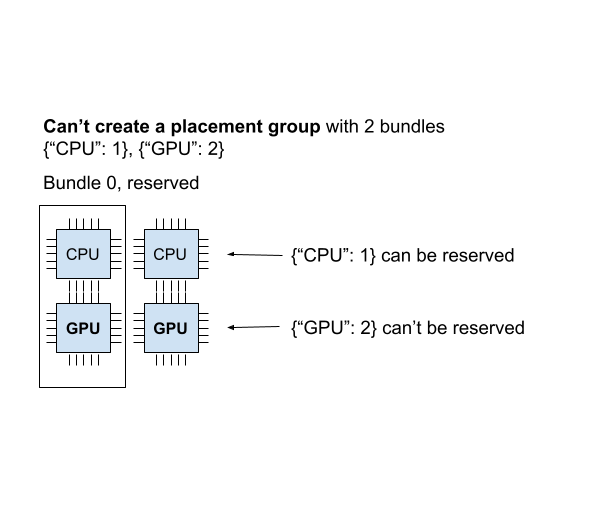
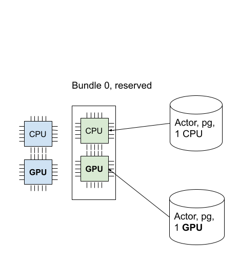
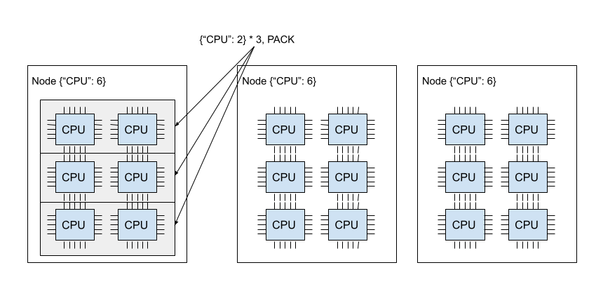
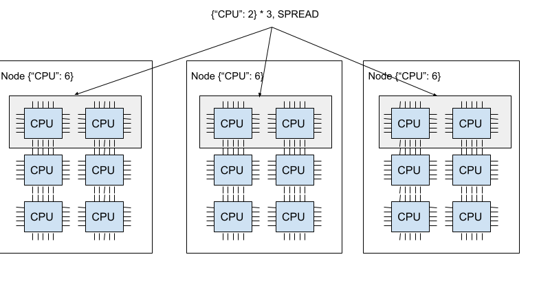
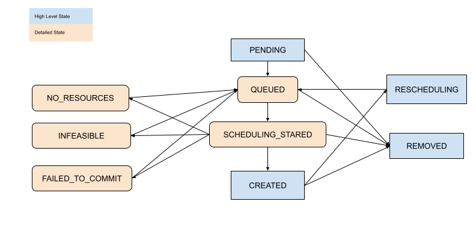

Placement Groups
================

.. _ray-placement-group-doc-ref:

Placement groups allow users to atomically reserve groups of resources across multiple nodes (i.e., gang scheduling).
They can be then used to schedule Ray tasks and actors packed as close as possible for locality (PACK), or spread apart 
(SPREAD). Placement groups are generally used for gang-scheduling actors, but also support tasks.

Here are some real-world use cases:

- **Distributed Machine Learning Training**: Distributed Training (e.g., :ref:`Ray Train <train-docs>` and :ref:`Ray Tune <tune-main>`) uses the placement group APIs to enable gang scheduling. In these settings, all resources for a trial must be available at the same time. Gang scheduling is a critical technique to enable all-or-nothing scheduling for deep learning training. 
- **Fault tolerance in distributed training**: Placement groups can be used to configure fault tolerance. In Ray Tune, it can be beneficial to pack related resources from a single trial together, so that a node failure impacts a low number of trials. In libraries that support elastic training (e.g., XGBoost-Ray), spreading the resources across multiple nodes can help to ensure that training continues even when a node dies.

Key Concepts
------------

Bundles
~~~~~~~

A **bundle** is a collection of "resources". It could be a single resource, ``{"CPU": 1}``, or a group of resources, ``{"CPU": 1, "GPU": 4}``. 
A bundle is a unit of reservation for placement groups. "Scheduling a bundle" means we find a node that fits the bundle and reserve the resources specified by the bundle. 
A bundle must be able to fit on a single node on the Ray cluster. For example, if you only have an 8 CPU node, and if you have a bundle that requires ``{"CPU": 9}``, this bundle cannot be scheduled.

Placement Group
~~~~~~~~~~~~~~~

A **placement group** reserves the resources from the cluster. The reserved resources can only be used by tasks or actors that use the :ref:`PlacementGroupSchedulingStrategy <ray-placement-group-schedule-tasks-actors-ref>`.

- Placement groups are represented by a list of bundles. For example, ``{"CPU": 1} * 4`` means you'd like to reserve 4 bundles of 1 CPU (i.e., it reserves 4 CPUs).
- Bundles are then placed according to the :ref:`placement strategies <pgroup-strategy>` across nodes on the cluster.
- After the placement group is created, tasks or actors can be then scheduled according to the placement group and even on individual bundles.

Create a Placement Group (Reserve Resources)
--------------------------------------------

You can create a placement group using :func:`ray.util.placement_group() <ray.util.placement_group.placement_group>`. 
Placement groups take in a list of bundles and a :ref:`placement strategy <pgroup-strategy>`. 
Note that each bundle must be able to fit on a single node on the Ray cluster.
For example, if you only have a 8 CPU node, and if you have a bundle that requires ``{"CPU": 9}``,
this bundle cannot be scheduled.

Bundles are specified by a list of dictionaries, e.g., ``[{"CPU": 1}, {"CPU": 1, "GPU": 1}]``).

- ``CPU`` corresponds to ``num_cpus`` as used in :func:`ray.remote <ray.remote>`.
- ``GPU`` corresponds to ``num_gpus`` as used in :func:`ray.remote <ray.remote>`.
- ``memory`` corresponds to ``memory`` as used in :func:`ray.remote <ray.remote>`
- Other resources corresponds to ``resources`` as used in :func:`ray.remote <ray.remote>` (E.g., ``ray.init(resources={"disk": 1})`` can have a bundle of ``{"disk": 1}``).

Placement group scheduling is asynchronous. The `ray.util.placement_group` returns immediately.

.. tab-set::

    .. tab-item:: Python

        .. literalinclude:: ../doc_code/placement_group_example.py
            :language: python
            :start-after: __create_pg_start__
            :end-before: __create_pg_end__

    .. tab-item:: Java

        .. code-block:: java

          // Initialize Ray.
          Ray.init();

          // Construct a list of bundles.
          Map<String, Double> bundle = ImmutableMap.of("CPU", 1.0);
          List<Map<String, Double>> bundles = ImmutableList.of(bundle);

          // Make a creation option with bundles and strategy.
          PlacementGroupCreationOptions options =
            new PlacementGroupCreationOptions.Builder()
              .setBundles(bundles)
              .setStrategy(PlacementStrategy.STRICT_SPREAD)
              .build();

          PlacementGroup pg = PlacementGroups.createPlacementGroup(options);

    .. tab-item:: C++

        .. code-block:: c++

          // Initialize Ray.
          ray::Init();

          // Construct a list of bundles.
          std::vector<std::unordered_map<std::string, double>> bundles{{{"CPU", 1.0}}};

          // Make a creation option with bundles and strategy.
          ray::internal::PlacementGroupCreationOptions options{
              false, "my_pg", bundles, ray::internal::PlacementStrategy::PACK};

          ray::PlacementGroup pg = ray::CreatePlacementGroup(options);

You can block your program until the placement group is ready using one of two APIs:

* :func:`ready <ray.util.placement_group.PlacementGroup.ready>`, which is compatible with ``ray.get``
* :func:`wait <ray.util.placement_group.PlacementGroup.wait>`, which blocks the program until the placement group is ready)

.. tab-set::

    .. tab-item:: Python

        .. literalinclude:: ../doc_code/placement_group_example.py
            :language: python
            :start-after: __ready_pg_start__
            :end-before: __ready_pg_end__

    .. tab-item:: Java

        .. code-block:: java

          // Wait for the placement group to be ready within the specified time(unit is seconds).
          boolean ready = pg.wait(60);
          Assert.assertTrue(ready);

          // You can look at placement group states using this API.
          List<PlacementGroup> allPlacementGroup = PlacementGroups.getAllPlacementGroups();
          for (PlacementGroup group: allPlacementGroup) {
            System.out.println(group);
          }

    .. tab-item:: C++

        .. code-block:: c++

          // Wait for the placement group to be ready within the specified time(unit is seconds).
          bool ready = pg.Wait(60);
          assert(ready);

          // You can look at placement group states using this API.
          std::vector<ray::PlacementGroup> all_placement_group = ray::GetAllPlacementGroups();
          for (const ray::PlacementGroup &group : all_placement_group) {
            std::cout << group.GetName() << std::endl;
          }

Let's verify the placement group is successfully created.

.. code-block:: bash

  # This API is only available when you download Ray via `pip install "ray[default]"`
  ray list placement-groups

.. code-block:: bash

  ======== List: 2023-04-07 01:15:05.682519 ========
  Stats:
  ------------------------------
  Total: 1

  Table:
  ------------------------------
      PLACEMENT_GROUP_ID                    NAME      CREATOR_JOB_ID  STATE
  0  3cd6174711f47c14132155039c0501000000                  01000000  CREATED

The placement group is successfully created. Out of the ``{"CPU": 2, "GPU": 2}`` resources, the placement group reserves ``{"CPU": 1, "GPU": 1}``. 
The reserved resources can only be used when you schedule tasks or actors with a placement group.
The diagram below demonstrates the "1 CPU and 1 GPU" bundle that the placement group reserved.

Placement groups are atomically created; if a bundle cannot fit in any of the current nodes, 
the entire placement group is not ready and no resources are reserved.
To illustrate, let's create another placement group that requires ``{"CPU":1}, {"GPU": 2}`` (2 bundles).

.. tab-set::

    .. tab-item:: Python

        .. literalinclude:: ../doc_code/placement_group_example.py
            :language: python
            :start-after: __create_pg_failed_start__
            :end-before: __create_pg_failed_end__

You can verify the new placement group is pending creation.

.. code-block:: bash

  # This API is only available when you download Ray via `pip install "ray[default]"`
  ray list placement-groups

.. code-block:: bash

  ======== List: 2023-04-07 01:16:23.733410 ========
  Stats:
  ------------------------------
  Total: 2

  Table:
  ------------------------------
      PLACEMENT_GROUP_ID                    NAME      CREATOR_JOB_ID  STATE
  0  3cd6174711f47c14132155039c0501000000                  01000000  CREATED
  1  e1b043bebc751c3081bddc24834d01000000                  01000000  PENDING <---- the new placement group.

You can also verify that the ``{"CPU": 1, "GPU": 2}`` bundles cannot be allocated, using the ``ray status`` CLI command.

.. code-block:: bash

  ray status

.. code-block:: bash

  Resources
  ---------------------------------------------------------------
  Usage:
  0.0/2.0 CPU (0.0 used of 1.0 reserved in placement groups)
  0.0/2.0 GPU (0.0 used of 1.0 reserved in placement groups)
  0B/3.46GiB memory
  0B/1.73GiB object_store_memory

  Demands:
  {'CPU': 1.0} * 1, {'GPU': 2.0} * 1 (PACK): 1+ pending placement groups <--- 1 placement group is pending creation.

The current cluster has ``{"CPU": 2, "GPU": 2}``. We already created a ``{"CPU": 1, "GPU": 1}`` bundle, so only ``{"CPU": 1, "GPU": 1}`` is left in the cluster.
If we create 2 bundles ``{"CPU": 1}, {"GPU": 2}``, we can create a first bundle successfully, but can't schedule the second bundle.
Since we cannot create every bundle on the cluster, the placement group is not created, including the ``{"CPU": 1}`` bundle.

When the placement group cannot be scheduled in any way, it is called "infeasible". 
Imagine you schedule ``{"CPU": 4}`` bundle, but you only have a single node with 2 CPUs. There's no way to create this bundle in your cluster.
The Ray Autoscaler is aware of placement groups, and auto-scales the cluster to ensure pending groups can be placed as needed. 

If Ray Autoscaler cannot provide resources to schedule a placement group, Ray does *not* print a warning about infeasible groups and tasks and actors that use the groups. 
You can observe the scheduling state of the placement group from the :ref:`dashboard or state APIs <ray-placement-group-observability-ref>`.

.. _ray-placement-group-schedule-tasks-actors-ref:

Schedule Tasks and Actors to Placement Groups (Use Reserved Resources)
----------------------------------------------------------------------

In the previous section, we created a placement group that reserved ``{"CPU": 1, "GPU: 1"}`` from a 2 CPU and 2 GPU node.

Now let's schedule an actor to the placement group. 
You can schedule actors or tasks to a placement group using
:class:`options(scheduling_strategy=PlacementGroupSchedulingStrategy(...)) <ray.util.scheduling_strategies.PlacementGroupSchedulingStrategy>`.

.. tab-set::

    .. tab-item:: Python

        .. literalinclude:: ../doc_code/placement_group_example.py
            :language: python
            :start-after: __schedule_pg_start__
            :end-before: __schedule_pg_end__

    .. tab-item:: Java

        .. code-block:: java

          public static class Counter {
            private int value;

            public Counter(int initValue) {
              this.value = initValue;
            }

            public int getValue() {
              return value;
            }

            public static String ping() {
              return "pong";
            }
          }

          // Create GPU actors on a gpu bundle.
          for (int index = 0; index < 1; index++) {
            Ray.actor(Counter::new, 1)
              .setPlacementGroup(pg, 0)
              .remote();
          }

    .. tab-item:: C++

        .. code-block:: c++

          class Counter {
          public:
            Counter(int init_value) : value(init_value){}
            int GetValue() {return value;}
            std::string Ping() {
              return "pong";
            }
          private:
            int value;
          };

          // Factory function of Counter class.
          static Counter *CreateCounter() {
            return new Counter();
          };

          RAY_REMOTE(&Counter::Ping, &Counter::GetValue, CreateCounter);

          // Create GPU actors on a gpu bundle.
          for (int index = 0; index < 1; index++) {
            ray::Actor(CreateCounter)
              .SetPlacementGroup(pg, 0)
              .Remote(1);
          }

.. note::

  When you use an actor with a placement group, always specify ``num_cpus``.

  When you don't specify (e.g., ``num_cpus=0``), a placement group option is ignored,
  and the task and actor don't use the reserved resources.
  
  Note that by default (with no arguments to ``ray.remote``),

  - Ray task requires 1 CPU
  - Ray actor requires 1 CPU when it is scheduled. But after it is created, it occupies 0 CPU.

  When scheduling an actor without resource requirements and a placement group, the placement group has to be created (since it requires 1 CPU to be scheduled).
  However, when the actor is created, it ignores the placement group.

The actor is scheduled now! One bundle can be used by multiple tasks and actors (i.e., the bundle to task (or actor) is a one-to-many relationship). 
In this case, since the actor uses 1 CPU, 1 GPU remains from the bundle. 
You can verify this from the CLI command ``ray status``. You can see the 1 CPU is reserved by the placement group, and 1.0 is used (by the actor we created).

.. code-block:: bash

  ray status

.. code-block:: bash

  Resources
  ---------------------------------------------------------------
  Usage:
  1.0/2.0 CPU (1.0 used of 1.0 reserved in placement groups) <---
  0.0/2.0 GPU (0.0 used of 1.0 reserved in placement groups)
  0B/4.29GiB memory
  0B/2.00GiB object_store_memory

  Demands:
  (no resource demands)

You can also verify the actor is created using ``ray list actors``.

.. code-block:: bash

  # This API is only available when you download Ray via `pip install "ray[default]"`
  ray list actors --detail

.. code-block:: bash

  -   actor_id: b5c990f135a7b32bfbb05e1701000000
      class_name: Actor
      death_cause: null
      is_detached: false
      job_id: '01000000'
      name: ''
      node_id: b552ca3009081c9de857a31e529d248ba051a4d3aeece7135dde8427
      pid: 8795
      placement_group_id: d2e660ac256db230dbe516127c4a01000000 <------
      ray_namespace: e5b19111-306c-4cd8-9e4f-4b13d42dff86
      repr_name: ''
      required_resources:
          CPU_group_d2e660ac256db230dbe516127c4a01000000: 1.0
      serialized_runtime_env: '{}'
      state: ALIVE

Since 1 GPU remains, let's create a new actor that requires 1 GPU.
This time, we also specify the ``placement_group_bundle_index``. Each bundle is given an "index" within the placement group.
For example, a placement group of 2 bundles ``[{"CPU": 1}, {"GPU": 1}]`` has index 0 bundle ``{"CPU": 1}`` 
and index 1 bundle ``{"GPU": 1}``. Since we only have 1 bundle, we only have index 0. If you don't specify a bundle, the actor (or task)
is scheduled on a random bundle that has unallocated reserved resources.

.. tab-set::

    .. tab-item:: Python

        .. literalinclude:: ../doc_code/placement_group_example.py
            :language: python
            :start-after: __schedule_pg_3_start__
            :end-before: __schedule_pg_3_end__

We succeed to schedule the GPU actor! The below image describes 2 actors scheduled into the placement group. 

You can also verify that the reserved resources are all used, with the ``ray status`` command.

.. code-block:: bash

  ray status

.. code-block:: bash

  Resources
  ---------------------------------------------------------------
  Usage:
  1.0/2.0 CPU (1.0 used of 1.0 reserved in placement groups)
  1.0/2.0 GPU (1.0 used of 1.0 reserved in placement groups) <----
  0B/4.29GiB memory
  0B/2.00GiB object_store_memory

.. _pgroup-strategy:

Placement Strategy
------------------

One of the features the placement group provides is to add placement constraints among bundles.

For example, you'd like to pack your bundles to the same
node or spread out to multiple nodes as much as possible. You can specify the strategy via ``strategy`` argument.
This way, you can make sure your actors and tasks can be scheduled with certain placement constraints.

The example below creates a placement group with 2 bundles with a PACK strategy;
both bundles have to be created in the same node. Note that it is a soft policy. If the bundles cannot be packed
into a single node, they are spread to other nodes. If you'd like to avoid the problem, you can instead use `STRICT_PACK` 
policies, which fail to create placement groups if placement requirements cannot be satisfied.

.. literalinclude:: ../doc_code/placement_group_example.py
    :language: python
    :start-after: __strategy_pg_start__
    :end-before: __strategy_pg_end__

The image below demonstrates the PACK policy. Three of the ``{"CPU": 2}`` bundles are located in the same node.

The image below demonstrates the SPREAD policy. Each of three of the ``{"CPU": 2}`` bundles are located in three different nodes.

Ray supports four placement group strategies. The default scheduling policy is ``PACK``.

**STRICT_PACK**

All bundles must be placed into a single node on the cluster. Use this strategy when you want to maximize the locality.

**PACK**

All provided bundles are packed onto a single node on a best-effort basis.
If strict packing is not feasible (i.e., some bundles do not fit on the node), bundles can be placed onto other nodes.

**STRICT_SPREAD**

Each bundle must be scheduled in a separate node.

**SPREAD**

Each bundle is spread onto separate nodes on a best-effort basis.
If strict spreading is not feasible, bundles can be placed on overlapping nodes.

Remove Placement Groups (Free Reserved Resources)
-------------------------------------------------

By default, a placement group's lifetime is scoped to the driver that creates placement groups 
(unless you make it a :ref:`detached placement group <placement-group-detached>`). When the placement group is created from
a :ref:`detached actor <actor-lifetimes>`, the lifetime is scoped to the detached actor.
In Ray, the driver is the Python script that calls ``ray.init``.

Reserved resources (bundles) from the placement group are automatically freed when the driver or detached actor
that creates placement group exits. To free the reserved resources manually, remove the placement
group using the :func:`remove_placement_group <ray.util.remove_placement_group>` API (which is also an asynchronous API).

.. note::

  When you remove the placement group, actors or tasks that still use the reserved resources are
  forcefully killed.

.. tab-set::

    .. tab-item:: Python

        .. literalinclude:: ../doc_code/placement_group_example.py
            :language: python
            :start-after: __remove_pg_start__
            :end-before: __remove_pg_end__

    .. tab-item:: Java

        .. code-block:: java

          PlacementGroups.removePlacementGroup(placementGroup.getId());

          PlacementGroup removedPlacementGroup = PlacementGroups.getPlacementGroup(placementGroup.getId());
          Assert.assertEquals(removedPlacementGroup.getState(), PlacementGroupState.REMOVED);

    .. tab-item:: C++

        .. code-block:: c++

          ray::RemovePlacementGroup(placement_group.GetID());

          ray::PlacementGroup removed_placement_group = ray::GetPlacementGroup(placement_group.GetID());
          assert(removed_placement_group.GetState(), ray::PlacementGroupState::REMOVED);

.. _ray-placement-group-observability-ref:

Observe and Debug Placement Groups
----------------------------------

Ray provides several useful tools to inspect the placement group states and resource usage.

- **Ray Status** is a CLI tool for viewing the resource usage and scheduling resource requirements of placement groups.
- **Ray Dashboard** is a UI tool for inspecting placement group states.
- **Ray State API** is a CLI for inspecting placement group states.

.. tab-set::

    .. tab-item:: ray status (CLI)

      The CLI command ``ray status`` provides the autoscaling status of the cluster.
      It provides the "resource demands" from unscheduled placement groups as well as the resource reservation status.

      .. code-block:: bash

        Resources
        ---------------------------------------------------------------
        Usage:
        1.0/2.0 CPU (1.0 used of 1.0 reserved in placement groups)
        0.0/2.0 GPU (0.0 used of 1.0 reserved in placement groups)
        0B/4.29GiB memory
        0B/2.00GiB object_store_memory

    .. tab-item:: Dashboard

      The :ref:`dashboard job view <dash-jobs-view>` provides the placement group table that displays the scheduling state and metadata of the placement group.

      .. note::

        Ray dashboard is only available when you install Ray is with ``pip install "ray[default]"``.

    .. tab-item:: Ray State API

      :ref:`Ray state API <state-api-overview-ref>` is a CLI tool for inspecting the state of Ray resources (tasks, actors, placement groups, etc.).

      ``ray list placement-groups`` provides the metadata and the scheduling state of the placement group.
      ``ray list placement-groups --detail`` provides statistics and scheduling state in a greater detail.

      .. note::

        State API is only available when you install Ray is with ``pip install "ray[default]"``

Inspect Placement Group Scheduling State
~~~~~~~~~~~~~~~~~~~~~~~~~~~~~~~~~~~~~~~~

With the above tools, you can see the state of the placement group. The definition of states are specified in the following files:

- `High level state <https://github.com/ray-project/ray/blob/03a9d2166988b16b7cbf51dac0e6e586455b28d8/src/ray/protobuf/gcs.proto#L579>`_
- `Details <https://github.com/ray-project/ray/blob/03a9d2166988b16b7cbf51dac0e6e586455b28d8/src/ray/protobuf/gcs.proto#L524>`_

[Advanced] Child Tasks and Actors
---------------------------------

By default, child actors and tasks don't share the same placement group that the parent uses.
To automatically schedule child actors or tasks to the same placement group,
set ``placement_group_capture_child_tasks`` to True.

.. tab-set::

    .. tab-item:: Python

        .. literalinclude:: ../doc_code/placement_group_capture_child_tasks_example.py
          :language: python
          :start-after: __child_capture_pg_start__
          :end-before: __child_capture_pg_end__

    .. tab-item:: Java

        It's not implemented for Java APIs yet.

When ``placement_group_capture_child_tasks`` is True, but you don't want to schedule
child tasks and actors to the same placement group, specify ``PlacementGroupSchedulingStrategy(placement_group=None)``.

.. literalinclude:: ../doc_code/placement_group_capture_child_tasks_example.py
  :language: python
  :start-after: __child_capture_disable_pg_start__
  :end-before: __child_capture_disable_pg_end__

[Advanced] Named Placement Group
--------------------------------

A placement group can be given a globally unique name.
This allows you to retrieve the placement group from any job in the Ray cluster.
This can be useful if you cannot directly pass the placement group handle to
the actor or task that needs it, or if you are trying to
access a placement group launched by another driver.
Note that the placement group is still destroyed if its lifetime isn't `detached`.

.. tab-set::

    .. tab-item:: Python

        .. literalinclude:: ../doc_code/placement_group_example.py
            :language: python
            :start-after: __get_pg_start__
            :end-before: __get_pg_end__

    .. tab-item:: Java

        .. code-block:: java

          // Create a placement group with a unique name.
          Map<String, Double> bundle = ImmutableMap.of("CPU", 1.0);
          List<Map<String, Double>> bundles = ImmutableList.of(bundle);

          PlacementGroupCreationOptions options =
            new PlacementGroupCreationOptions.Builder()
              .setBundles(bundles)
              .setStrategy(PlacementStrategy.STRICT_SPREAD)
              .setName("global_name")
              .build();

          PlacementGroup pg = PlacementGroups.createPlacementGroup(options);
          pg.wait(60);

          ...

          // Retrieve the placement group later somewhere.
          PlacementGroup group = PlacementGroups.getPlacementGroup("global_name");
          Assert.assertNotNull(group);

    .. tab-item:: C++

        .. code-block:: c++

          // Create a placement group with a globally unique name.
          std::vector<std::unordered_map<std::string, double>> bundles{{{"CPU", 1.0}}};

          ray::PlacementGroupCreationOptions options{
              true/*global*/, "global_name", bundles, ray::PlacementStrategy::STRICT_SPREAD};

          ray::PlacementGroup pg = ray::CreatePlacementGroup(options);
          pg.Wait(60);

          ...

          // Retrieve the placement group later somewhere.
          ray::PlacementGroup group = ray::GetGlobalPlacementGroup("global_name");
          assert(!group.Empty());

        We also support non-global named placement group in C++, which means that the placement group name is only valid within the job and cannot be accessed from another job.

        .. code-block:: c++

          // Create a placement group with a job-scope-unique name.
          std::vector<std::unordered_map<std::string, double>> bundles{{{"CPU", 1.0}}};

          ray::PlacementGroupCreationOptions options{
              false/*non-global*/, "non_global_name", bundles, ray::PlacementStrategy::STRICT_SPREAD};

          ray::PlacementGroup pg = ray::CreatePlacementGroup(options);
          pg.Wait(60);

          ...

          // Retrieve the placement group later somewhere in the same job.
          ray::PlacementGroup group = ray::GetPlacementGroup("non_global_name");
          assert(!group.Empty());

.. _placement-group-detached:

[Advanced] Detached Placement Group
-----------------------------------

By default, the lifetimes of placement groups belong to the driver and actor.

- If the placement group is created from a driver, it is destroyed when the driver is terminated.
- If it is created from a detached actor, it is killed when the detached actor is killed.

To keep the placement group alive regardless of its job or detached actor, specify
`lifetime="detached"`. For example:

.. tab-set::

    .. tab-item:: Python

        .. literalinclude:: ../doc_code/placement_group_example.py
            :language: python
            :start-after: __detached_pg_start__
            :end-before: __detached_pg_end__

    .. tab-item:: Java

        The lifetime argument is not implemented for Java APIs yet.

Let's terminate the current script and start a new Python script. Call ``ray list placement-groups``, and you can see the placement group is not removed.

Note that the lifetime option is decoupled from the name. If we only specified
the name without specifying ``lifetime="detached"``, then the placement group can
only be retrieved as long as the original driver is still running.
It is recommended to always specify the name when creating the detached placement group.

[Advanced] Fault Tolerance
--------------------------

.. _ray-placement-group-ft-ref:

Rescheduling Bundles on a Dead Node
~~~~~~~~~~~~~~~~~~~~~~~~~~~~~~~~~~~

If nodes that contain some bundles of a placement group die, all the bundles are rescheduled on different nodes by 
GCS (i.e., we try reserving resources again). This means that the initial creation of placement group is "atomic", 
but once it is created, there could be partial placement groups. 
Rescheduling bundles have higher scheduling priority than other placement group scheduling.

Provide Resources for Partially Lost Bundles
~~~~~~~~~~~~~~~~~~~~~~~~~~~~~~~~~~~~~~~~~~~~

If there are not enough resources to schedule the partially lost bundles, 
the placement group waits, assuming Ray Autoscaler will start a new node to satisfy the resource requirements. 
If the additinoal resources cannot be provided (e.g., you don't use the Autoscaler or the Autoscaler hits the resource limit), 
the placement group remains in the partially created state indefinitely.

Fault Tolerance of Actors and Tasks that Use the Bundle
~~~~~~~~~~~~~~~~~~~~~~~~~~~~~~~~~~~~~~~~~~~~~~~~~~~~~~~

Actors and tasks that use the bundle (reserved resources) are rescheduled based on their :ref:`fault tolerant policy <fault-tolerance>` once the
bundle is recovered.

API Reference
-------------
:ref:`Placement Group API reference <ray-placement-group-ref>`
