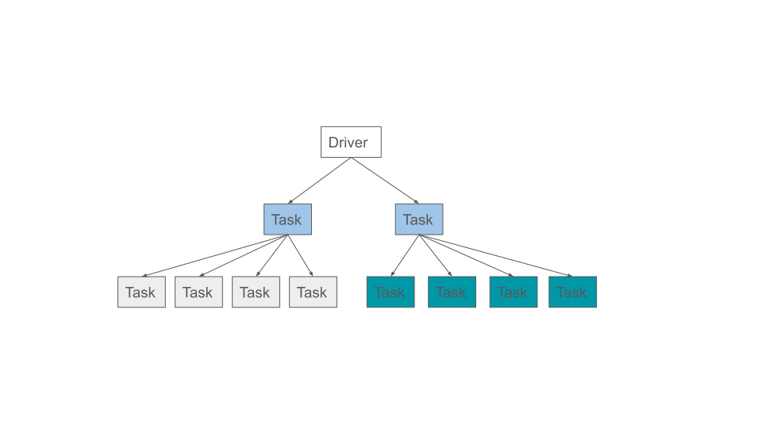
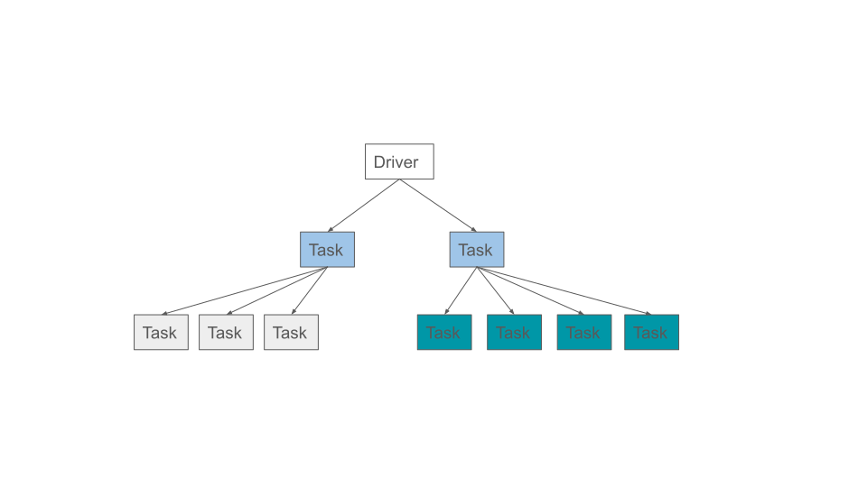
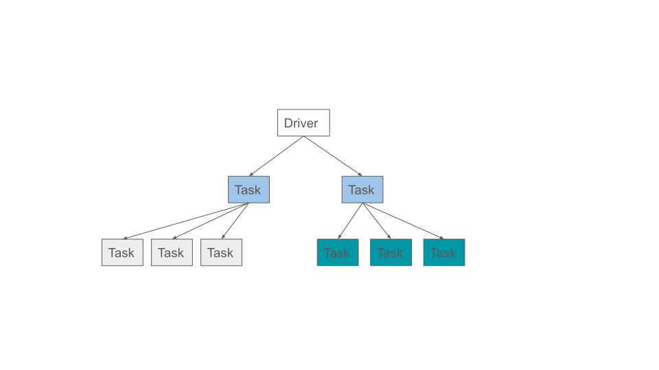

.. _ray-oom-prevention:

Out-Of-Memory Prevention
========================

If application tasks or actors consume a large amount of heap space, it can cause the node to run out of memory (OOM). When that happens, the operating system will start killing worker or raylet processes, disrupting the application. OOM may also stall metrics and if this happens on the head node, it may stall the :ref:`dashboard <observability-getting-started>` or other control processes and cause the cluster to become unusable.

In this section we will go over:

- What is the memory monitor and how it works

- How to enable and configure it

- How to use the memory monitor to detect and resolve memory issues

Also view :ref:`Debugging Out of Memory <troubleshooting-out-of-memory>` to learn how to troubleshoot out-of-memory issues.

.. _ray-oom-monitor:

What is the memory monitor?
---------------------------

The memory monitor is a component that runs within the :ref:`raylet <whitepaper>` process on each node. It periodically checks the memory usage, which includes the worker heap, the object store, and the raylet as described in :ref:`memory management <memory>`. If the combined usage exceeds a configurable threshold the raylet will kill a task or actor process to free up memory and prevent Ray from failing.

It's available on Linux and is tested with Ray running inside a container that is using cgroup v1/v2. If you encounter issues when running the memory monitor outside of a container, :ref:`file an issue or post a question <oom-questions>`.

How do I disable the memory monitor?
--------------------------------------

The memory monitor is enabled by default and can be disabled by setting the environment variable ``RAY_memory_monitor_refresh_ms`` to zero when Ray starts (e.g., RAY_memory_monitor_refresh_ms=0 ray start ...).

How do I configure the memory monitor?
--------------------------------------

The memory monitor is controlled by the following environment variables:

- ``RAY_memory_monitor_refresh_ms (int, defaults to 250)`` is the interval to check memory usage and kill tasks or actors if needed. Task killing is disabled when this value is 0. The memory monitor selects and kills one task at a time and waits for it to be killed before choosing another one, regardless of how frequent the memory monitor runs.

- ``RAY_memory_usage_threshold (float, defaults to 0.95)`` is the threshold when the node is beyond the memory
  capacity. If the memory usage is above this fraction it will start killing processes to free up memory. Ranges from [0, 1].

Using the Memory Monitor
------------------------

.. _ray-oom-retry-policy:

Retry policy
~~~~~~~~~~~~

When a task or actor is killed by the memory monitor it will be retried with exponential backoff. There is a cap on the retry delay, which is 60 seconds. If tasks are killed by the memory monitor, it retries infinitely (not respecting :ref:`max_retries <task-fault-tolerance>`). If actors are killed by the memory monitor, it doesn't recreate the actor infinitely (It respects :ref:`max_restarts <actor-fault-tolerance>`, which is 0 by default).

Worker killing policy
~~~~~~~~~~~~~~~~~~~~~

The memory monitor avoids infinite loops of task retries by ensuring at least one task is able to run for each caller on each node. If it is unable to ensure this, the workload will fail with an OOM error. Note that this is only an issue for tasks, since the memory monitor will not indefinitely retry actors. If the workload fails, refer to :ref:`how to address memory issues <addressing-memory-issues>` on how to adjust the workload to make it pass. For code example, see the :ref:`last task <last-task-example>` example below.

When a worker needs to be killed, the policy first prioritizes tasks that are retriable, i.e. when :ref:`max_retries <task-fault-tolerance>` or :ref:`max_restarts <actor-fault-tolerance>` is > 0. This is done to minimize workload failure. Actors by default are not retriable since :ref:`max_restarts <actor-fault-tolerance>` defaults to 0. Therefore, by default, tasks are preferred to actors when it comes to what gets killed first.

When there are multiple callers that has created tasks, the policy will pick a task from the caller with the most number of running tasks. If two callers have the same number of tasks it picks the caller whose earliest task has a later start time. This is done to ensure fairness and allow each caller to make progress.

Amongst the tasks that share the same caller, the latest started task will be killed first.

Below is an example to demonstrate the policy. In the example we have a script that creates two tasks, which in turn creates four more tasks each. The tasks are colored such that each color forms a "group" of tasks where they belong to the same caller.

If, at this point, the node runs out of memory, it will pick a task from the caller with the most number of tasks, and kill its task whose started the last:

If, at this point, the node still runs out of memory, the process will repeat:

.. _last-task-example:

.. dropdown:: Example: Workloads fails if the last task of the caller is killed

    Let's create an application oom.py that runs a single task that requires more memory than what is available. It is set to infinite retry by setting ``max_retries`` to -1.

    The worker killer policy sees that it is the last task of the caller, and will fail the workload when it kills the task as it is the last one for the caller, even when the task is set to retry forever.

    .. literalinclude:: ../doc_code/ray_oom_prevention.py
          :language: python
          :start-after: __last_task_start__
          :end-before: __last_task_end__

    Set ``RAY_event_stats_print_interval_ms=1000`` so it prints the worker kill summary every second, since by default it prints every minute.

    .. code-block:: bash

        RAY_event_stats_print_interval_ms=1000 python oom.py

        (raylet) node_manager.cc:3040: 1 Workers (tasks / actors) killed due to memory pressure (OOM), 0 Workers crashed due to other reasons at node (ID: 2c82620270df6b9dd7ae2791ef51ee4b5a9d5df9f795986c10dd219c, IP: 172.31.183.172) over the last time period. To see more information about the Workers killed on this node, use `ray logs raylet.out -ip 172.31.183.172`
        (raylet)
        (raylet) Refer to the documentation on how to address the out of memory issue: https://docs.ray.io/en/latest/ray-core/scheduling/ray-oom-prevention.html. Consider provisioning more memory on this node or reducing task parallelism by requesting more CPUs per task. To adjust the kill threshold, set the environment variable `RAY_memory_usage_threshold` when starting Ray. To disable worker killing, set the environment variable `RAY_memory_monitor_refresh_ms` to zero.
                task failed with OutOfMemoryError, which is expected
                Verify the task was indeed executed twice via ``task_oom_retry``:

.. dropdown:: Example: memory monitor prefers to kill a retriable task

    Let's first start ray and specify the memory threshold.

    .. code-block:: bash

        RAY_memory_usage_threshold=0.4 ray start --head

    Let's create an application two_actors.py that submits two actors, where the first one is retriable and the second one is non-retriable.

    .. literalinclude:: ../doc_code/ray_oom_prevention.py
          :language: python
          :start-after: __two_actors_start__
          :end-before: __two_actors_end__

    Run the application to see that only the first actor was killed.

    .. code-block:: bash

        $ python two_actors.py

        First started actor, which is retriable, was killed by the memory monitor.
        Second started actor, which is not-retriable, finished.

.. _addressing-memory-issues:

Addressing memory issues
------------------------

When the application fails due to OOM, consider reducing the memory usage of the tasks and actors, increasing the memory capacity of the node, or :ref:`limit the number of concurrently running tasks <core-patterns-limit-running-tasks>`.

.. _oom-questions:

Questions or Issues?
--------------------

.. include:: /_includes/_help.rst
