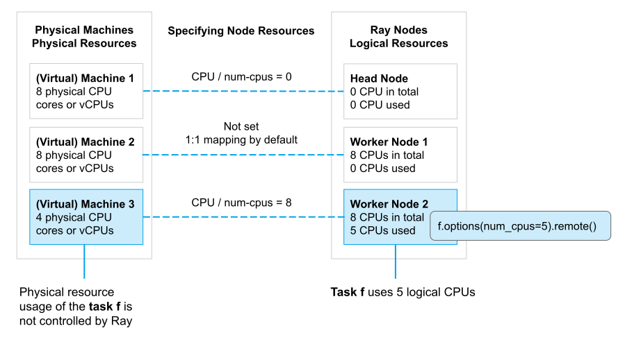

.. _core-resources:

Resources
=========

Ray allows you to seamlessly scale your applications from a laptop to a cluster without code change.
**Ray resources** are key to this capability.
They abstract away physical machines and let you express your computation in terms of resources,
while the system manages scheduling and autoscaling based on resource requests.

A resource in Ray is a key-value pair where the key denotes a resource name, and the value is a float quantity.
For convenience, Ray has native support for CPU, GPU, and memory resource types; CPU, GPU and memory are called **pre-defined resources**.
Besides those, Ray also supports :ref:`custom resources <custom-resources>`.

.. _logical-resources:

Physical Resources and Logical Resources
----------------------------------------

Physical resources are resources that a machine physically has such as physical CPUs and GPUs
and logical resources are virtual resources defined by a system.

Ray resources are **logical** and don’t need to have 1-to-1 mapping with physical resources.
For example, you can start a Ray head node with 3 GPUs via ``ray start --head --num-gpus=3`` even if it physically has zero.
They are mainly used for admission control during scheduling.

The fact that resources are logical has several implications:

- Resource requirements of tasks or actors do NOT impose limits on actual physical resource usage.
  For example, Ray doesn't prevent a ``num_cpus=1`` task from launching multiple threads and using multiple physical CPUs.
  It's your responsibility to make sure tasks or actors use no more resources than specified via resource requirements.
- Ray doesn't provide CPU isolation for tasks or actors.
  For example, Ray won't reserve a physical CPU exclusively and pin a ``num_cpus=1`` task to it.
  Ray will let the operating system schedule and run the task instead.
  If needed, you can use operating system APIs like ``sched_setaffinity`` to pin a task to a physical CPU.
- Ray does provide :ref:`GPU <gpu-support>` isolation in the form of *visible devices* by automatically setting the ``CUDA_VISIBLE_DEVICES`` environment variable,
  which most ML frameworks will respect for purposes of GPU assignment.

  Physical resources vs logical resources

.. _custom-resources:

Custom Resources
----------------

Besides pre-defined resources, you can also specify a Ray node's custom resources and request them in your tasks or actors.
Some use cases for custom resources:

- Your node has special hardware and you can represent it as a custom resource.
  Then your tasks or actors can request the custom resource via ``@ray.remote(resources={"special_hardware": 1})``
  and Ray will schedule the tasks or actors to the node that has the custom resource.
- You can use custom resources as labels to tag nodes and you can achieve label based affinity scheduling.
  For example, you can do ``ray.remote(resources={"custom_label": 0.001})`` to schedule tasks or actors to nodes with ``custom_label`` custom resource.
  For this use case, the actual quantity doesn't matter, and the convention is to specify a tiny number so that the label resource is
  not the limiting factor for parallelism.

.. _specify-node-resources:

Specifying Node Resources
-------------------------

By default, Ray nodes start with pre-defiend CPU, GPU, and memory resources. The quantities of these resources on each node are set to the physical quantities auto detected by Ray.
By default, logical resources are configured by the following rule.

.. warning::

    Ray **does not permit dynamic updates of resource capacities after a node has begun**.

- **Number of logical CPUs (``num_cpus``)**: Set to the number of CPUs of the machine/container.
- **Number of logical GPUs (``num_gpus)**: Set to the number of GPUs of the machine/container.
- **Memory (``memory``)**: Set to 70% of "available memory" when ray runtime starts.
- **Object Store Memory (``object_store_memory``)**: Set to 30% of "available memory" when ray runtime starts. Note that the object store memory is not logical resource, and users cannot use it for scheduling.

However, you can always override that by manually specifying the quantities of pre-defined resources and adding custom resources.
There are several ways to do that depending on how you start the Ray cluster:

.. tabbed:: ray.init()

    If you are using :ref:`ray.init() <ray-init-ref>` to start a single node Ray cluster, you can do the following to manually specify node resources:

    .. literalinclude:: ../doc_code/resources.py
        :language: python
        :start-after: __specifying_node_resources_start__
        :end-before: __specifying_node_resources_end__

.. tabbed:: ray start

    If you are using :ref:`ray start <ray-start-doc>` to start a Ray node, you can run:

    .. code-block:: shell

        ray start --head --num-cpus=3 --num-gpus=4 --resources='{"special_hardware": 1, "custom_label": 1}'

.. tabbed:: ray up

    If you are using :ref:`ray up <ray-up-doc>` to start a Ray cluster, you can set the :ref:`resources field <cluster-configuration-resources-type>` in the yaml file:

    .. code-block:: yaml

        available_node_types:
          head:
            ...
            resources:
              CPU: 3
              GPU: 4
              special_hardware: 1
              custom_label: 1

.. tabbed:: KubeRay

    If you are using :ref:`KubeRay <kuberay-index>` to start a Ray cluster, you can set the :ref:`rayStartParams field <rayStartParams>` in the yaml file:

    .. code-block:: yaml

        headGroupSpec:
          rayStartParams:
            num-cpus: "3"
            num-gpus: "4"
            resources: '"{\"special_hardware\": 1, \"custom_label\": 1}"'

.. _resource-requirements:

Specifying Task or Actor Resource Requirements
----------------------------------------------

Ray allows specifying a task or actor's resource requirements (e.g., CPU, GPU, and custom resources).
The task or actor will only run on a node if there are enough required resources
available to execute the task or actor.

By default, Ray tasks use 1 CPU resource and Ray actors use 1 CPU for scheduling and 0 CPU for running
(This means, by default, actors cannot get scheduled on a zero-cpu node, but an infinite number of them can run on any non-zero cpu node.
The default resource requirements for actors was chosen for historical reasons.
It's recommended to always explicitly set ``num_cpus`` for actors to avoid any surprises.
If resources are specified explicitly, they are required for both scheduling and running.)

You can also explicitly specify a task's or actor's resource requirements (for example, one task may require a GPU) instead of using default ones via :ref:`ray.remote() <ray-remote-ref>` and :ref:`.options() <ray-options-ref>`.

.. tabbed:: Python

    .. literalinclude:: ../doc_code/resources.py
        :language: python
        :start-after: __specifying_resource_requirements_start__
        :end-before: __specifying_resource_requirements_end__

.. tabbed:: Java

    .. code-block:: java

        // Specify required resources.
        Ray.task(MyRayApp::myFunction).setResource("CPU", 1.0).setResource("GPU", 1.0).setResource("special_hardware", 1.0).remote();

        Ray.actor(Counter::new).setResource("CPU", 2.0).setResource("GPU", 1.0).remote();

.. tabbed:: C++

    .. code-block:: c++

        // Specify required resources.
        ray::Task(MyFunction).SetResource("CPU", 1.0).SetResource("GPU", 1.0).SetResource("special_hardware", 1.0).Remote();

        ray::Actor(CreateCounter).SetResource("CPU", 2.0).SetResource("GPU", 1.0).Remote();

Task and actor resource requirements have implications for the Ray's scheduling concurrency.
In particular, the sum of the resource requirements of all of the
concurrently executing tasks and actors on a given node cannot exceed the node's total resources.
This property can be used to :ref:`limit the number of concurrently running tasks or actors to avoid issues like OOM <core-patterns-limit-running-tasks>`.

.. _fractional-resource-requirements:

Fractional Resource Requirements
~~~~~~~~~~~~~~~~~~~~~~~~~~~~~~~~

Ray supports fractional resource requirements.
For example, if your task or actor is IO bound and has low CPU usage, you can specify fractional CPU ``num_cpus=0.5`` or even zero CPU ``num_cpus=0``.
The precision of the fractional resource requirement is 0.0001 so you should avoid specifying a double that's beyond that precision.

.. literalinclude:: ../doc_code/resources.py
    :language: python
    :start-after: __specifying_fractional_resource_requirements_start__
    :end-before: __specifying_fractional_resource_requirements_end__

.. tip::

  Besides resource requirements, you can also specify an environment for a task or actor to run in,
  which can include Python packages, local files, environment variables, and more---see :ref:`Runtime Environments <runtime-environments>` for details.
