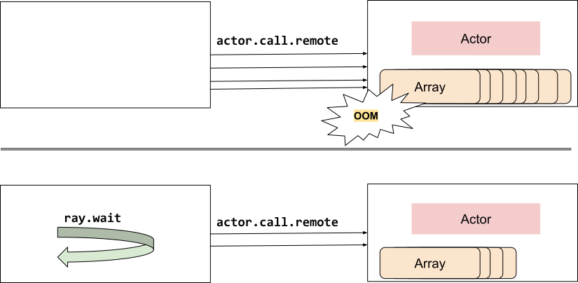

Pattern: Using ray.wait to limit the number of in-flight tasks
==============================================================

Example use case
----------------

When you submit a ray task or actor call, Ray will make sure the data is available to the worker. However, if you submit too many tasks rapidly, the worker might be overloaded and run out of memory. You should use ray.wait to block until a certain number of tasks are ready.

Ray Serve uses this pattern to limit the number of in flight queries for each worker.

    Limit number of parallel tasks

Code example
------------

**Without backpressure:**

.. code-block:: python

    @ray.remote
    class Actor:
        def heavy_compute(self, large_array):
            # taking a long time...

    actor = Actor.remote()
    result_refs = []
    for i in range(1_000_000):
        large_array = np.zeros(1_000_000)
        result_refs.append(actor.heavy_compute.remote(large_array))
    results = ray.get(result_refs)

**With backpressure:**

.. code-block:: python

    result_refs = []
    results = []
    max_in_flight_tasks = 1000
    for i in range(1_000_000):
        large_array = np.zeros(1_000_000)

        # Limit in-flight tasks to 1000.
        # When the 1001st task is added
        # we wait for 1 task to complete
        # before adding another.
        if len(result_refs) > max_in_flight_tasks:
            num_ready = len(result_refs) - max_in_flight_tasks:
            completed_refs, result_refs = ray.wait(result_refs, num_returns=num_ready)
            for completed_ref in completed_refs:
                results.append(ray.get(completed_ref))

        result_refs.append(actor.heavy_compute.remote(large_array))

    # fetch the remaining results
    results.extend(ray.get(result_refs))
