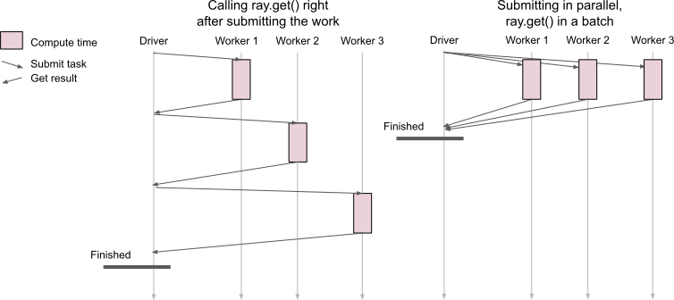

.. _ray-get-loop:

Antipattern: Calling ray.get in a loop
======================================

**TLDR:** Avoid calling ``ray.get`` in a loop since it's blocking; call ``ray.get`` only for the final result.

A call to ``ray.get()`` fetches the results of remotely executed functions. However, it is a blocking call, which means that it always waits until the requested result is available.
If you call ``ray.get`` in a loop, the loop will not continue to run until the call to ``ray.get()`` was resolved.

If you also spawn the remote function calls in the same loop, you end up with no parallelism at all, as you wait for the previous function call to finish (because of ``ray.get()``) and only spawn the next process in the next iteration of the loop.
The solution here is to separate the call to ``ray.get`` from the call to the remote functions. That way all remote processes are spawned before we wait for the results and can run in parallel in the background. Additionally, you can pass a list of object references to ``ray.get()`` instead of calling it one by one to wait for all of the tasks to finish.

Code example
------------

.. code-block:: python

    import ray
    ray.init()

    @ray.remote
    def f(i):
        return i

    # Antipattern: no parallelism due to calling ray.get inside of the loop.
    returns = []
    for i in range(100):
        returns.append(ray.get(f.remote(i)))

    # Better approach: parallelism because the tasks are spawned in parallel.
    refs = []
    for i in range(100):
        refs.append(f.remote(i))

    returns = ray.get(refs)

    Calling ``ray.get()`` in a loop

When calling ``ray.get()`` right after scheduling the remote work, the loop blocks until the item is received. We thus end up with sequential processing.
Instead, we should first schedule all remote calls, which are then processed in parallel. After scheduling the work, we can then request all the results at once.
