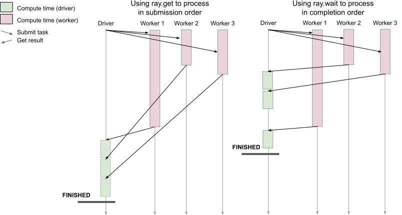

Antipattern: Processing results in submission order using ray.get
=================================================================

**TLDR:** Avoid calling ``ray.get`` one by one in a loop if possible.

When processing in submission order, a remote function might delay processing of earlier finished remote function. When using ray.wait we can get finished tasks early, speeding up total time to completion.

    Processing results in submission order

A batch of tasks are submitted, and we need to process their results individually once they’re done. We want to process the results as they finish, but use ray.get on the ObjectRefs in the order that they were submitted.

If each remote function takes a different amount of time to finish, we may waste time waiting for all of the slower (straggler) remote functions to finish while the other faster functions have already finished. Instead, we want to process the tasks in the order that they finish using ``ray.wait``.

Code example
------------

.. code-block:: python

    import random
    import time
    import ray

    @ray.remote
    def f():
        time.sleep(random.random())

    # Antipattern: process results in the order they were spawned.
    refs = [f.remote(i) for i in range(100)]
    for ref in refs:
        # Blocks until this ObjectRef is ready.
        result = ray.get(ref)
        # process result

    # Better approach: process results in the order that they finish.
    refs = [f.remote(i) for i in range(100)]
    unfinished = refs
    while unfinished:
        # Returns the first ObjectRef that is ready.
        finished, unfinished = ray.wait(unfinished, num_returns=1)
        result = ray.get(finished)
        # process result
