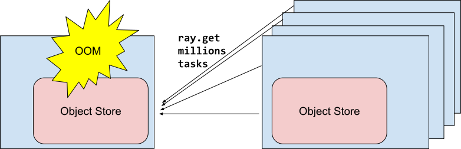

Antipattern: Fetching too many results at once with ray.get
===========================================================

**TLDR:** Avoid calling ``ray.get`` on many large objects since this will lead to object store OOM. Instead process one batch at a time.

If you have a large number of tasks that you want to run in parallel, trying to do ray.get() on all of them at once could lead to object store OOM (out of memory). Instead you should process the results a batch at a time. Once one of the batches is processed, Ray will evict those objects preventing object store from running out of memory.

Code example
------------

**Antipattern:**

.. code-block:: python

    @ray.remote
    def return_big_object():
        return np.zeros(1024*1024*10)

    object_refs = [return_big_object.remote() for _ in range(1e6)]
    # Calling ray.get will cause object store to OOM!
    results = ray.get(object_refs)
    write_to_file(results)

**Better approach:**

.. code-block:: python

    @ray.remote
    def return_big_object():
        return np.zeros(1024*1024*10)

    object_refs = [return_big_object.remote() for _ in range(1_000_000)]
    for i in range(1_000):
        chunk = object_refs[:1_000]
        object_refs = object_refs[1_000:]
        results = ray.get(chunk)
        write_to_file(results)

    Fetching too many results at once with ``ray.get()``
