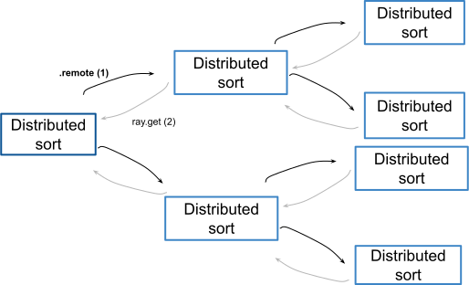

Pattern: Tree of tasks
======================

In this pattern, remote tasks are spawned in a recursive fashion to sort a list. Within the definition of a remote function, it is possible to invoke itself (quick_sort_distributed.remote). A single call to the task triggers the dispatch of multiple tasks.

Example use case
----------------

You have a large list of items that you need to process recursively (i.e., sorting).

We call ``ray.get`` after both ray function invocations take place. This allows you to maximize parallelism in the workload.
Notice in the execution times below that with smaller and finer tasks, the non-distributed version is faster; however, as the task execution
time increases, that is the task with larger list takes longer, the distributed version is faster. Takeaway here is that fine trained tasks are an
anti Ray pattern.

.. code-block:: python

    lesser = quick_sort_distributed.remote(lesser)
    greater = quick_sort_distributed.remote(greater)
    ray.get(lesser) + [pivot] + ray.get(greater)

    Tree of tasks

Code example
------------

.. code-block:: python
    
    import ray

    def partition(collection):        
        # Use the last element as the first pivot
        pivot = collection.pop()
        greater, lesser = [], []
        for element in collection:
            if element > pivot:
                greater.append(element)
            else:
                lesser.append(element)
        return lesser, pivot, greater

    def quick_sort(collection):

        if len(collection) <= 200000:  # magic number
            return sorted(collection)
        else:
            lesser, pivot, greater = partition(collection)
            lesser = quick_sort(lesser)
            greater = quick_sort(greater)
        return lesser + [pivot] + greater
    
    @ray.remote
    def quick_sort_distributed(collection):
        # Tiny tasks are an antipattern. 
        # Thus, in our example we have a "magic number" to 
        # toggle when distributed recursion should be used vs
        # when the sorting should be done in place. The rule
        # of thumb is that the duration of an individual task
        # should be at least 1 second.
        if len(collection) <= 200000:  # magic number
            return sorted(collection)
        else:
            lesser, pivot, greater = partition(collection)
            lesser = quick_sort_distributed.remote(lesser)
            greater = quick_sort_distributed.remote(greater)
            return ray.get(lesser) + [pivot] + ray.get(greater)
    
    if __name__ == "__main__":
        from numpy import random
        import time

        ray.init()
        for size in [200000, 4000000, 8000000, 10000000, 20000000]:
            print(f'Array size: {size}')
            unsorted = random.randint(1000000, size=(size)).tolist()
            s = time.time()
            quick_sort(unsorted)
            print(f"Sequential execution: {(time.time() - s):.3f}")
            s = time.time()
            # put the large object in the global store and pass only the reference
            unsorted_obj = ray.put(unsorted)
            ray.get(quick_sort_distributed.remote(unsorted_obj))
            print(f"Distributed execution: {(time.time() - s):.3f}")
            print("--" * 10)

.. code-block:: text

    Array size: 200000
    Sequential execution: 0.040
    Distributed execution: 0.152
    --------------------
    Array size: 4000000
    Sequential execution: 6.161
    Distributed execution: 5.779
    --------------------
    Array size: 8000000
    Sequential execution: 15.459
    Distributed execution: 11.282
    --------------------
    Array size: 10000000
    Sequential execution: 20.671
    Distributed execution: 13.132
    --------------------
    Array size: 20000000
    Sequential execution: 47.352
    Distributed execution: 36.213
    --------------------

