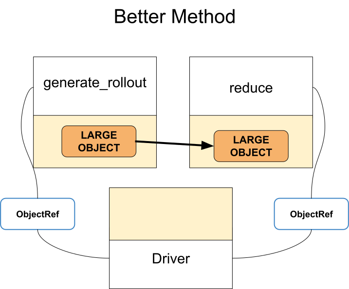

Antipattern: Unnecessary call of ray.get in a task
==================================================

**TLDR:** Avoid calling ``ray.get`` too frequently/for intermediate steps. Work with object references directly, and only call ``ray.get`` at the end to get the final result.

When ``ray.get`` is called, objects must be transferred to the worker/node that calls ``ray.get``. If you don't need to manipulate the object in a task, you probably don't need to call ``ray.get`` on it!

Typically, it’s a best practice to wait as long as possible before calling ``ray.get``, or even design your program to avoid having to call ``ray.get`` too soon.

Notes
-----
Notice in the first example, we call ``ray.get`` which forces us to transfer the large rollout to the driver, then to *reducer* after that.

In the fixed version, we only pass the reference to the object to the *reducer*. The ``reducer`` automatically calls ``ray.get`` once, which means the data is passed directly from ``generate_rollout`` to ``reduce``, avoiding the driver.

Code example
------------

**Antipattern:**

.. code-block:: python

    @ray.remote
    def generate_rollout():
        return np.ones((10000, 10000))

    @ray.remote
    def reduce(rollout):
        return np.sum(rollout)

    # `ray.get` downloads the result here.
    rollout = ray.get(generate_rollout.remote())
    # Now we have to reupload `rollout`
    reduced = ray.get(reduce.remote(rollout))

**Better approach:**

.. code-block:: python

    # Don't need ray.get here.
    rollout = generate_rollout.remote()
    # Rollout object is passed by reference.
    reduced = ray.get(reduce.remote(rollout))

    Antipattern: Unnecessary call to ``ray.get``

    Better approach: Pass object references (futures) instead
