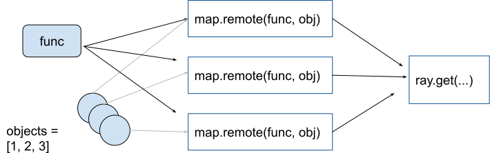

Pattern: Map and reduce
=======================

For ``map``, this example uses Ray tasks to execute a given function multiple times in parallel (on a separate process). We then use ray.get to fetch the results of each of these functions.

You can have many ``map`` stages and many ``reduce`` stages.

Example use case
----------------

Implement generic map and reduce functionality with Ray tasks. “map” applies a function to a list of elements.

    Map and reduce

Code examples
-------------

**Single-threaded map:**

.. code-block:: python

    items = list(range(100))
    map_func = lambda i : i*2
    output = [map_func(i) for i in items]

**Ray parallel map:**

.. code-block:: python

    @ray.remote
    def map(obj, f):
        return f(obj)

    items = list(range(100))
    map_func = lambda i : i*2
    output = ray.get([map.remote(i, map_func) for i in items])

**Single-threaded reduce:**

.. code-block:: python

    items = list(range(100))
    map_func = lambda i : i*2
    output = sum([map_func(i) for i in items])

**Ray parallel reduce:**

.. code-block:: python

    @ray.remote
    def map(obj, f):
        return f(obj)
    @ray.remote
    def sum_results(*elements):
        return np.sum(elements)

    items = list(range(100))
    map_func = lambda i : i*2
    remote_elements = [map.remote(i, map_func) for i in items]

    # simple reduce
    remote_final_sum = sum_results.remote(*remote_elements)
    result = ray.get(remote_final_sum)

    # tree reduce
    intermediate_results = [sum_results.remote(
        *remote_elements[i * 20: (i + 1) * 20]) for i in range(5)]
    remote_final_sum = sum_results.remote(*intermediate_results)
    result = ray.get(remote_final_sum)
