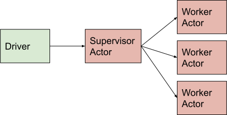

Pattern: Tree of actors
=======================

Example use case
----------------

You want to train 3 models at the same time, while being able to checkpoint/inspect its state.

In this pattern, a collection of Ray worker actors is managed by a supervisory Ray actor.

    Tree of actors

A single call to the supervisor actor triggers the dispatch of multiple method calls to child actors. The supervisor can process results or update child actors prior to returning.

Notes
-----

- If the supervisor dies (or the driver), the worker actors are automatically terminated thanks to actor reference counting.
- Actors can be nested to multiple levels to form a tree.

Code example
------------

.. code-block:: python

    @ray.remote(num_cpus=1)
    class Worker:
        def work(self):
            return "done"

    @ray.remote(num_cpus=1)
    class Supervisor:
        def __init__(self):
            self.workers = [Worker.remote() for _ in range(3)]
        def work(self):
            return ray.get([w.work.remote() for w in self.workers])

    ray.init()
    sup = Supervisor.remote()
    print(ray.get(sup.work.remote()))  # outputs ['done', 'done', 'done']
