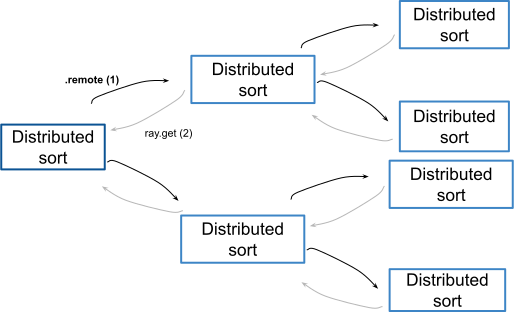

Pattern: Tree of tasks
======================

In this pattern, remote tasks are spawned in a recursive fashion to sort a list. Within the definition of a remote function, it is possible to invoke itself (quick_sort_distributed.remote). A single call to the task triggers the dispatch of multiple tasks.

Example use case
----------------

You have a large list of items that you need to process recursively (i.e., sorting).

We call ``ray.get`` after both ray function invocations take place. This allows you to maximize parallelism in the workload.

.. code-block:: python

    lesser = quick_sort_distributed.remote(lesser)
    greater = quick_sort_distributed.remote(greater)
    ray.get(lesser) + [pivot] + ray.get(greater)

    Tree of tasks

Code example
------------

.. code-block:: python
    
    import ray
    ray.init()
    def partition(collection):        
        # Use the last element as the first pivot
        pivot = collection.pop()
        greater, lesser = [], []
        for element in collection:
            if element > pivot:
                greater.append(element)
            else:
                lesser.append(element)
        return lesser, pivot, greater
    
    @ray.remote
    def quick_sort_distributed(collection):
        # Tiny tasks are an antipattern. 
        # Thus, in our example we have a "magic number" to 
        # toggle when distributed recursion should be used vs
        # when the sorting should be done in place. The rule
        # of thumb is that the duration of an individual task
        # should be at least 1 second.
        if len(collection) <= 200000:  # magic number
            return sorted(collection)
        else:
            lesser, pivot, greater = partition(collection)
            lesser = quick_sort_distributed.remote(lesser)
            greater = quick_sort_distributed.remote(greater)
            return ray.get(lesser) + [pivot] + ray.get(greater)
    
    if __name__ == "__main__":
        from numpy import random
        import time
        unsorted = random.randint(1000000, size=(4000000)).tolist()
        s = time.time()
        quick_sort(unsorted)
        print("Sequential execution: " + str(time.time() - s))
        s = time.time()
        ray.get(quick_sort_distributed.remote(unsorted))
        print("Distributed execution: " + str(time.time() - s))
