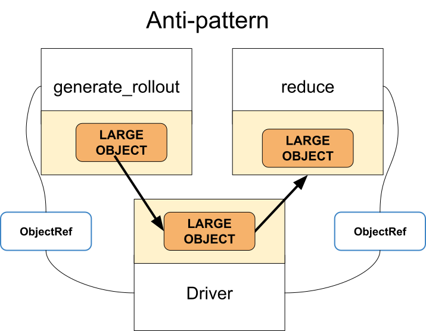

Antipattern: Accessing Global Variable in Tasks/Actors
======================================================

**TLDR:** Don't modify global variables in remote functions. Instead, encapsulate the global variables into actors.

Ray tasks and actors decorated by ``@ray.remote`` are running in
different processes that don’t share the same address space as ray driver
(Python script that runs ray.init). That says if you define a global variable
and change the value inside a driver, changes are not reflected in the workers
(a.k.a tasks and actors).

Code example
------------

**Antipattern:**

.. code-block:: python

    import ray
    global_v = 3

    @ray.remote
    class A:
        def f(self):
            return global_v + 3

    actor = A.remote()
    global_v = 4
    # This prints 6, not 7. It is because the value  change of global_v inside a driver is not
    # reflected to the actor because they are running in different processes.
    print(ray.get(actor.f.remote()))

**Better approach:** Use an actor’s instance variables to hold the global state that needs to be modified / accessed by multiple workers (tasks and actors).

.. code-block:: python

    import ray

    @ray.remote
    class GlobalVarActor:
        def __init__(self):
            self.global_v = 3
        def set_global_v(self, v):
            self.global_v = v
        def get_global_v(self):
            return self.global_v

    @ray.remote
    class A:
        def __init__(self, global_v_registry):
            self.global_v_registry = global_v_registry
        def f(self):
            return ray.get(self.global_v_registry.get_global_v.remote()) + 3

    global_v_registry = GlobalVarActor.remote()
    actor = A.remote(global_v_registry)
    ray.get(global_v_registry.set_global_v.remote(4))
    # This will print 7 correctly.
    print(ray.get(actor.f.remote()))

Notes
-----
Note that using class variables to update/manage state between instances
of the same class is not currently supported.
Each actor instance is instantiated across multiple processes,
so each actor will have its own copy of the class variables.

    Antipattern: Unnecessary call to ``ray.get``

.. figure:: unnecessary-ray-get-better.svg

    Better approach: Pass object references (futures) instead
