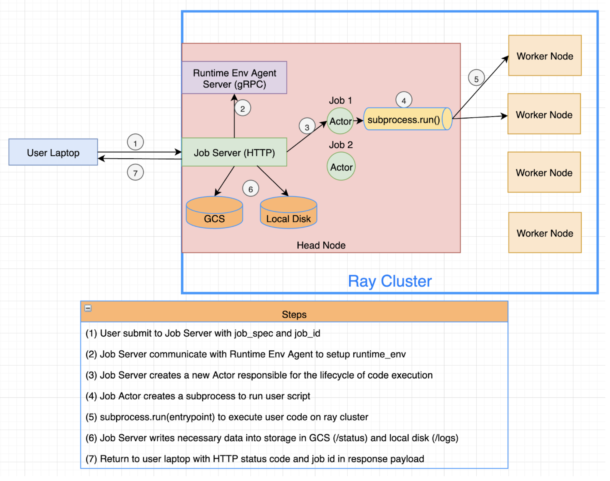

============================
From laptop to production
============================

**Ray Job Submission**

**Concepts**

- **Package**: A collection of files and configurations that defines an application thus allows it to be executed in a different environment remotely (ideally self-contained).

- **Job**: A Ray application that will be submitted to a Ray cluster for execution. Once a job is submitted, it runs once on the cluster to completion or failure. Retries or different runs with different parameters should be handled by the submitter. Jobs are scoped to the lifetime of a ray cluster.

- **Job Manager**: An entity that manages the lifecycle of a Job and potentially multiple ray clusters, such as scheduling, killing, polling status, getting logs, and persisting inputs / outputs. Should be highly available (HA) by default. Can be any framework with these abilities, such as Airflow.

Within the context of job submission, the packaging part is equivalent to runtime environment.

Entrypoint:
Runtime Environment:

**The goal of Ray job submssion is to provide a lightweight mechanism for user to submit their locally developed and tested application to a running local / remote ray cluster, thus enable user to package, deploy, and manage their ray application as jobs, with pluggable job manager of their choice.**

**Example - Setup**

Let's start with writing a local driver script to a temporary directory and use it as example for job submission. Once executed locally, this script will use ray APIs to print counter value of a remote actor from 1 to 5, and print the version of 'requests' module it's using.

.. tabs::
  .. group-tab:: Python

.. code-block:: python
    import os
    import tempfile
    import time

    import ray

    driver_script = """
import ray
import requests

ray.shutdown()
ray.init()

@ray.remote
class Counter:
    def __init__(self):
        self.counter = 0

    def inc(self):
        self.counter += 1

    def get_counter(self):
        return self.counter

counter = Counter.remote()

for _ in range(5):
    ray.get(counter.inc.remote())
    print(ray.get(counter.get_counter.remote()))

print(requests.__version__)
    """

    # Flag to enable runtime_env in case your local ray is built from source
    os.environ["RAY_RUNTIME_ENV_LOCAL_DEV_MODE"] = "1"

    # Have a ray local cluster running with active job http server
    if not ray.is_initialized():
        print("Starting a new ray local cluster")
        ray.init()

    def poll_status_sdk(job_id):
        start = time.time()
        timeout = 5
        while time.time() - start <= timeout:
            status = client.get_job_status(job_id)
            print(f"status: {status}")
            if status in {JobStatus.SUCCEEDED, JobStatus.STOPPED, JobStatus.FAILED}:
                break
            time.sleep(1)

    with tempfile.TemporaryDirectory() as tmpdir:
        # Write driver script to tmpdir.
        with open(os.path.join(tmpdir, "test_script.py"), "w") as file:
            file.write(driver_script)

**Ray Job Client**

Using ray job client is the recommended way to do job submission programmatically.

.. tabs::
  .. group-tab:: Python

.. code-block:: python

    from ray.dashboard.modules.job.sdk import JobSubmissionClient
    from ray.dashboard.modules.job.common import JobStatus

    client = JobSubmissionClient("http://127.0.0.1:8265")

#     1.1, Trivial local working_dir submit
    job_id = client.submit_job(
        # Entry point to execute
        entrypoint="python test_script.py",
        # Working dir
        runtime_env={
            "working_dir": tmpdir,
            "pip": ["requests==2.26.0"]
        }
    )
    wait_until_success(job_id)
    logs = client.get_job_logs(job_id)
    print(logs)

#     1.2 S3 working_dir
    os.environ["AWS_ACCESS_KEY_ID"] = {your_aws_credentials}
    os.environ["AWS_SECRET_ACCESS_KEY"] = {your_aws_credentials}
    os.environ["AWS_SESSION_TOKEN"] = {your_aws_credentials}
    job_id = client.submit_job(
        # Entry point to execute
        entrypoint="python script.py",
        # Working dir
        runtime_env={
            # This is a public object, accessible as long as your host have
            # AWS credentials for any valia identity
            "working_dir": "s3://runtime-env-test/script.zip",
            "pip": ["requests==2.26.0"]
        }
    )
    wait_until_success(job_id)
    logs = client.get_job_logs(job_id)
    print(logs)

#     1.3 Stop API
    job_id = client.submit_job(
        # Entry point to execute
        entrypoint="python -c 'import time; time.sleep(60)'",
        runtime_env={}
    )
    poll_status(job_id)
    client.stop_job(job_id)
    poll_status(job_id)
    logs = client.get_job_logs(job_id)
    print(logs)

#     1.4 Generate and pass id
    job_id = uuid4().hex
    returned_id = client.submit_job(
        # Entry point to execute
        job_id=job_id,
        entrypoint="echo hello",
        runtime_env={}
    )
    assert job_id == returned_id
    Re-submit with same job_id should lead to RuntimeError
    try:
        client.submit_job(
            # Entry point to execute
            job_id=job_id,
            entrypoint="echo hello",
            runtime_env={}
        )
    except requests.exceptions.HTTPError as e:
        print(e.response.reason)
        print(e.response.status_code)

**Job CLI**

Alternatively, one can also submit ray application via CLI.

❯ ray start --head

**Job HTTP**

Under the hood, both Job Client and CLI make HTTP calls to the job server running on ray head node.

.. tabs::
  .. group-tab:: Python

.. code-block:: python

    resp = requests.post(
            "http://127.0.0.1:8265/api/jobs/submit",
            json={
                "entrypoint": "echo hello",
                "runtime_env": {},
                "job_id": None,
                "metadata": {"job_submission_id": "123"}
            }
        )
        rst = json.loads(resp.text)
        job_id = rst["job_id"]
        print(job_id)

        start = time.time()
        while time.time() - start <= 10:
            resp = requests.get(
                "http://127.0.0.1:8265/api/jobs/status",
                params={
                    "job_id": job_id,
                }
            )
            rst = json.loads(resp.text)
            status = rst["job_status"]
            print(f"status: {status}")
            if status in {JobStatus.SUCCEEDED, JobStatus.STOPPED, JobStatus.FAILED}:
                break
            time.sleep(1)

        resp = requests.get(
            "http://127.0.0.1:8265/api/jobs/logs",
            params={
                "job_id": job_id,
            }
        )
        rst = json.loads(resp.text)
        logs = rst["logs"]
        print(logs)

** Job Submission Architecture **

The following diagram shows the underlying structure and steps for each job submission.

