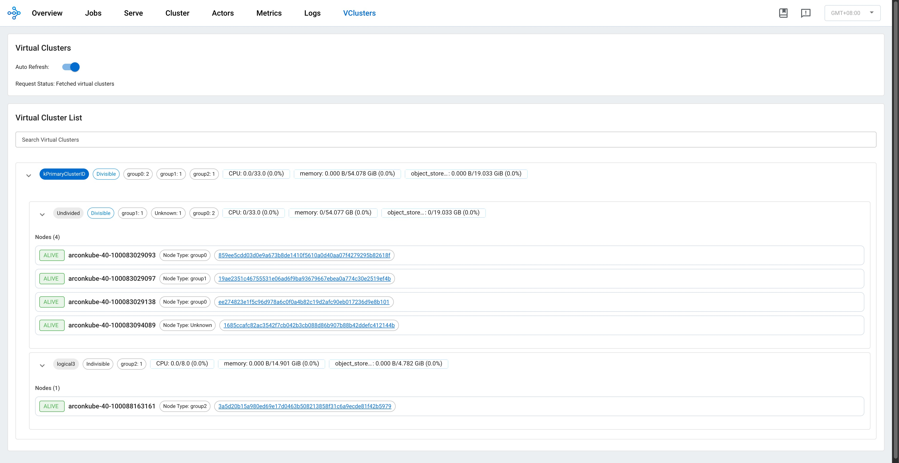
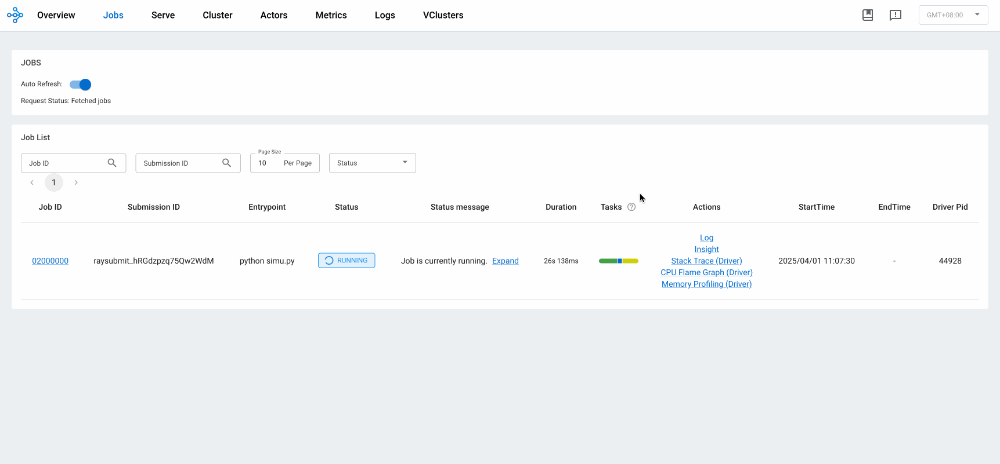
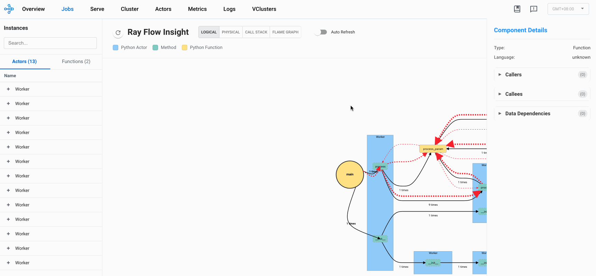
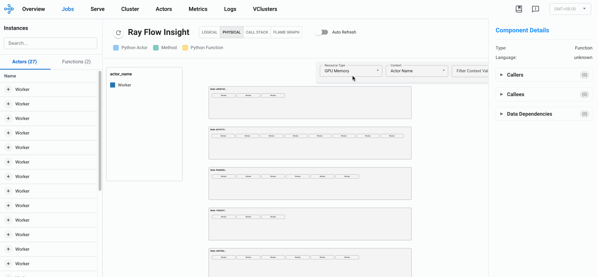
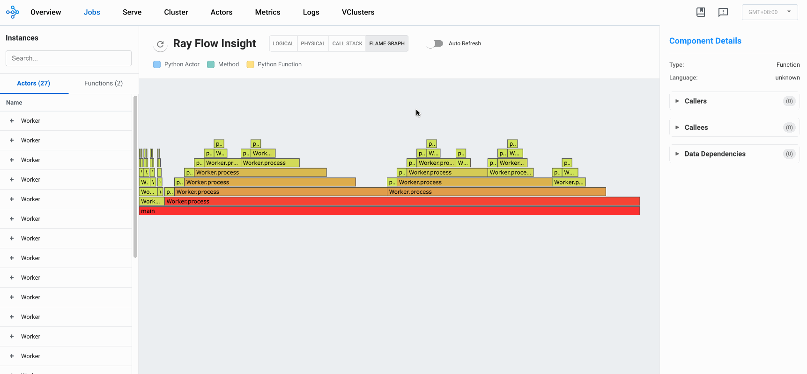
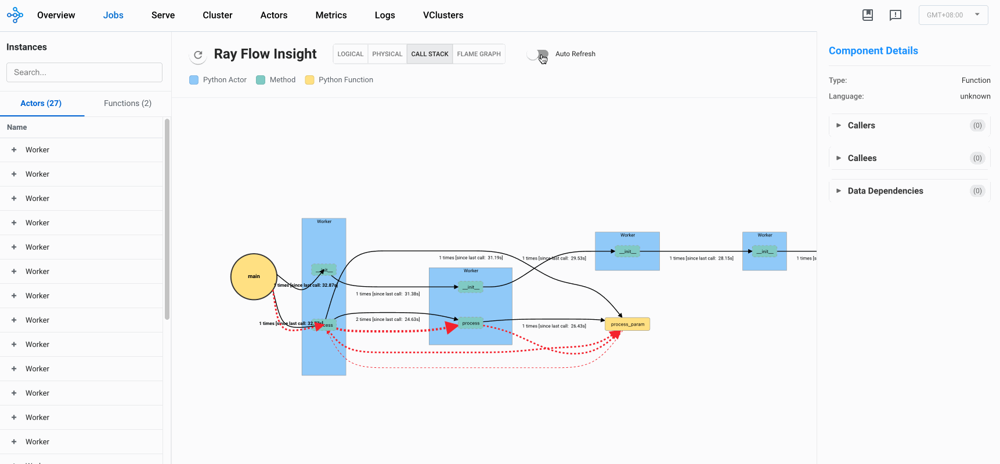

.. _observability-getting-started:

Ray Dashboard
=============

Ray provides a web-based dashboard for monitoring and debugging Ray applications.
The visual representation of the system state, allows users to track the performance
of applications and troubleshoot issues.

.. raw:: html

    

        <iframe width="560" height="315" src="https://www.youtube.com/embed/i33b1DYjYRQ" title="YouTube video player" frameborder="0" allow="accelerometer; autoplay; clipboard-write; encrypted-media; gyroscope; picture-in-picture; web-share" allowfullscreen></iframe>
    

Set up Dashboard
------------------

To access the dashboard, use `ray[default]` or :ref:`other installation commands <installation>` that include the Ray Dashboard component. For example:

.. code-block:: bash

  pip install -U "ray[default]"

When you start a single-node Ray Cluster on your laptop, access the dashboard with the URL that Ray prints when it initializes (the default URL is **http://localhost:8265**) or with the context object returned by `ray.init`.

.. testcode::
  :hide:

  import ray
  ray.shutdown()

.. testcode::

    import ray

    context = ray.init()
    print(context.dashboard_url)

..
    This test output is flaky. If Ray isn't completely shutdown, the port can be
    "8266" instead of "8265".

.. testoutput::
    :options: +MOCK

   127.0.0.1:8265

.. code-block:: text

  INFO worker.py:1487 -- Connected to Ray cluster. View the dashboard at 127.0.0.1:8265.

.. note::

    If you start Ray in a docker container, ``--dashboard-host`` is a required parameter. For example, ``ray start --head --dashboard-host=0.0.0.0``.

When you start a remote Ray Cluster with the :ref:`VM Cluster Launcher <vm-cluster-quick-start>`, :ref:`KubeRay operator <kuberay-quickstart>`, or manual configuration, Ray Dashboard launches on the head node but the dashboard port may not be publicly exposed. View :ref:`configuring the dashboard <dashboard-in-browser>` for how to view Dashboard from outside the Head Node.

.. note::

  When using the Ray Dashboard, it is highly recommended to also set up Prometheus and Grafana.
  They are necessary for critical features such as :ref:`Metrics View <dash-metrics-view>`.
  See :ref:`Configuring and Managing the Dashboard <observability-visualization-setup>` for how to integrate Prometheus and Grafana with Ray Dashboard.

Navigate the views
------------------

The Dashboard has multiple tabs called views. Depending on your goal, you may use one or a combination of views:

- Analyze, monitor, or visualize status and resource utilization metrics for logical or physical components: :ref:`Metrics view <dash-metrics-view>`, :ref:`Cluster view <dash-node-view>`
- Monitor Job and Task progress and status: :ref:`Jobs view <dash-jobs-view>`
- Locate logs and error messages for failed Tasks and Actors: :ref:`Jobs view <dash-jobs-view>`, :ref:`Logs view <dash-logs-view>`
- Analyze CPU and memory usage of Tasks and Actors: :ref:`Metrics view <dash-metrics-view>`,  :ref:`Cluster view <dash-node-view>`
- Monitor a Serve application: :ref:`Serve view <dash-serve-view>`

.. _dash-jobs-view:

Jobs view
---------

.. raw:: html

    

        <iframe width="560" height="315" src="https://www.youtube.com/embed/CrpXSSs0uaw" title="YouTube video player" frameborder="0" allow="accelerometer; autoplay; clipboard-write; encrypted-media; gyroscope; picture-in-picture; web-share" allowfullscreen></iframe>
    

The Jobs view lets you monitor the different Jobs that ran on your Ray Cluster.
A :ref:`Ray Job <jobs-overview>` is a Ray workload that uses Ray APIs (e.g., ``ray.init``). It is recommended to submit your Job to Clusters via :ref:`Ray Job API <jobs-quickstart>`. You can also interactively run Ray jobs (e.g., by executing a Python script within a Head Node).

The Job view displays a list of active, finished, and failed Jobs, and clicking on an ID allows users to view detailed information about that Job.
For more information on Ray Jobs, see the :ref:`Ray Job Overview section <jobs-overview>`.

Job Profiling
~~~~~~~~~~~~~

You can profile Ray Jobs by clicking on the “Stack Trace” or “CPU Flame Graph” actions. See :ref:`Profiling <profiling-concept>` for more details.

.. _dash-workflow-job-progress:

Task and Actor breakdown
~~~~~~~~~~~~~~~~~~~~~~~~
.. image:: https://raw.githubusercontent.com/ray-project/Images/master/docs/new-dashboard-v2/dashboard-pics/advanced-progress.png
    :align: center

The Jobs view breaks down Tasks and Actors by their states.
Tasks and Actors are grouped and nested by default. You can see the nested entries by clicking the expand button.

Tasks and Actors are grouped and nested using the following criteria:

- All Tasks and Actors are grouped together. View individual entries by expanding the corresponding row.
- Tasks are grouped by their ``name`` attribute (e.g., ``task.options(name="<name_here>").remote()``).
- Child Tasks (nested Tasks) are nested under their parent Task's row.
- Actors are grouped by their class name.
- Child Actors (Actors created within an Actor) are nested under their parent Actor's row.
- Actor Tasks (remote methods within an Actor) are nested under the Actor for the corresponding Actor method.

.. note::

  Job detail page can only display or retrieve up to 10K Tasks per Job. For Jobs with more than 10K Tasks, the portion of Tasks that exceed the 10K limit are unaccounted. The number of unaccounted Tasks is available from the Task breakdown.

.. _dashboard-timeline:

Task Timeline
~~~~~~~~~~~~~

First, download the chrome tracing file by clicking the download button. Alternatively, you can :ref:`use CLI or SDK to export the tracing file <ray-core-timeline>`.

Second, use tools like ``chrome://tracing`` or the `Perfetto UI <https://ui.perfetto.dev/>`_ and drop the downloaded chrome tracing file. We will use the Perfetto as it is the recommendation way to visualize chrome tracing files.

In the timeline visualization of Ray Tasks and Actors, there are Node rows (hardware) and Worker rows (processes).
Each Worker rows display a list of Task events (e.g., Task scheduled, Task running, input/output deserialization, etc.) happening from that Worker over time.

Ray Status
~~~~~~~~~~

The Jobs view displays the status of the Ray Cluster. This information is the output of the ``ray status`` CLI command.

The left panel shows the autoscaling status, including pending, active, and failed nodes.
The right panel displays the resource demands, which are resources that cannot be scheduled to the Cluster at the moment. This page is useful for debugging resource deadlocks or slow scheduling.

.. note::

  The output shows the aggregated information across the Cluster (not by Job). If you run more than one Job, some of the demands may come from other Jobs.

.. _dash-workflow-state-apis:

Task, Actor, and Placement Group tables
~~~~~~~~~~~~~~~~~~~~~~~~~~~~~~~~~~~~~~~

The Dashboard displays a table of the status of the Job's Tasks, Actors, and Placement Groups.
This information is the output of the :ref:`Ray State APIs <state-api-overview-ref>`.

You can expand the table to see a list of each Task, Actor, and Placement Group.

.. _dash-serve-view:

Serve view
----------

.. raw:: html

    

        <iframe width="560" height="315" src="https://www.youtube.com/embed/eqXfwM641a4" title="YouTube video player" frameborder="0" allow="accelerometer; autoplay; clipboard-write; encrypted-media; gyroscope; picture-in-picture; web-share" allowfullscreen></iframe>
    

See your general Serve configurations, a list of the Serve applications, and, if you configured :ref:`Grafana and Prometheus <observability-visualization-setup>`, high-level
metrics of your Serve applications. Click the name of a Serve application to go to the Serve Application Detail page.

Serve Application Detail page
~~~~~~~~~~~~~~~~~~~~~~~~~~~~~

See the Serve application's configurations and metadata and the list of :ref:`Serve deployments and replicas <serve-key-concepts-deployment>`.
Click the expand button of a deployment to see the replicas.

Each deployment has two available actions. You can view the Deployment config and, if you configured :ref:`Grafana and Prometheus <observability-configure-manage-dashboard>`, you can open
a Grafana dashboard with detailed metrics about that deployment.

For each replica, there are two available actions. You can see the logs of that replica and, if you configured :ref:`Grafana and Prometheus <observability-visualization-setup>`, you can open
a Grafana dashboard with detailed metrics about that replica. Click on the replica name to go to the Serve Replica Detail page.

Serve Replica Detail page
~~~~~~~~~~~~~~~~~~~~~~~~~

This page shows metadata about the Serve replica, high-level metrics about the replica if you configured :ref:`Grafana and Prometheus <observability-visualization-setup>`, and
a history of completed :ref:`Tasks <core-key-concepts>` of that replica.

Serve metrics
~~~~~~~~~~~~~

Ray Serve exports various time-series metrics to help you understand the status of your Serve application over time. Find more details about these metrics :ref:`here <serve-production-monitoring-metrics>`.
To store and visualize these metrics, set up Prometheus and Grafana by following the instructions :ref:`here <observability-visualization-setup>`.

These metrics are available in the Ray Dashboard in the Serve page and the Serve Replica Detail page. They are also accessible as Grafana dashboards.
Within the Grafana dashboard, use the dropdown filters on the top to filter metrics by route, deployment, or replica. Exact descriptions
of each graph are available by hovering over the "info" icon on the top left of each graph.

.. _dash-node-view:

Cluster view
------------

.. raw:: html

    

        <iframe width="560" height="315" src="https://www.youtube.com/embed/K2jLoIhlsnY" title="YouTube video player" frameborder="0" allow="accelerometer; autoplay; clipboard-write; encrypted-media; gyroscope; picture-in-picture; web-share" allowfullscreen></iframe>
    

The Cluster view is a visualization of the hierarchical relationship of
machines (nodes) and Workers (processes). Each host machine consists of many Workers, that
you can see by clicking the + button. See also the assignment of GPU resources to specific Actors or Tasks.

Click the node ID to see the node detail page.

In addition, the machine view lets you see **logs** for a node or a Worker.

.. _dash-actors-view:

Actors view
-----------

Use the Actors view to see the logs for an Actor and which Job created the Actor.

.. raw:: html

    

        <iframe width="560" height="315" src="https://www.youtube.com/embed/MChn6O1ecEQ" title="YouTube video player" frameborder="0" allow="accelerometer; autoplay; clipboard-write; encrypted-media; gyroscope; picture-in-picture; web-share" allowfullscreen></iframe>
    

The information for up to 100000 dead Actors is stored.
Override this value with the `RAY_maximum_gcs_destroyed_actor_cached_count` environment variable
when starting Ray.

Actor profiling
~~~~~~~~~~~~~~~

Run the profiler on a running Actor. See :ref:`Dashboard Profiling <dashboard-profiling>` for more details.

Actor Detail page
~~~~~~~~~~~~~~~~~

Click the ID, to see the detail view of the Actor.

On the Actor Detail page, see the metadata, state, and all of the Actor's Tasks that have run.

.. _dash-metrics-view:

Metrics view
------------

.. raw:: html

    

        <iframe width="560" height="315" src="https://www.youtube.com/embed/yn5Q65iHAR8" title="YouTube video player" frameborder="0" allow="accelerometer; autoplay; clipboard-write; encrypted-media; gyroscope; picture-in-picture; web-share" allowfullscreen></iframe>
    

Ray exports default metrics which are available from the :ref:`Metrics view <dash-metrics-view>`. Here are some available example metrics.

- Tasks, Actors, and Placement Groups broken down by states
- :ref:`Logical resource usage <logical-resources>` across nodes
- Hardware resource usage across nodes
- Autoscaler status

See :ref:`System Metrics Page <system-metrics>` for available metrics.

.. note::

  The Metrics view requires the Prometheus and Grafana setup. See :ref:`Configuring and managing the Dashboard <observability-visualization-setup>` to learn how to set up Prometheus and Grafana.

The Metrics view provides visualizations of the time series metrics emitted by Ray.

You can select the time range of the metrics in the top right corner. The graphs refresh automatically every 15 seconds.

There is also a convenient button to open the Grafana UI from the dashboard. The Grafana UI provides additional customizability of the charts.

.. _dash-workflow-cpu-memory-analysis:

Analyze the CPU and memory usage of Tasks and Actors
~~~~~~~~~~~~~~~~~~~~~~~~~~~~~~~~~~~~~~~~~~~~~~~~~~~~

The :ref:`Metrics view <dash-metrics-view>` in the Dashboard provides a "per-component CPU/memory usage graph" that displays CPU and memory usage over time for each Task and Actor in the application (as well as system components).
You can identify Tasks and Actors that may be consuming more resources than expected and optimize the performance of the application.

.. image:: https://raw.githubusercontent.com/ray-project/Images/master/docs/new-dashboard-v2/dashboard-pics/node_cpu_by_comp.png
    :align: center

Per component CPU graph. 0.379 cores mean that it uses 40% of a single CPU core. Ray process names start with ``ray::``. ``raylet``, ``agent``, ``dashboard``, or ``gcs`` are system components.

.. image:: https://raw.githubusercontent.com/ray-project/Images/master/docs/new-dashboard-v2/dashboard-pics/node_memory_by_comp.png
    :align: center

Per component memory graph. Ray process names start with ``ray::``. ``raylet``, ``agent``, ``dashboard``, or ``gcs`` are system components.

.. image:: https://raw.githubusercontent.com/ray-project/Images/master/docs/new-dashboard-v2/dashboard-pics/cluster_page.png
    :align: center

Additionally, users can see a snapshot of hardware utilization from the :ref:`Cluster view <dash-node-view>`, which provides an overview of resource usage across the entire Ray Cluster.

.. _dash-workflow-resource-utilization:

View the resource utilization
~~~~~~~~~~~~~~~~~~~~~~~~~~~~~

Ray requires users to specify the number of :ref:`resources <logical-resources>` their Tasks and Actors to use through arguments such as ``num_cpus``, ``num_gpus``, ``memory``, and ``resource``.
These values are used for scheduling, but may not always match the actual resource utilization (physical resource utilization).

- See the logical and physical resource utilization over time from the :ref:`Metrics view <dash-metrics-view>`.
- The snapshot of physical resource utilization (CPU, GPU, memory, disk, network) is also available from the :ref:`Cluster view <dash-node-view>`.

.. image:: https://raw.githubusercontent.com/ray-project/Images/master/docs/new-dashboard-v2/dashboard-pics/logical_resource.png
    :align: center

The :ref:`logical resources <logical-resources>` usage.

.. image:: https://raw.githubusercontent.com/ray-project/Images/master/docs/new-dashboard-v2/dashboard-pics/physical_resource.png
    :align: center

The physical resources (hardware) usage. Ray provides CPU, GPU, Memory, GRAM, disk, and network usage for each machine in a Cluster.

.. _dash-logs-view:

Logs view
---------

.. raw:: html

    

        <iframe width="560" height="315" src="https://www.youtube.com/embed/8V187F2DsN0" title="YouTube video player" frameborder="0" allow="accelerometer; autoplay; clipboard-write; encrypted-media; gyroscope; picture-in-picture; web-share" allowfullscreen></iframe>
    

The Logs view lists the Ray logs in your Cluster. It is organized by node and log file name. Many log links in the other pages link to this view and filter the list so the relevant logs appear.

To understand the logging structure of Ray, see :ref:`logging directory and file structure <logging-directory-structure>`.

The Logs view provides search functionality to help you find specific log messages.

**Driver logs**

If the Ray Job is submitted by the :ref:`Job API <jobs-quickstart>`, the Job logs are available from the Dashboard. The log file follows the following format: ``job-driver-<job_submission_id>.log``.

.. note::

  If you execute the Driver directly on the Head Node of the Ray Cluster (without using the Job API) or run with :ref:`Ray Client <ray-client-ref>`, the Driver logs are not accessible from the Dashboard. In this case, see the terminal or Jupyter Notebook output to view the Driver logs.

**Task and Actor Logs (Worker logs)**

Task and Actor logs are accessible from the :ref:`Task and Actor table view <dash-workflow-state-apis>`. Click the "Log" button.
You can see the ``stdout`` and ``stderr`` logs that contain the output emitted from Tasks and Actors.
For Actors, you can also see the system logs for the corresponding Worker process.

.. note::

    Logs of asynchronous Actor Tasks or threaded Actor Tasks (concurrency>1) are only available as part of the Actor logs. Follow the instruction in the Dashboard to view the Actor logs.

**Task and Actor errors**

You can easily identify failed Tasks or Actors by looking at the Job progress bar.

The Task and Actor tables display the name of the failed Tasks or Actors, respectively. They also provide access to their corresponding log or error messages.

.. _virtual-clusters-view:

Virtual Clusters View
---------------------

The Virtual Clusters view in the Ray Dashboard offers a real‐time, hierarchical
representation of the virtual clusters running on your Ray cluster. This view
is designed to provide an at-a-glance overview of resource allocations, node
status, and replica set configurations across both divisible and indivisible
clusters.

Key Features
------------

- **Hierarchical Organization:**  
  Virtual clusters are displayed as a tree structure. Divisible clusters can be
  subdivided into logical (or job) clusters while also listing “undivided” nodes.
  This structure makes it easy to visualize parent–child relationships and resource
  distribution among clusters.

- **Resource Overview:**  
  For each virtual cluster, key resources – such as CPU, memory, and object store
  memory – are presented in a clear, formatted overview. Values are aggregated and
  displayed in real time, so you can quickly see resource utilization and identify
  potential bottlenecks.

- **Search and Filtering:**  
  A search bar at the top of the Virtual Clusters panel lets you filter clusters
  by name or other properties. This is especially useful in large deployments where
  numerous virtual clusters are active simultaneously.

- **Detailed Node Information:**  
  Expanding a virtual cluster node reveals detailed data about the underlying
  nodes. For each node, you can view its hostname, status (e.g., ALIVE or DEAD),
  and configured node type.

For more in-depth information, please refer to the complete
:ref:`virtual-cluster-index` documentation.

Flow Insight View
-----------------

The Flow Insight view provides a powerful visualization of your Ray application's
execution flow, helping you understand the relationships between actors, tasks, and
data transfers in your distributed application. This view offers logical view, 
physical view, distributed stack and flame graph of your application's execution,
making it easier to analyze performance, identify bottlenecks, and optimize your Ray workloads.

Key Features
~~~~~~~~~~~~

**Four Visualization Modes:**

- **Logical View:** Displays the call graph between functions and actors, showing the control flow and data dependencies in your application.

- **Physical View:** Shows the physical distribution of actors across nodes with their resource usage and placement groups.

- **Distrubuted Stack View**: Offers a unified call stack visualization across your distributed system, similar to how developers use pstack for single-process applications.

- **Flame Graph View:** Provides a hierarchical visualization of execution time across your distributed application.

**Interactive Exploration:**

- **Zoom and Pan:** Navigate through complex graphs with intuitive zoom and pan controls.

- **Element Selection:** Click on any node to view detailed information in the info card.

- **Highlighting:** Automatically highlights related nodes and edges when selecting an element.

- **Search:** Filter the visualization to highlight elements matching your search term.

**Resource Usage Visualization:**

- Monitor CPU, memory, and GRAM usage of actors in the physical view.

- View detailed GPU memory utilization for actors using GPU resources.

- Select different resource metrics to visualize (GRAM, CPU, memory).

**Context-Based Filtering:**

- Filter actors based on custom context information registered by your application.

- Visualize actors with different colors based on their context values.

Enabling Flow Insight
~~~~~~~~~~~~~~~~~~~~~

To enable Flow Insight, set the `RAY_FLOW_INSIGHT` environment variable to "1" before starting your Ray cluster.

Accessing Flow Insight
~~~~~~~~~~~~~~~~~~~~~~

To access the Flow Insight view, click on the "Insight" link in the Jobs view for a specific job.
This will open the Flow Insight visualization for that job, showing the execution graph and
relationships between components.

Logical View
~~~~~~~~~~~~

The logical view displays the call graph of your Ray application, showing the relationships
between functions, actors, and methods. This view helps you understand the control flow
and data dependencies in your application.

- **Nodes:** Represent functions, actors, and methods in your application.
- **Edges:** Show the call relationships and data transfers between nodes.
- **Edge Thickness:** Indicates the frequency or volume of calls/data transfers.

The logical view is particularly useful for understanding the high-level structure of your
application and identifying communication patterns between components.

Physical View
~~~~~~~~~~~~~

The physical view shows how actors are distributed across nodes in your Ray cluster,
organized by placement groups. This view helps you understand the physical deployment
of your application and resource utilization.

- **Nodes:** Represent physical machines in your Ray cluster.
- **Placement Groups:** Show how actors are grouped together for locality.
- **Actor Boxes:** Display individual actors with their resource usage.
- **Color Coding:** Indicates resource utilization levels or context-based grouping.

The physical view is valuable for identifying resource bottlenecks, understanding actor
placement, and optimizing resource utilization in your Ray cluster.

Resource Visualization
~~~~~~~~~~~~~~~~~~~~~~

Flow Insight provides detailed resource usage visualization for your Ray application:

- **CPU Usage:** View CPU utilization for each actor and node.
- **Memory Usage:** Monitor memory consumption across your application.
- **GPU Usage:** Track GPU memory utilization for actors using GPUs.
- **Resource Selection:** Switch between different resource metrics to visualize.

This helps you identify resource-intensive components and optimize resource allocation
in your Ray application.

Context-Based Filtering
~~~~~~~~~~~~~~~~~~~~~~~

You can register custom context information for your actors to enable context-based
filtering and visualization in the Flow Insight view. This is particularly useful for
categorizing actors by their role, status, or other application-specific attributes.

To register context information for an actor:

.. code-block:: python

    import ray
    from ray.util.insight import register_current_context, async_register_current_context
    
    @ray.remote
    class MyActor:
        def __init__(self, role):
            # Register context synchronously
            register_current_context({"role": role, "status": "initialized"})
            
        async def update_status(self, status):
            # Register context asynchronously
            await async_register_current_context({"status": status})
            
        def process(self):
            # Update context with current processing information
            register_current_context({"processing": True})
            # ... processing logic ...
            register_current_context({"processing": False})

In the Flow Insight physical view, you can then select the context key (e.g., "role" or "status")
to color-code actors based on their context values, making it easy to identify actors with
specific roles or states.

Distributed Flame Graph
~~~~~~~~~~~~~~~~~~~~~~~

The Distributed Flame Graph is an advanced visualization tool that automatically collects and aggregates
execution time data from all components across your entire Ray job lifecycle. While traditional flame
graphs are limited to profiling performance on a single machine, Ray's Distributed Flame Graph provides
a unified view of performance across your entire distributed system.

The demo we provide in gif is using the deepseek-chat as the LLM model, feel free to use models like gpt, gemini or claude, make sure to configure the corresponding context size.

Key features of the Distributed Flame Graph:

- **System-wide Performance View:** Visualizes execution time across all distributed components
- **Call Hierarchy:** Shows parent-child relationships between function calls
- **Time Distribution:** Block width represents the proportion of time spent in each function
- **Performance Hotspots:** Easily identify which components consume the most execution time

The flame graph is particularly valuable for performance optimization as it allows you to:

- Identify which distributed components are consuming the most time
- Understand call relationships between components
- Detect unexpected performance bottlenecks
- Compare expected vs. actual execution time distribution

For example, the flame graph might reveal that a particular process is consuming a long
execution time, representing the majority of your application's runtime, helping you focus your
optimization efforts on the most impactful components.

To access the Distributed Flame Graph, select "Flame" in the view type selector in the Flow Insight
visualization after clicking on the "Insight" link for a specific job in the Jobs view.

Distributed Stack (DStack)
~~~~~~~~~~~~~~~~~~~~~~~~~~

The Distributed Stack (DStack) view provides a unified call stack visualization across your entire
Ray cluster. Similar to how developers use `pstack` to diagnose issues in single-process applications,
DStack extends this capability to distributed systems, automatically collecting and visualizing call
relationships across all actors and tasks in your Ray cluster.

Key features of DStack:

- **Zero-Code Integration:** Works automatically with native Ray API code without any modifications
- **Global System View:** See the entire distributed system's call stack in a single interface
- **Dependency Tracking:** Identify call dependencies between components across nodes
- **Blockage Detection:** Quickly locate blocked components and understand why they're stuck

DStack is particularly valuable for debugging complex distributed applications by helping you:

- Understand the current state of all distributed components at a glance
- Trace execution paths across multiple nodes
- Detect deadlocks and performance bottlenecks in distributed interactions
- Identify which specific components are blocking progress and why

This capability is especially powerful for troubleshooting complex distributed applications like
reinforcement learning systems, where traditional debugging approaches would require manually
logging into individual nodes and examining processes one by one.

To access the DStack view, select "Call Stack" in the view type selector in the Flow Insight
visualization after clicking on the "Insight" link for a specific job in the Jobs view.

Analysis
~~~~~~~~

.. image:: ./images/flow-insight-analysis.gif
    :align: center
    :alt: Flow Insight Analysis screenshot

The Analysis feature provides AI-powered performance analysis of Ray application, generating comprehensive reports that identify bottlenecks, resource utilization patterns, and optimization opportunities. This feature leverages the visualization data from Flow Insight to deliver comprehensive insights.

Key capabilities of the Analysis feature:

- **Automated Performance Analysis:** Get detailed reports analyzing your application's distributed execution patterns
- **Resource Utilization Insights:** Identify inefficient resource usage across CPU, memory, and GPU
- **Bottleneck Detection:** Pinpoint performance bottlenecks in your distributed application
- **Optimization Recommendations:** Receive actionable suggestions to improve application performance
- **Architecture Analysis:** Understand the strengths and weaknesses of your current application architecture

The analysis reports are structured into several key sections:

- **Performance Summary:** Critical findings and priority optimizations
- **Distributed Application Topology Analysis:** Node distribution and resource profiles
- **Distributed Execution Analysis:** Actor/task system behavior and scalability characteristics
- **Data Flow Analysis:** Object transfer patterns
- **Application-Specific Analysis:** Workload characterization and architecture evaluation
- **Recommendations:** Architecture optimizations with expected improvements

To generate an analysis report:

1. Navigate to the Flow Insight view and click on the "Analysis" tab
2. Configure your OpenAI API settings if this is your first time
3. Click "Generate Report" to begin the analysis process
4. The analysis will be streamed in real-time as it's generated
5. Once complete, you can export the report as a Markdown file for sharing or documentation

The Analysis feature helps bridge the gap between visualization and comprehensive insights, making it easier to optimize complex distributed applications by identifying specific areas for improvement.

Info Card
~~~~~~~~~

When you click on an element in each view, the info card displays detailed information about that element:

- **For Actors:**
  - Basic information (name, ID, language)
  - State and PID
  - GPU devices and memory usage
  - Methods implemented by the actor
  - Callers and callees (who calls this actor and who this actor calls)
  - Data dependencies

- **For Methods:**
  - Basic information (name, actor, language)
  - Callers and callees
  - Data dependencies

- **For Functions:**
  - Basic information (name, language)
  - Callers and callees
  - Data dependencies

The info card helps you understand the detailed characteristics and relationships of
individual components in your Ray application.

Search Functionality
~~~~~~~~~~~~~~~~~~~~

The search functionality allows you to filter the visualization to show only elements
matching your search term. This is particularly useful for finding specific actors,
methods, or functions in complex applications.

Simply enter your search term in the search box, and the visualization will highlight
matching elements while fading out non-matching ones.

Best Practices
~~~~~~~~~~~~~~

To get the most out of Flow Insight:

1. **Enable Flow Insight:** Set the `RAY_FLOW_INSIGHT` environment variable to "1" before starting your Ray cluster.

2. **Register Context Information:** Use `register_current_context` or `async_register_current_context` to provide additional filtering capabilities.

3. **Use Meaningful Names:** Give your actors and tasks descriptive names to make the visualization more informative.

4. **Explore Both Views:** Switch between logical and physical views to understand both the structural and deployment aspects of your application.

5. **Use Search and Filtering:** For complex applications, use search and context-based filtering to focus on specific components.

Flow Insight is a powerful tool for understanding, debugging, and optimizing Ray applications,
providing insights into both the logical structure and physical deployment of your distributed workloads.

Visual RDB View
---------------

.. image:: ./images/visual-rdb-view.gif
    :align: center
    :alt: Visual RDB View screenshot

The Visual RDB View provides an integrated visual debugging experience for Ray applications, 
allowing you to debug distributed actors and tasks through a familiar debugging interface 
directly within the Ray Dashboard. This feature leverages the underlying ray rdb
capability to provide real-time debugging of your distributed application components.

Key Features
~~~~~~~~~~~~

- **Live Debugging:** Debug running Ray actors and tasks without stopping your application
- **Source Code Navigation:** View and navigate through source code of your distributed components
- **Breakpoint Management:** enable and disable breakpoints across your distributed codebase
- **Variable Inspection:** Examine runtime values of variables in the current context
- **Call Stack Navigation:** Navigate through the call stack to understand execution flow
- **Step Controls:** Standard debugging controls (continue, pause, step over, step in, step out)
- **Multi-thread Support:** Debug applications with multiple threads across distributed components

Enabling Visual RDB
~~~~~~~~~~~~~~~~~~~

To enable Visual RDB debugging, you need to enable both Flow Insight and Visual RDB:

1. Set the `RAY_VISUAL_RDB` environment variable to "1" before starting your Ray job:

   .. code-block:: bash

        ray job submit --runtime-env-json '{"env_vars":{"RAY_VISUAL_RDB": "1"}}' --working-dir ./ -- python entrypoint.py

2. Visual debug must also have Flow Insight enabled to function properly:

   .. code-block:: bash
   
       export RAY_FLOW_INSIGHT=1
       ray start --head

Accessing Visual RDB
~~~~~~~~~~~~~~~~~~~~

To access the Visual RDB view:

1. Navigate to the Flow Insight view from the Jobs page by clicking on the "Insight" link
2. In the Flow Insight view, when you select an actor method or task, then click on the "Debug" button, the Debug Panel will appear on the right side of the screen
3. Click on any available debug session to begin debugging

Debugging Interface
~~~~~~~~~~~~~~~~~~~

The Visual RDB interface consists of several key components:

- **Source Code View:** Displays the source code of the selected component with the current execution line highlighted
- **Controls Bar:** Contains debugging action buttons (continue, pause, step over, step into, step out)
- **Threads List:** Shows available threads and allows switching between them
- **Call Stack Panel:** Displays the current call stack, allowing navigation between frames
- **Evaluation Console:** Allows evaluating expressions in the current context

Working with Breakpoints
~~~~~~~~~~~~~~~~~~~~~~~~

To set breakpoints:

1. Click on a line number in the source code view to set a breakpoint
2. Click an existing breakpoint to remove it

The Visual RDB View transforms how you debug distributed applications by bringing traditional 
debugging workflows to distributed systems, making it easier to understand complex behaviors 
and resolve issues in Ray applications.

.. _dash-overview:

Overview view
-------------

.. image:: ./images/dashboard-overview.png
    :align: center

The Overview view provides a high-level status of the Ray Cluster.

**Overview metrics**

The Overview Metrics page provides the Cluster-level hardware utilization and autoscaling status (number of pending, active, and failed nodes).

**Recent Jobs**

The Recent Jobs pane provides a list of recently submitted Ray Jobs.

**Serve applications**

The Serve Applications pane provides a list of recently deployed Serve applications

.. _dash-event:

**Events view**

.. image:: https://raw.githubusercontent.com/ray-project/Images/master/docs/new-dashboard-v2/dashboard-pics/event-page.png
    :align: center

The Events view displays a list of events associated with a specific type (e.g., Autoscaler or Job) in chronological order. The same information is accessible with the ``ray list cluster-events`` :ref:`(Ray state APIs)<state-api-overview-ref>` CLI commands.

Two types of events are available:

- Job: Events related to :ref:`Ray Jobs API <jobs-quickstart>`.
- Autoscaler: Events related to the :ref:`Ray autoscaler <cluster-autoscaler>`.

Resources
---------
- `Ray Summit observability talk <https://www.youtube.com/watch?v=v_JzurOkdVQ>`_
- `Ray metrics blog <https://www.anyscale.com/blog/monitoring-and-debugging-ray-workloads-ray-metrics>`_
- `Ray Dashboard roadmap <https://github.com/ray-project/ray/issues/30097#issuecomment-1445756658>`_
- `Observability Training Module <https://github.com/ray-project/ray-educational-materials/blob/main/Observability/Ray_observability_part_1.ipynb>`_
