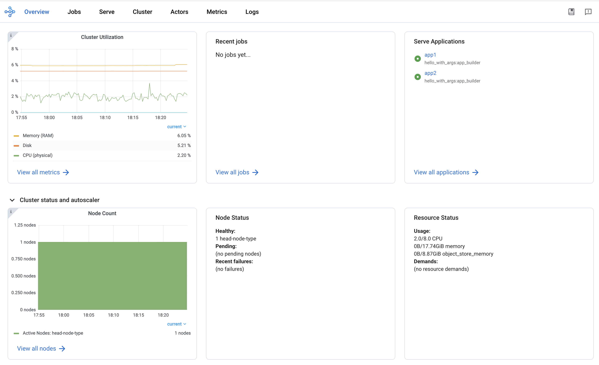

.. _observability-getting-started:

Ray Dashboard
=============

Ray provides a web-based dashboard for monitoring and debugging Ray applications.
The visual representation of the system state, allows users to track the performance
of applications and troubleshoot issues.

.. raw:: html

    

        <iframe width="560" height="315" src="https://www.youtube.com/embed/i33b1DYjYRQ" title="YouTube video player" frameborder="0" allow="accelerometer; autoplay; clipboard-write; encrypted-media; gyroscope; picture-in-picture; web-share" allowfullscreen></iframe>
    

Set up Dashboard
------------------

To access the dashboard, use `ray[default]` or :ref:`other installation commands <installation>` that include the Ray Dashboard component. For example:

.. code-block:: bash

  pip install -U "ray[default]"

When you start a single-node Ray Cluster on your laptop, access the dashboard with the URL that Ray prints when it initializes (the default URL is **http://localhost:8265**) or with the context object returned by `ray.init`.

.. testcode::
  :hide:

  import ray
  ray.shutdown()

.. testcode::

    import ray

    context = ray.init()
    print(context.dashboard_url)

..
    This test output is flaky. If Ray isn't completely shutdown, the port can be
    "8266" instead of "8265".

.. testoutput::
    :options: +MOCK

   127.0.0.1:8265

.. code-block:: text

  INFO worker.py:1487 -- Connected to Ray cluster. View the dashboard at 127.0.0.1:8265.

.. note::

    If you start Ray in a docker container, ``--dashboard-host`` is a required parameter. For example, ``ray start --head --dashboard-host=0.0.0.0``.

When you start a remote Ray Cluster with the :ref:`VM Cluster Launcher <vm-cluster-quick-start>`, :ref:`KubeRay operator <kuberay-quickstart>`, or manual configuration, Ray Dashboard launches on the head node but the dashboard port may not be publicly exposed. View :ref:`configuring the dashboard <dashboard-in-browser>` for how to view Dashboard from outside the Head Node.

.. note::

  When using the Ray Dashboard, it is highly recommended to also set up Prometheus and Grafana.
  They are necessary for critical features such as :ref:`Metrics View <dash-metrics-view>`.
  See :ref:`Configuring and Managing the Dashboard <observability-visualization-setup>` for how to integrate Prometheus and Grafana with Ray Dashboard.

Navigate the views
------------------

The Dashboard has multiple tabs called views. Depending on your goal, you may use one or a combination of views:

- Analyze, monitor, or visualize status and resource utilization metrics for logical or physical components: :ref:`Metrics view <dash-metrics-view>`, :ref:`Cluster view <dash-node-view>`
- Monitor Job and Task progress and status: :ref:`Jobs view <dash-jobs-view>`
- Locate logs and error messages for failed Tasks and Actors: :ref:`Jobs view <dash-jobs-view>`, :ref:`Logs view <dash-logs-view>`
- Analyze CPU and memory usage of Tasks and Actors: :ref:`Metrics view <dash-metrics-view>`,  :ref:`Cluster view <dash-node-view>`
- Monitor a Serve application: :ref:`Serve view <dash-serve-view>`

.. _dash-jobs-view:

Jobs view
---------

.. raw:: html

    

        <iframe width="560" height="315" src="https://www.youtube.com/embed/CrpXSSs0uaw" title="YouTube video player" frameborder="0" allow="accelerometer; autoplay; clipboard-write; encrypted-media; gyroscope; picture-in-picture; web-share" allowfullscreen></iframe>
    

The Jobs view lets you monitor the different Jobs that ran on your Ray Cluster.
A :ref:`Ray Job <jobs-overview>` is a Ray workload that uses Ray APIs (e.g., ``ray.init``). It is recommended to submit your Job to Clusters via :ref:`Ray Job API <jobs-quickstart>`. You can also interactively run Ray jobs (e.g., by executing a Python script within a Head Node).

The Job view displays a list of active, finished, and failed Jobs, and clicking on an ID allows users to view detailed information about that Job.
For more information on Ray Jobs, see the :ref:`Ray Job Overview section <jobs-overview>`.

Job Profiling
~~~~~~~~~~~~~

You can profile Ray Jobs by clicking on the “Stack Trace” or “CPU Flame Graph” actions. See :ref:`Profiling <profiling-concept>` for more details.

.. _dash-workflow-job-progress:

Task and Actor breakdown
~~~~~~~~~~~~~~~~~~~~~~~~
.. image:: https://raw.githubusercontent.com/ray-project/Images/master/docs/new-dashboard-v2/dashboard-pics/advanced-progress.png
    :align: center

The Jobs view breaks down Tasks and Actors by their states.
Tasks and Actors are grouped and nested by default. You can see the nested entries by clicking the expand button.

Tasks and Actors are grouped and nested using the following criteria:

- All Tasks and Actors are grouped together. View individual entries by expanding the corresponding row.
- Tasks are grouped by their ``name`` attribute (e.g., ``task.options(name="<name_here>").remote()``).
- Child Tasks (nested Tasks) are nested under their parent Task's row.
- Actors are grouped by their class name.
- Child Actors (Actors created within an Actor) are nested under their parent Actor's row.
- Actor Tasks (remote methods within an Actor) are nested under the Actor for the corresponding Actor method.

.. note::

  Job detail page can only display or retrieve up to 10K Tasks per Job. For Jobs with more than 10K Tasks, the portion of Tasks that exceed the 10K limit are unaccounted. The number of unaccounted Tasks is available from the Task breakdown.

.. _dashboard-timeline:

Task Timeline
~~~~~~~~~~~~~

First, download the chrome tracing file by clicking the download button. Alternatively, you can :ref:`use CLI or SDK to export the tracing file <ray-core-timeline>`.

Second, use tools like ``chrome://tracing`` or the `Perfetto UI <https://ui.perfetto.dev/>`_ and drop the downloaded chrome tracing file. We will use the Perfetto as it is the recommendation way to visualize chrome tracing files.

In the timeline visualization of Ray Tasks and Actors, there are Node rows (hardware) and Worker rows (processes).
Each Worker rows display a list of Task events (e.g., Task scheduled, Task running, input/output deserialization, etc.) happening from that Worker over time.

Ray Status
~~~~~~~~~~

The Jobs view displays the status of the Ray Cluster. This information is the output of the ``ray status`` CLI command.

The left panel shows the autoscaling status, including pending, active, and failed nodes.
The right panel displays the resource demands, which are resources that cannot be scheduled to the Cluster at the moment. This page is useful for debugging resource deadlocks or slow scheduling.

.. note::

  The output shows the aggregated information across the Cluster (not by Job). If you run more than one Job, some of the demands may come from other Jobs.

.. _dash-workflow-state-apis:

Task, Actor, and Placement Group tables
~~~~~~~~~~~~~~~~~~~~~~~~~~~~~~~~~~~~~~~

The Dashboard displays a table of the status of the Job's Tasks, Actors, and Placement Groups.
This information is the output of the :ref:`Ray State APIs <state-api-overview-ref>`.

You can expand the table to see a list of each Task, Actor, and Placement Group.

.. _dash-serve-view:

Serve view
----------

.. raw:: html

    

        <iframe width="560" height="315" src="https://www.youtube.com/embed/eqXfwM641a4" title="YouTube video player" frameborder="0" allow="accelerometer; autoplay; clipboard-write; encrypted-media; gyroscope; picture-in-picture; web-share" allowfullscreen></iframe>
    

See your general Serve configurations, a list of the Serve applications, and, if you configured :ref:`Grafana and Prometheus <observability-visualization-setup>`, high-level
metrics of your Serve applications. Click the name of a Serve application to go to the Serve Application Detail page.

Serve Application Detail page
~~~~~~~~~~~~~~~~~~~~~~~~~~~~~

See the Serve application's configurations and metadata and the list of :ref:`Serve deployments and replicas <serve-key-concepts-deployment>`.
Click the expand button of a deployment to see the replicas.

Each deployment has two available actions. You can view the Deployment config and, if you configured :ref:`Grafana and Prometheus <observability-configure-manage-dashboard>`, you can open
a Grafana dashboard with detailed metrics about that deployment.

For each replica, there are two available actions. You can see the logs of that replica and, if you configured :ref:`Grafana and Prometheus <observability-visualization-setup>`, you can open
a Grafana dashboard with detailed metrics about that replica. Click on the replica name to go to the Serve Replica Detail page.

Serve Replica Detail page
~~~~~~~~~~~~~~~~~~~~~~~~~

This page shows metadata about the Serve replica, high-level metrics about the replica if you configured :ref:`Grafana and Prometheus <observability-visualization-setup>`, and
a history of completed :ref:`Tasks <core-key-concepts>` of that replica.

Serve metrics
~~~~~~~~~~~~~

Ray Serve exports various time-series metrics to help you understand the status of your Serve application over time. Find more details about these metrics :ref:`here <serve-production-monitoring-metrics>`.
To store and visualize these metrics, set up Prometheus and Grafana by following the instructions :ref:`here <observability-visualization-setup>`.

These metrics are available in the Ray Dashboard in the Serve page and the Serve Replica Detail page. They are also accessible as Grafana dashboards.
Within the Grafana dashboard, use the dropdown filters on the top to filter metrics by route, deployment, or replica. Exact descriptions
of each graph are available by hovering over the "info" icon on the top left of each graph.

.. _dash-node-view:

Cluster view
------------

.. raw:: html

    

        <iframe width="560" height="315" src="https://www.youtube.com/embed/K2jLoIhlsnY" title="YouTube video player" frameborder="0" allow="accelerometer; autoplay; clipboard-write; encrypted-media; gyroscope; picture-in-picture; web-share" allowfullscreen></iframe>
    

The Cluster view is a visualization of the hierarchical relationship of
machines (nodes) and Workers (processes). Each host machine consists of many Workers, that
you can see by clicking the + button. See also the assignment of GPU resources to specific Actors or Tasks.

Click the node ID to see the node detail page.

In addition, the machine view lets you see **logs** for a node or a Worker.

.. _dash-actors-view:

Actors view
-----------

Use the Actors view to see the logs for an Actor and which Job created the Actor.

.. raw:: html

    

        <iframe width="560" height="315" src="https://www.youtube.com/embed/MChn6O1ecEQ" title="YouTube video player" frameborder="0" allow="accelerometer; autoplay; clipboard-write; encrypted-media; gyroscope; picture-in-picture; web-share" allowfullscreen></iframe>
    

The information for up to 100000 dead Actors is stored.
Override this value with the `RAY_maximum_gcs_destroyed_actor_cached_count` environment variable
when starting Ray.

Actor profiling
~~~~~~~~~~~~~~~

Run the profiler on a running Actor. See :ref:`Dashboard Profiling <dashboard-profiling>` for more details.

Actor Detail page
~~~~~~~~~~~~~~~~~

Click the ID, to see the detail view of the Actor.

On the Actor Detail page, see the metadata, state, and all of the Actor's Tasks that have run.

.. _dash-metrics-view:

Metrics view
------------

.. raw:: html

    

        <iframe width="560" height="315" src="https://www.youtube.com/embed/yn5Q65iHAR8" title="YouTube video player" frameborder="0" allow="accelerometer; autoplay; clipboard-write; encrypted-media; gyroscope; picture-in-picture; web-share" allowfullscreen></iframe>
    

Ray exports default metrics which are available from the :ref:`Metrics view <dash-metrics-view>`. Here are some available example metrics.

- Tasks, Actors, and Placement Groups broken down by states
- :ref:`Logical resource usage <logical-resources>` across nodes
- Hardware resource usage across nodes
- Autoscaler status

See :ref:`System Metrics Page <system-metrics>` for available metrics.

.. note::

  The Metrics view requires the Prometheus and Grafana setup. See :ref:`Configuring and managing the Dashboard <observability-visualization-setup>` to learn how to set up Prometheus and Grafana.

The Metrics view provides visualizations of the time series metrics emitted by Ray.

You can select the time range of the metrics in the top right corner. The graphs refresh automatically every 15 seconds.

There is also a convenient button to open the Grafana UI from the dashboard. The Grafana UI provides additional customizability of the charts.

.. _dash-workflow-cpu-memory-analysis:

Analyze the CPU and memory usage of Tasks and Actors
~~~~~~~~~~~~~~~~~~~~~~~~~~~~~~~~~~~~~~~~~~~~~~~~~~~~

The :ref:`Metrics view <dash-metrics-view>` in the Dashboard provides a "per-component CPU/memory usage graph" that displays CPU and memory usage over time for each Task and Actor in the application (as well as system components).
You can identify Tasks and Actors that may be consuming more resources than expected and optimize the performance of the application.

.. image:: https://raw.githubusercontent.com/ray-project/Images/master/docs/new-dashboard-v2/dashboard-pics/node_cpu_by_comp.png
    :align: center

Per component CPU graph. 0.379 cores mean that it uses 40% of a single CPU core. Ray process names start with ``ray::``. ``raylet``, ``agent``, ``dashboard``, or ``gcs`` are system components.

.. image:: https://raw.githubusercontent.com/ray-project/Images/master/docs/new-dashboard-v2/dashboard-pics/node_memory_by_comp.png
    :align: center

Per component memory graph. Ray process names start with ``ray::``. ``raylet``, ``agent``, ``dashboard``, or ``gcs`` are system components.

.. image:: https://raw.githubusercontent.com/ray-project/Images/master/docs/new-dashboard-v2/dashboard-pics/cluster_page.png
    :align: center

Additionally, users can see a snapshot of hardware utilization from the :ref:`Cluster view <dash-node-view>`, which provides an overview of resource usage across the entire Ray Cluster.

.. _dash-workflow-resource-utilization:

View the resource utilization
~~~~~~~~~~~~~~~~~~~~~~~~~~~~~

Ray requires users to specify the number of :ref:`resources <logical-resources>` their Tasks and Actors to use through arguments such as ``num_cpus``, ``num_gpus``, ``memory``, and ``resource``.
These values are used for scheduling, but may not always match the actual resource utilization (physical resource utilization).

- See the logical and physical resource utilization over time from the :ref:`Metrics view <dash-metrics-view>`.
- The snapshot of physical resource utilization (CPU, GPU, memory, disk, network) is also available from the :ref:`Cluster view <dash-node-view>`.

.. image:: https://raw.githubusercontent.com/ray-project/Images/master/docs/new-dashboard-v2/dashboard-pics/logical_resource.png
    :align: center

The :ref:`logical resources <logical-resources>` usage.

.. image:: https://raw.githubusercontent.com/ray-project/Images/master/docs/new-dashboard-v2/dashboard-pics/physical_resource.png
    :align: center

The physical resources (hardware) usage. Ray provides CPU, GPU, Memory, GRAM, disk, and network usage for each machine in a Cluster.

.. _dash-logs-view:

Logs view
---------

.. raw:: html

    

        <iframe width="560" height="315" src="https://www.youtube.com/embed/8V187F2DsN0" title="YouTube video player" frameborder="0" allow="accelerometer; autoplay; clipboard-write; encrypted-media; gyroscope; picture-in-picture; web-share" allowfullscreen></iframe>
    

The Logs view lists the Ray logs in your Cluster. It is organized by node and log file name. Many log links in the other pages link to this view and filter the list so the relevant logs appear.

To understand the logging structure of Ray, see :ref:`logging directory and file structure <logging-directory-structure>`.

The Logs view provides search functionality to help you find specific log messages.

**Driver logs**

If the Ray Job is submitted by the :ref:`Job API <jobs-quickstart>`, the Job logs are available from the Dashboard. The log file follows the following format: ``job-driver-<job_submission_id>.log``.

.. note::

  If you execute the Driver directly on the Head Node of the Ray Cluster (without using the Job API) or run with :ref:`Ray Client <ray-client-ref>`, the Driver logs are not accessible from the Dashboard. In this case, see the terminal or Jupyter Notebook output to view the Driver logs.

**Task and Actor Logs (Worker logs)**

Task and Actor logs are accessible from the :ref:`Task and Actor table view <dash-workflow-state-apis>`. Click the "Log" button.
You can see the ``stdout`` and ``stderr`` logs that contain the output emitted from Tasks and Actors.
For Actors, you can also see the system logs for the corresponding Worker process.

.. note::

    Logs of asynchronous Actor Tasks or threaded Actor Tasks (concurrency>1) are only available as part of the Actor logs. Follow the instruction in the Dashboard to view the Actor logs.

**Task and Actor errors**

You can easily identify failed Tasks or Actors by looking at the Job progress bar.

The Task and Actor tables display the name of the failed Tasks or Actors, respectively. They also provide access to their corresponding log or error messages.

.. _dash-overview:

Overview view
-------------

The Overview view provides a high-level status of the Ray Cluster.

**Overview metrics**

The Overview Metrics page provides the Cluster-level hardware utilization and autoscaling status (number of pending, active, and failed nodes).

**Recent Jobs**

The Recent Jobs pane provides a list of recently submitted Ray Jobs.

**Serve applications**

The Serve Applications pane provides a list of recently deployed Serve applications

.. _dash-event:

**Events view**

.. image:: https://raw.githubusercontent.com/ray-project/Images/master/docs/new-dashboard-v2/dashboard-pics/event-page.png
    :align: center

The Events view displays a list of events associated with a specific type (e.g., Autoscaler or Job) in chronological order. The same information is accessible with the ``ray list cluster-events`` :ref:`(Ray state APIs)<state-api-overview-ref>` CLI commands.

Two types of events are available:

- Job: Events related to :ref:`Ray Jobs API <jobs-quickstart>`.
- Autoscaler: Events related to the :ref:`Ray autoscaler <cluster-autoscaler>`.

Resources
---------
- `Ray Summit observability talk <https://www.youtube.com/watch?v=v_JzurOkdVQ>`_
- `Ray metrics blog <https://www.anyscale.com/blog/monitoring-and-debugging-ray-workloads-ray-metrics>`_
- `Ray Dashboard roadmap <https://github.com/ray-project/ray/issues/30097#issuecomment-1445756658>`_
- `Observability Training Module <https://github.com/ray-project/ray-educational-materials/blob/main/Observability/Ray_observability_part_1.ipynb>`_
