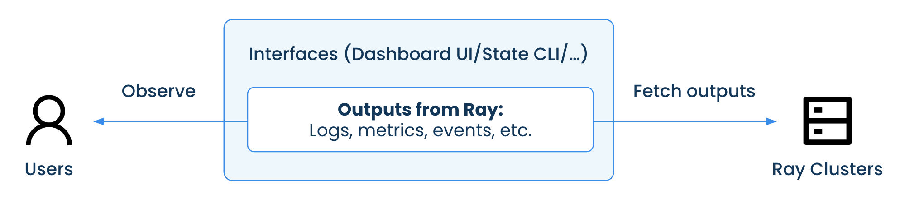
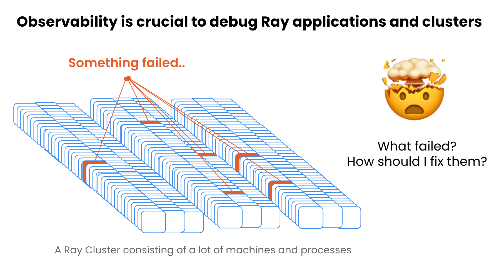

(observability)=

# Monitoring and Debugging

```{toctree}
:hidden:

getting-started
key-concepts
User Guides <user-guides/index>
Reference <reference/index>
```

This section covers how to **monitor and debug Ray applications and clusters** with Ray's Observability features.


## What is observability
In general, observability is a measure of how well the internal states of a system can be inferred from knowledge of its external outputs.

In Ray's context, observability refers to the ability for users to observe and infer Ray applications' and Ray clusters' internal states with various external outputs, such as logs, metrics, events, etc.




## Importance of observability
Debugging a distributed system can be challenging due to the large scale and complexity. Good observability is important for Ray users to be able to easily monitor and debug their Ray applications and clusters.




## Monitoring and debugging workflow and tools

Monitoring and debugging Ray applications consist of 4 major steps:
1. Monitor the clusters and applications.
2. Identify the surfaced problems or errors.
3. Debug with various tools and data.
4. Form a hypothesis, implement a fix, and validate it.

The remainder of this section covers the observability tools that Ray provides to accelerate your monitoring and debugging workflow.
