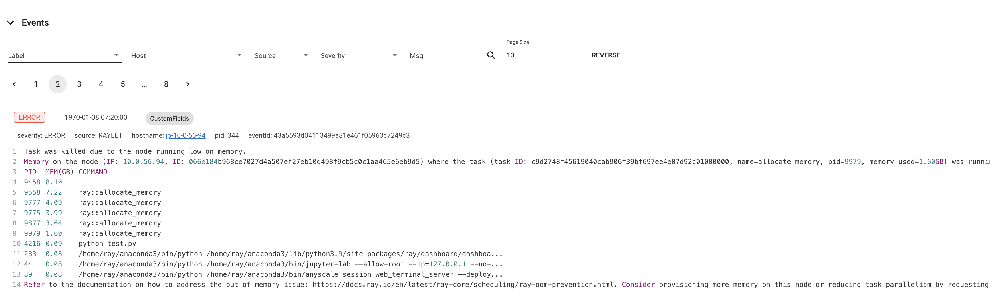
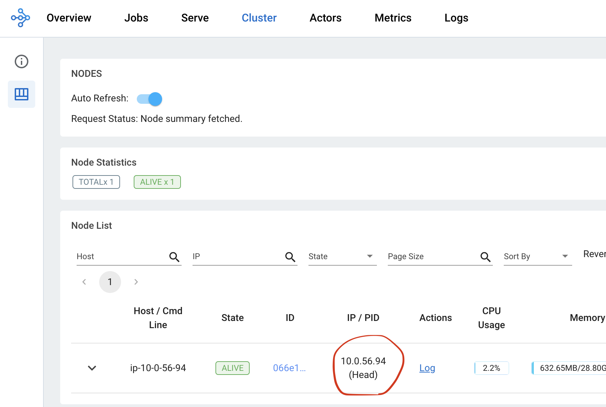
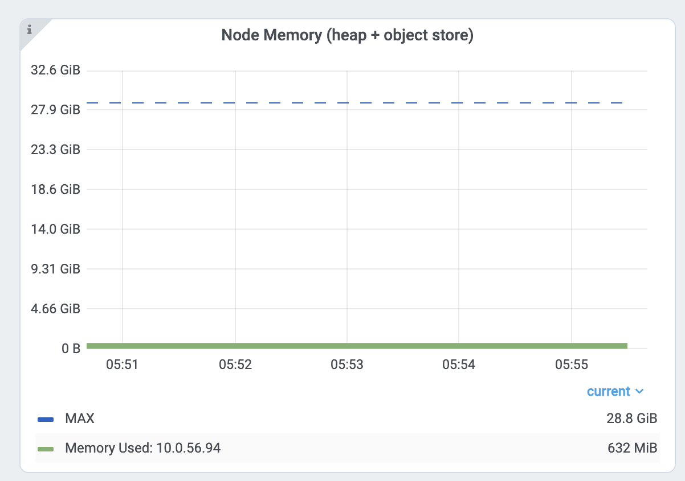

Troubleshooting Failures
========================

What Kind of Failures Exist in Ray?
-----------------------------------

Ray consists of 2 major APIs. ``.remote()`` to create a task/actor and :func:`ray.get <ray.get>` to get the result. 
Debugging Ray means identifying and fixing failures from remote processes that run functions and classes (task and actor) created by the ``.remote`` API. 

Ray APIs are future APIs (indeed, it is :ref:`possible to convert Ray object references to standard Python future APIs <async-ref-to-futures>`), 
and the error handling model is the same. When any remote tasks or actors fail, the returned object ref will contain an exception. 
When you call ``get`` API to the object ref, it raises an exception.

.. code-block:: python

  import ray
  @ray.remote
  def f():
      raise ValueError
  
  # Raises a ValueError.
  ray.get(f.remote())

In Ray, there are 3 types of failures. See exception APIs for more details. 

- **Application failures**: This means the remote task/actor fails by the user code. In this case, ``get`` API will raise the :func:`RayTaskError <ray.exceptions.RayTaskError>` which includes the exception raised from the remote process.
- **Intentional system failures**: This means Ray is failed, but the failure is intended. For example, when you call cancellation APIs like ``ray.cancel`` (for task) or ``ray.kill`` (for actors), the system fails remote tasks and actors, but it is intentional.
- **Unintended system failures**: This means the remote tasks and actors failed due to unexpected system failures such as processes crashing (for example, by out-of-memory error) or nodes failing.

  1. `Linux Out of Memory killer <https://www.kernel.org/doc/gorman/html/understand/understand016.html>`_ or :ref:`Ray OOM killer <ray-oom-monitor>` kills processes with high memory usages to avoid out-of-memory.
  2. The machine shuts down (e.g., spot instance termination) or a :term:`raylet <raylet>` is crashed (e.g., by an unexpected failure). 
  3. System is highly overloaded or stressed (either machine or system components like Raylet or :term:`GCS <GCS / Global Control Service>`), which makes the system unstable and fail.

Debugging Application Failures
------------------------------

Ray distributes users' code to multiple processes across many machines. Application failures mean bugs in users' code.
Ray provides a debugging experience that's similar to debugging a single-process Python program.

print
~~~~~

``print`` debugging is one of the most common ways to debug Python programs. 
:ref:`Ray's task and actor logs are printed to the Ray driver <ray-worker-logs>` by default, 
which allows you to simply use the ``print`` function to debug the application failures.

Debugger
~~~~~~~~

Many Python developers use a debugger to debug Python programs, and `Python pdb <https://docs.python.org/3/library/pdb.html>`_) is one of the popular choices.
Ray has native integration to ``pdb``. You can simply add ``breakpoint()`` to actors and tasks code to enable ``pdb``. View :ref:`Ray Debugger <ray-debugger>` for more details.

.. _troubleshooting-out-of-memory:

Debugging Out of Memory
-----------------------

Before reading this section, it is recommended to understand Ray's :ref:`Memory Management <memory>` model.

- To find if your cluster has out-of-memory problems, view :ref:`How to Detect Out-of-Memory Errors? <troubleshooting-out-of-memory-how-to-detect>`.
- To find what leaks the memory, view :ref:`Find per Task and Actor Memory Usage <troubleshooting-out-of-memory-task-actor-mem-usage>`.
- If your head node has high memory usage, view :ref:`Head Node Out-of-Memory Error <troubleshooting-out-of-memory-head>`.
- If your memory usage is high due to high parallelism, view :ref:`Reduce Parallelism <troubleshooting-out-of-memory-reduce-parallelism>`.
- If you want to profile per task and actor memory usage, view :ref:`Profile Task and Actor Memory Usage <troubleshooting-out-of-memory-profile>`.

What's the Out-of-Memory Error?
~~~~~~~~~~~~~~~~~~~~~~~~~~~~~~~

Memory is a limited resource. When a process requests memory and the OS fails to allocate memory, the OS executes a routine to free up memory
by killing a process that has high memory usage (via SIGKILL) to avoid the OS becoming unstable. It is called `Linux Out of Memory killer <https://www.kernel.org/doc/gorman/html/understand/understand016.html>`_.

One of the common problems of the Linux out-of-memory killer is that processes are killed by a SIGKILL without Ray noticing it. 
Since SIGKILL cannot be handled by processes, it makes Ray difficult to raise a proper error message
and take proper actions for fault tolerance.
To solve this problem, Ray built and enabled (from Ray 2.2) an application-level :ref:`memory monitor <ray-oom-monitor>`,
which keeps monitoring the memory usage of the host and kills the Ray workers before the Linux out-of-memory killer kicks in. 

.. _troubleshooting-out-of-memory-how-to-detect:

How to Detect Out-of-Memory Errors?
~~~~~~~~~~~~~~~~~~~~~~~~~~~~~~~~~~~

If tasks or actors are killed by the Linux out-of-memory killer, Ray worker processes are unable to catch and display an exact root cause
because SIGKILL cannot be handled by processes. If you call ``ray.get`` into the tasks and actors that were executed from the dead worker,
it will raise an exception with one of the following error messages (which indicates the worker is killed unexpectedly).

.. code-block:: bash

  Worker exit type: UNEXPECTED_SY STEM_EXIT Worker exit detail: Worker unexpectedly exits with a connection error code 2. End of file. There are some potential root causes. (1) The process is killed by SIGKILL by OOM killer due to high memory usage. (2) ray stop --force is called. (3) The worker is crashed unexpectedly due to SIGSEGV or other unexpected errors.

.. code-block:: bash

  Worker exit type: SYSTEM_ERROR Worker exit detail: The leased worker has unrecoverable failure. Worker is requested to be destroyed when it is returned.

Also, you can use the `dmesg <https://phoenixnap.com/kb/dmesg-linux#:~:text=The%20dmesg%20command%20is%20a,take%20place%20during%20system%20startup.>`_ CLI command to verify the processes are killed by the Linux out-of-memory killer.

.. image:: ../images/dmsg.png
    :align: center

If the worker is killed by Ray's memory monitor, they are automatically retried (see the :ref:`link <ray-oom-retry-policy>` for the detail).
If tasks or actors cannot be retried, they raise an exception with 
a much cleaner error message when you call ``ray.get`` to it.

.. code-block:: bash

  ray.exceptions.OutOfMemoryError: Task was killed due to the node running low on memory.

  Task was killed due to the node running low on memory.
  Memory on the node (IP: 10.0.62.231, ID: e5d953ef03e55e26f13973ea1b5a0fd0ecc729cd820bc89e4aa50451) where the task (task ID: 43534ce9375fa8e4cd0d0ec285d9974a6a95897401000000, name=allocate_memory, pid=11362, memory used=1.25GB) was running was 27.71GB / 28.80GB (0.962273), which exceeds the memory usage threshold of 0.95. Ray killed this worker (ID: 6f2ec5c8b0d5f5a66572859faf192d36743536c2e9702ea58084b037) because it was the most recently scheduled task; to see more information about memory usage on this node, use `ray logs raylet.out -ip 10.0.62.231`. To see the logs of the worker, use `ray logs worker-6f2ec5c8b0d5f5a66572859faf192d36743536c2e9702ea58084b037*out -ip 10.0.62.231.`
  Top 10 memory users:
  PID	MEM(GB)	COMMAND
  410728	8.47	510953	7.19	ray::allocate_memory
  610952	6.15	ray::allocate_memory
  711164	3.63	ray::allocate_memory
  811156	3.63	ray::allocate_memory
  911362	1.25	ray::allocate_memory
  107230	0.09	python test.py --num-tasks 2011327	0.08	/home/ray/anaconda3/bin/python /home/ray/anaconda3/lib/python3.9/site-packages/ray/dashboard/dashboa...

  Refer to the documentation on how to address the out of memory issue: https://docs.ray.io/en/latest/ray-core/scheduling/ray-oom-prevention.html.

Ray memory monitor also periodically prints the aggregated out-of-memory killer summary to Ray drivers.

.. code-block:: bash

  (raylet) [2023-04-09 07:23:59,445 E 395 395] (raylet) node_manager.cc:3049: 10 Workers (tasks / actors) killed due to memory pressure (OOM), 0 Workers crashed due to other reasons at node (ID: e5d953ef03e55e26f13973ea1b5a0fd0ecc729cd820bc89e4aa50451, IP: 10.0.62.231) over the last time period. To see more information about the Workers killed on this node, use `ray logs raylet.out -ip 10.0.62.231`
  (raylet) 
  (raylet) Refer to the documentation on how to address the out of memory issue: https://docs.ray.io/en/latest/ray-core/scheduling/ray-oom-prevention.html. Consider provisioning more memory on this node or reducing task parallelism by requesting more CPUs per task. To adjust the kill threshold, set the environment variable `RAY_memory_usage_threshold` when starting Ray. To disable worker killing, set the environment variable `RAY_memory_monitor_refresh_ms` to zero.

Ray Dashboard's :ref:`metrics page <dash-metrics-view>` and :ref:`event page <dash-event>` also provides the out-of-memory killer-specific events and metrics.

.. image:: ../images/oom-metrics.png
    :align: center

.. _troubleshooting-out-of-memory-task-actor-mem-usage:

Find per Task and Actor Memory Usage
~~~~~~~~~~~~~~~~~~~~~~~~~~~~~~~~~~~~

If tasks or actors are failed by Out-of-memory errors, they are retried based on :ref:`retry policies <ray-oom-retry-policy>`. 
However, it is often more desirable to find the root causes of memory issues and fix them instead of relying on fault tolerance mechanisms.
This section explains how to debug out-of-memory errors in Ray.

First, find the tasks and actors that use high memory usage. View the :ref:`per task and actor memory usage graph <dash-workflow-cpu-memory-analysis>` for more details.
The memory usage from the per component graph uses RSS - SHR. See the below for reasoning.

Alternatively, you can also use the CLI command `htop <https://htop.dev/>`_.

.. image:: ../images/htop.png
    :align: center

See the ``allocate_memory`` row. See two columns, RSS and SHR. 

SHR usage is typically the memory usage from the Ray object store. The Ray object store allocates 30% of host memory to the shared memory (``/dev/shm``, unless you specify ``--object-store-memory``).
If Ray workers access the object inside the object store using ``ray.get``, SHR usage increases. Since the Ray object store supports the :ref:`zero-copy <serialization-guide>`
deserialization, several workers can access the same object without copying them to in-process memory. For example, if
8 workers access the same object inside the Ray object store, each process' ``SHR`` usage increases. However, they are not using 8 * SHR memory (there's only 1 copy in the shared memory). 
Also note that Ray object store triggers :ref:`object spilling <object-spilling>` when the object usage goes beyond the limit, which means the memory usage from the shared memory won't exceed 30%
of the host memory.

It means when there are out-of-memory issues from a host, it is due to RSS usage from each worker. We recommend to calculate per
process memory usage by RSS - SHR because SHR is for Ray object store as explained above. That said, the total memory usage is typically
``SHR (object store memory usage, 30% of memory) + sum(RSS - SHR from each ray proc) + sum(RSS - SHR from system components. e.g., raylet, GCS. Usually small)``.

.. _troubleshooting-out-of-memory-head:

Head Node Out-of-Memory Error
~~~~~~~~~~~~~~~~~~~~~~~~~~~~~

First, check the head node memory usage from the metrics page. Find the head node address from the cluster page.

And then check the memory usage from the head node from the node memory usage view inside the Dashboard :ref:`metrics view <dash-metrics-view>`.

Ray head node has more memory-demanding system components such as GCS or the dashboard. 
Also, driver runs from a head node by default. If the head node has the same memory capacity as worker nodes
and if you execute the same number of tasks and actors from a head node, it can easily have out-of-memory problems.
In this case, we recommend you not running any tasks and actors to the head node. This is achievable by specifying ``--num-cpus=0`` when starting a head node by ``ray start --head`` (if you use Kuberay, view `<specify-node-resources>`).

.. _troubleshooting-out-of-memory-reduce-parallelism:

Reduce Parallelism
~~~~~~~~~~~~~~~~~~

High parallelism can trigger out-of-memory errors. For example, imagine 
you have 8 training workers that perform the data preprocessing -> training. 
If you load too much data into each worker, the total memory usage (``training worker mem usage * 8``) can exceed the
memory capacity. 

You can verify it by looking at the :ref:`per task and actor memory usage graph <dash-workflow-cpu-memory-analysis>`. And the task metrics.

First, see the memory usage of a ``allocate_memory`` task. It is total 18GB.
At the same time, you can verify 15 concurrent tasks running.

.. image:: ../images/component-memory.png
    :align: center

.. image:: ../images/tasks-graph.png
    :align: center

It means each task uses about 18GB / 15 == 1.2 GB. To reduce the parallelism,

- `Limit the max number of running tasks <https://docs.ray.io/en/latest/ray-core/patterns/limit-running-tasks.html>`_. 
- increase the ``num_cpus`` options for :func:`ray.remote`. Modern hardware typically has 4GB of memory per CPU, so you can choose the CPU requirements accordingly. For this example, we specified 1 CPU per each ``allocate_memory`` task. If we double the CPU requirements, you can only run half of tasks (7) at the same time, meaning memory usage won't exceed 9GB.

.. _troubleshooting-out-of-memory-profile:

Profile Task and Actor Memory Usage
~~~~~~~~~~~~~~~~~~~~~~~~~~~~~~~~~~~

It is also possible tasks and actors use more memory than you expect. For example, actors or tasks can have a memory leak or have unnecessary copies.

View :ref:`Memory Profiling Ray Tasks and Actors <ray-core-mem-profiling>` to learn how to memory profile individual actors and tasks.

Running out of file descriptors (``Too may open files``)
--------------------------------------------------------

In a Ray cluster, arbitrary two system components can communicate with each other and make 1 or more connections.
For example, some workers may need to communicate with GCS to schedule actors (worker <-> GCS connection).
Your driver can invoke actor methods (worker <-> worker connection).

Ray can support 1000s of raylets and 10000s of worker processes. When a Ray cluster gets larger, 
each component can have an increasing number of network connections which requires file descriptors. 

Linux typically limits the default file descriptors per process to 1024. When there are
more than 1024 connections to the component, it can raise error messages below.

.. code-block:: bash

  Too may open files

It is especially common for the head node GCS process because it is a centralized
component that many other components in Ray communicate with. When you see this error message,
we recommend you adjust the max file descriptors limit per process via the ``ulimit`` command.

We recommend you apply ``ulimit -n 65536`` to your host configuration. However, you can also selectively apply it for
Ray components (view below example). Normally, each worker has 2~3 connections to GCS. Each raylet has 1~2 connections to GCS.
65536 file descriptors can handle 10000~15000 of workers and 1000~2000 of nodes. 
If you have more workers, you should consider using a higher number than 65536.

.. code-block:: bash

  # Start head node components with higher ulimit.
  ulimit -n 65536 ray start --head

  # Start worker node components with higher ulimit.
  ulimit -n 65536 ray start --address <head_node>

  # Start a Ray driver with higher ulimit.
  ulimit -n 65536 <python script>

If that fails, double-check that the hard limit is sufficiently large by running ``ulimit -Hn``. 
If it is too small, you can increase the hard limit as follows (these instructions work on EC2).

* Increase the hard ulimit for open file descriptors system-wide by running
  the following.

  .. code-block:: bash

    sudo bash -c "echo $USER hard nofile 65536 >> /etc/security/limits.conf"

* Logout and log back in.
