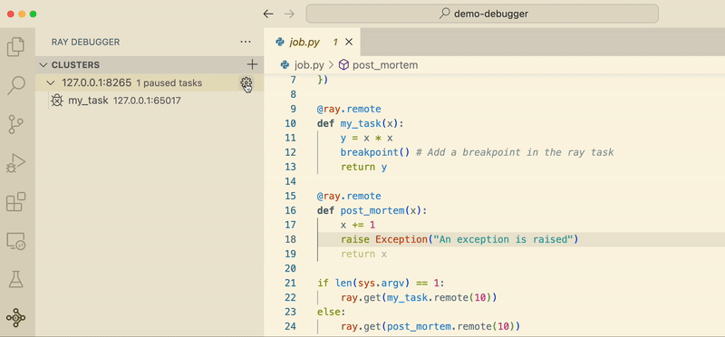

Ray Distributed Debugger
========================

The Ray Distributed Debugger **is a VSCode extension** designed to streamline the debugging process for Ray open source users, offering interactive debugging experience with Visual Studio Code and **`Ray >= 2.9.1`**. The Ray Debugger enables you to:

- **Break into Remote Tasks**: Set breakpoints anywhere in your Ray cluster. When your code hits the breakpoints, it will pause execution and allow you to connect with VSCode for debugging.
- **Post-Mortem Debugging**: When Ray tasks fail with unhandled exceptions, Ray automatically freezes the failing task and waits for the Ray Debugger to attach, allowing you to investigate to inspect the state of the program at the time of the error.

Say goodbye to the complexities of debugging distributed systems. Ray Distributed Debugger empowers you to debug Ray applications more efficiently, saving you time and effort in your development workflow.

**Ready to revolutionize your debugging experience? Complete the form below and dive into seamless debugging with Ray Debugger in VSCode!**

Download for Free
=================

.. raw:: html

    
    

Demo
====

.. raw:: html

    

        <iframe width="560" height="315" src="https://www.youtube.com/embed/EiGHHUXL0oI" title="YouTube video player" frameborder="0" allow="accelerometer; autoplay; clipboard-write; encrypted-media; gyroscope; picture-in-picture; web-share" allowfullscreen></iframe>
    

How to use
==========

Prerequisite
------------

1. `Visual Studio Code <https://code.visualstudio.com/>`_
2. `ray[default] >= 2.9.1`
3. `debugpy >= 1.8.0`

Get started
-----------

- **Setup Environment**: Create a new virtual environment and install dependencies.

    .. code-block:: python

        conda create -n myenv python=3.9
        conda activate myenv
        pip install "ray[default]" debugpy

- **Start a Ray Cluster**: Run ray start `--head` to start a Ray Cluster.

    .. code-block:: bash

        ray start --head

- **Register Clusters**: Add the Ray cluster `IP:PORT` to the Cluster list. The default `IP:PORT` is `127.0.0.1:8265`, and you may change it when starting a new cluster. Make sure the IP and port are accessible from your current machine.

.. image:: ./images/register-cluster.gif
    :align: center

- **Create a Ray Task**: Create a file `job.py` with the following snippet. Add the `RAY_DEBUG` environment variable to enable Ray Debugger and add `breakpoint()` in the ray task.

    .. code-block:: python

        import ray
        import sys

        # Add RAY_DEBUG environment variable to enable Ray Debugger
        ray.init(runtime_env={
            "env_vars": {"RAY_DEBUG": "1"}, 
        })

        @ray.remote
        def my_task(x):
            y = x * x
            breakpoint() # Add a breakpoint in the ray task
            return y

        @ray.remote
        def post_mortem(x):
            x += 1
            raise Exception("An exception is raised")
            return x

        if len(sys.argv) == 1:
            ray.get(my_task.remote(10))
        else:
            ray.get(post_mortem.remote(10)) 

- **Setup Debugger Local Folder**: Ray Debugger needs to know the absolute path to the folder you submitted `job.py`. Use pwd command to get the submission path, and set the cluster's local folder to the path. For each cluster, you can set the local folder by clicking on the ⚙️ icon on the cluster item.

- **Run Your Ray Application**: Start running your Ray application.

    .. code-block:: bash

        python job.py

- **Attach to Paused Tasks**:
  - The task will enter a paused state once the breakpoint is hit.
  - The terminal will clearly indicate when a task is paused and waiting for the debugger to attach.
  - The paused tasks will be listed in the Ray Debugger extension.
  - Click on a paused task to attach the VSCode debugger.

.. image:: ./images/attach-paused-task.gif
    :align: center

- **Use the VSCode Debugger**: Debug your Ray application just as you would when developing locally.

Post-Mortem Debugging
=====================

Continuing from the previous section, let's delve into Post-Mortem debugging. This feature becomes essential when Ray tasks encounter unhandled exceptions. In such cases, Ray automatically freezes the failing task, awaiting attachment by the Ray Debugger. This functionality empowers you to thoroughly investigate and inspect the program's state at the time of the error.

- **Run a Ray Task Raised Exception**: Run the same `job.py` created above with an additional argument raise-exception.

    .. code-block:: bash

        python job.py raise-exception

- **Attach to Paused Tasks**:
  - The task will be frozen once the exception is thrown.
  - The terminal will clearly indicate when a task is paused and waiting for the debugger to attach.
  - The paused tasks will be listed in the Ray Debugger extension.
  - Click on a paused task to attach the VSCode debugger.

.. image:: ./images/post-moretem.gif
    :align: center

- **Use the VSCode Debugger**: Debug your Ray application just as you would when developing locally.

Feedback
=========

Join `#ray-debugger <https://ray-distributed.slack.com/archives/C073MPGLAC9>`_ channel on the Ray slack channel to get help
