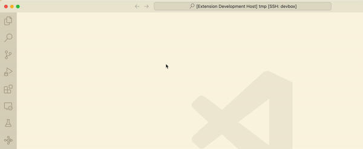
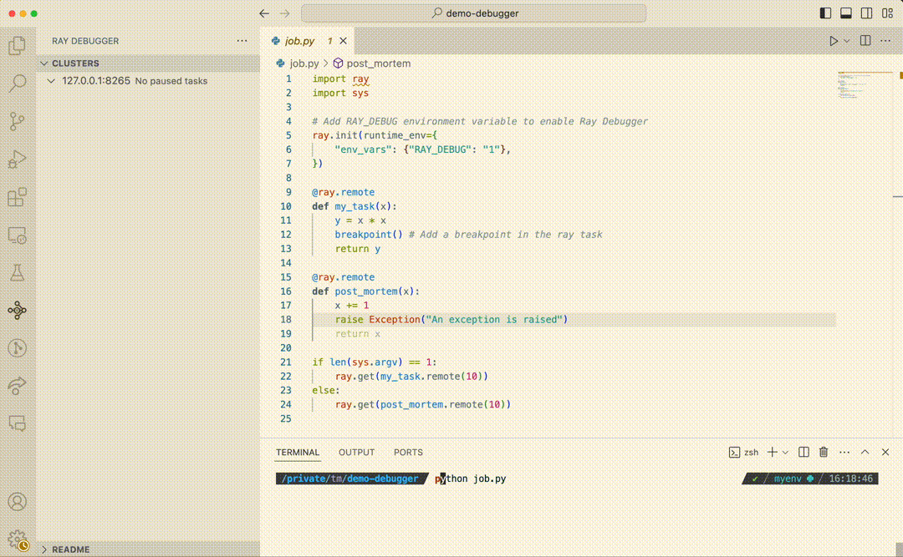
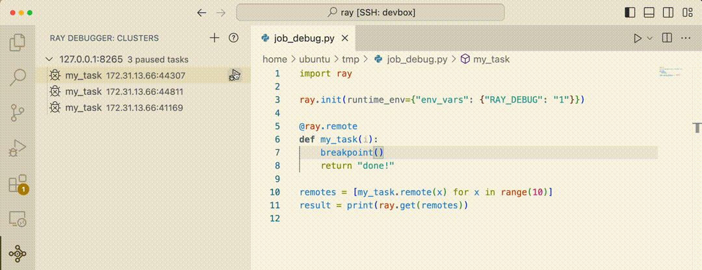
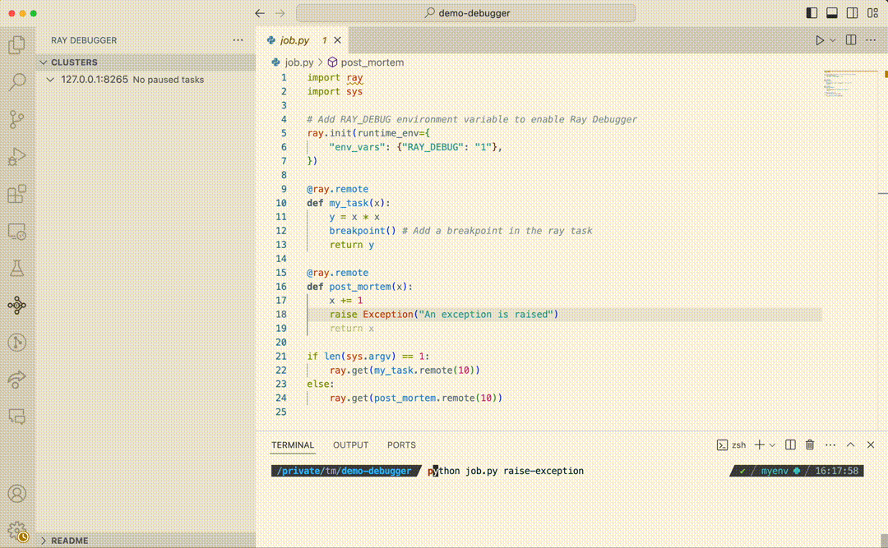

.. _ray-distributed-debugger:

Ray Distributed Debugger
========================

The Ray Distributed Debugger includes a debugger backend and a `VS Code extension <https://www.anyscale.com/blog/ray-distributed-debugger?utm_source=ray_docs&utm_medium=docs&utm_campaign=promotion#download-for-free>`_ frontend that streamline the debugging process with an interactive debugging experience. The Ray Debugger enables you to:

- **Break into remote tasks**: Set a breakpoint in any remote task. A breakpoint pauses execution and allows you to connect with VS Code for debugging.
- **Post-mortem debugging**: When Ray tasks fail with unhandled exceptions, Ray automatically freezes the failing task and waits for the Ray Debugger to attach, allowing you to inspect the state of the program at the time of the error.

Ray Distributed Debugger abstracts the complexities of debugging distributed systems for you to debug Ray applications more efficiently, saving time and effort in the development workflow.

.. note::

    The Ray Distributed Debugger frontend is only available in VS Code and other VS Code-compatible IDEs like Cursor. If you need support for other IDEs, file a feature request on `GitHub <https://github.com/ray-project/ray/issues>`_.

.. raw:: html

    

        <iframe width="560" height="315" src="https://www.youtube.com/embed/EiGHHUXL0oI" title="YouTube video player" frameborder="0" allow="accelerometer; autoplay; clipboard-write; encrypted-media; gyroscope; picture-in-picture; web-share" allowfullscreen></iframe>
    

Set up the environment
~~~~~~~~~~~~~~~~~~~~~~

Create a new virtual environment and install dependencies.

.. testcode::
    :skipif: True

    conda create -n myenv python=3.9
    conda activate myenv
    pip install "ray[default]" debugpy

Start a Ray cluster
~~~~~~~~~~~~~~~~~~~

.. tab-set::

  .. tab-item:: Local

    Run `ray start --head` to start a local Ray cluster.

  .. tab-item:: KubeRay

    Follow the instructions in :doc:`the RayCluster quickstart <../cluster/kubernetes/getting-started/raycluster-quick-start>` to set up a cluster.
    You need to connect VS Code to the cluster. For example, add the following to the `ray-head` container and make sure `sshd` is running in the `ray-head` container.

    .. code-block:: yaml

        ports:
        - containerPort: 22
          name: ssd

    .. note::

        How to run `sshd` in the `ray-head` container depends on your setup. For example you can use `supervisord`.
        A simple way to run `sshd` interactively for testing is by logging into the head node pod and running:

        .. code-block:: bash

            sudo apt-get install openssh-server
            sudo mkdir -p /run/sshd
            sudo /usr/sbin/sshd -D

    You can then connect to the cluster via SSH by running:

    .. code-block:: bash

        kubectl port-forward service/raycluster-sample-head-svc 2222:22

    After checking that `ssh -p 2222 ray@localhost` works, set up VS Code as described in the
    `VS Code SSH documentation <https://code.visualstudio.com/docs/remote/ssh>`_.

Register the cluster
~~~~~~~~~~~~~~~~~~~~

Find and click the Ray extension in the VS Code left side nav. Add the Ray cluster `IP:PORT` to the cluster list. The default `IP:PORT` is `127.0.0.1:8265`. You can change it when you start the cluster. Make sure your current machine can access the IP and port.

Create a Ray task
~~~~~~~~~~~~~~~~~

Create a file `job.py` with the following snippet. Add `breakpoint()` in the Ray task. If you want to use the post-mortem debugging below, also add the `RAY_DEBUG_POST_MORTEM=1` environment variable.

.. literalinclude:: ./doc_code/ray-distributed-debugger.py
    :language: python

Run your Ray app
~~~~~~~~~~~~~~~~

Start running your Ray app.

.. code-block:: bash

    python job.py

Attach to the paused task
~~~~~~~~~~~~~~~~~~~~~~~~~

When the debugger hits a breakpoint:

- The task enters a paused state.
- The terminal clearly indicates when the debugger pauses a task and waits for the debugger to attach.
- The paused task is listed in the Ray Debugger extension.
- Click the play icon next to the name of the paused task to attach the VS Code debugger.

Start and stop debugging
~~~~~~~~~~~~~~~~~~~~~~~~

Debug your Ray app as you would when developing locally. After you're done debugging this particular
breakpoint, click the **Disconnect** button in the debugging toolbar so you can join another task
in the **Paused Tasks** list.

Post-mortem debugging
=====================

Use post-mortem debugging when Ray tasks encounter unhandled exceptions. In such cases, Ray automatically freezes the failing task, awaiting attachment by the Ray Debugger. This feature allows you to thoroughly investigate and inspect the program's state at the time of the error.

Run a Ray task raised exception
~~~~~~~~~~~~~~~~~~~~~~~~~~~~~~~

Run the same `job.py` file with an additional argument to raise an exception.

.. code-block:: bash

    python job.py raise-exception

Attach to the paused task
~~~~~~~~~~~~~~~~~~~~~~~~~

When the app throws an exception:

- The debugger freezes the task.
- The terminal clearly indicates when the debugger pauses a task and waits for the debugger to attach.
- The paused task is listed in the Ray Debugger extension.
- Click the play icon next to the name of the paused task to attach the debugger and start debugging.

Start debugging
~~~~~~~~~~~~~~~

Debug your Ray app as you would when developing locally.

Share feedback
==============

Join the `#ray-debugger <https://ray-distributed.slack.com/archives/C073MPGLAC9>`_ channel on the Ray Slack channel to get help.

Next steps
==========

- For guidance on debugging distributed apps in Ray, see :doc:`General debugging <./user-guides/debug-apps/general-debugging>`.
- For tips on using the Ray debugger, see :doc:`Ray debugging <./user-guides/debug-apps/ray-debugging>`.
