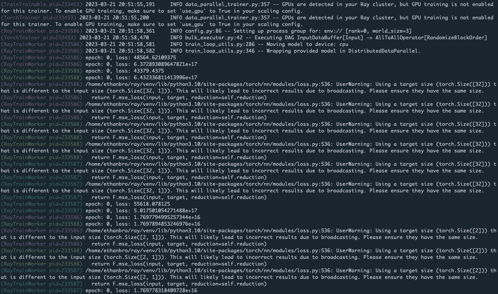

(configure-logging)=

# Configuring Logging

This guide helps you understand and modify the configuration of Ray's logging system.

(logging-directory)=
## Logging directory
By default, Ray stores the log files in a `/tmp/ray/session_*/logs` directory. View the {ref}`log files in logging directory <logging-directory-structure>` below to understand how Ray organizes the log files within the logs folder.

:::{note}
For Linux and macOS, Ray uses ``/tmp/ray`` as the default temp directory. To change the temp and the logging directory, specify it when you call ``ray start`` or ``ray.init()``.
:::

A new Ray session creates a new folder to the temp directory. Ray symlinks the latest session folder to `/tmp/ray/session_latest`. Here is an example temp directory:

```
├── tmp/ray
│   ├── session_latest
│   │   ├── logs
│   │   ├── ...
│   ├── session_2023-05-14_21-19-58_128000_45083
│   │   ├── logs
│   │   ├── ...
│   ├── session_2023-05-15_21-54-19_361265_24281
│   ├── ...
```

Usually, Ray clears up the temp directories whenever the machines reboot. As a result, log files may get lost whenever your cluster or some of the nodes are stopped.

If you need to inspect logs after the clusters stop, you need to store and persist the logs. See the instructions for how to process and export logs for {ref}`Log persistence <vm-logging>` and {ref}`KubeRay Clusters <persist-kuberay-custom-resource-logs>`.

(logging-directory-structure)=
## Log files in logging directory

Below are the log files in the logging directory. Broadly speaking, two types of log files exist: system log files and application log files.
Note that ``.out`` logs are from stdout/stderr and ``.err`` logs are from stderr. Ray doesn't guarantee the backward compatibility of log directories.

:::{note}
System logs may include information about your applications. For example, ``runtime_env_setup-[job_id].log`` may include information about your application's environment and dependency.
:::

### Application logs
- ``job-driver-[submission_id].log``: The stdout of a job submitted with the {ref}`Ray Jobs API <jobs-overview>`.
- ``worker-[worker_id]-[job_id]-[pid].[out|err]``: Python or Java part of Ray drivers and workers. Ray streams all stdout and stderr from Tasks or Actors to these files. Note that job_id is the ID of the driver.

### System/component logs
- ``dashboard.[log|err]``: A log file of a Ray Dashboard. ``.log`` files contain logs generated from the dashboard's logger. ``.err`` files contain stdout and stderr printed from the dashboard. They're usually empty except when the dashboard crashes unexpectedly.
- ``dashboard_agent.log``: Every Ray node has one dashboard agent. This is a log file of the agent.
- ``gcs_server.[out|err]``: The GCS server is a stateless server that manages Ray cluster metadata. It exists only in the head node.
- ``io-worker-[worker_id]-[pid].[out|err]``: Ray creates IO workers to spill/restore objects to external storage by default from Ray 1.3+. This is a log file of IO workers.
- ``log_monitor.[log|err]``: The log monitor is in charge of streaming logs to the driver. ``.log`` files contain logs generated from the log monitor's logger. ``.err`` files contain the stdout and stderr printed from the log monitor. They're usually empty except when the log monitor crashes unexpectedly.
- ``monitor.[out|err]``: Stdout and stderr of a cluster launcher.
- ``monitor.log``: Ray's Cluster Launcher operates from a monitor process. It also manages the Autoscaler.
- ``plasma_store.[out|err]``: Deprecated.
- ``python-core-driver-[worker_id]_[pid].log``: Ray drivers consist of C++ core and a Python or Java frontend. C++ code generates this log file.
- ``python-core-worker-[worker_id]_[pid].log``: Ray workers consist of C++ core and a Python or Java frontend. C++ code generates this log file.
- ``raylet.[out|err]``: A log file of raylets.
- ``redis-shard_[shard_index].[out|err]``: Redis shard log files.
- ``redis.[out|err]``: Redis log files.
- ``runtime_env_agent.log``: Every Ray node has one agent that manages {ref}`Runtime Environment <runtime-environments>` creation, deletion, and caching.
  This is the log file of the agent containing logs of create or delete requests and cache hits and misses.
 The logs of the actual installations for ``pip install`` logs are in the following ``runtime_env_setup-[job_id].log`` file.
- ``runtime_env_setup-ray_client_server_[port].log``: Logs from installing {ref}`Runtime Environments <runtime-environments>` for a job when connecting with {ref}`Ray Client <ray-client-ref>`.
- ``runtime_env_setup-[job_id].log``: Logs from installing {ref}`runtime environments <runtime-environments>` for a Task, Actor, or Job. This file is only present if you install a runtime environment.


(log-redirection-to-driver)=
## Redirecting Worker logs to the Driver
By default, Worker stdout and stderr for Tasks and Actors stream to the Ray Driver (the entrypoint script that calls ``ray.init``). It helps users aggregate the logs for the distributed Ray application in a single place.

```{literalinclude} ../doc_code/app_logging.py
```

Ray prints all stdout emitted from the ``print`` method to the driver with a ``(Task or Actor repr, process ID, IP address)`` prefix.

``` bash
(pid=45601) task
(Actor pid=480956) actor
```

### Customizing prefixes for Actor logs

It's often useful to distinguish between log messages from different Actors. For example, if you have a large number of worker Actors, you may want to easily see the index of the Actor that logged a particular message. Define the `__repr__ <https://docs.python.org/3/library/functions.html#repr>`__ method for the Actor class to replace the Actor name with the Actor repr. For example:

```{literalinclude} /ray-core/doc_code/actor-repr.py
```

The resulting output follows:

```bash
(MyActor(index=2) pid=482120) hello there
(MyActor(index=1) pid=482119) hello there
```

### Coloring Actor log prefixes
By default, Ray prints Actor log prefixes in light blue.
Turn color logging off by setting the environment variable ``RAY_COLOR_PREFIX=0``
- for example, when outputting logs to a file or other location that doesn't support ANSI codes.
Or activate multi-color prefixes by setting the environment variable ``RAY_COLOR_PREFIX=1``;
this indexes into an array of colors modulo the PID of each process.



### Disable logging to the driver
In large scale runs, you may not want to route all worker logs to the driver. Disable this feature by setting ``log_to_driver=False`` in `ray.init`:

```python
import ray

# Task and Actor logs are not copied to the driver stdout.
ray.init(log_to_driver=False)
```


## Log deduplication

By default, Ray deduplicates logs that appear redundantly across multiple processes. The first instance of each log message is always immediately printed. However, Ray buffers subsequent log messages of the same pattern for up to five seconds and prints them in batch. Note that Ray also ignores words with numeric components. For example, for the following code snippet:

```python
import ray
import random

@ray.remote
def task():
    print("Hello there, I am a task", random.random())

ray.get([task.remote() for _ in range(100)])
```

The output is as follows:

```bash
2023-03-27 15:08:34,195	INFO worker.py:1603 -- Started a local Ray instance. View the dashboard at http://127.0.0.1:8265
(task pid=534172) Hello there, I am a task 0.20583517821231412
(task pid=534174) Hello there, I am a task 0.17536720316370757 [repeated 99x across cluster] (Ray deduplicates logs by default. Set RAY_DEDUP_LOGS=0 to disable log deduplication)
```

This feature is useful when importing libraries such as `tensorflow` or `numpy`, which may emit many verbose warning messages when you import them.

Configure the following environment variables on the driver process **before importing Ray** to customize log deduplication:

* Set ``RAY_DEDUP_LOGS=0`` to turn off this feature entirely.
* Set ``RAY_DEDUP_LOGS_AGG_WINDOW_S=<int>`` to change the aggregation window.
* Set ``RAY_DEDUP_LOGS_ALLOW_REGEX=<string>`` to specify log messages to never deduplicate.
    * Example:
        ```python
        import os
        os.environ["RAY_DEDUP_LOGS_ALLOW_REGEX"] = "ABC"

        import ray

        @ray.remote
        def f():
            print("ABC")
            print("DEF")

        ray.init()
        ray.get([f.remote() for _ in range(5)])

        # 2024-10-10 17:54:19,095 INFO worker.py:1614 -- Connecting to existing Ray cluster at address: 172.31.13.10:6379...
        # 2024-10-10 17:54:19,102 INFO worker.py:1790 -- Connected to Ray cluster. View the dashboard at 127.0.0.1:8265
        # (f pid=1574323) ABC
        # (f pid=1574323) DEF
        # (f pid=1574321) ABC
        # (f pid=1574318) ABC
        # (f pid=1574320) ABC
        # (f pid=1574322) ABC
        # (f pid=1574322) DEF [repeated 4x across cluster] (Ray deduplicates logs by default. Set RAY_DEDUP_LOGS=0 to disable log deduplication, or see https://docs.ray.io/en/master/ray-observability/user-guides/configure-logging.html#log-deduplication for more options.)
        ```
* Set ``RAY_DEDUP_LOGS_SKIP_REGEX=<string>`` to specify log messages to skip printing.
    * Example:
        ```python
        import os
        os.environ["RAY_DEDUP_LOGS_SKIP_REGEX"] = "ABC"

        import ray

        @ray.remote
        def f():
            print("ABC")
            print("DEF")

        ray.init()
        ray.get([f.remote() for _ in range(5)])
        # 2024-10-10 17:55:05,308 INFO worker.py:1614 -- Connecting to existing Ray cluster at address: 172.31.13.10:6379...
        # 2024-10-10 17:55:05,314 INFO worker.py:1790 -- Connected to Ray cluster. View the dashboard at 127.0.0.1:8265
        # (f pid=1574317) DEF
        # (f pid=1575229) DEF [repeated 4x across cluster] (Ray deduplicates logs by default. Set RAY_DEDUP_LOGS=0 to disable log deduplication, or see https://docs.ray.io/en/master/ray-observability/user-guides/configure-logging.html#log-deduplication for more options.)
        ```


## Distributed progress bars with tqdm

When using [tqdm](https://tqdm.github.io) in Ray remote Tasks or Actors, you may notice that the progress bar output is corrupted. To avoid this problem, use the Ray distributed tqdm implementation at ``ray.experimental.tqdm_ray``:

```{literalinclude} /ray-core/doc_code/tqdm.py
```

This tqdm implementation works as follows:

1. The ``tqdm_ray`` module translates tqdm calls into special JSON log messages written to the worker stdout.
2. The Ray log monitor routes these log messages to a tqdm singleton, instead of copying them directly to the driver stdout.
3. The tqdm singleton determines the positions of progress bars from various Ray Tasks or Actors, ensuring they don't collide or conflict with each other.

Limitations:

- Ray only supports a subset of tqdm features. Refer to the ray_tqdm [implementation](https://github.com/ray-project/ray/blob/master/python/ray/experimental/tqdm_ray.py) for more details.
- Performance may be poor if there are more than a couple thousand updates per second because Ray doesn't batch updates.

By default, the built-in print is also patched to use `ray.experimental.tqdm_ray.safe_print` when you use `tqdm_ray`.
This avoids progress bar corruption on driver print statements. To turn off this, set `RAY_TQDM_PATCH_PRINT=0`.


## Using Ray's logger
When Ray executes ``import ray``, Ray initializes Ray's logger, generating a default configuration given in ``python/ray/_private/log.py``. The default logging level is ``logging.INFO``.

All Ray loggers are automatically configured in ``ray._private.ray_logging``. To modify the Ray logger:

```python
import logging

logger = logging.getLogger("ray")
logger.setLevel(logging.WARNING) # Modify the Ray logging config
```
Similarly, to modify the logging configuration for Ray libraries, specify the appropriate logger name:

```python
import logging

# First, get the handle for the logger you want to modify
ray_data_logger = logging.getLogger("ray.data")
ray_tune_logger = logging.getLogger("ray.tune")
ray_rllib_logger = logging.getLogger("ray.rllib")
ray_train_logger = logging.getLogger("ray.train")
ray_serve_logger = logging.getLogger("ray.serve")

# Modify the ray.data logging level
ray_data_logger.setLevel(logging.WARNING)

# Other loggers can be modified similarly.
# Here's how to add an additional file handler for Ray Tune:
ray_tune_logger.addHandler(logging.FileHandler("extra_ray_tune_log.log"))
```

### Using Ray logger for application logs
A Ray app includes both driver and worker processes. For Python apps, use Python loggers to format your logs.
As a result, you need to set up Python loggers for both driver and worker processes.

::::{tab-set}

:::{tab-item} Ray Core

```{admonition} Caution
:class: caution
This is an experimental feature. It doesn't support [Ray Client](ray-client-ref) yet.
```

Set up the Python logger for driver and worker processes separately:
1. Set up the logger for the driver process after importing `ray`.
2. Use `worker_process_setup_hook` to configure the Python logger for all worker processes.


If you want to control the logger for particular actors or tasks, view the following [customizing logger for individual worker process](#customizing-worker-process-loggers).

:::

:::{tab-item} Ray libraries
If you are using any of the Ray libraries, follow the instructions provided in the documentation for the library.
:::

::::

### Customizing worker process loggers

Ray executes Tasks and Actors remotely in Ray's worker processes. To provide your own logging configuration for the worker processes, customize the worker loggers with the instructions below:
::::{tab-set}

:::{tab-item} Ray Core: individual worker process
Customize the logger configuration when you define the Tasks or Actors.
```python
import ray
import logging
# Initiate a driver.
ray.init()

@ray.remote
class Actor:
    def __init__(self):
        # Basic config automatically configures logs to
        # stream to stdout and stderr.
        # Set the severity to INFO so that info logs are printed to stdout.
        logging.basicConfig(level=logging.INFO)

    def log(self, msg):
        logger = logging.getLogger(__name__)
        logger.info(msg)

actor = Actor.remote()
ray.get(actor.log.remote("A log message for an actor."))

@ray.remote
def f(msg):
    logging.basicConfig(level=logging.INFO)
    logger = logging.getLogger(__name__)
    logger.info(msg)

ray.get(f.remote("A log message for a task."))
```

```bash
(Actor pid=179641) INFO:__main__:A log message for an actor.
(f pid=177572) INFO:__main__:A log message for a task.
```
:::

:::{tab-item} Ray Core: all worker processes of a job

```{admonition} Caution
:class: caution
This is an experimental feature. The semantic of the API is subject to change.
It doesn't support [Ray Client](ray-client-ref) yet.
```

Use `worker_process_setup_hook` to apply the new logging configuration to all worker processes within a job.

```python
# driver.py
def logging_setup_func():
    logger = logging.getLogger("ray")
    logger.setLevel(logging.DEBUG)
    warnings.simplefilter("always")

ray.init(runtime_env={"worker_process_setup_hook": logging_setup_func})

logging_setup_func()
```
:::

:::{tab-item} Ray libraries
If you use any of the Ray libraries, follow the instructions provided in the documentation for the library.
:::

::::

(structured-logging)=
## Structured logging
Implement structured logging to enable downstream users and applications to consume the logs efficiently.

### Application logs

Ray enables users to configure the Python logging library to output logs in a structured format. This setup standardizes log entries, making them easier to handle.

#### Configure structured logging for Ray Core

```{admonition} Ray libraries
If you are using any of the Ray libraries, follow the instructions provided in the documentation for the library.
```

The following methods are ways to configure Ray Core's structure logging format:

##### Method 1: Configure structured logging with `ray.init`
```python
ray.init(
    log_to_driver=False,
    logging_config=ray.LoggingConfig(encoding="JSON", log_level="INFO")
)
```

You can configure the following parameters:

* `encoding`: The encoding format for the logs. The default is `TEXT` for plain text logs.
The other option is `JSON` for structured logs.
In both `TEXT` and `JSON` encoding formats, the logs include Ray-specific fields such as `job_id`, `worker_id`, `node_id`, `actor_id`, `actor_name`, `task_id`, `task_name` and `task_function_name`, if available.

* `log_level`: The log level for the driver process. The default is `INFO`.
Available log levels are defined in the [Python logging library](https://docs.python.org/3/library/logging.html#logging-levels).

* `additional_log_standard_attrs`: Since Ray version 2.43. A list of additional 
standard Python logger attributes to include in the log record. The default is an empty 
list. The list of already included standard attributes are: `asctime`, `levelname`, 
`message`, `filename`, `lineno`, `exc_text`. The list of all valid attributes are 
specified in the [Python logging library](http://docs.python.org/library/logging.html#logrecord-attributes).

When you set up `logging_config` in `ray.init`, it configures the root loggers for the driver process, Ray actors, and Ray tasks.

```{admonition} note
The `log_to_driver` parameter is set to `False` to disable logging to the driver
process as the redirected logs to the driver will include prefixes that made the logs
not JSON parsable.
```

##### Method 2: Configure structured logging with an environment variable

You can set the `RAY_LOGGING_CONFIG_ENCODING` environment variable to `TEXT` or `JSON` to set the encoding format for the logs.
Note that you need to set the environment variables before `import ray`.

```python
import os
os.environ["RAY_LOGGING_CONFIG_ENCODING"] = "JSON"

import ray
import logging

ray.init(log_to_driver=False)
# Use the root logger to print log messages.
```
#### Example

The following example configures the `LoggingConfig` to output logs in a structured JSON format and sets the log level to `INFO`.
It then logs messages with the root loggers in the driver process, Ray tasks, and Ray actors.
The logs include Ray-specific fields such as `job_id`, `worker_id`, `node_id`, `actor_id`, `actor_name`, `task_id`, `task_name` and `task_function_name` when applicable.

```python
import ray
import logging

ray.init(
    logging_config=ray.LoggingConfig(encoding="JSON", log_level="INFO", additional_log_standard_attrs=['name'])
)

def init_logger():
    """Get the root logger"""
    return logging.getLogger()

logger = logging.getLogger()
logger.info("Driver process")

@ray.remote
def f():
    logger = init_logger()
    logger.info("A Ray task")

@ray.remote
class actor:
    def print_message(self):
        logger = init_logger()
        logger.info("A Ray actor")

task_obj_ref = f.remote()
ray.get(task_obj_ref)

actor_instance = actor.remote()
ray.get(actor_instance.print_message.remote())

"""
{"asctime": "2025-02-25 22:06:00,967", "levelname": "INFO", "message": "Driver process", "filename": "test-log-config-doc.py", "lineno": 13, "name": "root", "job_id": "01000000", "worker_id": "01000000ffffffffffffffffffffffffffffffffffffffffffffffff", "node_id": "543c939946ec1321c9c1a10899bfb72f59aa6eab7655719f2611da04", "timestamp_ns": 1740549960968002000}
{"asctime": "2025-02-25 22:06:00,974", "levelname": "INFO", "message": "A Ray task", "filename": "test-log-config-doc.py", "lineno": 18, "name": "root", "job_id": "01000000", "worker_id": "162f2bd846e84685b4c07eb75f2c1881b9df1cdbf58ffbbcccbf2c82", "node_id": "543c939946ec1321c9c1a10899bfb72f59aa6eab7655719f2611da04", "task_id": "c8ef45ccd0112571ffffffffffffffffffffffff01000000", "task_name": "f", "task_func_name": "test-log-config-doc.f", "timestamp_ns": 1740549960974027000}
{"asctime": "2025-02-25 22:06:01,314", "levelname": "INFO", "message": "A Ray actor", "filename": "test-log-config-doc.py", "lineno": 24, "name": "root", "job_id": "01000000", "worker_id": "b7fd965bb12b1046ddfa3d73ead5ed54eb7678d97e743d98dfab852b", "node_id": "543c939946ec1321c9c1a10899bfb72f59aa6eab7655719f2611da04", "actor_id": "43b5d1828ad0a003ca6ebcfc01000000", "task_id": "c2668a65bda616c143b5d1828ad0a003ca6ebcfc01000000", "task_name": "actor.print_message", "task_func_name": "test-log-config-doc.actor.print_message", "actor_name": "", "timestamp_ns": 1740549961314391000}
"""
```

#### Add metadata to structured logs

Add extra fields to the log entries by using the `extra` parameter in the `logger.info` method.

```python
import ray
import logging

ray.init(
    log_to_driver=False,
    logging_config=ray.LoggingConfig(encoding="JSON", log_level="INFO")
)

logger = logging.getLogger()
logger.info("Driver process with extra fields", extra={"username": "anyscale"})

# The log entry includes the extra field "username" with the value "anyscale".

# {"asctime": "2024-07-17 21:57:50,891", "levelname": "INFO", "message": "Driver process with extra fields", "filename": "test.py", "lineno": 9, "username": "anyscale", "job_id": "04000000", "worker_id": "04000000ffffffffffffffffffffffffffffffffffffffffffffffff", "node_id": "76cdbaa32b3938587dcfa278201b8cef2d20377c80ec2e92430737ae"}
```

If needed, you can fetch the metadata of Jobs, Tasks, or Actors with Ray’s {py:obj}`ray.runtime_context.get_runtime_context` API.
::::{tab-set}

:::{tab-item} Ray Job
Get the job ID.

```python
import ray
# Initiate a driver.
ray.init()

job_id = ray.get_runtime_context().get_job_id
```

```{admonition} Note
:class: note
The job submission ID is not supported yet. This [GitHub issue](https://github.com/ray-project/ray/issues/28089#issuecomment-1557891407) tracks the work to support it.
```
:::

:::{tab-item} Ray Actor
Get the actor ID.

```python
import ray
# Initiate a driver.
ray.init()
@ray.remote
class actor():
    actor_id = ray.get_runtime_context().get_actor_id
```


:::

:::{tab-item} Ray Task
Get the task ID.

```python
import ray
# Initiate a driver.
ray.init()
@ray.remote
def task():
    task_id = ray.get_runtime_context().get_task_id
```
:::

:::{tab-item} Node
Get the node ID.

```python
import ray
# Initiate a driver.
ray.init()

# Get the ID of the node where the driver process is running
driver_process_node_id = ray.get_runtime_context().get_node_id

@ray.remote
def task():
    # Get the ID of the node where the worker process is running
    worker_process_node_id = ray.get_runtime_context().get_node_id
```

```{admonition} Tip
:class: tip
If you need node IP, use {py:obj}`ray.nodes` API to fetch all nodes and map the node ID to the corresponding IP.
```


:::


::::

### System logs
Ray structures most system or component logs by default. <br />

Logging format for Python logs <br />
```bash
%(asctime)s\t%(levelname)s %(filename)s:%(lineno)s -- %(message)s
```

Example: <br />
```
2023-06-01 09:15:34,601	INFO job_manager.py:408 -- Submitting job with RAY_ADDRESS = 10.0.24.73:6379
```

Logging format for c++ logs <br />

```bash
[year-month-day, time, pid, thread_id] (component) [file]:[line] [message]
```

Example: <br />

```bash
[2023-06-01 08:47:47,457 I 31009 225171] (gcs_server) gcs_node_manager.cc:42: Registering node info, node id = 8cc65840f0a332f4f2d59c9814416db9c36f04ac1a29ac816ad8ca1e, address = 127.0.0.1, node name = 127.0.0.1
```

:::{note}
Some system component logs aren't structured as suggested preceding as of 2.5. The migration of system logs to structured logs is ongoing.
:::

(log-rotation)=
## Log rotation

Ray supports log rotation of log files. Note that not all components support log rotation. (Raylet, Python, and Java worker logs don't rotate).

By default, logs rotate when they reach 512 MB (maxBytes), and have a maximum of five backup files (backupCount). Ray appends indexes to all backup files - for example, `raylet.out.1`.
To change the log rotation configuration, specify environment variables. For example,

```bash
RAY_ROTATION_MAX_BYTES=1024; ray start --head # Start a ray instance with maxBytes 1KB.
RAY_ROTATION_BACKUP_COUNT=1; ray start --head # Start a ray instance with backupCount 1.
```

The max size of a log file, including its backup, is `RAY_ROTATION_MAX_BYTES * RAY_ROTATION_BACKUP_COUNT + RAY_ROTATION_MAX_BYTES`


## Log persistence

To process and export logs to external storage or management systems, view {ref}`log persistence on Kubernetes <persist-kuberay-custom-resource-logs>` see {ref}`log persistence on VMs <vm-logging>` for more details.
