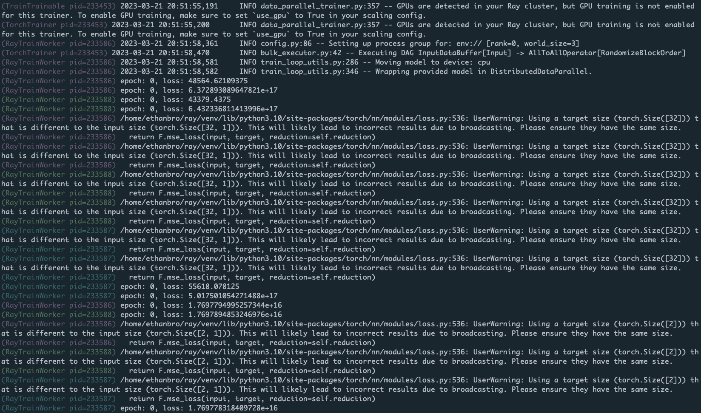

.. _configure-logging:

Configuring Logging
===================

This guide helps you modify the default configuration of Ray's logging system.

Internal Ray logging configuration
~~~~~~~~~~~~~~~~~~~~~~~~~~~~~~~~~~
When ``import ray`` is executed, Ray's logger is initialized, generating a sensible configuration given in ``python/ray/_private/log.py``. The default logging level is ``logging.INFO``.

All Ray loggers are automatically configured in ``ray._private.ray_logging``. To change the Ray library logging configuration:

.. code-block:: python

   import logging

   logger = logging.getLogger("ray")
   logger # Modify the ray logging config

Similarly, to modify the logging configuration for any Ray subcomponent, specify the appropriate logger name:

.. code-block:: python

   import logging

   # First, get the handle for the logger you want to modify
   ray_data_logger = logging.getLogger("ray.data")
   ray_tune_logger = logging.getLogger("ray.tune")
   ray_rllib_logger = logging.getLogger("ray.rllib")
   ray_air_logger = logging.getLogger("ray.air")
   ray_train_logger = logging.getLogger("ray.train")
   ray_workflow_logger = logging.getLogger("ray.workflow")

   # Modify the ray.data logging level
   ray_data_logger.setLevel(logging.WARNING)

   # Other loggers can be modified similarly.
   # Here's how to add an aditional file handler for ray tune:
   ray_tune_logger.addHandler(logging.FileHandler("extra_ray_tune_log.log"))

For more information about logging in workers, see :ref:`Customizing worker loggers <customize-worker-loggers>`.

Disabling logging to the driver
~~~~~~~~~~~~~~~~~~~~~~~~~~~~~~~

In large scale runs, it may be undesirable to route all worker logs to the driver. You can disable this feature by setting ``log_to_driver=False`` in Ray init:

.. code-block:: python

    import ray

    # Task and actor logs will not be copied to the driver stdout.
    ray.init(log_to_driver=False)

Log deduplication
~~~~~~~~~~~~~~~~~

By default, Ray deduplicates logs that appear redundantly across multiple processes. The first instance of each log message is always immediately printed. However, subsequent log messages of the same pattern (ignoring words with numeric components) are buffered for up to five seconds and printed in batch. For example, for the following code snippet:

.. code-block:: python

    import ray
    import random

    @ray.remote
    def task():
        print("Hello there, I am a task", random.random())

    ray.get([task.remote() for _ in range(100)])

The output is as follows:

.. code-block:: bash

    2023-03-27 15:08:34,195	INFO worker.py:1603 -- Started a local Ray instance. View the dashboard at http://127.0.0.1:8265 
    (task pid=534172) Hello there, I am a task 0.20583517821231412
    (task pid=534174) Hello there, I am a task 0.17536720316370757 [repeated 99x across cluster] (Ray deduplicates logs by default. Set RAY_DEDUP_LOGS=0 to disable log deduplication)

This feature is especially useful when importing libraries such as `tensorflow` or `numpy`, which may emit many verbose warning messages when imported. You can configure this feature as follows:

1. Set ``RAY_DEDUP_LOGS=0`` to disable this feature entirely.
2. Set ``RAY_DEDUP_LOGS_AGG_WINDOW_S=<int>`` to change the agggregation window.
3. Set ``RAY_DEDUP_LOGS_ALLOW_REGEX=<string>`` to specify log messages to never deduplicate.
4. Set ``RAY_DEDUP_LOGS_SKIP_REGEX=<string>`` to specify log messages to skip printing.

Customizing Actor logs prefixes
~~~~~~~~~~~~~~~~~~~~~~~~~~~~~~~

It is often useful to distinguish between log messages from different Actors. For example, suppose you have a large number of worker Actors. In this case, you may want to be able to easily see the index of the Actor that logged a particular message. This can be achieved by defining the `__repr__ <https://docs.python.org/3/library/functions.html#repr>`__ method for an Actor class. When defined, the Actor repr will be used in place of the Actor name. For example:

.. literalinclude:: /ray-core/doc_code/actor-repr.py

This produces the following output:

.. code-block:: bash

    (MyActor(index=2) pid=482120) hello there
    (MyActor(index=1) pid=482119) hello there

Coloring Actor log prefixes
~~~~~~~~~~~~~~~~~~~~~~~~~~~~
By default, Ray prints Actor logs prefixes in light blue:
Users may instead activate multi-color prefixes by setting the environment variable ``RAY_COLOR_PREFIX=1``.
This indexes into an array of colors modulo the PID of each process.

Distributed progress bars (tqdm)
~~~~~~~~~~~~~~~~~~~~~~~~~~~~~~~~

When using `tqdm <https://tqdm.github.io>`__ in Ray remote Tasks or Actors, you may notice that the progress bar output is corrupted. To avoid this problem, use the Ray distributed tqdm implementation at ``ray.experimental.tqdm_ray``:

.. literalinclude:: /ray-core/doc_code/tqdm.py

This tqdm implementation works as follows:

1. The ``tqdm_ray`` module translates TQDM calls into special JSON log messages written to worker stdout.
2. The Ray log monitor, instead of copying these log messages directly to the driver stdout, routes these messages to a tqdm singleton.
3. The tqdm singleton determines the positions of progress bars from various Ray tasks or actors, ensuring they don't collide or conflict with each other.

Limitations:

- Only a subset of tqdm functionality is supported. Refer to the ray_tqdm `implementation <https://github.com/ray-project/ray/blob/master/python/ray/experimental/tqdm_ray.py>`__ for more details.
- Performance may be poor if there are more than a couple thousand updates per second (updates are not batched).

By default, the built-in print is also patched to use `ray.experimental.tqdm_ray.safe_print` when `tqdm_ray` is used.
This avoids progress bar corruption on driver print statements. To disable this, set `RAY_TQDM_PATCH_PRINT=0`.

.. _customize-worker-loggers:

Customizing worker loggers
~~~~~~~~~~~~~~~~~~~~~~~~~~

When using Ray, all tasks and actors are executed remotely in Ray's worker processes. 

.. note::

    To stream logs to a driver, they should be flushed to stdout and stderr.

.. code-block:: python

    import ray
    import logging
    # Initiate a driver.
    ray.init()

    @ray.remote
    class Actor:
        def __init__(self):
            # Basic config automatically configures logs to
            # be streamed to stdout and stderr.
            # Set the severity to INFO so that info logs are printed to stdout.
            logging.basicConfig(level=logging.INFO)

        def log(self, msg):
            logger = logging.getLogger(__name__)
            logger.info(msg)

    actor = Actor.remote()
    ray.get(actor.log.remote("A log message for an actor."))

    @ray.remote
    def f(msg):
        logging.basicConfig(level=logging.INFO)
        logger = logging.getLogger(__name__)
        logger.info(msg)

    ray.get(f.remote("A log message for a task."))

.. code-block:: bash

    (Actor pid=179641) INFO:__main__:A log message for an actor.
    (f pid=177572) INFO:__main__:A log message for a task.