.. _ray-core-mem-profiling:

Debugging Memory Issues
=======================

.. _troubleshooting-out-of-memory:

Debugging Out of Memory
-----------------------

Before reading this section, familiarize yourself with the Ray :ref:`Memory Management <memory>` model.

- If your cluster has out-of-memory problems, view :ref:`How to Detect Out-of-Memory Errors <troubleshooting-out-of-memory-how-to-detect>`.
- To locate the source of the memory problems, view :ref:`Find per Task and Actor Memory Usage <troubleshooting-out-of-memory-task-actor-mem-usage>`.
- Once the source of the memory problems is identified, address by :ref:`Eliminating worker out-of-memory errors <troubleshooting-out-of-memory-eliminate-worker-oom>`.
- If your head node has high memory usage, view :ref:`Head Node Out-of-Memory Error <troubleshooting-out-of-memory-head>`.
- If your memory usage is high due to high parallelism, view :ref:`Reduce Parallelism <troubleshooting-out-of-memory-reduce-parallelism>`.
- If you want to profile per Task and Actor memory usage, view :ref:`Profile Task and Actor Memory Usage <troubleshooting-out-of-memory-profile>`.

What's the Out-of-Memory Error?
~~~~~~~~~~~~~~~~~~~~~~~~~~~~~~~

Memory is a limited resource. When a process requests memory and the OS fails to allocate it, the OS executes a routine to free up memory
by killing a process that has high memory usage (via SIGKILL) to avoid the OS becoming unstable. This routine is called the `Linux Out of Memory killer <https://www.kernel.org/doc/gorman/html/understand/understand016.html>`_.

For Ray, the linux out-of-memory (OOM) killer kills Ray processes without the control plane noticing it. This can cause the following problems:
1. The Linux OOM killer indiscriminately kills processes based on memory footprint.
   To Ray, this behavior can result in the significant loss of progress and in some scenarios, the death of critical 
   Ray components, leading to node deaths.
2. The Linux OOM killer uses SIGKILL to kill processes. Since SIGKILL cannot be handled by processes, 
   Ray has difficulty raising a proper error message and taking proper actions for fault tolerance.

.. _troubleshooting-out-of-memory-how-to-detect:

Detecting Out-of-Memory errors
~~~~~~~~~~~~~~~~~~~~~~~~~~~~~~~~~~~

Out of memory errors can be monitored on the Ray Dashboard via the Ray OOM Kills panel and the Unexpected System Level Worker Failures panel.
The Ray OOM Kills panel shows the number of workers killed by the Ray OOM killer.
The Unexpected System Level Worker Failures panel shows the number of workers that unexpectedly failed. These are typically
caused by the Linux out-of-memory killer (corrolate with memory usage metrics to confirm).
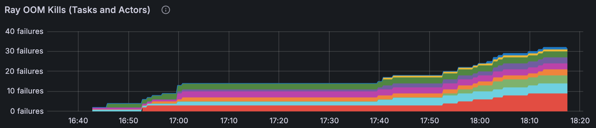
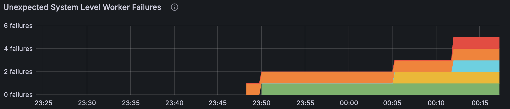

If the Linux out-of-memory killer terminates Tasks or Actors, Ray Worker processes are unable to catch and display an exact root cause
because SIGKILL cannot be handled by processes. If you call ``ray.get`` into the Tasks and Actors that were executed from the dead worker,
it raises an exception with one of the following error messages (which indicates the worker is killed unexpectedly).

.. code-block:: bash

  Worker exit type: UNEXPECTED_SY STEM_EXIT Worker exit detail: Worker unexpectedly exits with a connection error code 2. End of file. There are some potential root causes. (1) The process is killed by SIGKILL by OOM killer due to high memory usage. (2) ray stop --force is called. (3) The worker is crashed unexpectedly due to SIGSEGV or other unexpected errors.

.. code-block:: bash

  Worker exit type: SYSTEM_ERROR Worker exit detail: The leased worker has unrecoverable failure. Worker is requested to be destroyed when it is returned.

You can also use the `dmesg <https://phoenixnap.com/kb/dmesg-linux#:~:text=The%20dmesg%20command%20is%20a,take%20place%20during%20system%20startup.>`_ CLI command to verify the processes are killed by the Linux out-of-memory killer.

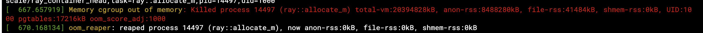

Like mentioned above, the linux OOM killer triggering before the ray OOM killer is undesirable.
For users in Ray 2.56 and above, we recommend enabling resource isolation mode by passing ``--enable-resource-isolation`` when starting Ray 
to enforce that the ray OOM killer triggers before the linux OOM killer. If resource isolation is already enabled, but Linux OOM kills are 
still happening, the system overhead is likely eating into the memory allocated for user processes. In this case, please increase the 
memory reserved for system processes by setting a higher value for ``--system-reserved-memory`` option when starting Ray in resource isolation mode.

Note: If you would like to enable resource isolation, please make sure to complete the prerequisite steps in :ref:`How to Enable Cgroup v2 for Resource Isolation <enable-cgroupv2>`.

If Ray's memory monitor kills the worker, it is automatically retried (see the :ref:`link <ray-oom-retry-policy>` for details).
Ray's memory monitor will also log the details of the out-of-memory kill to the ``raylet.out`` log file. 
Note that the log's new lines are delimiteed by ``;`` instead of ``\n`` to make grepping for the log easier. 
The example log below has ``;`` replaced with ``\n`` for readability.

.. code-block:: bash
  Task hungry_hippo failed due to oom. There are infinite oom retries remaining, so the task will be retried. Error: 2 worker(s) were killed due to the node running low on memory. Memory on the node (IP: <ip address>, ID: 92edc4e97e4dac3cee61126133ee7ab6d0a2ee73803623d24a02979d) was 110.69GB / 124.35GB (0.890161)
  OOM kill reason: user cgroup memory upper bound was met or exceeded
  Object store memory usage: [- objects spillable: 0
  - bytes spillable: 0
  - objects unsealed: 0
  - bytes unsealed: 0
  - objects in use: 0
  - bytes in use: 0
  - objects evictable: 0
  - bytes evictable: 0
  
  - objects created by worker: 0
  - bytes created by worker: 0
  - objects restored: 0
  - bytes restored: 0
  - objects received: 0
  - bytes received: 0
  - objects errored: 0
  - bytes errored: 0
  
  Eviction Stats:
  (global lru) capacity: 35098657996
  (global lru) used: 0%
  (global lru) num objects: 0
  (global lru) num evictions: 0
  (global lru) bytes evicted: 0]
  Ray killed 2 worker(s) based on the killing policy
  Considered workers: [
  Selected to kill: (Task: job ID=01000000, lease ID=0600000001000000ffffffffffffffffffffffffffffffffffffffffffffffff, task name=hungry_hippo, required resources={CPU: 1}, pid=3310152, actual memory used=0.67GB, worker ID=3e3d8f80b70d48b643d79ed2292b5d4f779820a964e55ad65413687d)
  Selected to kill: (Task: job ID=01000000, lease ID=0400000001000000ffffffffffffffffffffffffffffffffffffffffffffffff, task name=hungry_hippo, required resources={CPU: 1}, pid=3310153, actual memory used=21.64GB, worker ID=0e5649d39c15609c0db6a5cf95de94befded2ee7da2facbf64b52e6f)
  (Task: job ID=01000000, lease ID=0500000001000000ffffffffffffffffffffffffffffffffffffffffffffffff, task name=hungry_hippo, required resources={CPU: 1}, pid=3310151, actual memory used=21.95GB, worker ID=34241048bfb59ac29bd5e32d706c9bd41eafc6972c9bcbada99464e7)
  (Task: job ID=01000000, lease ID=0000000001000000ffffffffffffffffffffffffffffffffffffffffffffffff, task name=hungry_hippo, required resources={CPU: 1}, pid=3310149, actual memory used=21.87GB, worker ID=2cc6dbeef4ebc06789de65fb43e04fbe1feebf1e699902ece89a8328)
  (Task: job ID=01000000, lease ID=0200000001000000ffffffffffffffffffffffffffffffffffffffffffffffff, task name=hungry_hippo, required resources={CPU: 1}, pid=3310155, actual memory used=21.85GB, worker ID=14d4cc84e2f21ba3edbc9948b780d67013afbffda99dd33e829d56d3)
  (Task: job ID=01000000, lease ID=0100000001000000ffffffffffffffffffffffffffffffffffffffffffffffff, task name=hungry_hippo, required resources={CPU: 1}, pid=3310147, actual memory used=21.53GB, worker ID=c90db9af23d78530d1f848c1301bc4b877925fe9122bc70948ad9489)]
  Total non-selected idle workers: 25
  Total non-selected idle workers USS bytes: 1.00GB
  To see more information about memory usage on this node, use `ray logs raylet.out -ip <ip address>`
  Top 10 memory users: PID  MEM(GB) COMMAND
  3310151        21.95   ray::hungry_hippo
  3310149      21.87   ray::hungry_hippo
  3310155      21.85   ray::hungry_hippo
  3310153   21.64   ray::hungry_hippo
  3310147      21.53   ray::hungry_hippo
  3108574      1.95    bazel(ray) --add-opens=java.base/java.lang=ALL-UNNAMED -Xverify:none -Djava.util.logging.config.file...
  3180337     1.61    /home/ubuntu/.cursor-server/data/User/globalStorage/llvm-vs-code-extensions.vscode-clangd/install/21...
  3310152        0.67    ray::hungry_hippo
  2924839      0.53    /home/ubuntu/.cursor-server/bin/linux-x64/d5b2fc092e16007956c9e5047f76097b9e626ca0/node --dns-result...
  3149737     0.47    /home/ubuntu/.cursor-server/bin/linux-x64/d5b2fc092e16007956c9e5047f76097b9e626ca0/node --dns-result...
  Refer to the documentation on how to address the out of memory issue: https://docs.ray.io/en/latest/ray-core/scheduling/ray-oom-prevention.html. Consider provisioning more memory on this node or reducing task parallelism by requesting more CPUs per task. To adjust the kill threshold, set the environment variable `RAY_memory_usage_threshold` when starting Ray. To disable worker killing, set the environment variable `RAY_memory_monitor_refresh_ms` to zero. Since 2.56, Ray updated the oom killing policy to enabling killing multiple workers and selecting workers based on the time since the task start executing. To revert to the legacy policy of determining worker to oom kill based on owner group size or only selecting a single worker to kill at a time, set the environment variable `RAY_worker_killing_policy_by_group` to true before starting Ray. If the idle workers have a non-trivial memory footprint at the time of OOM (check OOM log for non-selected idle workers), consider setting the environment variable `RAY_idle_worker_killing_memory_threshold_bytes` to a lower value to consider idle workers with lower memory footprint for killing.

If Tasks or Actors cannot be retried, they raise an exception with 
a similar error message when you call ``ray.get`` to it.

Ray memory monitor also periodically prints the aggregated out-of-memory killer summary to Ray drivers.

.. code-block:: bash

  (raylet) [2023-04-09 07:23:59,445 E 395 395] (raylet) node_manager.cc:3049: 10 Workers (tasks / actors) killed due to memory pressure (OOM), 0 Workers crashed due to other reasons at node (ID: e5d953ef03e55e26f13973ea1b5a0fd0ecc729cd820bc89e4aa50451, IP: 10.0.62.231) over the last time period. To see more information about the Workers killed on this node, use `ray logs raylet.out -ip 10.0.62.231`
  (raylet) 
  (raylet) Refer to the documentation on how to address the out of memory issue: https://docs.ray.io/en/latest/ray-core/scheduling/ray-oom-prevention.html. Consider provisioning more memory on this node or reducing task parallelism by requesting more CPUs per task. To adjust the kill threshold, set the environment variable `RAY_memory_usage_threshold` when starting Ray. To disable worker killing, set the environment variable `RAY_memory_monitor_refresh_ms` to zero.

Ray Dashboard's :ref:`metrics page <dash-metrics-view>` and :ref:`event page <dash-event>` also provides the out-of-memory killer-specific events and metrics.

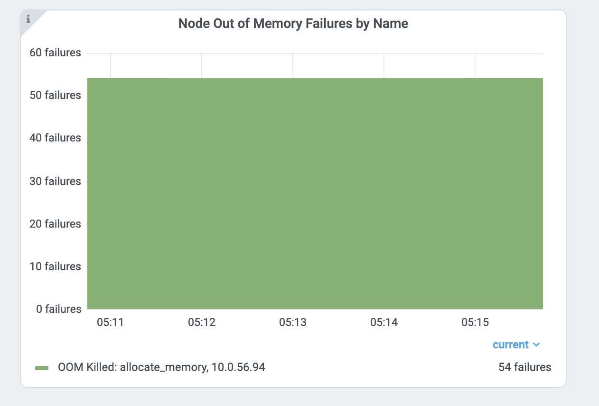

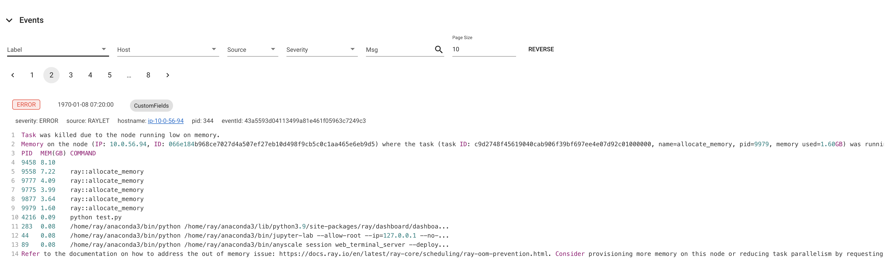

.. _troubleshooting-out-of-memory-task-actor-mem-usage:

Find per Task and Actor Memory Usage
~~~~~~~~~~~~~~~~~~~~~~~~~~~~~~~~~~~~

If Tasks or Actors fail because of out-of-memory errors, they are retried based on :ref:`retry policies <ray-oom-retry-policy>`. 
However, it is often preferred to find the root causes of memory issues and fix them instead of relying on fault tolerance mechanisms.
This section explains how to debug out-of-memory errors in Ray.

To view the memory usage of tasks and actors at the time of OOM, you can view the considered workers in the OOM log above. This information 
can be used to identify the tasks and actors that were responsible for the OOM. The OOM log also includes the memory footprint of all idle workers. 
See :ref:`ray-oom-worker-killing-policy` for how we consider idle workers for killing.

To view the memory usage of Tasks and Actors based on type over time, view the :ref:`per Task and Actor memory usage graph <dash-workflow-cpu-memory-analysis>` for more details.
The memory usage from the per component graph uses RSS - SHR. See below for reasoning.

Alternatively, you can also use the CLI command `htop <https://htop.dev/>`_.

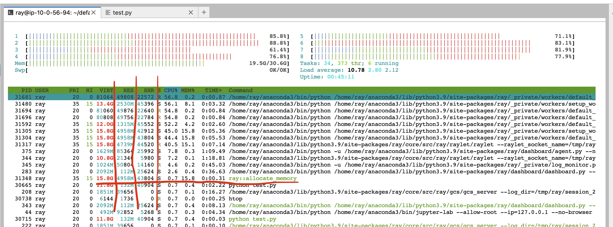

See the ``allocate_memory`` row. See two columns, RSS and SHR. 

SHR usage is typically the memory usage from the Ray object store. The Ray object store allocates 30% of host memory to the shared memory (``/dev/shm``, unless you specify ``--object-store-memory``).
If Ray workers access the object inside the object store using ``ray.get``, SHR usage increases. Since the Ray object store supports the :ref:`zero-copy <serialization-guide>`
deserialization, several workers can access the same object without copying them to in-process memory. For example, if
8 workers access the same object inside the Ray object store, each process' ``SHR`` usage increases. However, they are not using 8 * SHR memory (there's only 1 copy in the shared memory). 
Also note that Ray object store triggers :ref:`object spilling <object-spilling>` when the object usage goes beyond the limit, which means the memory usage from the shared memory won't exceed 30%
of the host memory.

Out-of-memory issues from a host, are due to RSS usage from each worker. Calculate per
process memory usage by RSS - SHR because SHR is for Ray object store as explained above. The total memory usage is typically
``SHR (object store memory usage, 30% of memory) + sum(RSS - SHR from each ray proc) + sum(RSS - SHR from system components. e.g., raylet, GCS. Usually small)``.

.. _troubleshooting-out-of-memory-eliminate-worker-oom:

Eliminating worker out-of-memory errors
~~~~~~~~~~~~~~~~~~~~~~~~~~~~~~~~~~~~~~~

Most commonly, out-of-memory errors are caused by oversubscribing the memory resource on a node. 
By default, each task or actor has no memory requirements. This means that the scheduler is unaware 
of the memory footprint of the tasks and actors and may schedule too many memory hungry tasks or actors onto a node.

To prevent this oversubscription and eliminate OOM issues, you can pass in a `memory` resource request to tasks or actors 
to reserve a certain amount of memory for them to use. See :ref:`resource requirements <resource-requirements>` for more details. 
Note that this does not impose any limits on memory usage and is used for scheduling only. 
As we can see from the example OOM log above, we also include the resource request for each active worker. Thus, 
if the worker memory usage exceeds the requested memory at the time of OOM, please adjust the resource request accordingly.

.. _troubleshooting-out-of-memory-head:

Head node out-of-Memory error
~~~~~~~~~~~~~~~~~~~~~~~~~~~~~

First, check the head node memory usage from the metrics page. Find the head node address from the cluster page.

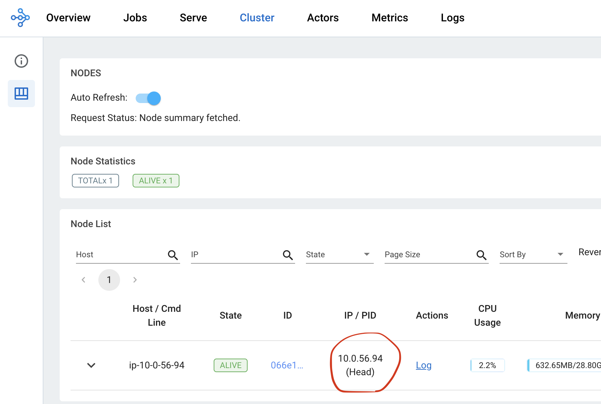

Then check the memory usage from the head node from the node memory usage view inside the Dashboard :ref:`metrics view <dash-metrics-view>`.

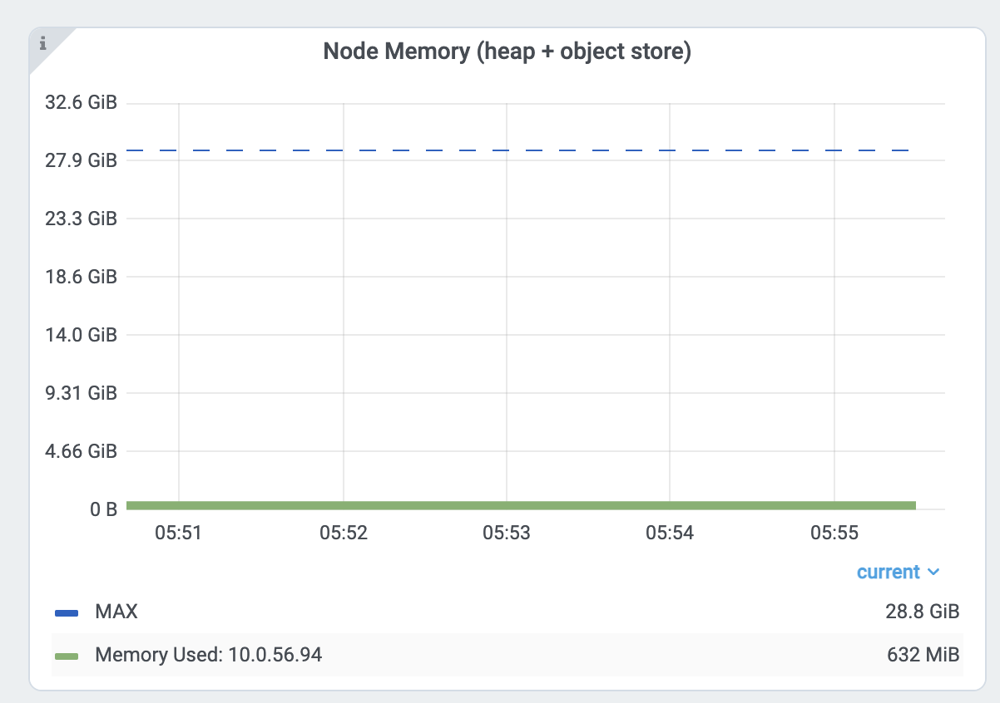

The Ray head node has more memory-demanding system components such as GCS or the dashboard. 
Also, the driver runs from a head node by default. If the head node has the same memory capacity as worker nodes
and if you execute the same number of Tasks and Actors from a head node, it can easily have out-of-memory problems.
In this case, do not run any Tasks and Actors on the head node by specifying ``--num-cpus=0`` when starting a head node by ``ray start --head``.
If you use KubeRay, view :ref:`here <kuberay-num-cpus>`.

.. _troubleshooting-out-of-memory-reduce-parallelism:

Reduce Parallelism
~~~~~~~~~~~~~~~~~~

High parallelism can trigger out-of-memory errors. For example, if
you have 8 training workers that perform the data preprocessing -> training. 
If you load too much data into each worker, the total memory usage (``training worker mem usage * 8``) can exceed the
memory capacity. 

Verify the memory usage by looking at the :ref:`per Task and Actor memory usage graph <dash-workflow-cpu-memory-analysis>` and the Task metrics.

First, see the memory usage of an ``allocate_memory`` task. The total is 18GB.
At the same time, verify the 15 concurrent tasks that are running.

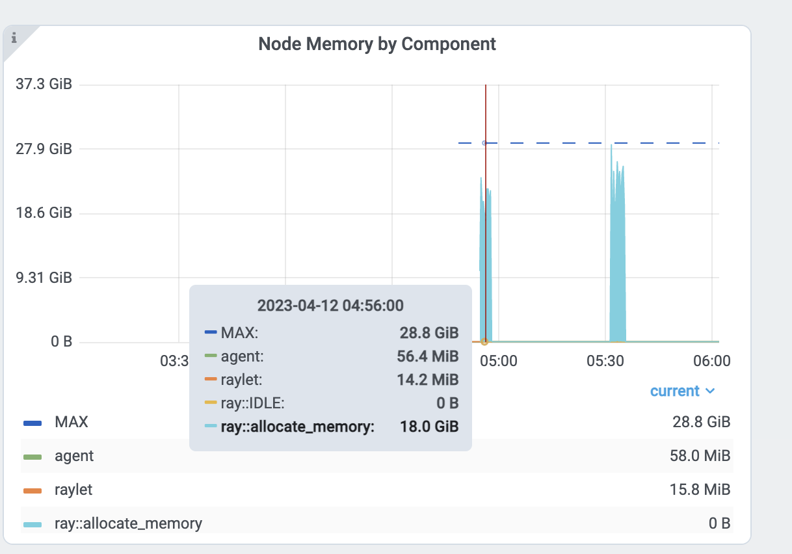

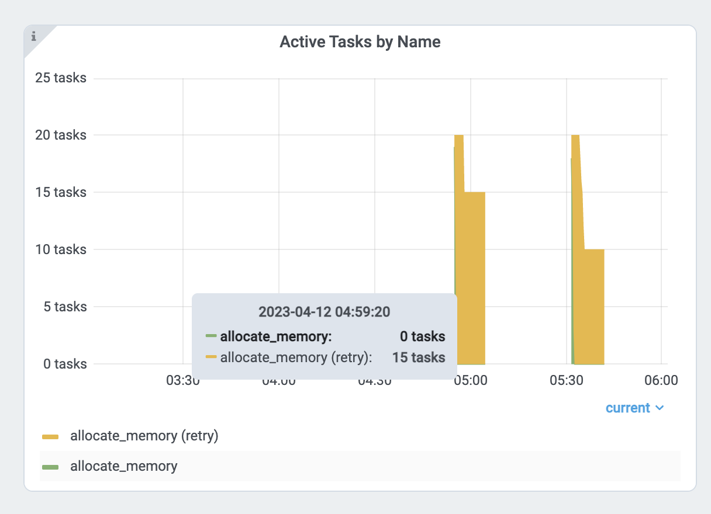

Each task uses about 18GB / 15 == 1.2 GB. To reduce the parallelism:

- `Limit the max number of running tasks <https://docs.ray.io/en/latest/ray-core/patterns/limit-running-tasks.html>`_. 
- Increase the ``num_cpus`` options for :func:`ray.remote`. Modern hardware typically has 4GB of memory per CPU, so you can choose the CPU requirements accordingly. This example specifies 1 CPU per ``allocate_memory`` Task. Doubling the CPU requirements, runs only half(7) of the Tasks at the same time, and memory usage doesn't exceed 9GB.

.. _troubleshooting-out-of-memory-profile:

Profiling Task and Actor memory usage
~~~~~~~~~~~~~~~~~~~~~~~~~~~~~~~~~~~~~~

It is also possible tasks and actors use more memory than you expect. For example, actors or tasks can have a memory leak or have unnecessary copies.

View the instructions below to learn how to memory profile individual actors and tasks.

.. _memray-profiling:

Memory Profiling Ray tasks and actors
--------------------------------------

To memory profile Ray tasks or actors, use `memray <https://bloomberg.github.io/memray/>`_.
Note that you can also use other memory profiling tools if it supports a similar API.

First, install ``memray``.

.. code-block:: bash

  pip install memray

``memray`` supports a Python context manager to enable memory profiling. You can write the ``memray`` profiling file wherever you want.
But in this example, we will write them to `/tmp/ray/session_latest/logs` because Ray dashboard allows you to download files inside the log folder.
This will allow you to download profiling files from other nodes.

.. tab-set::

    .. tab-item:: Actors

      .. literalinclude:: ../../doc_code/memray_profiling.py
          :language: python
          :start-after: __memray_profiling_start__
          :end-before: __memray_profiling_end__

    .. tab-item:: Tasks

      Note that tasks have a shorter lifetime, so there could be lots of memory profiling files.

      .. literalinclude:: ../../doc_code/memray_profiling.py
          :language: python
          :start-after: __memray_profiling_task_start__
          :end-before: __memray_profiling_task_end__

Once the task or actor runs, go to the :ref:`Logs view <dash-logs-view>` of the dashboard. Find and click the log file name.

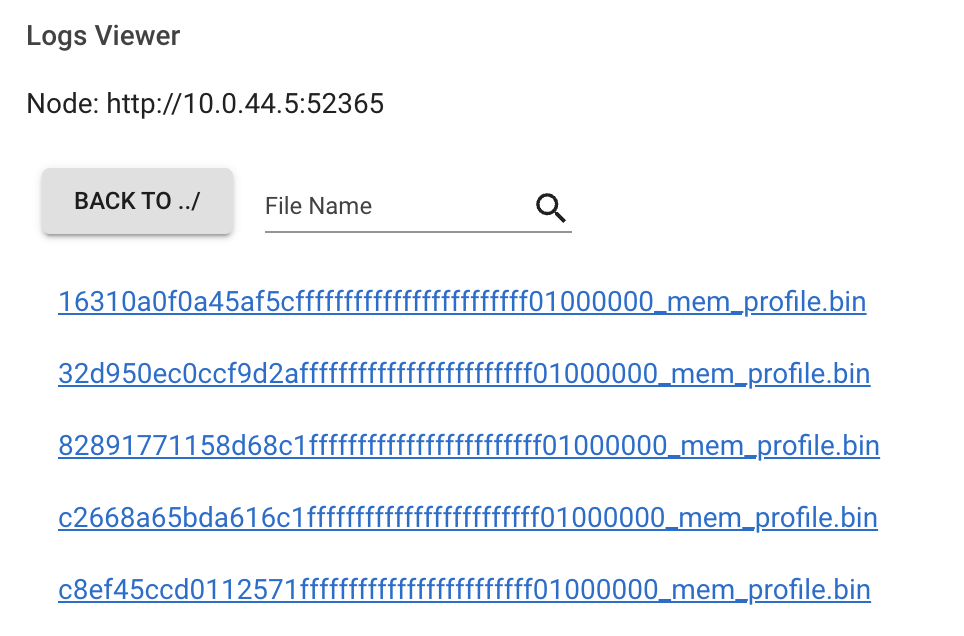

Click the download button. 

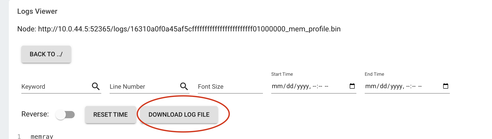

Now, you have the memory profiling file. Running

.. code-block:: bash

  memray flamegraph <memory profiling bin file>

And you can see the result of the memory profiling!

