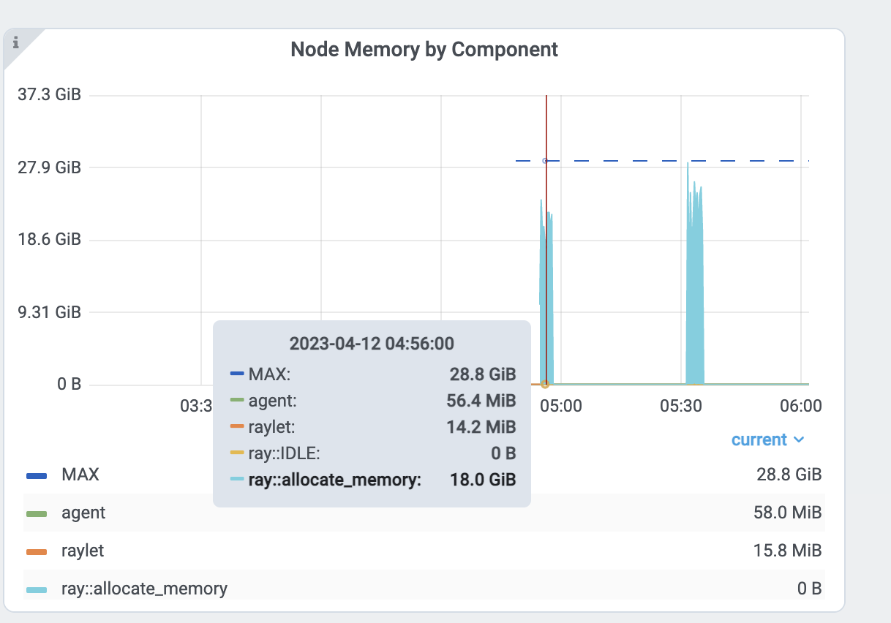

.. _ray-core-mem-profiling:

Debugging Memory Issues
=======================

.. _troubleshooting-out-of-memory:

Debugging Out of Memory
-----------------------

Before reading this section, familiarize yourself with the Ray :ref:`Memory Management <memory>` model.

- If your cluster has out-of-memory problems, view :ref:`How to Detect Out-of-Memory Errors <troubleshooting-out-of-memory-how-to-detect>`.
- To locate the source of the memory leak, view :ref:`Find per Task and Actor Memory Usage <troubleshooting-out-of-memory-task-actor-mem-usage>`.
- If your head node has high memory usage, view :ref:`Head Node Out-of-Memory Error <troubleshooting-out-of-memory-head>`.
- If your memory usage is high due to high parallelism, view :ref:`Reduce Parallelism <troubleshooting-out-of-memory-reduce-parallelism>`.
- If you want to profile per Task and Actor memory usage, view :ref:`Profile Task and Actor Memory Usage <troubleshooting-out-of-memory-profile>`.

What's the Out-of-Memory Error?
~~~~~~~~~~~~~~~~~~~~~~~~~~~~~~~

Memory is a limited resource. When a process requests memory and the OS fails to allocate it, the OS executes a routine to free up memory
by killing a process that has high memory usage (via SIGKILL) to avoid the OS becoming unstable. This routine is called the `Linux Out of Memory killer <https://www.kernel.org/doc/gorman/html/understand/understand016.html>`_.

One of the common problems of the Linux out-of-memory killer is that SIGKILL kills processes without Ray noticing it. 
Since SIGKILL cannot be handled by processes, Ray has difficulty raising a proper error message
and taking proper actions for fault tolerance.
To solve this problem, Ray has (from Ray 2.2) an application-level :ref:`memory monitor <ray-oom-monitor>`,
which continually monitors the memory usage of the host and kills the Ray Workers before the Linux out-of-memory killer executes. 

.. _troubleshooting-out-of-memory-how-to-detect:

Detecting Out-of-Memory errors
~~~~~~~~~~~~~~~~~~~~~~~~~~~~~~~~~~~

If the Linux out-of-memory killer terminates Tasks or Actors, Ray Worker processes are unable to catch and display an exact root cause
because SIGKILL cannot be handled by processes. If you call ``ray.get`` into the Tasks and Actors that were executed from the dead worker,
it raises an exception with one of the following error messages (which indicates the worker is killed unexpectedly).

.. code-block:: bash

  Worker exit type: UNEXPECTED_SY STEM_EXIT Worker exit detail: Worker unexpectedly exits with a connection error code 2. End of file. There are some potential root causes. (1) The process is killed by SIGKILL by OOM killer due to high memory usage. (2) ray stop --force is called. (3) The worker is crashed unexpectedly due to SIGSEGV or other unexpected errors.

.. code-block:: bash

  Worker exit type: SYSTEM_ERROR Worker exit detail: The leased worker has unrecoverable failure. Worker is requested to be destroyed when it is returned.

You can also use the `dmesg <https://phoenixnap.com/kb/dmesg-linux#:~:text=The%20dmesg%20command%20is%20a,take%20place%20during%20system%20startup.>`_ CLI command to verify the processes are killed by the Linux out-of-memory killer.

If Ray's memory monitor kills the worker, it is automatically retried (see the :ref:`link <ray-oom-retry-policy>` for details).
If Tasks or Actors cannot be retried, they raise an exception with 
a much cleaner error message when you call ``ray.get`` to it.

.. code-block:: bash

  ray.exceptions.OutOfMemoryError: Task was killed due to the node running low on memory.

  Task was killed due to the node running low on memory.
  Memory on the node (IP: 10.0.62.231, ID: e5d953ef03e55e26f13973ea1b5a0fd0ecc729cd820bc89e4aa50451) where the task (task ID: 43534ce9375fa8e4cd0d0ec285d9974a6a95897401000000, name=allocate_memory, pid=11362, memory used=1.25GB) was running was 27.71GB / 28.80GB (0.962273), which exceeds the memory usage threshold of 0.95. Ray killed this worker (ID: 6f2ec5c8b0d5f5a66572859faf192d36743536c2e9702ea58084b037) because it was the most recently scheduled task; to see more information about memory usage on this node, use `ray logs raylet.out -ip 10.0.62.231`. To see the logs of the worker, use `ray logs worker-6f2ec5c8b0d5f5a66572859faf192d36743536c2e9702ea58084b037*out -ip 10.0.62.231.`
  Top 10 memory users:
  PID	MEM(GB)	COMMAND
  410728	8.47	510953	7.19	ray::allocate_memory
  610952	6.15	ray::allocate_memory
  711164	3.63	ray::allocate_memory
  811156	3.63	ray::allocate_memory
  911362	1.25	ray::allocate_memory
  107230	0.09	python test.py --num-tasks 2011327	0.08	/home/ray/anaconda3/bin/python /home/ray/anaconda3/lib/python3.9/site-packages/ray/dashboard/dashboa...

  Refer to the documentation on how to address the out of memory issue: https://docs.ray.io/en/latest/ray-core/scheduling/ray-oom-prevention.html.

Ray memory monitor also periodically prints the aggregated out-of-memory killer summary to Ray drivers.

.. code-block:: bash

  (raylet) [2023-04-09 07:23:59,445 E 395 395] (raylet) node_manager.cc:3049: 10 Workers (tasks / actors) killed due to memory pressure (OOM), 0 Workers crashed due to other reasons at node (ID: e5d953ef03e55e26f13973ea1b5a0fd0ecc729cd820bc89e4aa50451, IP: 10.0.62.231) over the last time period. To see more information about the Workers killed on this node, use `ray logs raylet.out -ip 10.0.62.231`
  (raylet) 
  (raylet) Refer to the documentation on how to address the out of memory issue: https://docs.ray.io/en/latest/ray-core/scheduling/ray-oom-prevention.html. Consider provisioning more memory on this node or reducing task parallelism by requesting more CPUs per task. To adjust the kill threshold, set the environment variable `RAY_memory_usage_threshold` when starting Ray. To disable worker killing, set the environment variable `RAY_memory_monitor_refresh_ms` to zero.

Ray Dashboard's :ref:`metrics page <dash-metrics-view>` and :ref:`event page <dash-event>` also provides the out-of-memory killer-specific events and metrics.

.. image:: ../../images/oom-events.png
    :align: center

.. _troubleshooting-out-of-memory-task-actor-mem-usage:

Find per Task and Actor Memory Usage
~~~~~~~~~~~~~~~~~~~~~~~~~~~~~~~~~~~~

If Tasks or Actors fail because of out-of-memory errors, they are retried based on :ref:`retry policies <ray-oom-retry-policy>`. 
However, it is often preferred to find the root causes of memory issues and fix them instead of relying on fault tolerance mechanisms.
This section explains how to debug out-of-memory errors in Ray.

First, find the Tasks and Actors that have high memory usage. View the :ref:`per Task and Actor memory usage graph <dash-workflow-cpu-memory-analysis>` for more details.
The memory usage from the per component graph uses RSS - SHR. See below for reasoning.

Alternatively, you can also use the CLI command `htop <https://htop.dev/>`_.

See the ``allocate_memory`` row. See two columns, RSS and SHR. 

SHR usage is typically the memory usage from the Ray object store. The Ray object store allocates 30% of host memory to the shared memory (``/dev/shm``, unless you specify ``--object-store-memory``).
If Ray workers access the object inside the object store using ``ray.get``, SHR usage increases. Since the Ray object store supports the :ref:`zero-copy <serialization-guide>`
deserialization, several workers can access the same object without copying them to in-process memory. For example, if
8 workers access the same object inside the Ray object store, each process' ``SHR`` usage increases. However, they are not using 8 * SHR memory (there's only 1 copy in the shared memory). 
Also note that Ray object store triggers :ref:`object spilling <object-spilling>` when the object usage goes beyond the limit, which means the memory usage from the shared memory won't exceed 30%
of the host memory.

Out-of-memory issues from a host, are due to RSS usage from each worker. Calculate per
process memory usage by RSS - SHR because SHR is for Ray object store as explained above. The total memory usage is typically
``SHR (object store memory usage, 30% of memory) + sum(RSS - SHR from each ray proc) + sum(RSS - SHR from system components. e.g., raylet, GCS. Usually small)``.

.. _troubleshooting-out-of-memory-head:

Head node out-of-Memory error
~~~~~~~~~~~~~~~~~~~~~~~~~~~~~

First, check the head node memory usage from the metrics page. Find the head node address from the cluster page.

.. image:: ../../images/head-node-addr.png
    :align: center

Then check the memory usage from the head node from the node memory usage view inside the Dashboard :ref:`metrics view <dash-metrics-view>`.

.. image:: ../../images/metrics-node-view.png
    :align: center

The Ray head node has more memory-demanding system components such as GCS or the dashboard. 
Also, the driver runs from a head node by default. If the head node has the same memory capacity as worker nodes
and if you execute the same number of Tasks and Actors from a head node, it can easily have out-of-memory problems.
In this case, do not run any Tasks and Actors on the head node by specifying ``--num-cpus=0`` when starting a head node by ``ray start --head``. If you use KubeRay, view `here <kuberay-num-cpus>`.

.. _troubleshooting-out-of-memory-reduce-parallelism:

Reduce Parallelism
~~~~~~~~~~~~~~~~~~

High parallelism can trigger out-of-memory errors. For example, if
you have 8 training workers that perform the data preprocessing -> training. 
If you load too much data into each worker, the total memory usage (``training worker mem usage * 8``) can exceed the
memory capacity. 

Verify the memory usage by looking at the :ref:`per Task and Actor memory usage graph <dash-workflow-cpu-memory-analysis>` and the Task metrics.

First, see the memory usage of an ``allocate_memory`` task. The total is 18GB.
At the same time, verify the 15 concurrent tasks that are running.

.. image:: ../../images/tasks-graph.png
    :align: center

Each task uses about 18GB / 15 == 1.2 GB. To reduce the parallelism:

- `Limit the max number of running tasks <https://docs.ray.io/en/latest/ray-core/patterns/limit-running-tasks.html>`_. 
- Increase the ``num_cpus`` options for :func:`ray.remote`. Modern hardware typically has 4GB of memory per CPU, so you can choose the CPU requirements accordingly. This example specifies 1 CPU per ``allocate_memory`` Task. Doubling the CPU requirements, runs only half(7) of the Tasks at the same time, and memory usage doesn't exceed 9GB.

.. _troubleshooting-out-of-memory-profile:

Profiling Task and Actor memory usage
~~~~~~~~~~~~~~~~~~~~~~~~~~~~~~~~~~~~~~

It is also possible tasks and actors use more memory than you expect. For example, actors or tasks can have a memory leak or have unnecessary copies.

View the instructions below to learn how to memory profile individual actors and tasks.

.. _memray-profiling:

Memory Profiling Ray tasks and actors
--------------------------------------

To memory profile Ray tasks or actors, use `memray <https://bloomberg.github.io/memray/>`_.
Note that you can also use other memory profiling tools if it supports a similar API.

First, install ``memray``.

.. code-block:: bash

  pip install memray

``memray`` supports a Python context manager to enable memory profiling. You can write the ``memray`` profiling file wherever you want.
But in this example, we will write them to `/tmp/ray/session_latest/logs` because Ray dashboard allows you to download files inside the log folder.
This will allow you to download profiling files from other nodes.

.. tab-set::

    .. tab-item:: Actors

      .. literalinclude:: ../../doc_code/memray_profiling.py
          :language: python
          :start-after: __memray_profiling_start__
          :end-before: __memray_profiling_end__

    .. tab-item:: Tasks

      Note that tasks have a shorter lifetime, so there could be lots of memory profiling files.

      .. literalinclude:: ../../doc_code/memray_profiling.py
          :language: python
          :start-after: __memray_profiling_task_start__
          :end-before: __memray_profiling_task_end__

Once the task or actor runs, go to the :ref:`Logs view <dash-logs-view>` of the dashboard. Find and click the log file name.

.. image:: ../../images/memory-profiling-files.png
    :align: center

Click the download button. 

.. image:: ../../images/download-memory-profiling-files.png
    :align: center

Now, you have the memory profiling file. Running

.. code-block:: bash

  memray flamegraph <memory profiling bin file>

And you can see the result of the memory profiling!

