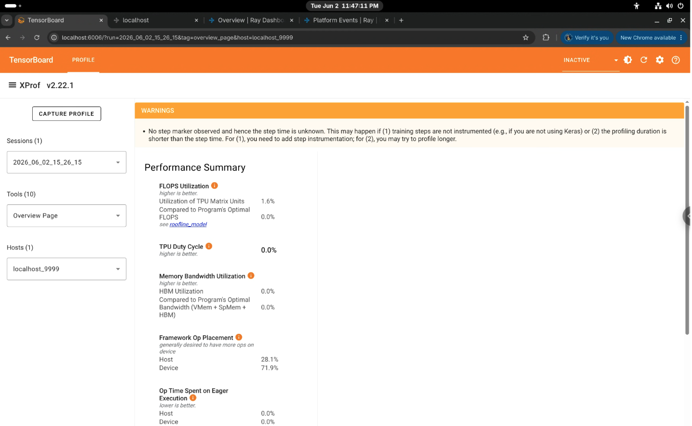
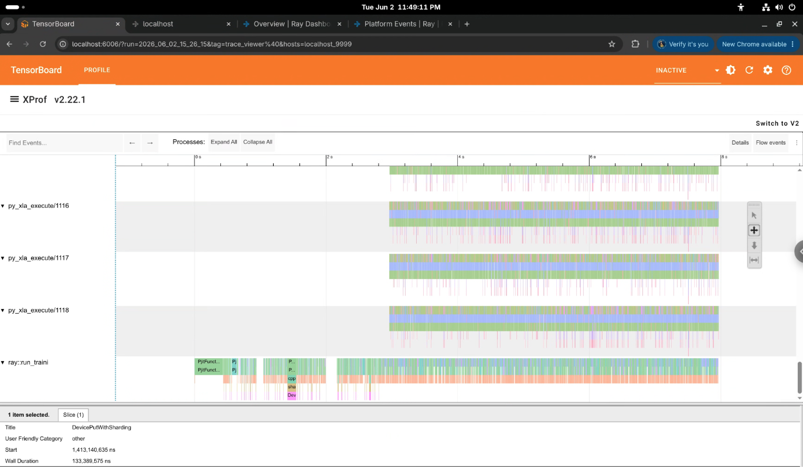

---
myst:
  html_meta:
    description: "Profile JAX workloads on Ray TPU workers in Kubernetes: trigger profiling dynamically on a worker, then view the traces in TensorBoard."
---

(jax-tpu-profiling)=

# JAX profiler for Ray on Kubernetes

This guide explains how to profile JAX workloads running on Ray TPU workers in a Kubernetes cluster.

## Prerequisites and image setup

To profile JAX workloads on TPU workers, make sure your environment meets the following requirements:

- Use a Ray Docker image with Ray 2.57 or later, or a custom image built with JAX profiler support. The image needs `jax`, `tensorflow`, `tensorboard`, and `tensorboard-plugin-profile` installed in the container's base Python environment. The Ray Dashboard `ReporterAgent` uses `tensorflow` on worker nodes to capture JAX profiles.
  :::{note}
  This feature doesn't support installing `tensorflow` dynamically with `runtime_env`.
  :::
- Set the environment variable `RAY_DASHBOARD_ENABLE_PROFILING=1` on the Ray head node container in your KubeRay `RayJob` or `RayCluster` YAML specification. The Ray Dashboard profiling endpoints are disabled by default for security reasons.

## Initialize the JAX profiler in user code

In your remote Ray task or actor executing JAX code on the TPU worker, call `init_jax_profiler()` after importing Ray. This call starts an in-process gRPC profiling server inside the worker process, on port 9999 by default. The call also registers the port in the Ray GCS internal key-value store so the Ray Dashboard can discover it:

```python
import ray
from ray.util.tpu import init_jax_profiler

ray.init()

@ray.remote(resources={"TPU": 4})
def train_step():
    # Initialize the in-process JAX profiler server and register it with the Ray GCS.
    init_jax_profiler()

    # Add your JAX training and XLA execution code here.
```

:::{note}
`init_jax_profiler()` listens on port 9999 by default and assumes at most one JAX worker process per host, which is the standard topology for multi-host TPU VM training.
:::

## Deploy a KubeRay RayJob

Deploy a TPU training `RayJob` using the sample configuration from the `ray-project/kuberay` repository:

```bash
# Clean up any previously deployed job with the same name:
kubectl delete -f https://raw.githubusercontent.com/ray-project/kuberay/master/ray-operator/config/samples/ray-job.tpu-jax.yaml --ignore-not-found

# Apply the RayJob specification:
kubectl apply -f https://raw.githubusercontent.com/ray-project/kuberay/master/ray-operator/config/samples/ray-job.tpu-jax.yaml
```

If you use your own `RayJob` manifest, set `RAY_DASHBOARD_ENABLE_PROFILING` to `"1"` on the head pod container so the Ray Dashboard profiling endpoints are reachable:

```yaml
# Under headGroupSpec.template.spec.containers:
- name: ray-head
  env:
    - name: RAY_DASHBOARD_ENABLE_PROFILING
      value: "1"
```

### Wait for pods to start

Check that all head and worker pods are running:

```bash
kubectl get pods -w
```

The output lists a head pod named `<RAY_JOB_NAME>-head-...` and a TPU worker pod named `<RAY_JOB_NAME>-worker-...`. Both reach the `Running` state.

## Port-forward the Ray Dashboard

Expose the Ray Dashboard port on the head node locally so you can call the API endpoints:

```bash
kubectl port-forward svc/<RAY_JOB_NAME>-head-svc 8265:8265
```

Keep this port-forwarding process running in a dedicated shell session.

## Locate target worker PID and node ID

To trigger profiling dynamically, identify the worker node ID or IP address and the running worker process PID.

### Get the node ID

Query the Ray State API from your local terminal through the port-forwarded Ray Dashboard:

```bash
RAY_ADDRESS=http://localhost:8265 ray list nodes --detail
```

Alternatively, open the Ray Dashboard in your browser at `http://localhost:8265` and copy the hexadecimal node ID from the **Cluster** nodes view.

### Get the worker process PID

You can find the PID of the Python worker process executing your JAX task or actor in two ways:
- Open the Ray Dashboard at `http://localhost:8265` and go to the **Workers**, **Tasks**, or **Actors** tab to view the PID and node ID.
- Alternatively, use the Ray State CLI:

  ```bash
  RAY_ADDRESS=http://localhost:8265 ray list workers --detail
  ```

## Trigger JAX profiling dynamically

Open a new terminal window and run the following `curl` command to trigger JAX profiling through the Ray Dashboard. Replace `<WORKER_PID>` and `<NODE_ID_HEX>` with the values you resolved:

```bash
curl -G "http://localhost:8265/worker/jax_profile" \
  --data-urlencode "pid=<WORKER_PID>" \
  --data-urlencode "node_id=<NODE_ID_HEX>" \
  --data-urlencode "duration=5"
```

You can pass `ip=<WORKER_IP>` instead of `node_id=<NODE_ID_HEX>`. The Ray Dashboard discovers the profiler port from the GCS registry, including a custom port that you passed to `init_jax_profiler()` or set through the `JAX_PROFILER_PORT` environment variable. Pass `port=<PORT>` only to bypass that lookup, or when the endpoint reports that it couldn't discover the port.

### Expected endpoint response

The Ray Dashboard looks up the JAX profiler port in the GCS registry, queries the TPU worker's in-process profiling server, collects the trace, and returns the following:

```json
{
  "result": true,
  "msg": "JAX profiling finished.",
  "data": {
    "traceDirectory": "profiles"
  }
}
```

## Verify trace outputs

Confirm that the profiler captured the JAX trace file and saved it to the local filesystem of the TPU worker pod that ran your JAX workload. Replace `<TPU_WORKER_POD>` with the name of the worker pod that ran the task:

```bash
kubectl exec -it <TPU_WORKER_POD> -c ray-worker -- ls -la /tmp/ray/session_latest/logs/profiles
```

:::{tip}
If your cluster has only a single worker pod, retrieve its name with `kubectl get pods -l ray.io/node-type=worker -o jsonpath='{.items[0].metadata.name}'`. In multi-pod clusters, target the worker pod matching the `node_id` or IP address you profiled in the previous step.
:::

Expected output:

```text
-rw-r--r-- 1 ray users 79526813 Jun  2 15:26 /tmp/ray/session_latest/logs/profiles/plugins/profile/2026_06_02_15_26_15/localhost_9999.xplane.pb
```

The trace directory contains a `.xplane.pb` file with JAX execution and TPU hardware usage events.

## Visualize profiling trace in TensorBoard

Follow these steps to copy the JAX trace files locally and visualize TPU performance inside the TensorBoard profile dashboard.

### Copy the trace folder from the worker pod to your local machine

Run the following command from your local machine to download the captured profiling traces from the target TPU worker pod:

```bash
kubectl cp <TPU_WORKER_POD>:/tmp/ray/session_latest/logs/profiles/ ./tensorboard_logs/ -c ray-worker
```

### Install TensorBoard and the profile plugin

Install TensorBoard and the profile plugin in your local Python environment:

```bash
pip install tensorboard tensorboard-plugin-profile
```

### Start the TensorBoard server

Point TensorBoard's log directory parameter to the downloaded folder:

```bash
tensorboard --logdir ./tensorboard_logs/
```

### View the dashboard

Open your web browser and go to `http://localhost:6006/#profile` to analyze TPU compilation timelines, operators, and hardware execution metrics.

Sample output:



