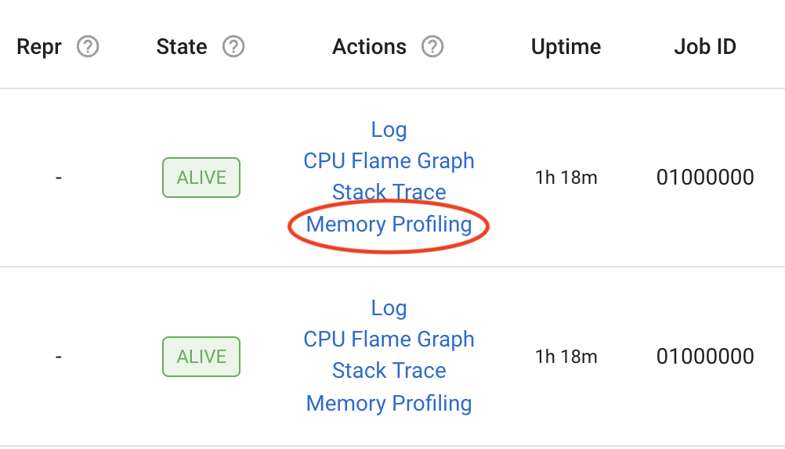
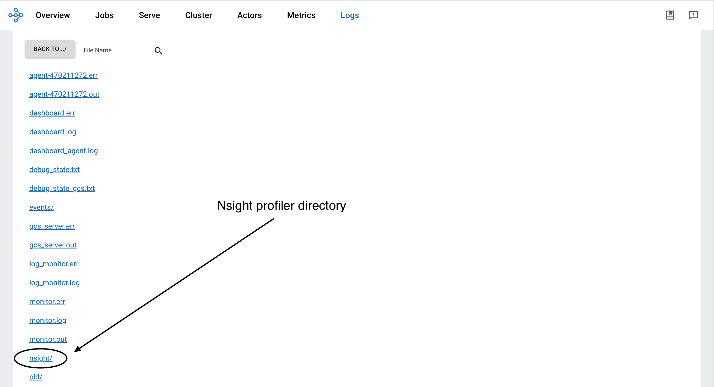

(profiling)=
# Profiling
Profiling is one of the most important debugging tools to diagnose performance, out of memory, hanging, or other application issues.
Here is a list of common profiling tools you may use when debugging Ray applications. 
- CPU profiling
    - py-spy
- Memory profiling
    - memray
- GPU profiling
    - PyTorch Profiler
    - Nsight System
- Ray Task / Actor timeline

If Ray doesn't work with certain profiling tools, try running them without Ray to debug the issues.

(profiling-cpu)=
## CPU profiling
Profile the CPU usage for Driver and Worker processes. This helps you understand the CPU usage by different processes and debug unexpectedly high or low usage.

(profiling-pyspy)=
### py-spy
[py-spy](https://github.com/benfred/py-spy/tree/master) is a sampling profiler for Python programs. Ray Dashboard has native integration with pyspy:

- It lets you visualize what your Python program is spending time on without restarting the program or modifying the code in any way.
- It dumps the stacktrace of the running process so that you can see what the process is doing at a certain time. It is useful when programs hangs.

:::{note}
You may run into permission errors when using py-spy in the docker containers. To fix the issue:

- if you start Ray manually in a Docker container, follow the `py-spy documentation`_ to resolve it. 
- if you are a KubeRay user, follow the {ref}`guide to configure KubeRay <kuberay-pyspy-integration>` and resolve it.
:::

Here are the {ref}`steps to use py-spy with Ray and Ray Dashboard <observability-debug-hangs>`.

(profiling-cprofile)=
### cProfile
cProfile is Python’s native profiling module to profile the performance of your Ray application.

Here are the {ref}`steps to use cProfile <dashboard-cprofile>`.

(profiling-memory)=
## Memory profiling
Profile the memory usage for Driver and Worker processes. This helps you analyze memory allocations in applications, trace memory leaks, and debug high/low memory or out of memory issues.

(profiling-memray)=
### memray
memray is a memory profiler for Python. It can track memory allocations in Python code, in native extension modules, and in the Python interpreter itself.

Here are the {ref}`steps to profile the memory usage of Ray Tasks and Actors <memray-profiling>`.

#### Ray Dashboard View
You can now do memory profiling for Ray Driver or Worker processes in the Ray Dashboard, by clicking on the "Memory profiling” actions for active Worker processes, Tasks, Actors, and a Job’s driver process.



Additionally, you can specify the following profiling Memray parameters from the dashboard view:
- **Format:** Format of the profiling result. The value is either "flamegraph" or "table"
- **Duration:** Duration to track for (in seconds)
- **Leaks:** Enables the Memory Leaks View, which displays memory that Ray didn't deallocate, instead of peak memory usage
- **Natives:** Track native (C/C++) stack frames (only supported in Linux)
- **Python Allocator Tracing:** Record allocations made by the pymalloc allocator


(profiling-gpu)=
## GPU profiling
GPU and GRAM profiling for your GPU workloads like distributed training. This helps you analyze performance and debug memory issues. 
- PyTorch profiler is supported out of box when used with Ray Train
- NVIDIA Nsight System is natively supported on Ray.

(profiling-pytorch-profiler)=
### PyTorch Profiler
PyTorch Profiler is a tool that allows the collection of performance metrics (especially GPU metrics) during training and inference.

Here are the {ref}`steps to use PyTorch Profiler with Ray Train or Ray Data <performance-debugging-gpu-profiling>`.

(profiling-nsight-profiler)=
### Nsight System Profiler

#### Installation

First, install the Nsight System CLI by following the [Nsight User Guide](https://docs.nvidia.com/nsight-systems/InstallationGuide/index.html). 

Confirm that you installed Nsight correctly:

```bash
$ nsys --version

# NVIDIA Nsight Systems version 2022.4.1.21-0db2c85
```

#### Run Nsight on Ray

To enable GPU profiling, specify the config in the `runtime_env` as follows:

```python
import torch
import ray

ray.init()

@ray.remote(num_gpus=1, runtime_env={ "nsight": "default"})
class RayActor:
    def run():
    a = torch.tensor([1.0, 2.0, 3.0]).cuda()
    b = torch.tensor([4.0, 5.0, 6.0]).cuda()
    c = a * b

    print("Result on GPU:", c)

ray_actor = RayActor.remote()
# The Actor or Task process runs with : "nsys profile [default options] ..."
ray.get(ray_actor.run.remote())
```

You can find the `"default"` config in [nsight.py](https://github.com/ray-project/ray/blob/master/python/ray/_private/runtime_env/nsight.py#L20).

#### Custom options

You can also add [custom options](https://docs.nvidia.com/nsight-systems/UserGuide/index.html#cli-profile-command-switch-options) for Nsight System Profiler by specifying a dictionary of option values, which overwrites the `default` config, however, Ray preserves the the `--output` option of the default config.


```python
import torch
import ray

ray.init()

@ray.remote(
num_gpus=1, 
runtime_env={ "nsight": {
    "t": "cuda,cudnn,cublas",
    "cuda-memory-usage": "true",
    "cuda-graph-trace": "graph",
}})
class RayActor:
    def run():
    a = torch.tensor([1.0, 2.0, 3.0]).cuda()
    b = torch.tensor([4.0, 5.0, 6.0]).cuda()
    c = a * b

    print("Result on GPU:", c)

ray_actor = RayActor.remote()

# The Actor or Task process runs with :
# "nsys profile -t cuda,cudnn,cublas --cuda-memory-usage=True --cuda-graph-trace=graph ..."
ray.get(ray_actor.run.remote())
```

**Note:**: The default report filename (`-o, --output`) is `worker_process_{pid}.nsys-rep` in the logs dir.


#### Profiling result

Find profiling results under the `/tmp/ray/session_*/logs/{profiler_name}` directory. This specific directory location may change in the future. You can download the profiling reports from the {ref}`Ray Dashboard <dash-logs-view>`.



To visualize the results, install the [Nsight System GUI](https://developer.nvidia.com/nsight-systems/get-started#latest-Platforms) on your laptop, which becomes the host. Transfer the .nsys-rep file to your host and open it using the GUI. You can now view the visual profiling info.

**Note**: The Nsight System Profiler output (-o, --output) option allows you to set the path to a filename. Ray uses the logs directory as the base and appends the output option to it. For example: 
```
--output job_name/ray_worker -> /tmp/ray/session_*/logs/nsight/job_name/ray_worker

--output /Users/Desktop/job_name/ray_worker -> /Users/Desktop/job_name/ray_worker
```
The best practice is to only specify the filename in output option.


(profiling-timeline)=
## Ray Task or Actor timeline
Ray Timeline profiles the execution time of Ray Tasks and Actors. This helps you analyze performance, identify the stragglers, and understand the distribution of workloads.

Open your Ray Job in Ray Dashboard and follow the {ref}`instructions to download and visualize the trace files <dashboard-timeline>` generated by Ray Timeline.
