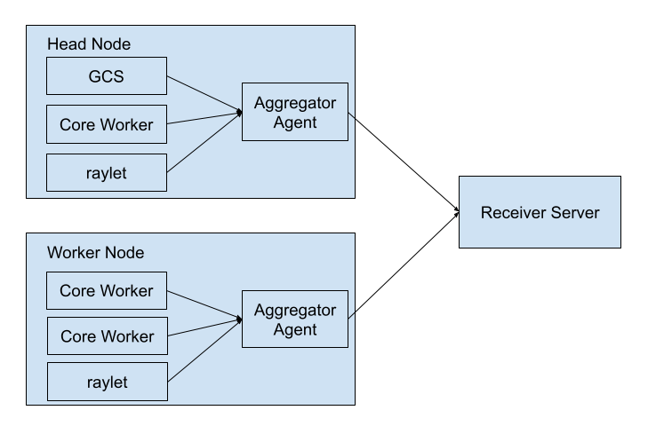

.. _ray-event-export:

Ray Event Export
================

Ray supports exporting structured events to a configured HTTP endpoint. Each worker node
sends events to the configured HTTP endpoint through a HTTP POST request.

Starting from 2.49, Ray supports exporting task events. Ray plans to support other 
event types, including actor events, node events, job events, etc., in the future.  

.. note:: 
    Ray event export feature is still in alpha version. The way to configure event 
    reporting and the format of the events are subject to change.

Enable event reporting
----------------------
To enable event reporting, you need to set the ``RAY_enable_core_worker_ray_event_to_aggregator`` environment 
variable to ``1`` when starting each Ray worker node.

To set the target HTTP endpoint, you need to set the ``RAY_events_export_addr`` 
environment variable. The value should be a valid HTTP URL with the scheme of ``http``.

Event format
------------

Events are JSON objects in the POST request body.

All events contains the same base fields and different event specific fields. 
See `src/ray/protobuf/public/events_base_event.proto <https://github.com/ray-project/ray/blob/master/src/ray/protobuf/public/events_base_event.proto>`_ for the base fields.

Task events
^^^^^^^^^^^

For each task, Ray exports two types of events: Task Definition Event and Task Execution Event.

* Task Definition Event generated once per task attempt. It contains the metadata of the task. 
  See `src/ray/protobuf/public/events_task_definition_event.proto <https://github.com/ray-project/ray/blob/master/src/ray/protobuf/public/events_task_definition_event.proto>`_ 
  and `src/ray/protobuf/public/events_actor_task_definition_event.proto <https://github.com/ray-project/ray/blob/master/src/ray/protobuf/public/events_actor_task_definition_event.proto>`_ for the event format for normal tasks 
  and actor tasks respectively.
* Task Execution Event contains the task state transition information and metadata that 
  generated during the task execution. 
  See `src/ray/protobuf/public/events_task_execution_event.proto <https://github.com/ray-project/ray/blob/master/src/ray/protobuf/public/events_task_execution_event.proto>`_ for the event format.

An example of the task events is as follows:

.. code-block:: json

    // task definition event
    {
        "eventId":"N5n229xkwyjlZRFJDF2G1sh6ZNYlqChwJ4WPEQ==",
        "sourceType":"CORE_WORKER",
        "eventType":"TASK_DEFINITION_EVENT",
        "timestamp":"2025-09-03T18:52:14.467290Z",
        "severity":"INFO",
        "sessionName":"session_2025-09-03_11-52-12_635210_85618",
        "taskDefinitionEvent":{
            "taskId":"yO9FzNARJXH///////////////8BAAAA",
            "taskFunc":{
                "pythonFunctionDescriptor":{
                    "moduleName":"test-tasks",
                    "functionName":"test_task",
                    "functionHash":"37ddb110c0514b049bd4db5ab934627b",
                    "className":""
                }
            },
            "taskName":"test_task",
            "requiredResources":{
                "CPU":1.0
            },
            "runtimeEnvInfo":{
                "serializedRuntimeEnv":"{}",
                "runtimeEnvConfig":{
                    "setupTimeoutSeconds":600,
                    "eagerInstall":true,
                    "logFiles":[
                    
                    ]
                }
            },
            "jobId":"AQAAAA==",
            "parentTaskId":"//////////////////////////8BAAAA",
            "placementGroupId":"////////////////////////",
            "taskAttempt":0,
            "taskType":"NORMAL_TASK",
            "language":"PYTHON",
            "refIds":{
                
            }
        },
        "message":""
    }

    // task execution event
    {
        "eventId":"vkIaAHlQC5KoppGosqs2kBq5k2WzsAAbawDDbQ==",
        "sourceType":"CORE_WORKER",
        "eventType":"TASK_EXECUTION_EVENT",
        "timestamp":"2025-09-03T18:52:14.469074Z",
        "severity":"INFO",
        "sessionName":"session_2025-09-03_11-52-12_635210_85618",
        "taskExecutionEvent":{
            "taskId":"yO9FzNARJXH///////////////8BAAAA",
            "taskState":{
                // key is the integer value of TaskStatus enum in common.proto at
                // https://github.com/ray-project/ray/blob/master/src/ray/protobuf/common.proto
                "2":"2025-09-03T18:52:14.467402Z", // PENDING_NODE_ASSIGNMENT
                "1":"2025-09-03T18:52:14.467290Z", // PENDING_ARGS_AVAIL
                "5":"2025-09-03T18:52:14.469074Z" // SUBMITTED_TO_WORKER
            },
            "nodeId":"ZvxTI6x9dlMFqMlIHErJpg5UEGK1INsKhW2zyg==",
            "workerId":"hMybCNYIFi+/yInYYhdc+qH8yMF65j/8+uCTmw==",
            "jobId":"AQAAAA==",
            "taskAttempt":0,
            "workerPid":0
        },
        "message":""
    }

High-level Architecture
-----------------------

The following diagram shows the high-level architecture of Ray event export.

Ray introduces a new aggregator agent on the head node and each worker nodes. All the 
Ray components send events to the aggregator agent through gRPC. The aggregator agent 
collects the events and sends them to the configured HTTP endpoint. 