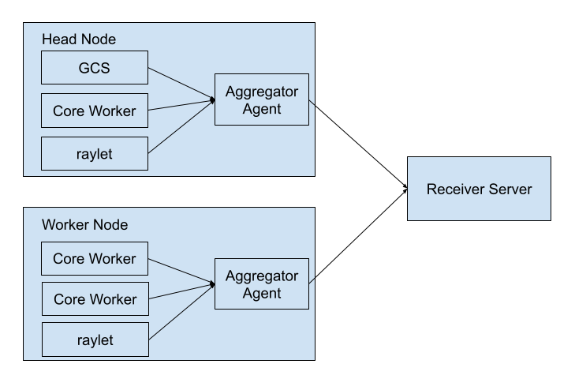
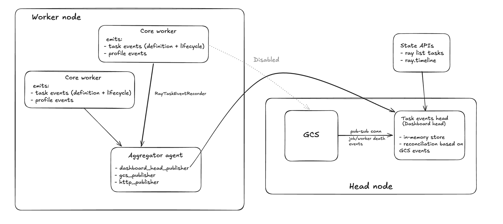

.. meta::
   :description: Export structured Ray events for tasks, actors, jobs, and nodes to an HTTP endpoint, with event format reference and reporting configuration.

.. _ray-event-export:

Ray Event Export
================

Starting from 2.49, Ray supports exporting structured events to a configured HTTP 
endpoint. Each node sends events to the endpoint through an HTTP POST request.

Previously, Ray's :ref:`task events <task-events>` were only used internally by the Ray dashboard 
and :ref:`State API <state-api-overview-ref>` for monitoring and debugging. With the new event 
export feature, you can now send these raw events to external systems for custom analytics, 
monitoring, and integration with third-party tools.

.. note:: 
    Ray Event Export is still in alpha. The way to configure event 
    reporting and the format of the events is subject to change.

Enable event reporting
----------------------
To enable event reporting, you need to set the ``RAY_enable_core_worker_ray_event_to_aggregator`` environment 
variable to ``1`` when starting each Ray worker node.

To set the target HTTP endpoint, set the ``RAY_DASHBOARD_AGGREGATOR_AGENT_EVENTS_EXPORT_ADDR`` 
environment variable to a valid HTTP URL with the ``http://`` URL scheme.

Event format
------------

Events are JSON objects in the POST request body.

All events contain the same base fields and different event specific fields. 
See `src/ray/protobuf/public/events_base_event.proto <https://github.com/ray-project/ray/blob/master/src/ray/protobuf/public/events_base_event.proto>`_ for the base fields.

Task events
^^^^^^^^^^^

For each task, Ray exports two types of events: Task Definition Event and Task Execution Event.

* Each task attempt generates one Task Definition Event which contains the metadata of the task. 
  See `src/ray/protobuf/public/events_task_definition_event.proto <https://github.com/ray-project/ray/blob/master/src/ray/protobuf/public/events_task_definition_event.proto>`_ 
  and `src/ray/protobuf/public/events_actor_task_definition_event.proto <https://github.com/ray-project/ray/blob/master/src/ray/protobuf/public/events_actor_task_definition_event.proto>`_ for the event formats for normal tasks 
  and actor tasks respectively.
* Task Execution Events contain task state transition information and metadata 
  generated during task execution. 
  See `src/ray/protobuf/public/events_task_lifecycle_event.proto <https://github.com/ray-project/ray/blob/master/src/ray/protobuf/public/events_task_lifecycle_event.proto>`_ for the event format.

An example of a Task Definition Event and a Task Execution Event:

.. code-block:: json

    // task definition event
    {
        "eventId":"N5n229xkwyjlZRFJDF2G1sh6ZNYlqChwJ4WPEQ==",
        "sourceType":"CORE_WORKER",
        "eventType":"TASK_DEFINITION_EVENT",
        "timestamp":"2025-09-03T18:52:14.467290Z",
        "severity":"INFO",
        "sessionName":"session_2025-09-03_11-52-12_635210_85618",
        "taskDefinitionEvent":{
            "taskId":"yO9FzNARJXH///////////////8BAAAA",
            "taskFunc":{
                "pythonFunctionDescriptor":{
                    "moduleName":"test-tasks",
                    "functionName":"test_task",
                    "functionHash":"37ddb110c0514b049bd4db5ab934627b",
                    "className":""
                }
            },
            "taskName":"test_task",
            "requiredResources":{
                "CPU":1.0
            },
            "serialized_runtime_env": "{}",
            "jobId":"AQAAAA==",
            "parentTaskId":"//////////////////////////8BAAAA",
            "placementGroupId":"////////////////////////",
            "taskAttempt":0,
            "taskType":"NORMAL_TASK",
            "language":"PYTHON",
            "refIds":{
                
            }
        },
        "nodeId":"ZvxTI6x9dlMFqMlIHErJpg5UEGK1INsKhW2zyg==",
        "message":""
    }

    // task lifecycle event
    {
        "eventId":"vkIaAHlQC5KoppGosqs2kBq5k2WzsAAbawDDbQ==",
        "sourceType":"CORE_WORKER",
        "eventType":"TASK_LIFECYCLE_EVENT",
        "timestamp":"2025-09-03T18:52:14.469074Z",
        "severity":"INFO",
        "sessionName":"session_2025-09-03_11-52-12_635210_85618",
        "taskLifecycleEvent":{
            "taskId":"yO9FzNARJXH///////////////8BAAAA",
            "stateTransitions": [
                {
                    "state":"PENDING_NODE_ASSIGNMENT",
                    "timestamp":"2025-09-03T18:52:14.467402Z"
                },
                {
                    "state":"PENDING_ARGS_AVAIL",
                    "timestamp":"2025-09-03T18:52:14.467290Z"
                },
                {
                    "state":"SUBMITTED_TO_WORKER",
                    "timestamp":"2025-09-03T18:52:14.469074Z"
                }
            ],
            "nodeId":"ZvxTI6x9dlMFqMlIHErJpg5UEGK1INsKhW2zyg==",
            "workerId":"hMybCNYIFi+/yInYYhdc+qH8yMF65j/8+uCTmw==",
            "jobId":"AQAAAA==",
            "taskAttempt":0,
            "workerPid":0
        },
        "nodeId":"ZvxTI6x9dlMFqMlIHErJpg5UEGK1INsKhW2zyg==",
        "message":""
    }

Actor events
^^^^^^^^^^^^

For each actor, Ray exports two types of events: Actor Definition Events and Actor Lifecycle Events.

* An Actor Definition Event contains the metadata of the actor when it is defined. See `src/ray/protobuf/public/events_actor_definition_event.proto <https://github.com/ray-project/ray/blob/master/src/ray/protobuf/public/events_actor_definition_event.proto>`_ for the event format.
* An Actor Lifecycle Event contains the actor state transition information and metadata associated with each transition. See `src/ray/protobuf/public/events_actor_lifecycle_event.proto <https://github.com/ray-project/ray/blob/master/src/ray/protobuf/public/events_actor_lifecycle_event.proto>`_ for the event format.

.. code-block:: json

    // actor definition event
    {
        "eventId": "gsRtAfaWn5TZsjUPFm8nOXd/cKGz82FXdr3Lqg==",
        "sourceType": "GCS",
        "eventType": "ACTOR_DEFINITION_EVENT",
        "timestamp": "2025-10-24T21:12:10.742651Z",
        "severity": "INFO",
        "sessionName": "session_2025-10-24_14-12-05_804800_55420",
        "actorDefinitionEvent": {
            "actorId": "0AFtngcXtEoxwqmJAQAAAA==", 
            "jobId": "AQAAAA==", 
            "name": "actor-test",
            "rayNamespace": "bd2ad7f8-650b-495c-b709-55d4c8a7d09f",
            "serializedRuntimeEnv": "{}",
            "className": "test_ray_actor_events.<locals>.A",
            "isDetached": false,
            "requiredResources": {},
            "placementGroupId": "",
            "labelSelector": {}
        },
        "nodeId": "zpLG7coqThVMl8df9RYHnhK6thhJqrgPodtfjg==",
        "message": ""
    }

    // actor lifecycle event
    {
        "eventId": "mOdfn5SRx3X0B05OvEDV0rcIOzqf/SGBJmrD/Q==",
        "sourceType": "GCS",
        "eventType": "ACTOR_LIFECYCLE_EVENT",
        "timestamp": "2025-10-24T21:12:10.742654Z",
        "severity": "INFO",
        "sessionName": "session_2025-10-24_14-12-05_804800_55420",
        "actorLifecycleEvent": {
            "actorId": "0AFtngcXtEoxwqmJAQAAAA==",
            "stateTransitions": [
                {
                    "timestamp": "2025-10-24T21:12:10.742654Z",
                    "state": "ALIVE",
                    "nodeId": "zpLG7coqThVMl8df9RYHnhK6thhJqrgPodtfjg==",
                    "workerId": "nrBehSG3HXu0PvHZBkPl2kovmjzAaoCuVj2KHA=="
                }
            ]
        },
        "nodeId": "zpLG7coqThVMl8df9RYHnhK6thhJqrgPodtfjg==",
        "message": ""
    }

Driver job events
^^^^^^^^^^^^^^^^^^

For each driver job, Ray exports two types of events: Driver Job Definition Events and Driver Job Lifecycle Events.

* A Driver Job Definition Event contains the metadata of the driver job when it is defined. See `src/ray/protobuf/public/events_driver_job_definition_event.proto <https://github.com/ray-project/ray/blob/master/src/ray/protobuf/public/events_driver_job_definition_event.proto>`_ for the event format.
* A Driver Job Lifecycle Event contains the driver job state transition information and metadata associated with each transition. See `src/ray/protobuf/public/events_driver_job_lifecycle_event.proto <https://github.com/ray-project/ray/blob/master/src/ray/protobuf/public/events_driver_job_lifecycle_event.proto>`_ for the event format.

.. code-block:: json

    // driver job definition event
    {
        "eventId": "7YnwZPJr0KUC28T7KnzsvGyceEIrjNDTHuQfrg==",
        "sourceType": "GCS",
        "eventType": "DRIVER_JOB_DEFINITION_EVENT",
        "timestamp": "2025-10-24T21:17:07.316482Z",
        "severity": "INFO",
        "sessionName": "session_2025-10-24_14-17-05_575968_59360",
        "driverJobDefinitionEvent": {
            "jobId": "AQAAAA==", 
            "driverPid": "59360", 
            "driverNodeId": "9eHWUIruJWnMjQuPas0W+TRNUyjY5PwFpWUfjA==", 
            "entrypoint": "...", 
            "config": {
                "serializedRuntimeEnv": "{}", 
                "metadata": {}
            }
        },
        "nodeId": "zpLG7coqThVMl8df9RYHnhK6thhJqrgPodtfjg==",
        "message": ""
    }

    // driver job lifecycle event
    {
        "eventId": "0cmbCI/RQghYe4ZQiJ+HrnK1RiZH+cg8ltBx2w==",
        "sourceType": "GCS",
        "eventType": "DRIVER_JOB_LIFECYCLE_EVENT",
        "timestamp": "2025-10-24T21:17:07.316483Z",
        "severity": "INFO",
        "sessionName": "session_2025-10-24_14-17-05_575968_59360",
        "driverJobLifecycleEvent": {
            "jobId": "AQAAAA==", 
            "stateTransitions": [
                {
                    "state": "CREATED", 
                    "timestamp": "2025-10-24T21:17:07.316483Z"
                }
            ]
        },
        "nodeId": "zpLG7coqThVMl8df9RYHnhK6thhJqrgPodtfjg==",
        "message": ""
    }

Node events
^^^^^^^^^^^

For each node, Ray exports two types of events: Node Definition Events and Node Lifecycle Events.

* A Node Definition Event contains the metadata of the node when it is defined. See `src/ray/protobuf/public/events_node_definition_event.proto <https://github.com/ray-project/ray/blob/master/src/ray/protobuf/public/events_node_definition_event.proto>`_ for the event format.
* A Node Lifecycle Event contains the node state transition information and metadata associated with each transition. See `src/ray/protobuf/public/events_node_lifecycle_event.proto <https://github.com/ray-project/ray/blob/master/src/ray/protobuf/public/events_node_lifecycle_event.proto>`_ for the event format.

.. code-block:: json

    // node definition event
    {
        "eventId": "l7r4gwq4UPhmZGFJYEym6mUkcxqafra60LB6/Q==",
        "sourceType": "GCS",
        "eventType": "NODE_DEFINITION_EVENT",
        "timestamp": "2025-10-24T21:19:14.063953Z",
        "severity": "INFO",
        "sessionName": "session_2025-10-24_14-19-12_675240_61141",
        "nodeDefinitionEvent": {
            "nodeId": "0yfRX1ex+VtcC+TFXjXcgesdpnEwM76+pEATrQ==", 
            "nodeIpAddress": "127.0.0.1", 
            "labels": {
                "ray.io/node-id": "d327d15f57b1f95b5c0be4c55e35dc81eb1da6713033bebea44013ad"
            }, 
            "startTimestamp": "2025-10-24T21:19:14.063Z"
        }, 
        "nodeId": "zpLG7coqThVMl8df9RYHnhK6thhJqrgPodtfjg==",
        "message": ""
    }

    // node lifecycle event
    {
        "eventId": "u3KTG8615MIKBH5PLcii0BMfGFWcvLuSOXM6zg==",
        "sourceType": "GCS",
        "eventType": "NODE_LIFECYCLE_EVENT",
        "timestamp": "2025-10-24T21:19:14.063955Z",
        "severity": "INFO",
        "sessionName": "session_2025-10-24_14-19-12_675240_61141",
        "nodeLifecycleEvent": {
            "nodeId": "0yfRX1ex+VtcC+TFXjXcgesdpnEwM76+pEATrQ==", 
            "stateTransitions": [
                {
                    "timestamp": "2025-10-24T21:19:14.063955Z", 
                    "resources": {"node:__internal_head__": 1.0, "CPU": 1.0, "object_store_memory": 157286400.0, "node:127.0.0.1": 1.0, "memory": 42964287488.0}, 
                    "state": "ALIVE", 
                    "aliveSubState": "UNSPECIFIED"
                }
            ]
        },
        "nodeId": "zpLG7coqThVMl8df9RYHnhK6thhJqrgPodtfjg==",
        "message": ""
    }

High-level Architecture
-----------------------

The following diagram shows the high-level architecture of Ray Event Export.

All Ray components send events to an aggregator agent through gRPC. There is an aggregator
agent on each node. The aggregator agent collects all events on that node and sends the
events to the configured HTTP endpoint.

Task events migration from the GCS to the dashboard head
--------------------------------------------------------

Starting from 2.58, Ray is moving observability data out of the Global Control Service (GCS)
so that the GCS can focus on control plane work. :ref:`Task events <task-events>` are the
first data set to move. Instead of the core worker sending task events to the GCS, task
events now travel over the Ray event framework to a dedicated task events module on the
dashboard head, which stores them and serves the :ref:`State API <state-api-overview-ref>`.

.. note::
    This migration is in progress. The default flag configuration still stores the task
    events in GCS, so the migration will be triggered when explicitly opted in.

Changes
^^^^^^^^^^^^

* **A new task event recorder in the core worker.** ``RayTaskEventRecorder`` records task
  definition, lifecycle, and profile events and exports them to the aggregator agent on the
  same node. It replaces the core worker task event buffer as the source of task events, and
  preserves the buffer's reporting of dropped task attempts so consumers still learn when
  task events are lost.
* **A new submodule for task events on the dashboard head called** ``TaskEventsHead``. The
  aggregator agent publishes task events to the task events head, which holds them in an
  in-memory store with the same storage limit and eviction policy the GCS used. The module
  subscribes to the GCS for worker death and job completion signals, and reconciles the state
  of stored task events from them. This is in parity with what ``GcsTaskManager`` did.
* **State APIs read from the dashboard head.** ``ray list tasks`` and ``ray.timeline`` query
  the task events head on the dashboard head instead of the GCS.

Enable the migrated path
^^^^^^^^^^^^^^^^^^^^^^^^

To enable the new path, set the following environment variables when starting each Ray node:

* ``RAY_enable_ray_event=1`` to use Ray events as the event collection backend. The task
  event recorder only runs when this variable is set.
* ``RAY_enable_ray_task_event_recorder=1`` to record task events with
  ``RayTaskEventRecorder``. When ``RayTaskEventRecorder`` is active, the core worker task
  event buffer stops sending events to the aggregator agent, so
  ``RAY_enable_core_worker_ray_event_to_aggregator`` no longer affects task events.
* ``RAY_enable_core_worker_task_event_to_gcs=0`` to stop the core worker from sending task
  events to the GCS. With this variable set to ``0`` and the recorder enabled, the task event
  buffer no longer records task events at all.
* ``RAY_enable_task_events_to_dashboard_head=1`` to complete the migration. This single
  variable makes the aggregator agent publish task events to the dashboard head, starts the
  task events module on the dashboard head, and points ``ray list tasks`` and
  ``ray.timeline`` at the dashboard head instead of the GCS.

Architecture
^^^^^^^^^^^^

The following diagram shows how task events flow once the migration is enabled.

Each core worker emits task definition, lifecycle, and profile events through
``RayTaskEventRecorder`` to the aggregator agent on its node. The aggregator agent publishes
them to the task events head on the head node, which stores them in memory and reconciles
them against the worker death and job death events it receives from the GCS over a pub-sub
connection. State APIs read task events from that store. The direct path from the core worker
to the GCS is disabled.
