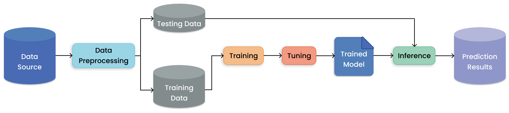

.. _batch_inference_home:

Running Batch Inference with Ray
================================

Batch inference refers to generating model predictions on a set of input data.
The model can range from a simple a Python function to a complex neural network.
In batch inference, also known as offline inference, your model is run on a large
batch of data on demand.
This is in contrast to online inference, where the model is run immediately on a data point when it becomes available.
Here's a simple schematic of batch inference, "mapping" batches to predictions via model inference:

.. figure:: images/batch_inference.png

  Evaluating a batch of input data with a model to get predictions.

Batch inference is a foundational workload for many AI companies, especially since more and more pre-trained models become available.
And while batch inference looks simple at the surface, it can be challenging to do right in production.
For instance, your data batches can be excessively large, too slow to process sequentially, or might need custom preprocessing before being fed into your models.
To run inference workloads effectively at scale, you need to

- manage your compute infrastructure and cloud clusters
- parallelize data processing and utilize all your cluster resources (CPUs & GPUs)
- efficiently transferring data between cloud storage, CPUs for preprocessing, and GPUs for model inference.

Here's a more realistic view of batch inference for modern AI applications:

.. figure:: images/batch_inference_overview.png

  Evaluating a batch of input data with a model to get predictions.

Landing page:
What is batch inference and why is it important?
How Ray helps you to run and scale batch inference. / Why Ray?
Quick start example (no Ray Data, simplest case of HF model)
Where to go from here?

TODO: install ray data

Why should I use Ray for offline batch inference?
-------------------------------------------------
1. **Faster and Cheaper for modern Deep Learning Applications**: Ray Data is built for hybrid CPU+GPU workloads. Through streaming based execution, CPU tasks like reading and preprocessing can be executed concurrently with GPU inference.
2. **Cloud, framework, and data format agnostic**. Ray Data works on any cloud provider, any ML framework (like PyTorch and Tensorflow) and does not require a particular file format.
3. **Out of the box scaling**: The same code works on 1 machine and a large cluster with no additional changes.
4. **Python first** Express your inference job in Python instead of YAML files or job specs, allowing for interactive development.

:ref:`Ray Data <datasets>` offers a highly performant and scalable solution for offline batch inference and processing on large amounts of data.

Quick Start
-----------

Tabular
~~~~~~~

.. tabs::

    .. group-tab:: HuggingFace

        .. literalinclude:: ./doc_code/hf_quick_start.py
            :language: python

    .. group-tab:: PyTorch

        .. literalinclude:: ./doc_code/pytorch_quick_start.py
            :language: python

    .. group-tab:: TensorFlow

        .. literalinclude:: ./doc_code/tf_quick_start.py
            :language: python

Learn more
----------

  How batch inference fits into the bigger picture of training and prediction AI models.

Learn more about batch inference with the following resources.

.. panels::
    :container: container pb-3
    :column: col-md-3 px-1 py-1
    :img-top-cls: p-2 w-75 d-block mx-auto fixed-height-img

    ---
    :img-top: /images/ray_logo.png

    .. link-button:: https://github.com/ray-project/ray-educational-materials/blob/main/Computer_vision_workloads/Semantic_segmentation/Scaling_batch_inference.ipynb
        :type: url
        :text: [Tutorial] Architectures for Scalable Batch Inference with Ray
        :classes: btn-link btn-block stretched-link scalableBatchInference
    ---
    :img-top: /images/ray_logo.png

    .. link-button:: https://www.anyscale.com/blog/model-batch-inference-in-ray-actors-actorpool-and-datasets
        :type: url
        :text: [Blog] Batch Inference in Ray: Actors, ActorPool, and Datasets
        :classes: btn-link btn-block stretched-link batchActorPool
    ---
    :img-top: /images/ray_logo.png

    .. link-button:: /ray-core/examples/batch_prediction
        :type: ref
        :text: [Example] Batch Prediction using Ray Core
        :classes: btn-link btn-block stretched-link batchCore
    ---
    :img-top: /images/ray_logo.png

    .. link-button:: /data/examples/nyc_taxi_basic_processing
        :type: ref
        :text: [Example] Batch Inference on NYC taxi data using Ray Data
        :classes: btn-link btn-block stretched-link nycTaxiData

    ---
    :img-top: /images/ray_logo.png

    .. link-button:: /data/examples/ocr_example
        :type: ref
        :text: [Example] Batch OCR processing using Ray Data
        :classes: btn-link btn-block stretched-link batchOcr
