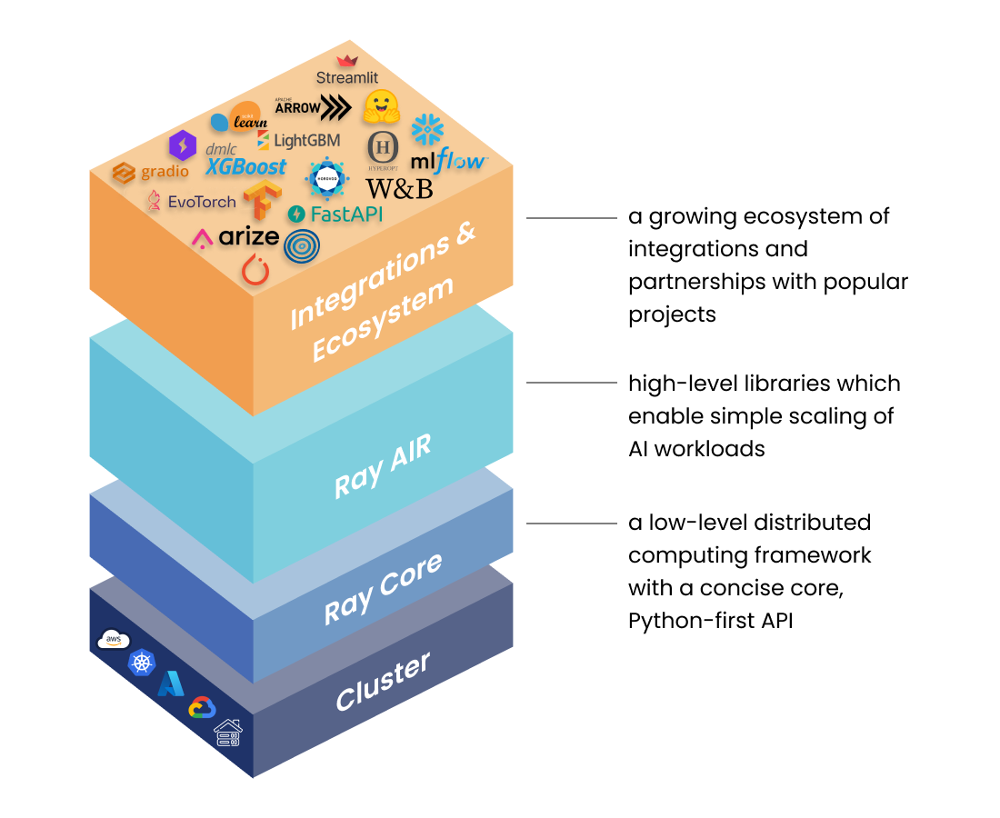

(overview-overview)=

```{include} /_includes/overview/announcement.md
```

# Overview

Ray is an open-source unified framework for scaling AI and Python applications like machine learning. It provides the compute layer for parallel processing so that you don’t need to be a distributed systems expert. Ray minimizes the complexity of running your distributed individual and end-to-end machine learning workflows with these components:
* Scalable libraries for common machine learning tasks such as data preprocessing, distributed training, hyperparameter tuning, reinforcement learning, and model serving. 
* Pythonic distributed computing primitives for parallelizing and scaling Python applications.
* Integrations and utilities for integrating and deploying a Ray cluster with existing tools and infrastructure such as Kubernetes, AWS, GCP, and Azure.

For data scientists and machine learning practitioners, Ray lets you scale jobs without needing infrastructure expertise:
* Easily parallelize and distribute workloads across multiple nodes and GPUs.
* Quickly configure and access cloud compute resources.
* Leverage the ML ecosystem with native and extensible integrations.

For distributed systems engineers, Ray automatically handles key processes:
* Orchestration--Managing the various components of a distributed system.
* Scheduling--Coordinating when and where tasks are executed.
* Fault tolerance--Ensuring tasks complete regardless of inevitable points of failure.
* Auto-scaling--Adjusting the number of resources allocated to dynamic demand.

## What you can do with Ray

These are some common ML workloads that individuals, organizations, and companies leverage Ray to build their AI applications:
* [Batch inference on CPUs and GPUs](use-cases.html#batch-inference)
* [Parallel training](use-cases.html#many-model-training)
* [Model serving](use-cases.html#model-serving)
* [Distributed training of large models](use-cases.html#distributed-training)
* [Parallel hyperparameter tuning experiments](use-cases.html#hyperparameter-tuning)
* [Reinforcement learning](use-cases.html#reinforcement-learning)
* [ML platform](use-cases.html#ml-platform)

## Ray framework

||
|:--:|
|Stack of Ray libraries - unified toolkit for ML workloads.|

Ray's unified compute framework consists of three layers:

1. **Ray AI Runtime**--An open-source, Python, domain-specific set of libraries that equip ML engineers, data scientists, and researchers with a scalable and unified toolkit for ML applications.
2. **Ray Core**--An open-source, Python, general purpose, distributed computing library that enables ML engineers and Python developers to scale Python applications and accelerate machine learning workloads.
3. **Ray cluster**--A set of worker nodes connected to a common Ray head node. Ray clusters can be fixed-size, or they can autoscale up and down according to the resources requested by applications running on the cluster.

```{eval-rst}
.. grid:: 1 2 3 3
    :gutter: 1
    :class-container: container pb-3

    .. grid-item-card::

        **Scale machine learning workloads**
        ^^^
        Build ML applications with a toolkit of libraries for distributed 
        :doc:`data processing <../data/data>`, 
        :doc:`model training <../train/train>`, 
        :doc:`tuning <../tune/index>`, 
        :doc:`reinforcement learning <../rllib/index>`, 
        :doc:`model serving <../serve/index>`, 
        and :doc:`more <../ray-more-libs/index>`.
        +++
        .. button-ref:: ../ray-air/getting-started
            :color: primary
            :outline:
            :expand:
        
            Ray AIR  

    .. grid-item-card::
        
        **Build distributed applications**
        ^^^
        Build and run distributed applications with a 
        :doc:`simple and flexible API <../ray-core/walkthrough>`.
        :doc:`Parallelize <../ray-core/walkthrough>` single machine code with 
        little to zero code changes.
        
        +++
        .. button-ref:: ../ray-core/walkthrough
            :color: primary
            :outline:
            :expand:
        
            Ray Core

    .. grid-item-card::
        
        **Deploy large-scale workloads**
        ^^^
        Deploy workloads on :doc:`AWS, GCP, Azure <../cluster/getting-started>` or 
        :doc:`on premise <../cluster/vms/user-guides/launching-clusters/on-premises>`.
        Use Ray cluster managers to run Ray on existing
        :doc:`Kubernetes <../cluster/kubernetes/index>`,
        :doc:`YARN <../cluster/vms/user-guides/community/yarn>`,
        or :doc:`Slurm <../cluster/vms/user-guides/community/slurm>` clusters.
        +++
        .. button-ref:: ../cluster/getting-started
            :color: primary
            :outline:
            :expand:
        
            Ray Clusters 
```

Each of [Ray AIR's](../ray-air/getting-started) five native libraries distributes a specific ML task:
- [Data](../data/data): Scalable, framework-agnostic data loading and transformation across training, tuning, and prediction.
- [Train](../train/train): Distributed multi-node and multi-core model training with fault tolerance that integrates with popular training libraries.
- [Tune](../tune/index): Scalable hyperparameter tuning to optimize model performance.
- [Serve](../serve/index): Scalable and programmable serving to deploy models for online inference, with optional microbatching to improve performance.
- [RLlib](../rllib/index): Scalable distributed reinforcement learning workloads that integrate with the other Ray AIR libraries.

For custom applications, the [Ray Core](../ray-core/walkthrough) library enables Python developers to easily build scalable, distributed systems that can run on a laptop, cluster, cloud, or Kubernetes. It's the foundation that Ray AIR and third-party integrations (Ray ecosystem) are built on.

Ray runs on any machine, cluster, cloud provider, and Kubernetes, and features a growing
[ecosystem of community integrations](ray-libraries).
