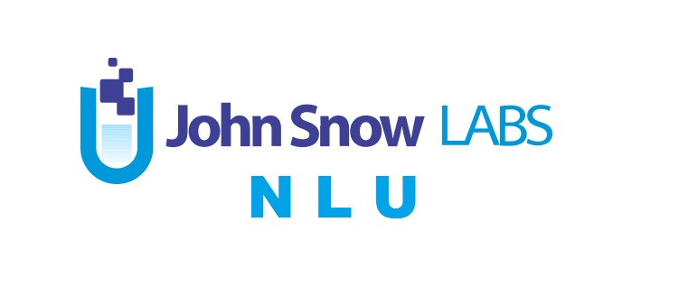

.. _ray-oss-list:

Ecosystem
=========

This page lists libraries that have integrations with Ray for distributed execution.
If you'd like to add your project to this list, feel free to file a pull request or open an issue on GitHub.

Airflow |airflow|
-----------------

Airflow is a platform created by the community to programmatically author, schedule and monitor workflows. The Airflow/Ray integration allows Airflow users to keep all of their Ray code in Python functions and define task dependencies by moving data through python functions.

[`Link to integration <https://registry.astronomer.io/providers/ray>`__] [`Link to announcement <https://www.astronomer.io/blog/airflow-ray-data-science-story>`__]

ClassyVision |classyvision|
---------------------------

Classy Vision is a new end-to-end, PyTorch-based framework for large-scale training of state-of-the-art image and video classification models. The library features a modular, flexible design that allows anyone to train machine learning models on top of PyTorch using very simple abstractions.

[`Link to integration <https://classyvision.ai/tutorials/ray_aws>`__]

Dask |dask|
-----------

Dask provides advanced parallelism for analytics, enabling performance at scale for the tools you love. Dask uses existing Python APIs and data structures to make it easy to switch between Numpy, Pandas, Scikit-learn to their Dask-powered equivalents.

[`Link to integration <dask-on-ray.html>`__]

Flambe |flambe|
---------------

Flambé is a machine learning experimentation framework built to accelerate the entire research life cycle. Flambé’s main objective is to provide a unified interface for prototyping models, running experiments containing complex pipelines, monitoring those experiments in real-time, reporting results, and deploying a final model for inference.

GitHub: `https://github.com/asappresearch/flambe <https://github.com/asappresearch/flambe>`_

Horovod |horovod|
-----------------

Horovod is a distributed deep learning training framework for TensorFlow, Keras, PyTorch, and Apache MXNet. The goal of Horovod is to make distributed deep learning fast and easy to use.

[`Link to integration <https://horovod.readthedocs.io/en/stable/ray_include.html>`__]

Hugging Face Transformers |hugging|
-----------------------------------

State-of-the-art Natural Language Processing for Pytorch and TensorFlow 2.0.

It integrates with Ray for distributed hyperparameter tuning of transformer models:

[`Link to integration <https://huggingface.co/transformers/master/main_classes/trainer.html#transformers.Trainer.hyperparameter_search>`__]

As well as for distributed document retrieval for Retrieval Augmented Generation Models

[`Link to integration <https://github.com/huggingface/transformers/tree/master/examples/research_projects/rag#document-retrieval>`__]

Intel Analytics Zoo |zoo|
-------------------------

Analytics Zoo seamless scales TensorFlow, Keras and PyTorch to distributed big data (using Spark, Flink & Ray).

[`Link to integration <https://analytics-zoo.github.io/master/#ProgrammingGuide/rayonspark/>`__]

John Snow Labs' NLU |NLU|
-------------------------
The power of 350+ pre-trained NLP models, 100+ Word Embeddings, 50+ Sentence Embeddings, and 50+ Classifiers in 46 languages with 1 line of Python code.

[`Link to integration <https://nlu.johnsnowlabs.com/docs/en/predict_api#modin-dataframe>`__]

Ludwig AI |ludwig|
------------------

Ludwig is a toolbox that allows users to train and test deep learning models without the need to write code. With Ludwig, you can train a deep learning model on Ray in zero lines of code, automatically leveraging Dask on Ray for data preprocessing, Horovod on Ray for distributed training, and Ray Tune for hyperparameter optimization.

[`Link to integration <https://medium.com/ludwig-ai/ludwig-ai-v0-4-introducing-declarative-mlops-with-ray-dask-tabnet-and-mlflow-integrations-6509c3875c2e>`__]

MARS |mars|
-----------

Mars is a tensor-based unified framework for large-scale data computation which scales Numpy, Pandas and Scikit-learn. Mars can scale in to a single machine, and scale out to a cluster with thousands of machines.

[`Link to integration <mars-on-ray.html>`__]

Modin |modin|
-------------

Scale your pandas workflows by changing one line of code. Modin transparently distributes the data and computation so that all you need to do is continue using the pandas API as you were before installing Modin.

GitHub: `https://github.com/modin-project/modin <https://github.com/modin-project/modin>`_

PyCaret |pycaret|
-----------------

PyCaret is an open source low-code machine learning library in Python that aims to reduce the hypothesis to insights cycle time in a ML experiment. It enables data scientists to perform end-to-end experiments quickly and efficiently.

GitHub: `https://github.com/pycaret/pycaret <https://github.com/pycaret/pycaret>`_

PyTorch Lightning |ptl|
-----------------------

PyTorch Lightning is a popular open-source library that provides a high level interface for PyTorch. The goal of PyTorch Lightning is to structure your PyTorch code to abstract the details of training, making AI research scalable and fast to iterate on.

[`Link to integration <https://github.com/ray-project/ray_lightning_accelerators>`__]

RayDP |raydp|
-------------

RayDP ("Spark on Ray") enables you to easily use Spark inside a Ray program. You can use Spark to read the input data, process the data using SQL, Spark DataFrame, or Pandas (via Koalas) API, extract and transform features using Spark MLLib, and use RayDP Estimator API for distributed training on the preprocessed dataset.

GitHub: `https://github.com/Intel-bigdata/oap-raydp <https://github.com/Intel-bigdata/oap-raydp>`_

Scikit Learn |scikit|
---------------------

Scikit-learn is a free software machine learning library for the Python programming language. It features various classification, regression and clustering algorithms including support vector machines, random forests, gradient boosting, k-means and DBSCAN, and is designed to interoperate with the Python numerical and scientific libraries NumPy and SciPy.

[`Link to integration <https://docs.ray.io/en/master/joblib.html>`__]

Seldon Alibi |seldon|
---------------------

Alibi is an open source Python library aimed at machine learning model inspection and interpretation. The focus of the library is to provide high-quality implementations of black-box, white-box, local and global explanation methods for classification and regression models.

GitHub: `https://github.com/SeldonIO/alibi <https://github.com/SeldonIO/alibi>`__

Spacy |spacy|
-------------
spaCy is a library for advanced Natural Language Processing in Python and Cython. It's built on the very latest research, and was designed from day one to be used in real products.

[`Link to integration <https://pypi.org/project/spacy-ray/>`__]

XGBoost |xgboost|
-----------------
XGBoost is a popular gradient boosting library for classification and regression. It is one of the most popular tools in data science and workhorse of many top-performing Kaggle kernels.

[`Link to integration <https://github.com/ray-project/xgboost_ray>`__]

LightGBM |lightgbm|
-------------------
LightGBM is a high-performance gradient boosting library for classification and regression. It is designed to be distributed and efficient.

[`Link to integration <https://github.com/ray-project/lightgbm_ray>`__]

.. |dask| image:: ../images/dask.png
    :class: inline-figure
    :height: 30

.. |horovod| image:: ../images/horovod.png
    :class: inline-figure
    :height: 30

.. |ptl| image:: ../images/pytorch_lightning_small.png
    :class: inline-figure
    :height: 30

