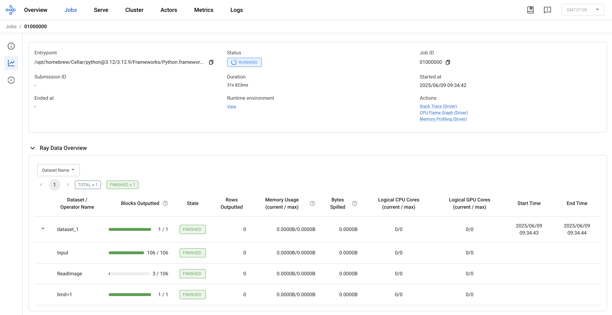
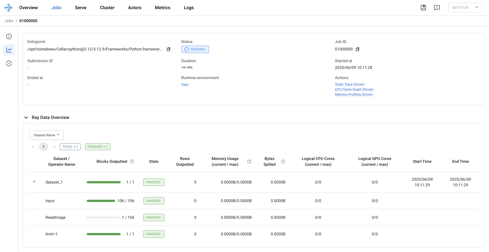
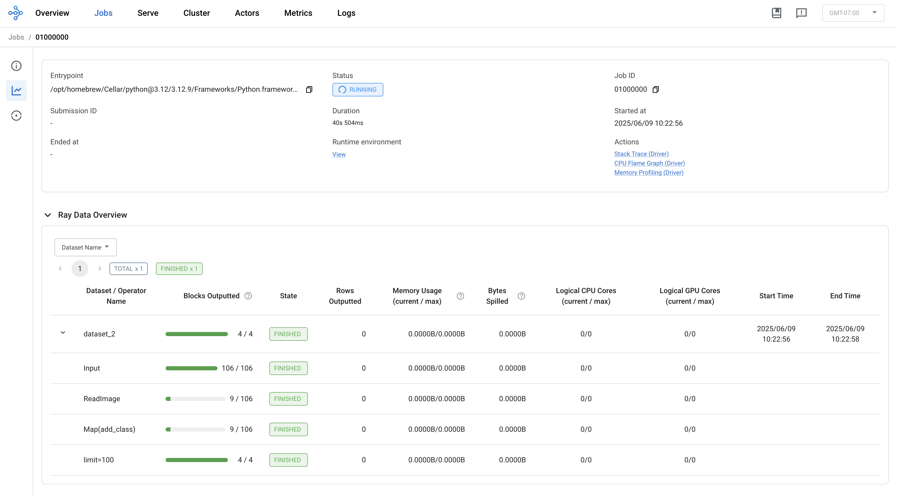
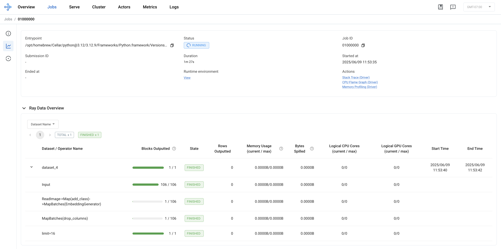
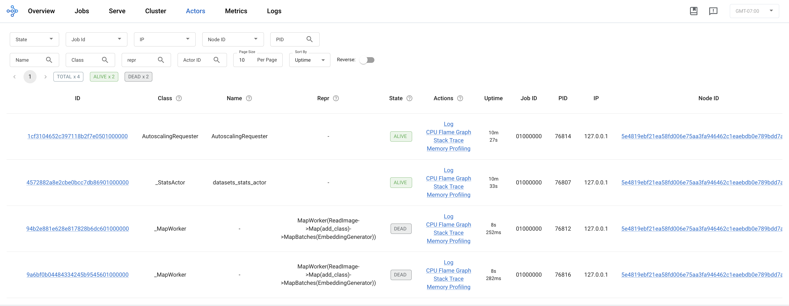
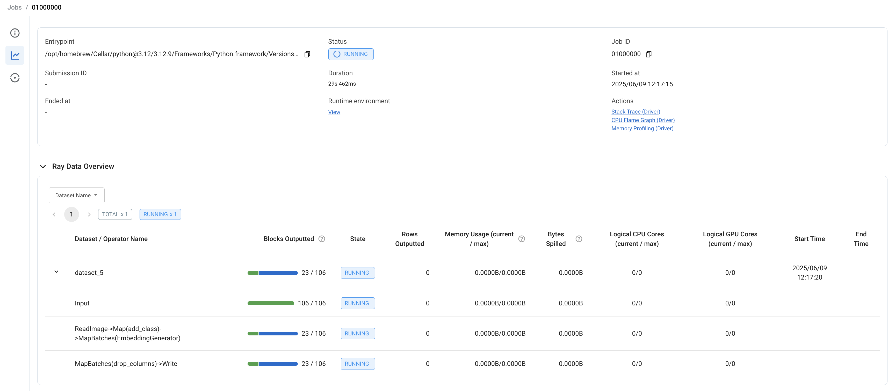
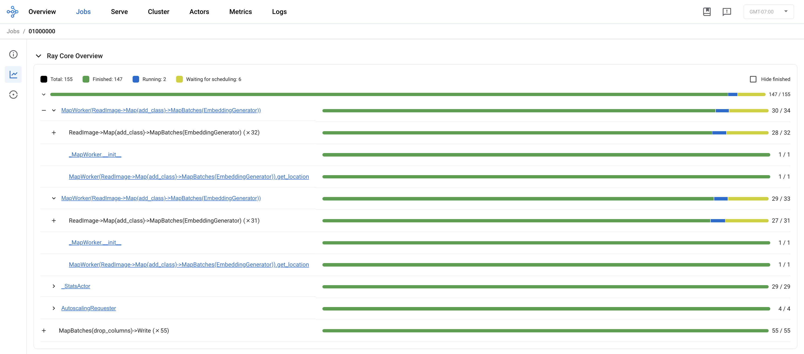

Generating Image Embeddings with Ray Data
=========================================

In this section, we'll learn how to use :ref:`Ray Data <data>` to efficiently transform image files into vector embeddings for our dog image dataset. Later in the tutorial, we will scale this pipeline to generate embeddings for our dog breed dataset in parallel across a multi-node remote Ray cluster.

What is Ray Data?
-----------------

Ray Data is a library for building scalable distributed data pipelines. It provides:

- **Simple API**: Familiar Python interfaces for data processing with powerful pythonic UDF support
- **Scalability**: Automatic parallelization across your cluster using a lazy streaming execution model to maximize resource utilization and avoid resource contention
- **Unification of Structured and Unstructured Data**: Process both structured and unstructured data, with support for distributed joins, aggregations, and other SQL-like operations
- **Flexible Data Sources**: Support for various data formats and connectors to storage systems
- **Integration with ML Ecosystem**: Seamless integration with Ray Train and other Python libraries used for ML training and inference

Ray Data is built on top of Ray and creates tasks, actors, and objects under the hood to achieve its scalability and performance.

Setting Up Our Environment
--------------------------

Let's start by installing our required dependencies:

.. literalinclude:: ../../examples/e2e-multimodal-ai-workloads/ci/build.sh
   :language: bash
   :start-after: # Install Python dependencies

Creating the Image Dataset
--------------------------

First, let's create a Ray Dataset from our image files. We'll use Ray Data's built-in support for image loading. Create a new file called `tutorial-data.py` and add the following code:

.. code-block:: python

    import ray
    from time import sleep

    # Read images from the dataset directory.
    ds = ray.data.read_images(
        "s3://doggos-dataset/train", 
        include_paths=True,
    )
    print(ds.take(1))
    print(ds.count())
    sleep(300)

This code:

1. Reads images from a public S3 bucket containing dog images, including file paths in the output
2. Prints the first processed image in the dataset
3. Prints the count of images in the dataset
4. Sleeps for 5 minutes to keep the Ray cluster running so that we can see the Ray dashboard

Ray Data uses a lazy execution model, meaning that it creates an execution plan and only executes that plan once there is an operation that requires dataset materialization. In the above code, the images are not downloaded and loaded into Ray's object store until we call `ds.take(1)`. This also only materializes the first block of data, since we are limiting the output to the first image.

The Ray dashboard allows us to see better what is happening under the hood:

From here, we can see that the execution plan created three operations: `Input`, `ReadImage`, and `limit`:

- The `Input` operation read the image file metadata from the dataset directory and determined that it should create 106 blocks
- The `ReadImage` operation pre-processed the image files and loaded them into object store memory
- The `limit` operation limited the output to the first image

Comparing this view to the output of `ds.count()`, you might notice that the `Input` operation created 106 blocks, despite there being 2,880 images in the dataset. In Ray Data, the atomic unit of execution is a **block** of data, which is a set of rows that are processed together. Unless explicitly overridden, Ray Data will infer the ideal number of blocks based on the available resources and the size of the data.

In addition, despite us only limiting the output to a single image in `ds.take(1)`, the `ReadImage` operation read in 3 blocks. Unless the `concurrency` is explicitly specified, Ray Data will determine how many tasks should be created to process the data in parallel based on the available resources. This means that the `ReadImage` operation will read in 4 images at a time, and then process them in parallel.

Let's update our code as follows:

.. code-block:: python

    import ray
    from time import sleep

    # Read images from the dataset directory.
    ds = ray.data.read_images(
        "s3://doggos-dataset/train", 
        include_paths=True,
        concurrency=1,
    )
    print(ds.take_batch(1))
    sleep(300)

This code limits the concurrency of the `ReadImage` operation to 1, which means that we should expect only 1 block to be materalized. We can run this code and see in fact that the `ReadImage` operation only reads in 1 block of data instead of 3:

Labeling the Dataset
--------------------

Now, let's define the recipe to label the dataset. We'll use the `map` operation to label the images. Let's update the `tutorial-data.py` file as follows:

.. code-block:: python
    
    import ray
    from time import sleep

    # Define a function to add a class label to each image.
    def add_class(row):
        row["class"] = row["path"].rsplit("/", 3)[-2]
        return row
    
    # Read images from the dataset directory.
    ds = ray.data.read_images(
        "s3://doggos-dataset/train", 
        include_paths=True,
    )

    # Add class labels to the dataset.
    ds = ds.map(
        add_class,
        num_cpus=1,
        num_gpus=0,
        concurrency=4)
    ds.take(100)
    sleep(300)

This code:

1. Defines a function to add a class label to each image
2. Reads images from a public S3 bucket containing dog images, including file paths in the output
3. Maps the function across each row of the dataset, operating on 4 blocks at a time
4. Prints the first 100 processed images in the dataset with the class label
5. Sleeps for 5 minutes to keep the Ray cluster running so that we can see the Ray dashboard

The `map` operation provides a powerful way to apply custom transformations to each row of the dataset in parallel. It is used heavily in Ray Data pipelines and provides significant advantage for transformations that are better expressed in Python, rather than in SQL.

The `num_cpus` and `num_gpus` arguments are used to specify the number of CPUs and GPUs to use for the operation. The `concurrency` argument is used to specify the number of blocks to process at a time. Under the hood, Ray Data will create a Ray task for each concurrent operation - in this case, 4 tasks. Each task will be allocated 1 CPU and 0 GPUs, for a total of 4 CPUs and 0 GPUs.

The Ray dashboard allows us to see better what is happening under the hood:

From here, we can see that the execution plan created an additional operation `Map(add_class)`. The end-to-end pipeline completed for 4 blocks of data before we had materialized the first 100 images in the dataset.

Computing the Image Embeddings
------------------------------

Now, let's define the recipe to create the image embeddings. We'll use the `map_batches` operation to create the embeddings, and define an `EmbeddingGenerator` class to perform the computation of the embeddings using a CLIP model from the Hugging Face Transformers library. Let's update the `tutorial-data.py` file as follows:

.. code-block:: python

    import ray
    from time import sleep
    import numpy as np
    from PIL import Image
    import torch
    from transformers import CLIPModel, CLIPProcessor

    # Define a function to add a class label to each image.
    def add_class(row):
        row["class"] = row["path"].rsplit("/", 3)[-2]
        return row

    class EmbeddingGenerator(object):
        def __init__(self, model_id):
            # Load CLIP model and processor.
            self.model = CLIPModel.from_pretrained(model_id)
            self.processor = CLIPProcessor.from_pretrained(model_id)

        def __call__(self, batch, device="cpu"):
            # Load and preprocess images.
            images = [Image.fromarray(np.uint8(img)).convert("RGB") for img in batch["image"]]
            inputs = self.processor(images=images, return_tensors="pt", padding=True).to(device)

            # Generate embeddings.
            self.model.to(device)
            with torch.inference_mode():
                batch["embedding"] = self.model.get_image_features(**inputs).cpu().numpy()

            return batch

    # Read images from the dataset directory.
    ds = ray.data.read_images(
        "s3://doggos-dataset/train", 
        include_paths=True,
    )

    # Add class labels to the dataset.
    ds = ds.map(
        add_class,
        num_cpus=1,
        num_gpus=0,
        concurrency=2)

    # Batch embeddings.
    embeddings_ds = ds.map_batches(
        EmbeddingGenerator,
        fn_constructor_kwargs={"model_id": "openai/clip-vit-base-patch32"},  # class kwargs
        concurrency=2,
        batch_size=2,
        num_cpus=1,
        num_gpus=0,
    )
    embeddings_ds = embeddings_ds.drop_columns(["image"])  # remove image column
    print(embeddings_ds.take(16))
    sleep(300)

This code:

1. Defines a function to add a class label to each image
2. Defines a class to generate embeddings using a CLIP model
3. Reads images from a public S3 bucket containing dog images, including file paths in the output
4. Maps the function across each row of the dataset, operating on 2 blocks at a time
5. Generates embeddings for each batch of images
6. Drops the image column
7. Prints the embeddings for the first 16 images in the dataset
8. Sleeps for 5 minutes to keep the Ray cluster running so that we can see the Ray dashboard

Similar to the `map` operation, the `map_batches` operation is a parallel operation that applies a function to a batch of dataset rows, rather than each individual row. The underlying Pytorch inference function used to compute the image embeddings is vectorized, so we can use the `map_batches` operation to significantly improves performance vs. using the `map` operation.

Also note that in our `map` call, we are passing the `add_class` function, but in our `map_batches` call, we are passing an `EmbeddingGenerator` class. Both the `map` and `map_batches` operations accept either a function argument or a class argument. In the case when a function is passed, Ray creates tasks under the hood to run the function. In the case when a class is passed, Ray creates an actor under the hood.

The Ray dashboard allows us to see better what is happening under the hood:

We can also see from the Actors tab of the Ray dashboard that Ray Data has created two actors, given that we have specified a `concurrency=2` in the `map_batches` call:

Note that in this example, we are not using any GPUs to compute the embeddings, as we are currently running locally on a laptop and the GPUs are not. We will scale this pipeline to run on a distributed Ray cluster in a later section of the tutorial, where we will use GPUs to accelerate the embeddings computation.

Storing the Embeddings
----------------------

Finally, let's run the end-to-end pipeline and write out to a parquet file. Update the `tutorial-data.py` file as follows:

.. code-block:: python

    import ray
    import numpy as np
    from PIL import Image
    import torch
    from transformers import CLIPModel, CLIPProcessor
    import os
    import shutil

    # Define a function to add a class label to each image.
    def add_class(row):
        row["class"] = row["path"].rsplit("/", 3)[-2]
        return row

    class EmbeddingGenerator(object):
        def __init__(self, model_id):
            # Load CLIP model and processor.
            self.model = CLIPModel.from_pretrained(model_id)
            self.processor = CLIPProcessor.from_pretrained(model_id)

        def __call__(self, batch, device="cpu"):
            # Load and preprocess images.
            images = [Image.fromarray(np.uint8(img)).convert("RGB") for img in batch["image"]]
            inputs = self.processor(images=images, return_tensors="pt", padding=True).to(device)

            # Generate embeddings.
            self.model.to(device)
            with torch.inference_mode():
                batch["embedding"] = self.model.get_image_features(**inputs).cpu().numpy()

            return batch

    # Read images from the dataset directory.
    ds = ray.data.read_images(
        "s3://doggos-dataset/train", 
        include_paths=True,
    )

    # Add class labels to the dataset.
    ds = ds.map(
        add_class,
        num_cpus=1,
        num_gpus=0,
        concurrency=2)

    # Batch embeddings.
    embeddings_ds = ds.map_batches(
        EmbeddingGenerator,
        fn_constructor_kwargs={"model_id": "openai/clip-vit-base-patch32"},  # class kwargs
        concurrency=2,
        batch_size=2,
        num_cpus=1,
        num_gpus=0,
    )
    embeddings_ds = embeddings_ds.drop_columns(["image"])  # remove image column

    # Clean up the embeddings directory registry if it exists.
    embeddings_dir = os.path.abspath("./embeddings")
    if os.path.isdir(embeddings_dir):
        shutil.rmtree(embeddings_dir)  # Clean up.
    os.makedirs(embeddings_dir, exist_ok=True)

    # Write embeddings to parquet file.
    embeddings_ds.write_parquet(embeddings_dir)

This code:

1. Runs the end-to-end pipeline
2. Writes the embeddings to a parquet file in the `/mnt/user_storage/doggos/embeddings` directory

The `write_parquet` operation triggers the execution of the pipeline and writes the embeddings to a parquet file. Note that we are writing the embeddings to a local directory, which would not work in a distributed environment.

We can use the Ray dashboard to monitor the progress of the pipeline:

We can also use the Ray dashboard to see a log of all of the tasks that were created, and the execution status of the job:

For more information on the Ray dashboard, see the :ref:`observability documentation <observability-getting-started>`.

Recap: Key Ray Data Concepts
----------------------------

Computing the embeddings for 2,880 images does not take long to complete. However, if we had to scale this pipeline to millions of images, we would run into challenges. In a later section, we will scale this pipeline to run on a distributed Ray cluster using GPUs to accelerate the embeddings computation.

In this section, we've introduced several important Ray Data concepts that explain how Ray Data achieves scalability and performance. We demonstrated how Ray Data:

- Uses a lazy streaming execution model to process data block-by-block.
- Allows granular control over the number of concurrent processing based on resource availability.
- Can read and write from various sources, using various data formats.
- Uses Ray primitives like tasks and actors under the hood to execute stateless and stateful transformations using the `map` and `map_batches` APIs.

We also learned how we can use the Ray dashboard to monitor the pipeline and understand what is happening as the application runs.

This is just a light introduction to what is possible with Ray Data. For more information, see the :ref:`Ray Data documentation <data>`.

Next Steps
----------

In the next section, we'll use our processed data to train a dog breed classifier using Ray Train. We'll learn how to:

- Define our classiciation model and pipeline architecture
- Train our model across multiple workers
- Monitor training progress
- Evaluate the performance of our model

In a later section, we will scale the training pipeline to run on a distributed Ray cluster using GPUs. Ready to move on? Let's proceed to :doc:`training`! 