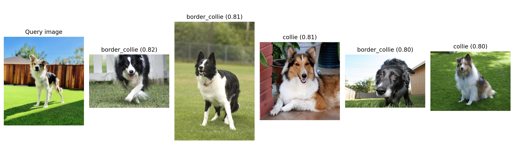

Online Classification and Image Search with Ray Serve
=====================================================

In this section, we'll learn how to use Ray Serve to deploy our trained dog breed classifier as a production-ready API. Ray Serve provides a scalable application serving solution that can handle high-throughput inference requests, allowing us to scale our dog breed classifier to handle thousands of concurrent requests.

.. note::
   This section assumes working knowledge of FastAPI. If you are not familiar with FastAPI, please refer to the `FastAPI documentation <https://fastapi.tiangolo.com/>`_ to learn more.

What is Ray Serve?
------------------

Ray Serve is a scalable library for serving online, real-time applications. It offers:

- **A Simple API**: Easy-to-use capabilities for serving APIs, models, and other applications, accessible through a Python interface for development use cases and/or YAML configuration for production use cases
- **Scalability**: Automatic scaling based on traffic within configured specifications
- **Composability**: Easily chain multiple models and business logic while keeping each component independently scalable

Ray Serve is built on top of Ray, relying on Ray's distributed computing capabilities to provide a production-ready serving solution while maintaining the simplicity of a Python API. Ray Serve uses actors under the hood to manage and process requests. Specifically, Ray Serve uses actors to:

- Manage the Ray Serve control plane, handling deployment creation, updates, and destruction
- Execute the user-defined code (e.g., ML model inference) in response to requests inside of a replica, batching requests and maintaining state between calls by leveraging the actor model's statefulness
- Run HTTP or gRPC servers to receive incoming requests and forward them to replicas
- And more!

Solution Architecture
---------------------

We want our application to have offer a single search API that finds both the most likely dog breed for an input image and the top `k` most similar images to an input image. To do this, we will need to create three separate Ray Serve deployments:

1. A deployment for the trained model that generates a probability distribution for a given image URL
2. A deployment that embeds the input image and retrieves the top `k` similar images from a dataset
3. A deployment for the application that composes the two deployments together and exposes a single API endpoint

We will compose these three deployments together in a single Ray Serve application to keep the API deployment simple and cost efficient.

Setting Up Our Environment
--------------------------

For this section, we will need to install some additional dependencies:

.. code-block:: bash

    pip3 install --no-cache-dir \
        "ray[serve]" \
        "fastapi"

Let's also download some example code that we have already written for this tutorial:

:download:`Example code for this section <../../../_static/doggos.zip>`

Unzip the code and copy the `doggos` directory into your working directory. This directory contains the code for the model serving application that we will be deploying.

Creating Our Model Deployment
-----------------------------

First, let's create a deployment for the trained model that generates a probability distribution for a given image URL, using the trained classifier from the previous section:
Let's start by importing the necessary libraries and setting up our environment. Let's create a new file called `tutorial-serve.py` file and add the following code:

.. code-block:: python

    import os
    import ray
    import sys

    # Ray Serve
    from fastapi import FastAPI
    import mlflow
    import requests
    from starlette.requests import Request
    from urllib.parse import urlparse
    from ray import serve
    from doggos.embed import EmbeddingGenerator, get_top_matches
    from doggos.infer import TorchPredictor
    from doggos.utils import url_to_array

    @serve.deployment(
        num_replicas="1", 
        ray_actor_options={
            "num_cpus": 1,
        },
    )
    class ClassPredictor:
        def __init__(self, artifacts_dir):
            """Initialize the model."""
            self.predictor = TorchPredictor.from_artifacts_dir(artifacts_dir=artifacts_dir)
            self.preprocessor = self.predictor.preprocessor

        def get_probabilities(self, url):
            image = url_to_array(url=url)
            ds = ray.data.from_items([{"image": image, "url": url}])
            ds = self.preprocessor.transform(
                ds=ds,
                concurrency=1,
                batch_size=1,
            )
            ds = ds.map_batches(
                self.predictor.predict_probabilities,
                fn_kwargs={"device": "cpu"},
                concurrency=1,
                batch_size=1,
            )
            probabilities = ds.take_all()[0]["probabilities"]
            return probabilities

This code defines a predictor class that wraps the classifier trained in the previous section and generates a probability distribution for an uploaded image, referenced by URL. The `@serve.deployment` decorator is used to create a Ray Serve deployment. The `num_replicas` argument is used to specify the number of replicas to deploy to handle concurrent requests. The `ray_actor_options` argument is used to specify the resources to allocate to each replica. For now, we'll deploy a single replica and not use any GPUs, as we are still running our application locally.

Next, let's create another deployment to use the input image, embed it, and retrieve the top similar matches. This deployment uses the top k predictions from the model as a filter for retrieving similar images. Let's append the following code to the `tutorial-serve.py` file:

.. code-block:: python

    @serve.deployment(
        num_replicas="1", 
        ray_actor_options={
            "num_cpus": 1
        },
    )
    class EmbeddingSimilarity:
        def __init__(self, embeddings_path):
            self.embedding_generator = EmbeddingGenerator(model_id="openai/clip-vit-base-patch32")
            self.embeddings_ds = ray.data.read_parquet(embeddings_path)  # use vector DB

        def get_top_matches(self, url, probabilities, k):
            # Top k class predictions
            sorted_probabilities = sorted(probabilities.items(), key=lambda x: x[1], reverse=True)
            top_k = [item[0] for item in sorted_probabilities[0:k]]

            # Generate embedding.
            image = url_to_array(url=url)
            embedding = self.embedding_generator({"image": [image]})["embedding"][0]

            # Filter for top matches.
            top_matches = get_top_matches(
                query_embedding=embedding,
                embeddings_ds=self.embeddings_ds,
                class_filters=top_k,
                n=5,
            )
            return top_matches

This code defines a class that searches through the previously computed embeddings to find the most similar images to the uploaded image, passed by URL reference. Like in the previous function, the `@serve.deployment` decorator is used to specify the resources to allocate to each replica of the deployment, and we are assuming a local deployment with no GPU access.

Defining the Ray Serve Application
----------------------------------

Now, let's define the Ray Serve application that will compose our two deployments:

.. code-block:: python

    # Define app.
    api = FastAPI(
        title="doggos", 
        description="classify your dog", 
        version="0.1",
    )

    @serve.deployment(num_replicas="1", ray_actor_options={"num_cpus": 1})
    @serve.ingress(api)
    class Doggos:
        def __init__(self, classifier, embedder):
            self.classifier = classifier
            self.embedder = embedder
            
        @api.post("/predict/")
        async def predict(self, request: Request):
            data = await request.json()
            probabilities = await self.classifier.get_probabilities.remote(url=data["url"])
            top_matches = await self.embedder.get_top_matches.remote(
                url=data["url"],
                probabilities=probabilities,
                k=data["k"],
            )
            return {
                "probabilities": probabilities, 
                "top_matches": top_matches,
            }

This code:

1. Defines a FastAPI application
2. Creates a deployment for the classifier and embedder
3. Composes the classifier and embedder into a single deployment
4. Defines the `/predict/` endpoint
5. Returns the probabilities and top matches

We use the `@serve.ingress` decorator to attach the FastAPI application to the deployment. This allows us to expose the Ray Serve deployment through a FastAPI endpoint. We also declare 

Deploying the Application for Local Testing
-------------------------------------------

Now we are ready to deploy our application. Let's append the following code to the `tutorial-serve.py` file to start the Ray Serve application locally:

.. code-block:: python

    from time import sleep
    
    # Model registry & vector store.
    model_registry = "./mlflow/doggos"
    embeddings_path = "./embeddings"
    experiment_name = "doggos"
    mlflow.set_tracking_uri(f"file:{model_registry}")

    # Get best_run's artifact_dir.
    mlflow.set_tracking_uri(f"file:{model_registry}")
    sorted_runs = mlflow.search_runs(
        experiment_names=[experiment_name], 
        order_by=["metrics.val_loss ASC"])
    best_run = sorted_runs.iloc[0]
    artifacts_dir = urlparse(best_run.artifact_uri).path

    # Define app.
    app = Doggos.bind(
        classifier=ClassPredictor.bind(artifacts_dir=artifacts_dir),
        embedder=EmbeddingSimilarity.bind(embeddings_path=embeddings_path),
    )
    
    # Run the application with Ray Serve.
    serve.run(app, route_prefix="/")

    # Send a request.
    url = "https://doggos-dataset.s3.us-west-2.amazonaws.com/samara.png"
    data = {"url": url, "k": 4}
    response = requests.post("http://127.0.0.1:8000/predict/", json=data)
    print(response.json())

    sleep(300)

This code:

1. Retrieves the best model trained in the previous section from the model registry
2. Binds the classifier and embedder to the application
3. Deploys the application locally
4. Sends a test request to the `/predict/` endpoint

Now, the Ray Serve application is running in a local Ray cluster, and we can see that the application is working as expected based on the test request output:

The `bind` API provides a simple way to compose the classifier and embedder deployments into a single application deployment. Though our application is quite simple and only contains two deployments, you can imagine how this might be useful for more complex applications, where you might want to compose multiple deployments together under specific business logic. 

Let's also take a look at the Ray Serve dashboard to see the application in action:

.. image:: ./images/ray-serve-dashboard.png
   :alt: Ray Serve dashboard
   :align: center

TODO: Add screenshot of Ray Serve dashboard and more information about how the Ray Serve works.

Refactoring the Application for Production Deployment
-----------------------------------------------------

In the previous section, we used the developer API for interactively deploying our application to a local Ray cluster. However, generally development and platform teams tend to use other configuration-based approaches, integrated with a CI/CD pipeline, to deploy applications in production. Ray Serve also provides a YAML-based configuration for specifying how to deploy an application, and Ray offers a deployment CLI.

Let's refactor the application to use a YAML configuration file to specify how to deploy our application. First, let's change the application code:

.. code-block:: python

    # deploy.py
    from fastapi import FastAPI
    from ray import serve

Next, let's create a `doggos.yaml` configuration file to specify how to deploy our application:

.. code-block:: yaml

    runtime_env:
    working_dir: .

    applications:
    - name: doggos_service
        route_prefix: "/"
        import_path: doggos.serve:app 
        deployments:
        - name: ClassPredictor
            num_replicas: 1
            ray_actor_options:
            num_cpus: 1
            num_gpus: 0
            accelerator_type: null
        - name: EmbeddingSimilarity
            num_replicas: 1
            ray_actor_options:
            num_cpus: 1
            num_gpus: 0
            accelerator_type: null
        - name: Doggos
            num_replicas: 1
            ray_actor_options:
            num_cpus: 1
            num_gpus: 0
            accelerator_type: null

This configuration defines the configuration for the Ray Serve application, specifying the `doggos/serve.py` file as the entry point and the `doggos_service` as the name of the application. It also specifies the deployments to use for the application, and the resources to allocate to each deployment.

To deploy the application, use the Ray CLI:

.. code-block:: bash

    serve run doggos.yaml

This will deploy the application to a local Ray cluster. Let's test the application:

.. code-block:: bash

    curl -X POST http://127.0.0.1:8000/predict/ -H "Content-Type: application/json" -d '{"url": "https://doggos-dataset.s3.us-west-2.amazonaws.com/samara.png", "k": 4}'

This will send a request to the `/predict/` endpoint and return the probabilities and top matches.

Key Ray Serve Concepts
----------------------

In this section, we've learned about several important Ray Serve concepts:

1. **Deployments**: High-level abstractions for exposing the functionality of a Python class in Ray Serve
2. **Replica**: A separately scalable instance of a deployment
3. **Resource Allocation**: Configuring CPU, GPU, and accelerator resources through a developer API and through a production API
4. **Composability**: Composing multiple deployments together and exposing them through a single Ray Serve application

We also learned how Ray Serve uses Ray's primitives under the hood to achieve scalability and performance.

Later in the tutorial, we will scale this application to run on a distributed Ray cluster and we use GPUs to accelerate the embeddings computation.

Next Steps
----------

In the next section, we'll learn how to set up a distributed Ray cluster and deploy our application to it.