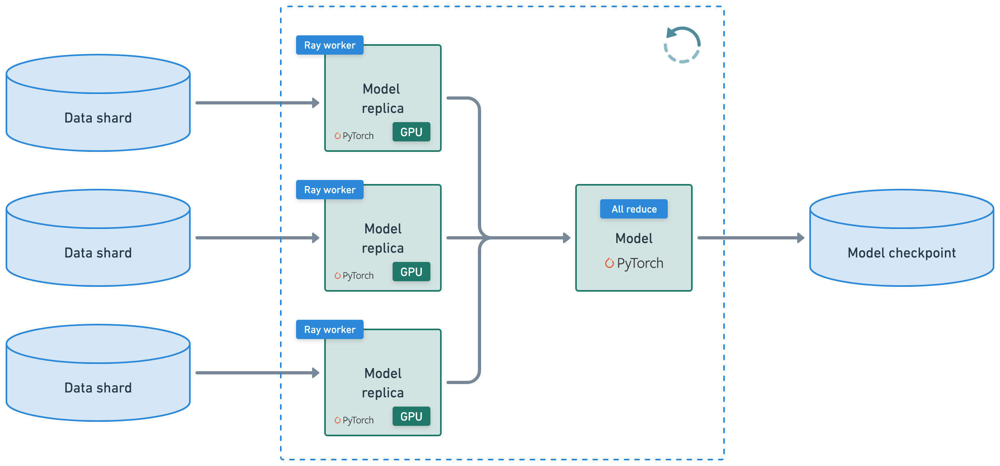
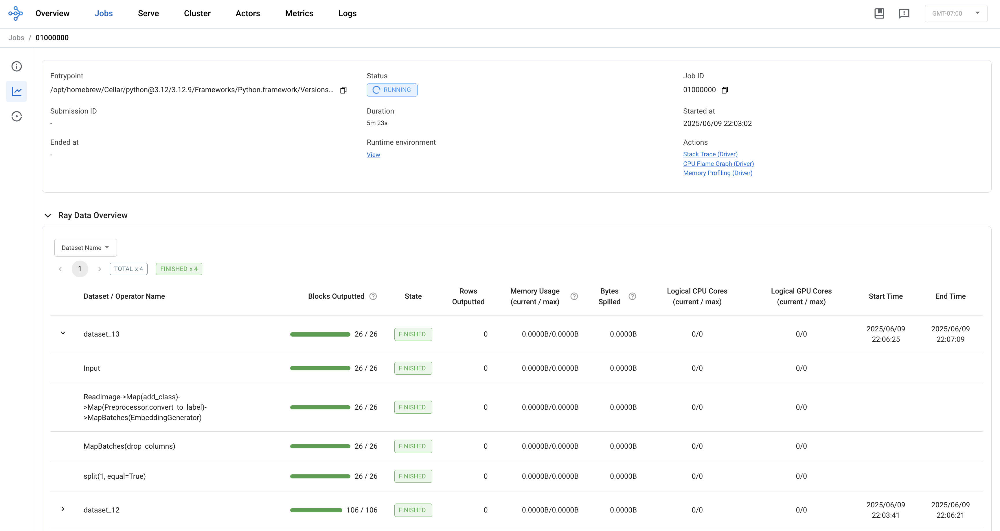
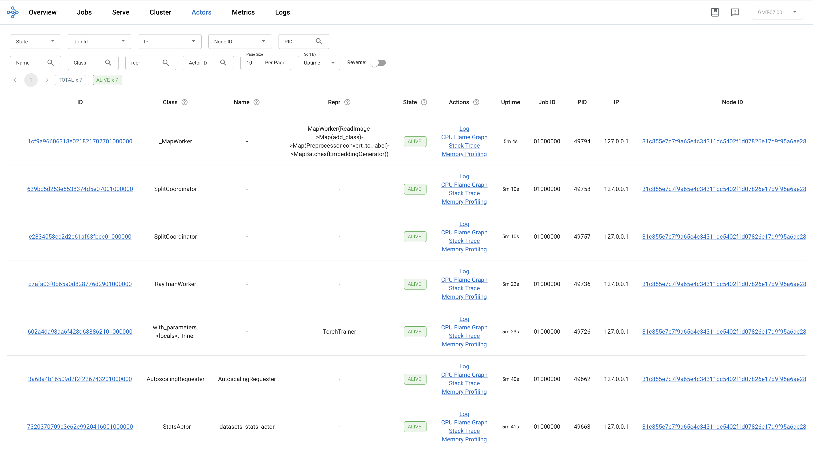
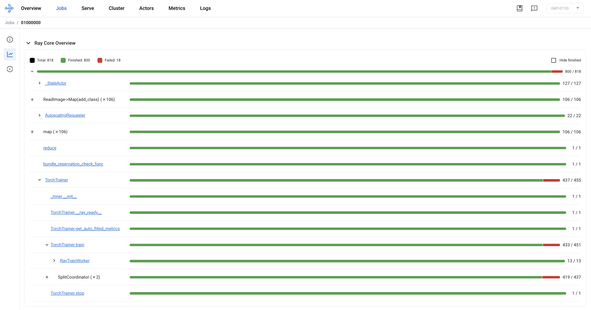

Training the Classification Model with Ray Train
================================================

In this section, we'll learn how to use :ref:`Ray Train <train-docs>` to distribute the training of our dog breed classifier across multiple workers. Ray Train provides a simple API for distributed training that works with popular deep learning frameworks like PyTorch. Later in this tutorial, we will scale this training pipeline to run on a multi-node remote Ray cluster.

.. note::
   This section assumes working knowledge of PyTorch. If you are new to PyTorch, please refer to the `PyTorch documentation <https://pytorch.org/docs/stable/index.html>`_ to learn more.

What is Ray Train?
------------------

Ray Train is a library for distributed model training that is:

- **Framework Agnostic**: Works with PyTorch, TensorFlow, and other frameworks
- **Scalable**: Automatically handles data and model parallelism, enabling multi-node and multi-GPU training
- **Fault Tolerant**: Built-in support for saving and loading model checkpoints and recovering from failures
- **Interoperable with Other Ray Libraries**: Integration with Ray Data for effiicent trainer loading and with Ray Tune for hyperparameter optimization

Ray Train is built on top of Ray and creates tasks and actors under the hood to orchestrate distributed training. Placement groups are used to ensure that workers are placed optimally within the cluster to maximize efficiency, for example by placing workers on the same GPU node to minimize communication overhead.

Setting Up Our Training Environment
-----------------------------------

If you haven't already, let's install the required dependencies:

.. literalinclude:: ../../examples/e2e-multimodal-ai-workloads/ci/build.sh
   :language: bash
   :start-after: # Install Python dependencies

Pre-processing the Training Dataset
-----------------------------------

In the previous section, we pre-processed the dataset to generate embeddings for each image in the training dataset. In this section, we want to move our embeddings generation logic as part of the last-mile training pipeline, as data is loaded to the trainer. Create a new file called `tutorial-train.py` and add the following code:

.. code-block:: python
    
    import ray
    import torch
    import json
    import numpy as np
    from transformers import CLIPModel, CLIPProcessor
    from PIL import Image

    def add_class(row):
        row["class"] = row["path"].rsplit("/", 3)[-2]
        return row

    # Preprocess data splits.
    train_ds = ray.data.read_images("s3://doggos-dataset/train", include_paths=True, shuffle="files")
    train_ds = train_ds.map(add_class)
    val_ds = ray.data.read_images("s3://doggos-dataset/val", include_paths=True)
    val_ds = val_ds.map(add_class)

    class EmbeddingGenerator(object):
        def __init__(self, model_id):
            # Load CLIP model and processor
            self.model = CLIPModel.from_pretrained(model_id)
            self.processor = CLIPProcessor.from_pretrained(model_id)

        def __call__(self, batch, device="cpu"):
            # Load and preprocess images
            images = [
                Image.fromarray(np.uint8(img)).convert("RGB") for img in batch["image"]
            ]

            inputs = self.processor(images=images, return_tensors="pt", padding=True).to(
                device
            )

            # Generate embeddings
            self.model.to(device)
            with torch.inference_mode():
                batch["embedding"] = self.model.get_image_features(**inputs).cpu().numpy()

            return batch

    class Preprocessor:
        """Preprocessor class."""
        def __init__(self, class_to_label=None):
            self.class_to_label = class_to_label or {}  # mutable defaults
            self.label_to_class = {v: k for k, v in self.class_to_label.items()}
            
        def fit(self, ds, column):
            self.classes = ds.unique(column=column)
            self.class_to_label = {tag: i for i, tag in enumerate(self.classes)}
            self.label_to_class = {v: k for k, v in self.class_to_label.items()}
            return self

        def convert_to_label(self, row, class_to_label):
            if "class" in row:
                row["label"] = class_to_label[row["class"]]
            return row
        
        def transform(self, ds, concurrency=1, batch_size=2, num_gpus=0):
            ds = ds.map(
                self.convert_to_label, 
                fn_kwargs={"class_to_label": self.class_to_label},
            )
            ds = ds.map_batches(
                EmbeddingGenerator,
                fn_constructor_kwargs={"model_id": "openai/clip-vit-base-patch32"},
                concurrency=concurrency, 
                batch_size=batch_size,
            )
            ds = ds.drop_columns(["image"])
            return ds

        def save(self, fp):
            with open(fp, "w") as f:
                json.dump(self.class_to_label, f)

This code defines the pipeline for pre-processing the dataset:

1. Reads the training and validation datasets from S3
2. Maps the `add_class` function across each row of the dataset to add a class label to each image
3. Creates embeddings for each image using the imported `EmbeddingGenerator` class
4. Drops the image column
5. Applies the transform function the pre-processed training and validation datasets

Functionally, this code defines the same pipeline as the previous section. However, we are not writing out to parquet at the end, and so running this code does not actually execute the pipeline. 

When we are training the model, we do not need to pre-compute the embeddings and write them out to parquet like we had done in the previous section. Instead, we can take advantage of the interoperability between  Ray Data and Ray Train to treat embeddings generation and trainer loading as part of one unified data pipeline, which we will show in the next section.

Defining Our Model
------------------

Let's create a simple classifier for our dog breeds - a simple two layer neural net with Softmax layer to predict class probabilities - using PyTorch. Let's append the following code to the `tutorial-train.py` file:

.. code-block:: python
    
    import torch.nn as nn
    import torch.nn.functional as F
    from pathlib import Path

    class ClassificationModel(torch.nn.Module):
        def __init__(self, embedding_dim, hidden_dim, dropout_p, num_classes):
            super().__init__()
            # Hyperparameters.
            self.embedding_dim = embedding_dim
            self.hidden_dim = hidden_dim
            self.dropout_p = dropout_p
            self.num_classes = num_classes

            # Define layers.
            self.fc1 = nn.Linear(embedding_dim, hidden_dim)
            self.batch_norm = nn.BatchNorm1d(hidden_dim)
            self.relu = nn.ReLU()
            self.dropout = nn.Dropout(dropout_p)
            self.fc2 = nn.Linear(hidden_dim, num_classes)

        def forward(self, batch):
            z = self.fc1(batch["embedding"])
            z = self.batch_norm(z)
            z = self.relu(z)
            z = self.dropout(z)
            z = self.fc2(z)
            return z

        @torch.inference_mode()
        def predict(self, batch):
            z = self(batch)
            y_pred = torch.argmax(z, dim=1).cpu().numpy()
            return y_pred

        @torch.inference_mode()
        def predict_probabilities(self, batch):
            z = self(batch)
            y_probs = F.softmax(z, dim=1).cpu().numpy()
            return y_probs

        def save(self, dp):
            Path(dp).mkdir(parents=True, exist_ok=True)
            with open(Path(dp, "args.json"), "w") as fp:
                json.dump({
                    "embedding_dim": self.embedding_dim,
                    "hidden_dim": self.hidden_dim,
                    "dropout_p": self.dropout_p,
                    "num_classes": self.num_classes,
                }, fp, indent=4)
            torch.save(self.state_dict(), Path(dp, "model.pt"))

        @classmethod
        def load(cls, args_fp, state_dict_fp, device="cpu"):
            with open(args_fp, "r") as fp:
                model = cls(**json.load(fp))
            model.load_state_dict(torch.load(state_dict_fp, map_location=device))
            return model

    # Preprocess.
    preprocessor = Preprocessor()
    preprocessor = preprocessor.fit(train_ds, column="class")
    train_ds = preprocessor.transform(ds=train_ds)
    val_ds = preprocessor.transform(ds=val_ds)

    # Initialize model.
    num_classes = len(preprocessor.classes)
    model = ClassificationModel(
        embedding_dim=512, 
        hidden_dim=256, 
        dropout_p=0.3, 
        num_classes=num_classes,
    )
    print(model)

This code:

1. Defines the model
2. Pre-processes the training and validation datasets
3. Prints out the model details

As we can see, only PyTorch code is used to define the model. Ray Train is totally framework agnostic and can be used with any machine learning framework. For developers who are new to Ray, this is a key benefit - there is no need to learn a new framework to get started with Ray Train.

Defining the Training & Evaluation Functions
--------------------------------------------

Now, let's define our training and evaluation functions that will be distributed across the Ray cluster during the training process. Let's append the following code to the `tutorial-train.py` file:

.. code-block:: python

    from ray.train.torch import get_device
    import mlflow
    import tempfile
    import os

    def collate_fn(batch):
        dtypes = {"embedding": torch.float32, "label": torch.int64}
        tensor_batch = {}
        for key in dtypes.keys():
            if key in batch:
                tensor_batch[key] = torch.as_tensor(
                    batch[key],
                    dtype=dtypes[key],
                    device=get_device(),
                )
        return tensor_batch

    def train_epoch(ds, batch_size, model, num_classes, loss_fn, optimizer):
        model.train()
        loss = 0.0
        ds_generator = ds.iter_torch_batches(batch_size=batch_size, collate_fn=collate_fn)
        for i, batch in enumerate(ds_generator):
            optimizer.zero_grad()  # Reset gradients.
            z = model(batch)  # Forward pass.
            targets = F.one_hot(batch["label"], num_classes=num_classes).float()
            J = loss_fn(z, targets)  # Define loss.
            J.backward()  # Backward pass.
            optimizer.step()  # Update weights.
            loss += (J.detach().item() - loss) / (i + 1)  # Cumulative loss
        return loss

    def eval_epoch(ds, batch_size, model, num_classes, loss_fn):
        model.eval()
        loss = 0.0
        y_trues, y_preds = [], []
        ds_generator = ds.iter_torch_batches(batch_size=batch_size, collate_fn=collate_fn)
        with torch.inference_mode():
            for i, batch in enumerate(ds_generator):
                z = model(batch)
                targets = F.one_hot(batch["label"], num_classes=num_classes).float()  # one-hot (for loss_fn)
                J = loss_fn(z, targets).item()
                loss += (J - loss) / (i + 1)
                y_trues.extend(batch["label"].cpu().numpy())
                y_preds.extend(torch.argmax(z, dim=1).cpu().numpy())
        return loss, np.vstack(y_trues), np.vstack(y_preds)

    def train_loop_per_worker(config):
        # Hyperparameters.
        model_registry = config["model_registry"]
        experiment_name = config["experiment_name"]
        embedding_dim = config["embedding_dim"]
        hidden_dim = config["hidden_dim"]
        dropout_p = config["dropout_p"]
        lr = config["lr"]
        lr_factor = config["lr_factor"]
        lr_patience = config["lr_patience"]
        num_epochs = config["num_epochs"]
        batch_size = config["batch_size"]
        num_classes = config["num_classes"]

        # Experiment tracking.
        if ray.train.get_context().get_world_rank() == 0:
            mlflow.set_tracking_uri(f"file:{model_registry}")
            mlflow.set_experiment(experiment_name)
            mlflow.start_run()
            mlflow.log_params(config)

        # Datasets.
        train_ds = ray.train.get_dataset_shard("train")
        val_ds = ray.train.get_dataset_shard("val")

        # Model.
        model = ClassificationModel(
            embedding_dim=embedding_dim, 
            hidden_dim=hidden_dim, 
            dropout_p=dropout_p, 
            num_classes=num_classes,
        )
        model = ray.train.torch.prepare_model(model)

        # Training components.
        loss_fn = torch.nn.CrossEntropyLoss()
        optimizer = torch.optim.Adam(model.parameters(), lr=lr)
        scheduler = torch.optim.lr_scheduler.ReduceLROnPlateau(
            optimizer, 
            mode="min", 
            factor=lr_factor, 
            patience=lr_patience,
        )

        # Training.
        best_val_loss = float("inf")
        for epoch in range(num_epochs):
            # Steps
            train_loss = train_epoch(train_ds, batch_size, model, num_classes, loss_fn, optimizer)
            val_loss, _, _ = eval_epoch(val_ds, batch_size, model, num_classes, loss_fn)
            scheduler.step(val_loss)

            # Checkpoint (metrics, preprocessor and model artifacts).
            with tempfile.TemporaryDirectory() as dp:
                model.module.save(dp=dp)
                metrics = dict(lr=optimizer.param_groups[0]["lr"], train_loss=train_loss, val_loss=val_loss)
                with open(os.path.join(dp, "class_to_label.json"), "w") as fp:
                    json.dump(config["class_to_label"], fp, indent=4)
                if ray.train.get_context().get_world_rank() == 0:  # only on main worker 0
                    mlflow.log_metrics(metrics, step=epoch)
                    if val_loss < best_val_loss:
                        best_val_loss = val_loss
                        mlflow.log_artifacts(dp)

        # End experiment tracking.
        if ray.train.get_context().get_world_rank() == 0:
            mlflow.end_run()

This code:

1. Imports the necessary libraries
2. Defines the training function, which is called once per epoch on each worker for a specific shard of the training dataset
3. Defines the evaluation function, which is called once per epoch on each worker for a specific shard of the validation dataset
4. Defines the training loop per worker, which is the function that will be distributed across the Ray cluster

Note that again, the vast majority of the code is PyTorch code. There is very little net new code that you need to write to distribute the PyTorch code across the Ray cluster. Now, we are ready to train the model.

Running Distributed Training
-------------------------------

The following diagram provides a high-level overview of the training process:

In this diagram, the training process is distributed across the Ray cluster in the following way:

1. The training data is sharded across the Ray cluster, and each worker receives a data shard
2. Each worker trains on the shard of data that it received
3. Model gradients are averaged across the Ray Cluster
4. The training process is repeated for a specified number of epochs

Now, let's run the training job. Let's append the following code to the `tutorial-train.py` file:

.. code-block:: python

    import shutil
    from ray.train.torch import TorchTrainer
    from urllib.parse import urlparse
    from sklearn.metrics import multilabel_confusion_matrix

    # Clean up the model registry if it exists.
    model_registry = os.path.abspath("./mlflow/doggos")
    if os.path.isdir(model_registry):
        shutil.rmtree(model_registry)  # Clean up.
    os.makedirs(model_registry, exist_ok=True)

    # Train loop config.
    experiment_name = "doggos"
    train_loop_config = {
        "model_registry": model_registry,
        "experiment_name": experiment_name,
        "embedding_dim": 512,
        "hidden_dim": 256,
        "dropout_p": 0.3,
        "lr": 1e-3,
        "lr_factor": 0.8,
        "lr_patience": 3,
        "num_epochs": 1,
        "batch_size": 256,
    }

    # Scaling config.
    num_workers = 1
    scaling_config = ray.train.ScalingConfig(
        num_workers=num_workers,
        resources_per_worker={"CPU": 2, "GPU": 0},
    )

    # Trainer.
    train_loop_config["class_to_label"] = preprocessor.class_to_label
    train_loop_config["num_classes"] = len(preprocessor.class_to_label)
    trainer = TorchTrainer(
        train_loop_per_worker=train_loop_per_worker,
        train_loop_config=train_loop_config,
        scaling_config=scaling_config,
        datasets={"train": train_ds, "val": val_ds},
    )

    # Train.
    results = trainer.fit()

    # Get the best run.
    mlflow.set_tracking_uri(f"file:{model_registry}")
    sorted_runs = mlflow.search_runs(
        experiment_names=[experiment_name], 
        order_by=["metrics.val_loss ASC"])
    best_run = sorted_runs.iloc[0]

    class TorchPredictor:
        def __init__(self, preprocessor, model):
            self.preprocessor = preprocessor
            self.model = model
            self.model.eval()

        def __call__(self, batch, device="cpu"):
            self.model.to(device)
            batch["prediction"] = self.model.predict(collate_fn(batch))
            return batch

        def predict_probabilities(self, batch, device="cpu"):
            self.model.to(device)
            predicted_probabilities = self.model.predict_probabilities(collate_fn(batch))
            batch["probabilities"] = [
                {self.preprocessor.label_to_class[i]: prob for i, prob in enumerate(probabilities)}
                for probabilities in predicted_probabilities
            ]
            return batch
        
        @classmethod
        def from_artifacts_dir(cls, artifacts_dir):
            with open(os.path.join(artifacts_dir, "class_to_label.json"), "r") as fp:
                class_to_label = json.load(fp)
            preprocessor = Preprocessor(class_to_label=class_to_label)
            model = ClassificationModel.load(
                args_fp=os.path.join(artifacts_dir, "args.json"), 
                state_dict_fp=os.path.join(artifacts_dir, "model.pt"),
            )
            return cls(preprocessor=preprocessor, model=model)
        
    # Load and preproces eval dataset.
    artifacts_dir = urlparse(best_run.artifact_uri).path
    predictor = TorchPredictor.from_artifacts_dir(artifacts_dir=artifacts_dir)
    test_ds = ray.data.read_images("s3://doggos-dataset/test", include_paths=True)
    test_ds = test_ds.map(add_class)
    test_ds = predictor.preprocessor.transform(ds=test_ds)
    
    # y_pred (batch inference).
    pred_ds = test_ds.map_batches(
        predictor,
        concurrency=1,
        batch_size=1,
    )

    def batch_metric(batch):
        labels = batch["label"]
        preds = batch["prediction"]
        mcm = multilabel_confusion_matrix(labels, preds)
        tn, fp, fn, tp = [], [], [], []
        for i in range(mcm.shape[0]):
            tn.append(mcm[i, 0, 0])  # True negatives
            fp.append(mcm[i, 0, 1])  # False positives
            fn.append(mcm[i, 1, 0])  # False negatives
            tp.append(mcm[i, 1, 1])  # True positives
        return {"TN": tn, "FP": fp, "FN": fn, "TP": tp}
    
    # Aggregated metrics after processing all batches.
    metrics_ds = pred_ds.map_batches(batch_metric)
    aggregate_metrics = metrics_ds.sum(["TN", "FP", "FN", "TP"])

    # Aggregate the confusion matrix components across all batches.
    tn = aggregate_metrics["sum(TN)"]
    fp = aggregate_metrics["sum(FP)"]
    fn = aggregate_metrics["sum(FN)"]
    tp = aggregate_metrics["sum(TP)"]

    # Calculate metrics.
    precision = tp / (tp + fp) if (tp + fp) > 0 else 0
    recall = tp / (tp + fn) if (tp + fn) > 0 else 0
    f1 = 2 * precision * recall / (precision + recall) if (precision + recall) > 0 else 0
    accuracy = (tp + tn) / (tp + tn + fp + fn)

    print(f"Precision: {precision:.2f}")
    print(f"Recall: {recall:.2f}")
    print(f"F1: {f1:.2f}")
    print(f"Accuracy: {accuracy:.2f}")

This code:

1. Cleans up the model registry if it exists
1. Configures the training hyperparameters
2. Sets the scaling configuration for Ray Train to distribute the training
3. Initiates the training run
4. Returns the best run
5. Evaluates the model on the validation set and returns the performance metrics

This code takes a few minutes to run, so we can use the Ray dashboard to track the training progress. We can see that the dataset processing looks similar to the previous section:

However, there is one additional processing step to split the dataset into training and testing set during the training process. 

Looking at the Actors page, we can see that Ray Train has created several Ray actors to manage the distributed training process:

Some of these actors are created for the stateful processing steps in of the Ray Data pipeline, specfically the embeddings generation and the test/train splitting. The other actors are responsible for distinct parts of the training process:

TODO: confirm that the below details are correct

1. **TorchTrainer**: Orchestrates the overall training job, setting up the distributed environment, and running the user-defined training function on each worker 
1. **RayTrainWorker**: Executes the training loop on its data shard, runs forward/backward passes, updates model parameters, and reports metrics/checkpoints

Looking at the Tasks page, we can see that Ray Train has created several Ray tasks to manage the distributed training process:

We can dig into these tasks to learn more about how Ray Train is distributed the training loop across the Ray cluster.

Key Ray Train Concepts
----------------------

Once the training and evaluation are complete, we can see that the model we trained is not very performant. We will scale the training pipeline later in the tutorial for more epochs using GPUs in a distributed Ray cluster to accelerate the training.

In this section, we've introduced several important Ray Train concepts that explain how Ray Train achieves scalability and performance. We demonstrated how Ray Train:

- Interoperates with Ray Data to create a unified data pipeline that can be used to train and evaluate models.
- Integrates with popular machine learning frameworks like PyTorch to distribute the training processes that developers are already familiar with.
- Uses Ray primitives like tasks and actors under the hood to manage the distributed training process.

We also learned how we can use the Ray dashboard to monitor the training workflow and understand what is happening as the application runs.

This is just a light introduction to what is possible with Ray Train. For more information, see the :ref:`Ray Train documentation <train-docs>`.

Next Steps
----------

In the next section, we'll deploy our model as an online application that can be used to classify dog breeds and return similar images using Ray Serve. We'll learn how to:

- Create a Ray Serve deployment from our trained model
- Create a Ray Serve deployment for a search application
- Compose a Ray Serve application from each of the two deployments
- Deploy the Ray Serve application locally in a single-node Ray cluster

In a later section, we will scale the serving application to run on a distributed Ray cluster using GPUs, independently scaling each of the two deployments. Ready to move on? Let's proceed to :doc:`model-serving`! 