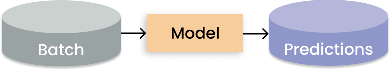

.. _ref-use-cases:

Ray Use Cases
=============

This page indexes common Ray use cases for scaling ML.
It contains highlighted references to blogs, examples, and tutorials also located
elsewhere in the Ray documentation.

.. _ref-use-cases-llm:

LLMs and Gen AI
---------------

Large language models (LLMs) and generative AI are rapidly changing industries, and demand compute at an astonishing pace. Ray provides a distributed compute framework for scaling these models, allowing developers to train and deploy models faster and more efficiently. With specialized libraries for data streaming, training, fine-tuning, hyperparameter tuning, and serving, Ray simplifies the process of developing and deploying large-scale AI models.

.. figure:: /images/llm-stack.png

Learn more about how Ray scales LLMs and generative AI with the following resources.

.. grid:: 1 2 3 4
    :gutter: 1
    :class-container: container pb-3

    .. grid-item-card::
        :img-top: /images/ray_logo.png
        :class-img-top: pt-2 w-75 d-block mx-auto fixed-height-img

        .. button-link:: https://www.anyscale.com/blog/ray-common-production-challenges-for-generative-ai-infrastructure

            [Blog] How Ray solves common production challenges for generative AI infrastructure

    .. grid-item-card::
        :img-top: /images/ray_logo.png
        :class-img-top: pt-2 w-75 d-block mx-auto fixed-height-img

        .. button-link:: https://www.anyscale.com/blog/training-175b-parameter-language-models-at-1000-gpu-scale-with-alpa-and-ray

            [Blog] Training 175B Parameter Language Models at 1000 GPU scale with Alpa and Ray

    .. grid-item-card::
        :img-top: /images/ray_logo.png
        :class-img-top: pt-2 w-75 d-block mx-auto fixed-height-img

        .. button-link:: https://www.anyscale.com/blog/faster-stable-diffusion-fine-tuning-with-ray-air

            [Blog] Faster stable diffusion fine-tuning with Ray AIR

    .. grid-item-card::
        :img-top: /images/ray_logo.png
        :class-img-top: pt-2 w-75 d-block mx-auto fixed-height-img

        .. button-link:: https://www.anyscale.com/blog/how-to-fine-tune-and-serve-llms-simply-quickly-and-cost-effectively-using

            [Blog] How to fine tune and serve LLMs simply, quickly and cost effectively using Ray + DeepSpeed + HuggingFace

    .. grid-item-card::
        :img-top: /images/ray_logo.png
        :class-img-top: pt-2 w-75 d-block mx-auto fixed-height-img

        .. button-link:: https://www.businessinsider.com/openai-chatgpt-trained-on-anyscale-ray-generative-lifelike-ai-models-2022-12

            [Blog] How OpenAI Uses Ray to Train Tools like ChatGPT

    .. grid-item-card::
        :img-top: /images/ray_logo.png
        :class-img-top: pt-2 w-75 d-block mx-auto fixed-height-img

        .. button-ref:: /ray-air/examples/gptj_deepspeed_fine_tuning

            [Example] GPT-J-6B Fine-Tuning with Ray AIR and DeepSpeed

    .. grid-item-card::
        :img-top: /images/ray_logo.png
        :class-img-top: pt-2 w-75 d-block mx-auto fixed-height-img

        .. button-ref:: /ray-air/examples/dreambooth_finetuning

            [Example] Fine-tuning DreamBooth with Ray AIR

    .. grid-item-card::
        :img-top: /images/ray_logo.png
        :class-img-top: pt-2 w-75 d-block mx-auto fixed-height-img

        .. button-ref:: /ray-air/examples/stablediffusion_batch_prediction

            [Example] Stable Diffusion Batch Prediction with Ray AIR

    .. grid-item-card::
        :img-top: /images/ray_logo.png
        :class-img-top: pt-2 w-75 d-block mx-auto fixed-height-img

        .. button-ref:: /ray-air/examples/gptj_serving

            [Example] GPT-J-6B Serving with Ray AIR

.. _ref-use-cases-batch-infer:

Batch Inference
---------------

Batch inference is the process of generating model predictions on a large "batch" of input data.
Ray for batch inference works with any cloud provider and ML framework,
and is fast and cheap for modern deep learning applications.
It scales from single machines to large clusters with minimal code changes.
As a Python-first framework, you can easily express and interactively develop your inference workloads in Ray.
To learn more about running batch inference with Ray, see the :ref:`batch inference guide<batch_inference_home>`.

.. grid:: 1 2 3 4
    :gutter: 1
    :class-container: container pb-3

    .. grid-item-card::
        :img-top: /images/ray_logo.png
        :class-img-top: pt-2 w-75 d-block mx-auto fixed-height-img

        .. button-link:: https://github.com/ray-project/ray-educational-materials/blob/main/Computer_vision_workloads/Semantic_segmentation/Scaling_batch_inference.ipynb

            [Tutorial] Architectures for Scalable Batch Inference with Ray

    .. grid-item-card::
        :img-top: /images/ray_logo.png
        :class-img-top: pt-2 w-75 d-block mx-auto fixed-height-img

        .. button-link:: https://www.anyscale.com/blog/model-batch-inference-in-ray-actors-actorpool-and-datasets

            [Blog] Batch Inference in Ray: Actors, ActorPool, and Datasets

    .. grid-item-card::
        :img-top: /images/ray_logo.png
        :class-img-top: pt-2 w-75 d-block mx-auto fixed-height-img

        .. button-ref:: /ray-core/examples/batch_prediction

            [Example] Batch Prediction using Ray Core

    .. grid-item-card::
        :img-top: /images/ray_logo.png
        :class-img-top: pt-2 w-75 d-block mx-auto fixed-height-img

        .. button-ref:: /data/examples/nyc_taxi_basic_processing

            [Example] Batch Inference on NYC taxi data using Ray Data

    .. grid-item-card::
        :img-top: /images/ray_logo.png
        :class-img-top: pt-2 w-75 d-block mx-auto fixed-height-img

        .. button-ref:: /data/examples/ocr_example

            [Example] Batch OCR processing using Ray Data

.. _ref-use-cases-mmt:

Many Model Training
-------------------

Many model training is common in ML use cases such as time series forecasting, which require fitting of models on multiple data batches corresponding to locations, products, etc.
The focus is on training many models on subsets of a dataset. This is in contrast to training a single model on the entire dataset.

When any given model you want to train can fit on a single GPU, Ray can assign each training run to a separate Ray Task. In this way, all available workers are utilized to run independent remote training rather than one worker running jobs sequentially.

.. figure:: /images/training_small_models.png

  Data parallelism pattern for distributed training on large datasets.

How do I do many model training on Ray?
~~~~~~~~~~~~~~~~~~~~~~~~~~~~~~~~~~~~~~~

To train multiple independent models, use the Ray Tune (:ref:`Tutorial <mmt-tune>`) library. This is the recommended library for most cases.

You can use Tune with your current data preprocessing pipeline if your data source fits into the memory of a single machine (node).
If you need to scale your data, or you want to plan for future scaling, use the :ref:`Ray Data <data>` library.
Your data must be a :ref:`supported format <input-output>`, to use Ray Data.

Alternative solutions exist for less common cases:

#. If your data is not in a supported format, use Ray Core (:ref:`Tutorial <mmt-core>`) for custom applications. This is an advanced option and requires and understanding of :ref:`design patterns and anti-patterns <core-patterns>`.
#. If you have a large preprocessing pipeline, you can use the Ray Data library to train multiple models (:ref:`Tutorial <mmt-datasets>`).

Learn more about many model training with the following resources.

.. grid:: 1 2 3 4
    :gutter: 1
    :class-container: container pb-3

    .. grid-item-card::
        :img-top: /images/ray_logo.png
        :class-img-top: pt-2 w-75 d-block mx-auto fixed-height-img

        .. button-link:: https://www.anyscale.com/blog/training-one-million-machine-learning-models-in-record-time-with-ray

            [Blog] Training One Million ML Models in Record Time with Ray

    .. grid-item-card::
        :img-top: /images/ray_logo.png
        :class-img-top: pt-2 w-75 d-block mx-auto fixed-height-img

        .. button-link:: https://www.anyscale.com/blog/many-models-batch-training-at-scale-with-ray-core

            [Blog] Many Models Batch Training at Scale with Ray Core

    .. grid-item-card::
        :img-top: /images/ray_logo.png
        :class-img-top: pt-2 w-75 d-block mx-auto fixed-height-img

        .. button-ref:: /ray-core/examples/batch_training

            [Example] Batch Training with Ray Core

    .. grid-item-card::
        :img-top: /images/ray_logo.png
        :class-img-top: pt-2 w-75 d-block mx-auto fixed-height-img

        .. button-ref:: /data/examples/batch_training

            [Example] Batch Training with Ray Data

    .. grid-item-card::
        :img-top: /images/tune.png
        :class-img-top: pt-2 w-75 d-block mx-auto fixed-height-img

        .. button-ref:: /tune/tutorials/tune-run

            [Guide] Tune Basic Parallel Experiments

    .. grid-item-card::
        :img-top:  /images/tune.png
        :class-img-top: pt-2 w-75 d-block mx-auto fixed-height-img

        .. button-ref:: /ray-air/examples/batch_tuning

            [Example] Batch Training and Tuning using Ray Tune

    .. grid-item-card::
        :img-top: /images/carrot.png
        :class-img-top: pt-2 w-75 d-block mx-auto fixed-height-img

        .. button-link:: https://www.youtube.com/watch?v=3t26ucTy0Rs

            [Talk] Scaling Instacart fulfillment ML on Ray

Model Serving
-------------

:ref:`Ray Serve <rayserve>` is well suited for model composition, enabling you to build a complex inference service consisting of multiple ML models and business logic all in Python code.

It supports complex `model deployment patterns <https://www.youtube.com/watch?v=mM4hJLelzSw>`_ requiring the orchestration of multiple Ray actors, where different actors provide inference for different models. Serve handles both batch and online inference and can scale to thousands of models in production.

.. figure:: /images/multi_model_serve.png

  Deployment patterns with Ray Serve. (Click image to enlarge.)

Learn more about model serving with the following resources.

.. grid:: 1 2 3 4
    :gutter: 1
    :class-container: container pb-3

    .. grid-item-card::
        :img-top: /images/serve.svg
        :class-img-top: pt-2 w-75 d-block mx-auto fixed-height-img

        .. button-link:: https://www.youtube.com/watch?v=UtH-CMpmxvI

            [Talk] Productionizing ML at Scale with Ray Serve

    .. grid-item-card::
        :img-top: /images/serve.svg
        :class-img-top: pt-2 w-75 d-block mx-auto fixed-height-img

        .. button-link:: https://www.anyscale.com/blog/simplify-your-mlops-with-ray-and-ray-serve

            [Blog] Simplify your MLOps with Ray & Ray Serve

    .. grid-item-card::
        :img-top: /images/serve.svg
        :class-img-top: pt-2 w-75 d-block mx-auto fixed-height-img

        .. button-ref:: /serve/getting_started

            [Guide] Getting Started with Ray Serve

    .. grid-item-card::
        :img-top: /images/serve.svg
        :class-img-top: pt-2 w-75 d-block mx-auto fixed-height-img

        .. button-ref:: /serve/model_composition

            [Guide] Model Composition in Serve

    .. grid-item-card::
        :img-top: /images/grid.png
        :class-img-top: pt-2 w-75 d-block mx-auto fixed-height-img

        .. button-ref:: /serve/tutorials/index

            [Gallery] Serve Examples Gallery

    .. grid-item-card::
        :img-top: /images/grid.png
        :class-img-top: pt-2 w-75 d-block mx-auto fixed-height-img

        .. button-link:: https://www.anyscale.com/blog?tag=ray_serve

            [Gallery] More Serve Use Cases on the Blog

Hyperparameter Tuning
---------------------

The :ref:`Ray Tune <tune-main>` library enables any parallel Ray workload to be run under a hyperparameter tuning algorithm.

Running multiple hyperparameter tuning experiments is a pattern apt for distributed computing because each experiment is independent of one another. Ray Tune handles the hard bit of distributing hyperparameter optimization and makes available key features such as checkpointing the best result, optimizing scheduling, and specifying search patterns.

.. figure:: /images/tuning_use_case.png

   Distributed tuning with distributed training per trial.

Learn more about the Tune library with the following talks and user guides.

.. grid:: 1 2 3 4
    :gutter: 1
    :class-container: container pb-3

    .. grid-item-card::
        :img-top: /images/tune.png
        :class-img-top: pt-2 w-75 d-block mx-auto fixed-height-img

        .. button-ref:: /tune/getting-started

            [Guide] Getting Started with Ray Tune

    .. grid-item-card::
        :img-top: /images/tune.png
        :class-img-top: pt-2 w-75 d-block mx-auto fixed-height-img

        .. button-link:: https://www.anyscale.com/blog/how-to-distribute-hyperparameter-tuning-using-ray-tune

            [Blog] How to distribute hyperparameter tuning with Ray Tune

    .. grid-item-card::
        :img-top: /images/tune.png
        :class-img-top: pt-2 w-75 d-block mx-auto fixed-height-img

        .. button-link:: https://www.youtube.com/watch?v=KgYZtlbFYXE

            [Talk] Simple Distributed Hyperparameter Optimization

    .. grid-item-card::
        :img-top: /images/tune.png
        :class-img-top: pt-2 w-75 d-block mx-auto fixed-height-img

        .. button-link:: https://www.anyscale.com/blog/hyperparameter-search-hugging-face-transformers-ray-tune

            [Blog] Hyperparameter Search with 🤗 Transformers

    .. grid-item-card::
        :img-top: /images/grid.png
        :class-img-top: pt-2 w-75 d-block mx-auto fixed-height-img

        .. button-ref:: /tune/examples/index

            [Gallery] Ray Tune Examples Gallery

    .. grid-item-card::
        :img-top: /images/grid.png
        :class-img-top: pt-2 w-75 d-block mx-auto fixed-height-img

        .. button-link:: https://www.anyscale.com/blog?tag=ray-tune

            More Tune use cases on the Blog

Distributed Training
--------------------

The :ref:`Ray Train <train-userguides>` library integrates many distributed training frameworks under a simple Trainer API,
providing distributed orchestration and management capabilities out of the box.

In contrast to training many models, model parallelism partitions a large model across many machines for training. Ray Train has built-in abstractions for distributing shards of models and running training in parallel.

.. figure:: /images/model_parallelism.png

  Model parallelism pattern for distributed large model training.

Learn more about the Train library with the following talks and user guides.

.. grid:: 1 2 3 4
    :gutter: 1
    :class-container: container pb-3

    .. grid-item-card::
        :img-top: /images/ray_logo.png
        :class-img-top: pt-2 w-75 d-block mx-auto fixed-height-img

        .. button-link:: https://www.youtube.com/watch?v=e-A93QftCfc

            [Talk] Ray Train, PyTorch, TorchX, and distributed deep learning

    .. grid-item-card::
        :img-top: /images/uber.png
        :class-img-top: pt-2 w-75 d-block mx-auto fixed-height-img

        .. button-link:: https://www.uber.com/blog/elastic-xgboost-ray/

            [Blog] Elastic Distributed Training with XGBoost on Ray

    .. grid-item-card::
        :img-top: /images/ray_logo.png
        :class-img-top: pt-2 w-75 d-block mx-auto fixed-height-img

        .. button-ref:: /train/train

            [Guide] Getting Started with Ray Train

    .. grid-item-card::
        :img-top: /images/ray_logo.png
        :class-img-top: pt-2 w-75 d-block mx-auto fixed-height-img

        .. button-ref:: /ray-air/examples/huggingface_text_classification

            [Example] Fine-tune a 🤗 Transformers model

    .. grid-item-card::
        :img-top: /images/grid.png
        :class-img-top: pt-2 w-75 d-block mx-auto fixed-height-img

        .. button-ref:: /train/examples

            [Gallery] Ray Train Examples Gallery

    .. grid-item-card::
        :img-top: /images/grid.png
        :class-img-top: pt-2 w-75 d-block mx-auto fixed-height-img

        .. button-link:: https://www.anyscale.com/blog?tag=ray_train

            [Gallery] More Train Use Cases on the Blog

Reinforcement Learning
----------------------

RLlib is an open-source library for reinforcement learning (RL), offering support for production-level, highly distributed RL workloads while maintaining unified and simple APIs for a large variety of industry applications. RLlib is used by industry leaders in many different verticals, such as climate control, industrial control, manufacturing and logistics, finance, gaming, automobile, robotics, boat design, and many others.

.. figure:: /images/rllib_use_case.png

   Decentralized distributed proximal polixy optimiation (DD-PPO) architecture.

Learn more about reinforcement learning with the following resources.

.. grid:: 1 2 3 4
    :gutter: 1
    :class-container: container pb-3

    .. grid-item-card::
        :img-top: /rllib/images/rllib-logo.png
        :class-img-top: pt-2 w-75 d-block mx-auto fixed-height-img

        .. button-link:: https://applied-rl-course.netlify.app/

            [Course] Applied Reinforcement Learning with RLlib

    .. grid-item-card::
        :img-top: /rllib/images/rllib-logo.png
        :class-img-top: pt-2 w-75 d-block mx-auto fixed-height-img

        .. button-link:: https://medium.com/distributed-computing-with-ray/intro-to-rllib-example-environments-3a113f532c70

            [Blog] Intro to RLlib: Example Environments

    .. grid-item-card::
        :img-top: /rllib/images/rllib-logo.png
        :class-img-top: pt-2 w-75 d-block mx-auto fixed-height-img

        .. button-ref:: /rllib/rllib-training

            [Guide] Getting Started with RLlib

    .. grid-item-card::
        :img-top: /images/riot.png
        :class-img-top: pt-2 w-75 d-block mx-auto fixed-height-img

        .. button-link:: https://www.anyscale.com/events/2022/03/29/deep-reinforcement-learning-at-riot-games

            [Talk] Deep reinforcement learning at Riot Games

    .. grid-item-card::
        :img-top: /images/grid.png
        :class-img-top: pt-2 w-75 d-block mx-auto fixed-height-img

        .. button-ref:: /rllib/rllib-examples

            [Gallery] RLlib Examples Gallery

    .. grid-item-card::
        :img-top: /images/grid.png
        :class-img-top: pt-2 w-75 d-block mx-auto fixed-height-img

        .. button-link:: https://www.anyscale.com/blog?tag=rllib

            [Gallery] More RL Use Cases on the Blog

ML Platform
-----------

`Merlin <https://shopify.engineering/merlin-shopify-machine-learning-platform>`_ is Shopify's ML platform built on Ray. It enables fast-iteration and `scaling of distributed applications <https://www.youtube.com/watch?v=kbvzvdKH7bc>`_ such as product categorization and recommendations.

.. figure:: /images/shopify-workload.png

  Shopify's Merlin architecture built on Ray.

Spotify `uses Ray for advanced applications <https://www.anyscale.com/ray-summit-2022/agenda/sessions/180>`_ that include personalizing content recommendations for home podcasts, and personalizing Spotify Radio track sequencing.

.. figure:: /images/spotify.png

  How Ray ecosystem empowers ML scientists and engineers at Spotify.

The following highlights feature companies leveraging Ray's unified API to build simpler, more flexible ML platforms.

.. grid:: 1 2 3 4
    :gutter: 1
    :class-container: container pb-3

    .. grid-item-card::
        :img-top: /images/shopify.png
        :class-img-top: pt-2 w-75 d-block mx-auto fixed-height-img

        .. button-link:: https://shopify.engineering/merlin-shopify-machine-learning-platform

            [Blog] The Magic of Merlin - Shopify's New ML Platform

    .. grid-item-card::
        :img-top: /images/uber.png
        :class-img-top: pt-2 w-75 d-block mx-auto fixed-height-img

        .. button-link:: https://drive.google.com/file/d/1BS5lfXfuG5bnI8UM6FdUrR7CiSuWqdLn/view

            [Slides] Large Scale Deep Learning Training and Tuning with Ray

    .. grid-item-card::
        :img-top: /images/carrot.png
        :class-img-top: pt-2 w-75 d-block mx-auto fixed-height-img

        .. button-link:: https://www.instacart.com/company/how-its-made/griffin-how-instacarts-ml-platform-tripled-ml-applications-in-a-year/

            [Blog] Griffin: How Instacart’s ML Platform Tripled in a year

    .. grid-item-card::
        :img-top: /images/predibase.png
        :class-img-top: pt-2 w-75 d-block mx-auto fixed-height-img

        .. button-link:: https://www.youtube.com/watch?v=B5v9B5VSI7Q

            [Talk] Predibase - A low-code deep learning platform built for scale

    .. grid-item-card::
        :img-top: /images/gke.png
        :class-img-top: pt-2 w-75 d-block mx-auto fixed-height-img

        .. button-link:: https://cloud.google.com/blog/products/ai-machine-learning/build-a-ml-platform-with-kubeflow-and-ray-on-gke

            [Blog] Building a ML Platform with Kubeflow and Ray on GKE

    .. grid-item-card::
        :img-top: /images/ray_logo.png
        :class-img-top: pt-2 w-75 d-block mx-auto fixed-height-img

        .. button-link:: https://www.youtube.com/watch?v=_L0lsShbKaY

            [Talk] Ray Summit Panel - ML Platform on Ray

End-to-End ML Workflows
-----------------------

The following highlights examples utilizing Ray AIR to implement end-to-end ML workflows.

.. grid:: 1 2 3 4
    :gutter: 1
    :class-container: container pb-3

    .. grid-item-card::
        :img-top: /images/text-classification.png
        :class-img-top: pt-2 w-75 d-block mx-auto fixed-height-img

        .. button-ref:: /ray-air/examples/huggingface_text_classification

            [Example] Text classification with Ray

    .. grid-item-card::
        :img-top: /images/image-classification.webp
        :class-img-top: pt-2 w-75 d-block mx-auto fixed-height-img

        .. button-ref:: /ray-air/examples/torch_image_example

            [Example] Image classification with Ray

    .. grid-item-card::
        :img-top: /images/detection.jpeg
        :class-img-top: pt-2 w-75 d-block mx-auto fixed-height-img

        .. button-ref:: /ray-air/examples/torch_detection

            [Example] Object detection with Ray

    .. grid-item-card::
        :img-top: /images/credit.png
        :class-img-top: pt-2 w-75 d-block mx-auto fixed-height-img

        .. button-ref:: /ray-air/examples/feast_example

            [Example] Credit scoring with Ray and Feast

    .. grid-item-card::
        :img-top: /images/tabular-data.png
        :class-img-top: pt-2 w-75 d-block mx-auto fixed-height-img

        .. button-ref:: /ray-air/examples/xgboost_example

            [Example] Machine learning on tabular data

    .. grid-item-card::
        :img-top: /images/timeseries.png
        :class-img-top: pt-2 w-75 d-block mx-auto fixed-height-img

        .. button-ref:: /ray-core/examples/automl_for_time_series

            [Example] AutoML for Time Series with Ray

    .. grid-item-card::
        :img-top: /images/grid.png
        :class-img-top: pt-2 w-75 d-block mx-auto fixed-height-img

        .. button-ref:: /ray-air/examples/index

            [Gallery] Full Ray AIR Examples Gallery

Large Scale Workload Orchestration
----------------------------------

The following highlights feature projects leveraging Ray Core's distributed APIs to simplify the orchestration of large scale workloads.

.. grid:: 1 2 3 4
    :gutter: 1
    :class-container: container pb-3

    .. grid-item-card::
        :img-top: /images/ray_logo.png
        :class-img-top: pt-2 w-75 d-block mx-auto fixed-height-img

        .. button-link:: https://www.anyscale.com/blog/building-highly-available-and-scalable-online-applications-on-ray-at-ant

            [Blog] Highly Available and Scalable Online Applications on Ray at Ant Group

    .. grid-item-card::
        :img-top: /images/ray_logo.png
        :class-img-top: pt-2 w-75 d-block mx-auto fixed-height-img

        .. button-link:: https://www.anyscale.com/blog/ray-forward-2022

            [Blog] Ray Forward 2022 Conference: Hyper-scale Ray Application Use Cases

    .. grid-item-card::
        :img-top: /images/ray_logo.png
        :class-img-top: pt-2 w-75 d-block mx-auto fixed-height-img

        .. button-link:: https://www.anyscale.com/blog/ray-breaks-the-usd1-tb-barrier-as-the-worlds-most-cost-efficient-sorting

            [Blog] A new world record on the CloudSort benchmark using Ray

    .. grid-item-card::
        :img-top: /images/ray_logo.png
        :class-img-top: pt-2 w-75 d-block mx-auto fixed-height-img

        .. button-ref:: /ray-core/examples/web-crawler

            [Example] Speed up your web crawler by parallelizing it with Ray
