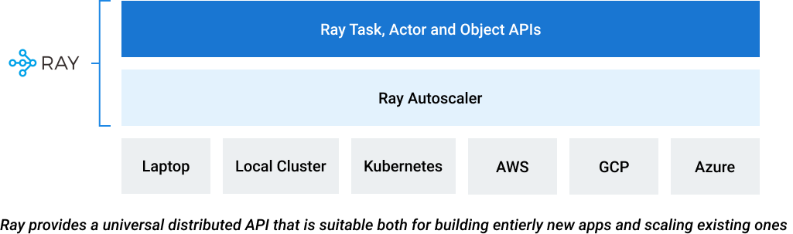

# Overview

Today’s machine learning workloads like deep learning and hyperparameter tuning are compute-intensive. They require distributed or parallel 
execution at scale. As more and more vertical industries incorporate the state-of-the-art (SOTA) ML applications, the current compute-strata 
does not meet applications’ demands. And these ML applications need more and more data for training, demanding further need of distributed 
data at low latency and high throughput. 

Therefore, the choice is nothing but to distribute compute at a massive scale to meet these applications’ compute and IO demands. In other words, 
your computing demands are elastic: they scale from a single node or laptop to a massive parallel compute and data infrastructure.

Ray makes it easy to parallelize single machine code — go from a single CPU to multi-core, multi-GPU, or multi-node with minimal code changes.

## What and Why Ray?

Ray is an open-source project developed at UC Berkeley RISE Lab. As a general-purpose and universal distributed compute framework, 
it allows any compute-intensive Python workload — from distributed training or hyperparameter tuning to deep learning training and production model serving.

It provides a set of distributed programming primitives—tasks, actors, and object—APIs in Python, C++, and Java to developers. 
The Ray autoscaler and the Ray runtime handle the scheduling, distributing, and fault-tolerance needs of your application. Although
most developers will use its Python API bindings, Python on its own is limited to a single threaded
programming model, because of the infamous global interpreter lock (GIL). It's limited in its capabilities in taking advantage of multiple
cores on the single machine. However, its `multiprocessing` modules comes to the rescue on a single host. But beyond a single node, you will need
a distributed framework like Ray.

With a rich set of ML libraries and integrations built on a flexible distributed execution framework, Ray makes distributed computing easy 
and accessible to every engineer. Because most popular ML libraries have Python bindings, data scientists and ML developers are attracted to Ray 
for three reasons.

First, writing distributed computing is easy and intuitive. You don’t have to understand all the communication and scheduling nuances and you 
don’t have to reason about it. With Ray’s simple primitives, you can take any Python function or class and convert it into its distributed 
setting: just add a decorator, and you are done. 

Ray’s distributed primitives APIs are simple, with all the complexity handled by Ray’s execution framework. The functions will be scheduled for
executing as stateless tasks, whereas the class will be a stateful remote service.

Second, most popular ML libraries have strong integrations with Ray, and Ray’s native libraries incorporate them. 
Composability is its strength. For example, you can use XGBBoost easily with Ray Train just as easily as you can use HuggingFace easily with 
Ray Serve. Or you can use PyTorch and TensorFlow just as easily with Ray Train. In short, it has a rich ecosystem of integrations with not 
only ML libraries but also other tools and frameworks.

And third, you can use your laptop, as most developers invariably do, for development. When you want to scale or extend it to a Ray cluster, 
you can easily do so with only a single line or no line change of code. 

`RAY_ADDRESS=ray://<cluster>:<port> python your_script.py`

## Is Ray For You?

### If you are building distributed applications
1. You want to take advantage of the PyData ecosystem with Ray’s capabilities for distributed computing.

### If you are building machine learning solutions
 1. You want to use the latest and greatest ML frameworks locally for development in an IDE or Jupyter notebook.
 2. You want to experiment and iterate over your machine learning models on your laptop with a small set of data and then scale it on a cluster, with multiple nodes and multiple cores of hardware accelerators, with no or as few lines of code as possible and not worry about library management and dependencies on the remote cluster.
 3. You want to build deep learning models, do distribute training with PyTorch or TensorFlow using their parallel distributed training algorithms and strategies.
 4. You want to conduct model inference at a massive scale with a large batch of data, and do it in a distributed fashion.
 5. You want to deploy your ML models at scale and adhere to the latest ML serving design patterns.
 6. You want to take advantage of the PyData ecosystem with Ray’s capabilities for distributed computing.

### If you are deploying Ray on your infrastructure
 1. You want to conduct model inference at a massive scale with a large batch of data, and do it in a distributed fashion.
 2. You want to deploy your ML models at scale and adhere to the latest ML serving design patterns.

All or a few of the above are good reasons why Ray is for you.

