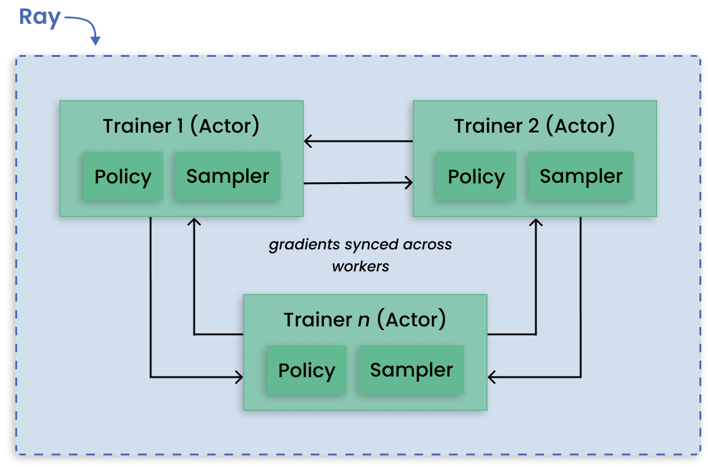

# What is Ray

<strong><a href="https://www.ray.io/" target="_blank">Ray</a></strong> is an open-source unified compute framework that makes it easy to scale AI and Python workloads. This guide gives a quick tour of Ray's features.

Ray provides the compute layer to scale applications without requiring distributed systems expertise. Ray automatically handles the following key processes:

* **Orchestration**--Managing the various components of a distributed system.
* **Scheduling**--Coordinating when and where tasks are executed.
* **Fault tolerance**--Ensuring tasks complete regardless of inevitable points of failure.
* **Auto-scaling**--Adjusting the number of resources allocated to dynamic demand.

To lower the effort needed to scale compute intensive workloads, Ray takes a Python-first approach and integrates with many common data science tools. ML practitioners can then parallelize Python applications from a laptop to a cluster with minimal code changes.

# Ray libraries

||
|:--|
|Stack of Ray libraries - unified toolkit for ML workloads.|

Ray's unified compute framework comprises of four layers:

1. **Ray cluster**--A set of worker nodes connected to a common Ray head node. Ray clusters can be fixed-size, or they can autoscale up and down according to the resources requested by applications running on the cluster.
1. **Ray Core**--An open-source, Python, general purpose, distributed computing library that enables ML engineers and Python developers to scale Python applications and accelerate machine learning workloads.
1. **Ray AI Runtime**--An open-source, Python, domain-specific set of libraries that equip ML engineers, data scientists, and researchers with a scalable and unified toolkit for ML applications.
1. **Integrations and ecosystem**--A common interface that unifies the most popular Python and machine learning libraries and frameworks to run ML tasks in a distributed way.

# Scaling common ML workloads

##  Parallel training of many models
When any given model you want to train can fit on a single GPU, Ray can assign each training run to a separate Ray Task. In this way, all available workers are utilized to run independent remote training rather than one worker running jobs sequentially.

||
|:--|
|Data parallelism pattern for distributed training on large datasets.|

## Distributed training of large models
In contrast to training many models, model parallelism partitions a large model across many machines for training. Ray Train has built-in abstractions for distributing shards of models and running training in parallel.

||
|:--|
|Model parallelism pattern for distributed large model training.|

## Managing parallel hyperparameter tuning experiments
Running multiple hyperparameter tuning experiments is a pattern apt for distributed computing because each experiment is independent of one another. Ray Tune handles the hard bit of distributing hyperparameter optimization and makes available key features such as checkpointing the best result, optimizing scheduling, and specifying search patterns.

||
|:--|
|Distributed tuning with distributed training per trial.|

## Reinforcement learning
Ray RLlib offers support for production-level, distributed reinforcement learning workloads while maintaining unified and simple APIs for a large variety of industry applications.

||
|:--|
|Decentralized distributed proximal polixy optimiation (DD-PPO) architecture, supported by Ray RLLib, where sampling and training are done on worker GPUs.|

## Batch inference on CPUs and GPUs
Performing inference on incoming batches of data can be parallelized by exporting the architecture and weights of a trained model to the shared object store. Using these model replicas, Ray scales predictions on batches across workers.

||
|:--|
|Using Ray AIR's `BatchPredictor` for batch inference.|

## ML platform

[Merlin](https://shopify.engineering/merlin-shopify-machine-learning-platform) is Shopify's ML platform built on Ray. It enables fast-iteration and [scaling of distributed applications](https://www.youtube.com/watch?v=kbvzvdKH7bc) such as product categorization and recommendations.

||
|:--|
|Merlin architecture built on Ray.|

Spotify [uses Ray for advanced applications](https://www.anyscale.com/ray-summit-2022/agenda/sessions/180) that include personalizing content recommendations for home podcasts, and personalizing Spotify Radio track sequencing.

||
|:--|
|How Ray ecosystem empowers ML scientists and engineers at Spotify.|

