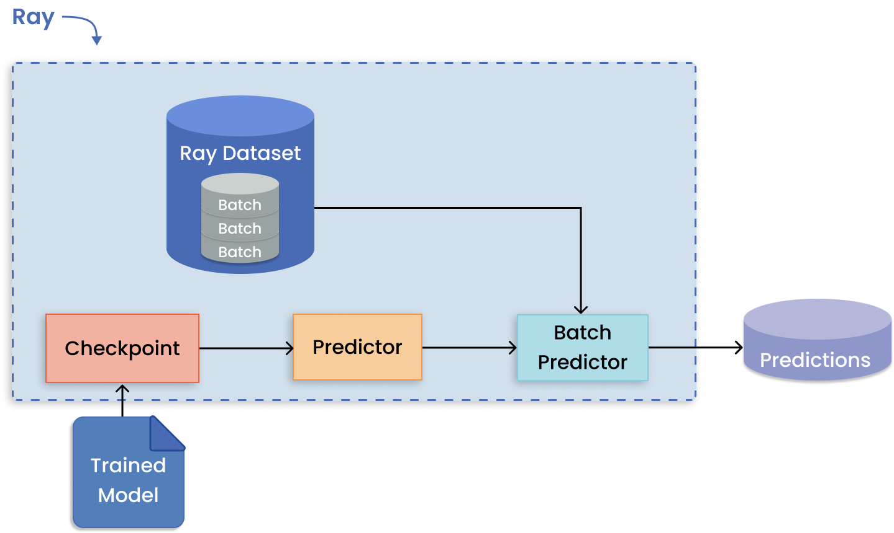

(overview-workloads)=

```{include} /_includes/overview/announcement.md
```

# ML workloads with Ray
Explore the ways that Ray helps to build AI applications.

## Batch inference on CPUs and GPUs
Performing inference on incoming batches of data can be parallelized by exporting the architecture and weights of a trained model to the shared object store. Using these model replicas, Ray AIR's [Batch Predictor](air-predictors) scales predictions on batches across workers.

||
|:--:|
|Using Ray AIR's `BatchPredictor` for batch inference.|

 See [batch inference examples](use-cases.html#batch-inference) for use cases.

## Model serving

[Ray Serve](../serve/index) supports complex [model deployment patterns](https://www.youtube.com/watch?v=mM4hJLelzSw) requiring the orchestration of multiple Ray actors, where different actors provide inference for different models. Serve handles both batch and online inference and can scale to thousands of models in production.

||
|:--:|
|Deployment patterns with Ray Serve. (Click image to enlarge.)|

See [model serving examples](use-cases.html#model-serving) for use cases.

##  Parallel training of many models
When any given model you want to train can fit on a single GPU, Ray can assign each training run to a separate Ray Task. In this way, all available workers are utilized to run independent remote training rather than one worker running jobs sequentially.

||
|:--:|
|Data parallelism pattern for distributed training on large datasets.|

 See [many model examples](use-cases.html#many-model-training) for use cases.

## Distributed training of large models
In contrast to training many models, model parallelism partitions a large model across many machines for training. [Ray Train](../train/user-guides) has built-in abstractions for distributing shards of models and running training in parallel.

||
|:--:|
|Model parallelism pattern for distributed large model training.|

 See [distributed training examples](use-cases.html#distributed-training) for use cases.

## Parallel hyperparameter tuning experiments
Running multiple hyperparameter tuning experiments is a pattern apt for distributed computing because each experiment is independent of one another. [Ray Tune](../tune/index) handles the hard bit of distributing hyperparameter optimization and makes available key features such as checkpointing the best result, optimizing scheduling, and specifying search patterns.

||
|:--:|
|Distributed tuning with distributed training per trial.|

 See [hyperparameter tuning examples](use-cases.html#hyperparameter-tuning) for use cases.

## Reinforcement learning
Ray RLlib offers support for production-level, distributed reinforcement learning workloads while maintaining unified and simple APIs for a large variety of industry applications.

||
|:--:|
|Decentralized distributed proximal polixy optimiation (DD-PPO) architecture.|

 See [reinforcement learning examples](use-cases.html#reinforcement-learning) for use cases.

## ML platform

[Merlin](https://shopify.engineering/merlin-shopify-machine-learning-platform) is Shopify's ML platform built on Ray. It enables fast-iteration and [scaling of distributed applications](https://www.youtube.com/watch?v=kbvzvdKH7bc) such as product categorization and recommendations.

||
|:--:|
|Shopify's Merlin architecture built on Ray.|

Spotify [uses Ray for advanced applications](https://www.anyscale.com/ray-summit-2022/agenda/sessions/180) that include personalizing content recommendations for home podcasts, and personalizing Spotify Radio track sequencing.

||
|:--:|
|How Ray ecosystem empowers ML scientists and engineers at Spotify.|

See [ML platform examples](use-cases.html#ml-platform) for use cases.

