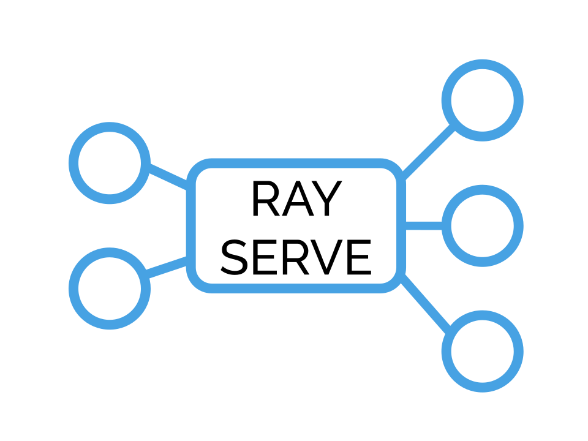

.. _rayserve:

RayServe: Scalable and Programmable Serving
===========================================

Overview
--------

RayServe is a scalable model-serving library built on Ray.

For users RayServe is:

- **Framework Agnostic**:Use the same toolkit to serve everything from deep learning models 
  built with frameworks like PyTorch or TensorFlow to scikit-learn models or arbitrary business logic.
- **Python First**: Configure your model serving with pure Python code - no more YAMLs or 
  JSON configs.

RayServe enables: 

-  **A/B test models** with zero downtime by decoupling routing logic from response handling logic.
- **Batching** built-in to help you meet your performance objectives.

Since Ray is built on Ray, RayServe also allows you to **scale to many machines**
and allows you to leverage all of the other Ray frameworks so you can deploy and scale on any cloud.

.. note:: 
  If you want to try out Serve, join our `community slack <https://forms.gle/9TSdDYUgxYs8SA9e8>`_ 
  and discuss in the #serve channel.

RayServe in 90 Seconds
~~~~~~~~~~~~~~~~~~~~~~

Serve a stateless function:

.. literalinclude:: ../../../python/ray/serve/examples/doc/quickstart_function.py

Serve a stateful class:

.. literalinclude:: ../../../python/ray/serve/examples/doc/quickstart_class.py

See :ref:`serve-key-concepts` for more information about working with RayServe.

Why RayServe?
~~~~~~~~~~~~~

There are generally two ways of serving machine learning applications, both with serious limitations:
you can build using a **traditional webserver** - your own Flask app or you can use a cloud hosted solution.

The first approach is easy to get started with, but it's hard to scale each component. The second approach
requires vendor lock-in (SageMaker), framework specific tooling (TFServing), and a general
lack of flexibility.

RayServe solves these problems by giving a user the ability to leverage the simplicity
of deployment of a simple webserver but handles the complex routing, scaling, and testing logic
necessary for production deployments.

For more on the motivation behind RayServe, check out these `meetup slides <https://tinyurl.com/serve-meetup>`_.

When should I use Ray Serve?
++++++++++++++++++++++++++++

RayServe should be used when you need to deploy at least one model, preferrably many models.  
RayServe **won't work well** when you need to run batch prediction over a dataset. Given this use case, we recommend looking into `multiprocessing with Ray </multiprocessing.html>`_.

.. _serve-key-concepts:

Key Concepts
------------

RayServe focuses on **simplicity** and only has two core concepts: endpoints and backends.

To follow along, you'll need to make the necessary imports.

.. code-block:: python

  from ray import serve
  serve.init() # initializes serve and Ray

Endpoints
~~~~~~~~~

Endpoints allow you to name the "entity" that you'll be exposing, 
the HTTP path that your application will expose. 
Endpoints are "logical" and decoupled from the business logic or 
model that you'll be serving. To create one, we'll simply specify the name, route, and methods.

.. code-block:: python

  serve.create_endpoint("simple_endpoint", "/simple")

You can also delete an endpoint using `serve.delete_endpoint`.
Note that this will not delete any associated backends, which can be reused for other endpoints.

.. code-block:: python

  serve.delete_endpoint("simple_endpoint")

.. _serve-backend:

Backends
~~~~~~~~

Backends are the logical structures for your business logic or models and 
how you specify what should happen when an endpoint is queried.
To define a backend, first you must define the "handler" or the business logic you'd like to respond with. 
The input to this request will be a `Flask Request object <https://flask.palletsprojects.com/en/1.1.x/api/?highlight=request#flask.Request>`_.
Once you define the function (or class) that will handle a request. 
You'd use a function when your response is stateless and a class when you
might need to maintain some state (like a model). 
For both functions and classes (that take as input Flask Requests), you'll need to 
define them as backends to RayServe.

It's important to note that RayServe places these backends in individual workers, which are replicas of the model.

.. code-block:: python
  
  def handle_request(flask_request):
    return "hello world"

  class RequestHandler:
    def __init__(self):
        self.msg = "hello, world!"

    def __call__(self, flask_request):
        return self.msg

  serve.create_backend("simple_backend", handle_request)
  serve.create_backend("simple_backend_class", RequestHandler)

Lastly, we need to link the particular backend to the server endpoint. 
To do that we'll use the ``link`` capability.
A link is essentially a load-balancer and allow you to define queuing policies 
for how you would like backends to be served via an endpoint.
For instance, you can route 50% of traffic to Model A and 50% of traffic to Model B.

.. code-block:: python

  serve.set_traffic("simple_backend", {"simple_endpoint": 1.0})

Once we've done that, we can now query our endpoint via HTTP (we use `requests` to make HTTP calls here).

.. code-block:: python
  
  import requests
  print(requests.get("http://127.0.0.1:8000/-/routes", timeout=0.5).text)

To delete a backend, we can use `serve.delete_backend`.
Note that the backend must not be use by any endpoints in order to be delete.
Once a backend is deleted, its tag can be reused.

.. code-block:: python

  serve.delete_backend("simple_backend")

Configuring Backends
~~~~~~~~~~~~~~~~~~~~

There are a number of things you'll likely want to do with your serving application including
scaling out, splitting traffic, or batching input for better response performance. To do all of this,
you will create a ``BackendConfig``, a configuration object that you'll use to set 
the properties of a particular backend.

Scaling Out
+++++++++++

To scale out a backend to multiple workers, simplify configure the number of replicas.

.. code-block:: python

  config = {"num_replicas": 2}
  serve.create_backend("my_scaled_endpoint_backend", handle_request, config=config)

This will scale out the number of workers that can accept requests.

Splitting Traffic
+++++++++++++++++

It's trivial to also split traffic, simply specify the endpoint and the backends that you want to split.

.. code-block:: python
  
  serve.create_endpoint("endpoint_identifier_split", "/split", methods=["GET", "POST"])

  # splitting traffic 70/30
  serve.set_traffic("endpoint_identifier_split", {"my_endpoint_backend": 0.7, "my_endpoint_backend_class": 0.3})

Batching
++++++++

You can also have RayServe batch requests for performance. You'll configure this in the backend config.

.. code-block:: python

  class BatchingExample:
      def __init__(self):
          self.count = 0

      @serve.accept_batch
      def __call__(self, flask_request):
          self.count += 1
          batch_size = serve.context.batch_size
          return [self.count] * batch_size

  serve.create_endpoint("counter1", "/increment")

  config = {"max_batch_size": 5}
  serve.create_backend("counter1", BatchingExample, config=config)
  serve.set_traffic("counter1", {"counter1": 1.0})

Other Resources
----------------

More coming soon!
