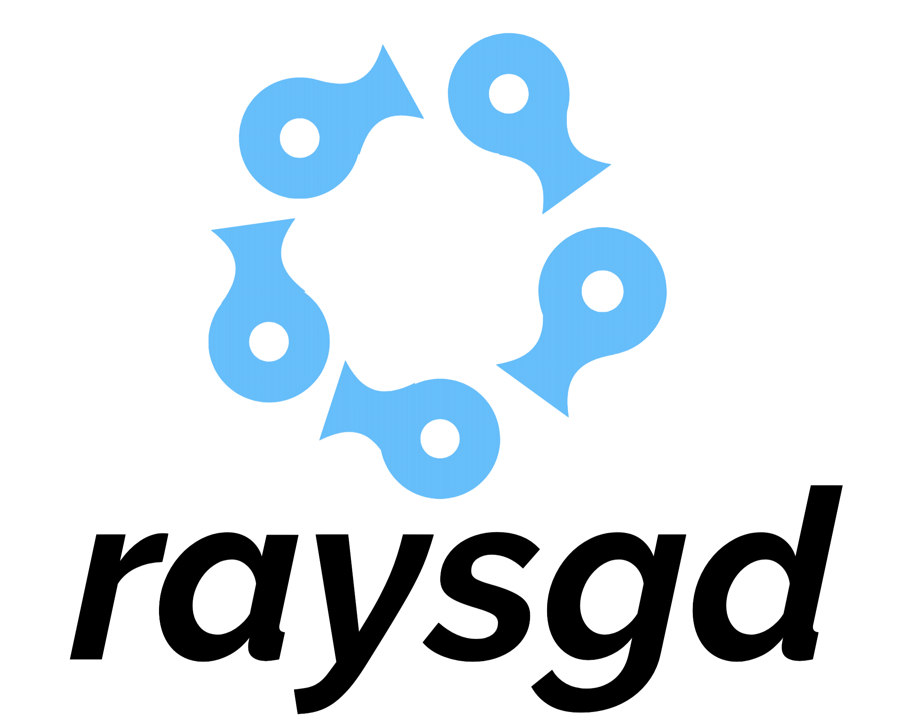

RaySGD: Distributed Deep Learning
=================================

.. tip:: Get in touch with us if you're using or considering using `RaySGD <https://forms.gle/26EMwdahdgm7Lscy9>`_!
.. warning:: This is still an experimental API and is subject to change in the near future.

RaySGD is a lightweight library for distributed deep learning, providing thin wrappers around PyTorch and TensorFlow native modules for data parallel training.

The main features are:

  - **Ease of use**: Scale Pytorch's native ``DistributedDataParallel`` and TensorFlow's ``tf.distribute.MirroredStrategy`` without needing to monitor individual nodes.
  - **Composability**: RaySGD is built on top of the Ray Actor API, enabling seamless integration with existing Ray applications such as RLlib, Tune, and Ray.Serve.
  - **Scale up and down**: Start on single CPU. Scale up to multi-node, multi-CPU, or multi-GPU clusters by changing 2 lines of code.

Getting Started
---------------

You can start a ``PyTorchTrainer`` with the following:

.. code-block:: python

    import numpy as np
    import torch
    import torch.nn as nn
    from torch import distributed

    from ray.experimental.sgd import PyTorchTrainer
    from ray.experimental.sgd.examples.train_example import LinearDataset

    def model_creator(config):
        return nn.Linear(1, 1)

    def optimizer_creator(model, config):
        """Returns optimizer."""
        return torch.optim.SGD(model.parameters(), lr=1e-2)

    def data_creator(batch_size, config):
        """Returns training dataloader, validation dataloader."""
        return LinearDataset(2, 5),  LinearDataset(2, 5, size=400)

    ray.init()

    trainer1 = PyTorchTrainer(
        model_creator,
        data_creator,
        optimizer_creator,
        loss_creator,
        num_replicas=2,
        use_gpu=True,
        batch_size=512,
        backend="nccl")

    stats = trainer1.train()
    print(stats)
    trainer1.shutdown()
    print("success!")
