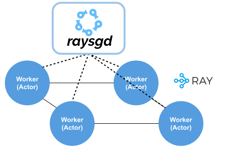

.. _torch-guide:

Distributed PyTorch
===================

.. warning:: This is an older version of Ray SGD. A newer, more light-weight version of Ray SGD (named Ray Train) is in alpha as of Ray 1.7.
         See the documentation :ref:`here <train-docs>`. To migrate from v1 to v2 you can follow the :ref:`migration guide <sgd-migration>`.

The RaySGD ``TorchTrainer`` simplifies distributed model training for PyTorch.

.. tip:: Get in touch with us if you're using or considering using `RaySGD <https://forms.gle/PXFcJmHwszCwQhqX7>`_!

The ``TorchTrainer`` is a wrapper around ``torch.distributed.launch`` with a Python API to easily incorporate distributed training into a larger Python application, as opposed to needing to wrap your training code in bash scripts.

For end to end examples leveraging RaySGD TorchTrainer, jump to :ref:`raysgd-torch-examples`.

.. contents:: :local:

Basic Usage
-----------

Setting up training
~~~~~~~~~~~~~~~~~~~

.. tip:: If you want to leverage multi-node data parallel training with PyTorch while using RayTune *without* using RaySGD, check out the :ref:`Tune PyTorch user guide <tune-pytorch-cifar-ref>` and Tune's  :ref:`distributed pytorch integrations <tune-ddp-doc>`.

The :ref:`ref-torch-trainer`  can be constructed from a custom :ref:`ref-torch-operator` subclass that defines training components like the model, data, optimizer, loss, and ``lr_scheduler``. These components are all automatically replicated across different machines and devices so that training can be executed in parallel.

.. warning:: You should call ``self.register(...)`` and ``self.register_data(...)`` inside the ``setup`` method of your custom ``TrainingOperator`` to register the necessary training components with Ray SGD.

.. literalinclude:: ../../../python/ray/util/sgd/torch/examples/raysgd_torch_signatures.py
    :language: python
    :start-after: __torch_operator_start__
    :end-before: __torch_operator_end__

Under the hood, ``TorchTrainer`` will create *replicas* of your model (controlled by ``num_workers``), each of which is managed by a Ray actor.

Before instantiating the trainer, first start or connect to a Ray cluster:

.. literalinclude:: ../../../python/ray/util/sgd/torch/examples/raysgd_torch_signatures.py
   :language: python
   :start-after: __torch_ray_start__
   :end-before: __torch_ray_end__

And then you can instantiate the trainer object using your custom ``TrainingOperator``:

.. literalinclude:: ../../../python/ray/util/sgd/torch/examples/raysgd_torch_signatures.py
   :language: python
   :start-after: __torch_trainer_start__
   :end-before: __torch_trainer_end__

You can also set the number of workers and whether the workers will use GPUs:

.. code-block:: python
    :emphasize-lines: 4,5

    trainer = TorchTrainer(
        training_operator_cls=MyTrainingOperator,
        config={"lr": 0.001},
        num_workers=100,
        use_gpu=True)

Executing Training
~~~~~~~~~~~~~~~~~~
Now that the trainer is constructed, here's how to train the model.

.. code-block:: python

    for i in range(10):
        metrics = trainer.train()
        val_metrics = trainer.validate()

Each ``train`` call makes one pass over the training data (trains on 1 epoch), and each ``validate`` call runs the model on the validation data.
Override training and validation methods in your Training Operator (:ref:`raysgd-custom-training`) to calculate custom metrics or customize the training/validation process.

.. tip:: Setting the batch size: Using a provided ``ray.util.sgd.utils.BATCH_SIZE`` variable, you can provide a global batch size that will be divided among all workers automatically.

.. code-block:: python

    from torch.utils.data import DataLoader
    from ray.util.sgd.utils import BATCH_SIZE

    class MyTrainingOperator(TrainingOperator):
        def setup(self, config):
            ...
            # Create data loaders.
            # config[BATCH_SIZE] == provided BATCH_SIZE // num_workers
            train_dataset, val_dataset = LinearDataset(2, 5), LinearDataset(2, 5)
            train_loader = DataLoader(train_dataset, batch_size=config[BATCH_SIZE])
            val_loader = DataLoader(val_dataset, batch_size=config[BATCH_SIZE])
            ...
    trainer = TorchTrainer(
        training_operator_cls=MyTrainingOperator,
        config={BATCH_SIZE: 1024},
        num_workers=128
    )

    # Each worker will process 1024 // 128 samples per batch
    stats = Trainer.train()

You can also obtain profiling information:

.. code-block:: python

    >>> from ray.tune.logger import pretty_print
    >>> print(pretty_print(trainer.train(profile=True)))

    batch_count: 16
    epoch: 1
    last_train_loss: 0.15574650466442108
    mean_train_loss: 7.475177114367485
    num_samples: 1000
    profile:
      mean_apply_s: 2.639293670654297e-05
      mean_fwd_s: 0.00012960433959960938
      mean_grad_s: 0.00016553401947021483
      train_epoch_s: 0.023712158203125

After training, you may want to reappropriate the Ray cluster. To release Ray resources obtained by the Trainer:

.. code-block:: python

    trainer.shutdown()

.. note:: Be sure to call ``trainer.save()`` or ``trainer.get_model()`` before shutting down.

See the documentation on the TorchTrainer here: :ref:`ref-torch-trainer`.

See the documentation on the TrainingOperator here: :ref:`ref-torch-operator`.

.. _raysgd-custom-training:

Custom Training and Validation
~~~~~~~~~~~~~~~~~~~~~~~~~~~~~~

If you would like to implement custom training and validation logic, you can do so by overriding the appropiate methods inside your :ref:`ref-torch-operator` subclass.

For both training and validation, there are two granularities that you can provide customization - per epoch and per batch. These correspond to ``train_batch``,
``train_epoch``, ``validate``, and ``validate_batch``. Other useful methods to override include ``state_dict`` and ``load_state_dict``. You can use these
to save and load additional state for your custom ``TrainingOperator``.

Custom training is necessary if you are using multiple models, optimizers, or schedulers.

Below is a partial example of a custom ``TrainingOperator`` that provides a ``train_batch`` implementation for a Deep Convolutional GAN.

.. code-block:: python

    import torch
    from ray.util.sgd.torch import TrainingOperator

    class GANOperator(TrainingOperator):
        def setup(self, config):
            """Setup for this operator.

            This is where you define the training state and register it with Ray SGD.

            Args:
                config (dict): Custom configuration value to be passed to
                    all creator and operator constructors. Same as ``self.config``.
            """
            ...
            self.models, self.optimizers, ... = self.register(...)
            self.register_data(...)

        def train_batch(self, batch, batch_info):
            """Trains on one batch of data from the data creator.

            Example taken from:
                https://github.com/eriklindernoren/PyTorch-GAN/blob/
                a163b82beff3d01688d8315a3fd39080400e7c01/implementations/dcgan/dcgan.py

            Args:
                batch: One item of the validation iterator.
                batch_info (dict): Information dict passed in from ``train_epoch``.

            Returns:
                A dict of metrics. Defaults to "loss" and "num_samples",
                    corresponding to the total number of datapoints in the batch.
            """
            Tensor = torch.cuda.FloatTensor if cuda else torch.FloatTensor
            discriminator, generator = self.models
            optimizer_D, optimizer_G = self.optimizers

            # Adversarial ground truths
            valid = Variable(Tensor(batch.shape[0], 1).fill_(1.0), requires_grad=False)
            fake = Variable(Tensor(batch.shape[0], 1).fill_(0.0), requires_grad=False)

            # Configure input
            real_imgs = Variable(batch.type(Tensor))

            # -----------------
            #  Train Generator
            # -----------------

            optimizer_G.zero_grad()

            # Sample noise as generator input
            z = Variable(Tensor(np.random.normal(0, 1, (
                    batch.shape[0], self.config["latent_dim"]))))

            # Generate a batch of images
            gen_imgs = generator(z)

            # Loss measures generator's ability to fool the discriminator
            g_loss = adversarial_loss(discriminator(gen_imgs), valid)

            g_loss.backward()
            optimizer_G.step()

            # ---------------------
            #  Train Discriminator
            # ---------------------

            optimizer_D.zero_grad()

            # Measure discriminator's ability to classify real from generated samples
            real_loss = adversarial_loss(discriminator(real_imgs), valid)
            fake_loss = adversarial_loss(discriminator(gen_imgs.detach()), fake)
            d_loss = (real_loss + fake_loss) / 2

            d_loss.backward()
            optimizer_D.step()

            return {
                "loss_g": g_loss.item(),
                "loss_d": d_loss.item(),
                "num_samples": imgs.shape[0]
            }

    trainer = TorchTrainer(
        training_operator_cls=GANOperator,
        num_workers=num_workers,
        config=config,
        use_gpu=True
    )

    for i in range(5):
        stats = trainer.train()
        print(stats)

See the `DCGAN example <https://github.com/ray-project/ray/blob/master/python/ray/util/sgd/torch/examples/dcgan.py>`__ for an end to end example. It constructs two models and two optimizers and uses a custom training operator to provide a non-standard training loop.

Custom DistributedDataParallel Wrappers
~~~~~~~~~~~~~~~~~~~~~~~~~~~~~~~~~~~~~~~

TorchTrainer automatically applies a DistributedDataParallel wrapper to your model.

.. code-block:: python

    DistributedDataParallel(model, device_ids=self.device_ids)

You can also pass in additional arguments to DistributedDataParallel by setting the `ddp_args` field in your `TrainingOperator`.

.. code-block:: python
    :emphasize-lines: 6

    from ray.util.sgd.torch import TrainingOperator

    class CustomOperator(TrainingOperator):
        def setup(self, config):
            ...
            self.model, ... = self.register(..., ddp_args={"find_unused_parameters": True})

If you want to use a custom wrapper for distributed training or if you want to wrap in DistributedDataParallel yourself, you can do so by setting ``TorchTrainer(wrap_ddp=False)``.

.. note:: Make sure to register the model before it is wrapped in DistributedDataParallel or a custom wrapper.

.. code-block:: python
    :emphasize-lines: 19

    from ray.util.sgd.torch import TrainingOperator

    class CustomOperator(TrainingOperator):
        def setup(self, config):
            ...
            self.model, ... = self.register(...)
            self.new_model = CustomDataParallel(self.model,
                                                 device_ids=self.device_ids)

        def train_batch(self, batch, batch_idx):
            output = self.new_model(batch)
            # calculate loss, etc
            return {"loss": loss}

    trainer = TorchTrainer(
        training_operator_cls=CustomOperator,
        num_workers=2,
        use_gpu=True
        wrap_ddp=False)

.. _backwards-compat:

Backwards Compatibility
~~~~~~~~~~~~~~~~~~~~~~~
In previous versions of Ray, *creator functions* (``model_creator``, ``optimizer_creator``, etc.) were necessary to setup the training components.
These creator functions are no longer used and instead training component setup should be specified inside the ``setup`` method of a ``TrainingOperator`` subclass.
However, if you have these creator functions already and do not want to change your code, you can easily use these creator functions to create a custom ``TrainingOperator``.

.. literalinclude:: ../../../python/ray/util/sgd/torch/examples/raysgd_torch_signatures.py
   :language: python
   :start-after: __backwards_compat_start__
   :end-before: __backwards_compat_end__

Initialization Functions
------------------------

Use the ``initialization_hook`` parameter to initialize state on each worker process when they are started. This is useful when setting an environment variable:

.. code-block:: python

    def initialization_hook():
        print("NCCL DEBUG SET")
        # Need this for avoiding a connection restart issue
        os.environ["NCCL_SOCKET_IFNAME"] = "^docker0,lo"
        os.environ["NCCL_LL_THRESHOLD"] = "0"
        os.environ["NCCL_DEBUG"] = "INFO"

    trainer = TorchTrainer(
        training_operator_cls=MyTrainingOperator,
        initialization_hook=initialization_hook,
        config={"lr": 0.001}
        num_workers=100,
        use_gpu=True)

Save and Load
-------------

If you want to save or reload the training procedure, you can use ``trainer.save``
and ``trainer.load``, which wraps the relevant ``torch.save`` and ``torch.load`` calls. This should work across a distributed cluster even without a NFS because it takes advantage of Ray's distributed object store.

.. tip:: Make sure to override the ``state_dict`` and ``load_state_dict`` methods in your custom TrainingOperator if necessary.

.. code-block:: python

    checkpoint_path = os.path.join(tempfile.mkdtemp(), "checkpoint")
    trainer_1.save(checkpoint_path)
    # You can only have 1 trainer alive at a time
    trainer_1.shutdown()

    trainer_2 = TorchTrainer(
        training_operator_cls=MyTrainingOperator,
        num_workers=num_workers)
    trainer_2.load(checkpoint_path)

Retrieving the model
--------------------

The trained torch model can be extracted for use within the same Python program with ``trainer.get_model()``. This will load the state dictionary of the model(s).

.. code-block:: python

    trainer.train()
    model = trainer.get_model()  # Returns multiple models if the model_creator does.

Training & Validation Results
-----------------------------
The output for ``trainer.train()`` and ``trainer.validate()`` are first collected on a per-batch basis. These results are then averaged: first across each batch in the epoch, and then across all workers.

By default, the output of ``train`` contains the following:

.. code-block:: python

    # Total number of samples trained on in this epoch.
    num_samples
    # Current training epoch.
    epoch
    # Number of batches trained on in this epoch averaged across all workers.
    batch_count
    # Training loss averaged across all batches on all workers.
    train_loss
    # Training loss for the last batch in epoch averaged across all workers.
    last_train_loss

And for ``validate``:

.. code-block:: python

    # Total number of samples validated on.
    num_samples
    # Number of batches validated on averaged across all workers.
    batch_count
    # Validation loss averaged across all batches on all workers.
    val_loss
    # Validation loss for last batch averaged across all workers.
    last_val_loss
    # Validation accuracy for last batch averaged across all workers.
    val_accuracy
    # Validation accuracy for last batch averaged across all workers.
    last_val_accuracy

If ``train`` or ``validate`` are run with ``reduce_results=False``, results are not averaged across workers and a list of results for each worker is returned.
If run with ``profile=True``, timing stats for a single worker is returned alongside the results above.

To add additional metrics to return you should implement your own custom training operator (:ref:`raysgd-custom-training`).
If overriding ``train_batch`` or ``validate_batch``, the result outputs are automatically averaged across all batches, and the results for the last batch are automatically returned.
If overriding ``train_epoch`` or ``validate`` you may find ``ray.util.sgd.utils.AverageMeterCollection`` (:ref:`ref-utils`) useful to handle this averaging.

Mixed Precision (FP16) Training
-------------------------------

You can enable mixed precision training for PyTorch with the ``use_fp16`` flag. This automatically converts the model(s) and optimizer(s) to train using mixed-precision.

.. code-block:: python
    :emphasize-lines: 4

    trainer = TorchTrainer(
        training_operator_cls=MyTrainingOperator,
        num_workers=4,
        use_fp16=True)

By default, `native mixed precision training <https://pytorch.org/docs/stable/amp.html>`_ will be used. This requires PyTorch>=1.6. If you are using an older version of PyTorch, you can alternatively use the ``Apex`` library. ``Apex`` is a Pytorch extension with NVIDIA-maintained utilities to streamline mixed precision and distributed training. It can be installed from `the NVIDIA/Apex repository <https://github.com/NVIDIA/apex#quick-start>`_.

When ``use_fp16=True`` and native mixed precision is not available, ``Apex`` will be used instead. If neither native support nor ``Apex`` are available, an exception will be raised.

``Apex`` can be forced to be used with ``use_fp16="apex"``.

When ``use_fp16=True``, you should not manually cast your model or data to ``.half()``.

**Native**:

The flag informs the Trainer to wrap model forward calls in ``torch.cuda.amp.autocast()`` and to scale the loss with ``torch.cuda.amp.GradScaler()``.

**Apex**:

The flag informs the Trainer to call ``amp.initialize`` on the created models and optimizers and optimize using the scaled loss: ``amp.scale_loss(loss, optimizer)``.

To specify particular parameters for ``amp.initialize``, you can use the ``apex_args`` field when calling `self.register` in your `TrainingOperator`. Valid arguments can be found in the `Apex documentation <https://nvidia.github.io/apex/amp.html#apex.amp.initialize>`_:

.. code-block:: python
    :emphasize-lines: 8-12

    class MyTrainingOperator(TrainingOperator):
        def setup(self, config):
            models = [...]
            optimizers = [...]
            model, optimizer = self.register(
                models=models,
                optimizers=optimizers,
                apex_args={
                    opt_level="03",
                    num_losses=2,
                    verbosity=0
                }
            )

    trainer = TorchTrainer(
        training_operator_cls=MyTrainingOperator,
        num_workers=4,
        use_fp16="apex"
    )

Note that if implementing custom training (:ref:`raysgd-custom-training`), you will need to manage loss scaling manually.

Distributed Multi-node Training
-------------------------------

You can scale your training to multiple nodes without making any modifications to your training code.

To train across a cluster, first make sure that the Ray cluster is started (see :ref:`cluster-index` for more details).

Then, in your program, you'll need to connect to this cluster via ``ray.init``:

.. code-block:: python

    ray.init(address="auto")  # or a specific Ray address of the form "ip-address:port"

After connecting, you can scale up the number of workers seamlessly across multiple nodes:

.. code-block:: python

    trainer = TorchTrainer(
        training_operator_cls=MyTrainingOperator,
        num_workers=100
    )
    trainer.train()
    model = trainer.get_model()

Advanced: Fault Tolerance
-------------------------

For distributed deep learning, jobs are often run on infrastructure where nodes can be pre-empted frequently (i.e., spot instances in the cloud). To overcome this, RaySGD provides **fault tolerance** features that enable training to continue regardless of node failures.

.. code-block:: python

    trainer.train(max_retries=N)

During each ``train`` method, each parallel worker iterates through the iterable, synchronizing gradients and parameters at each batch. These synchronization primitives can hang when one or more of the parallel workers becomes unresponsive (i.e., when a node is lost). To address this, we've implemented the following protocol.

  1. If any worker node is lost, Ray will mark the training task as complete (``ray.wait`` will return).
  2. Ray will throw ``RayActorException`` when fetching the result for any worker, so the Trainer class will call ``ray.get`` on the "finished" training task.
  3. Upon catching this exception, the Trainer class will kill all of its workers.
  4. The Trainer will then detect the quantity of available resources (either CPUs or GPUs). It will then restart as many workers as it can, each resuming from the last checkpoint. Note that this may result in fewer workers than initially specified.
  5. If there are no available resources, the Trainer will apply an exponential backoff before retrying to create workers.
  6. If there are available resources and the Trainer has fewer workers than initially specified, then it will scale up its worker pool until it reaches the initially specified ``num_workers``.

Note that we assume the Trainer itself is not on a pre-emptible node. To allow the entire Trainer to recover from failure, you must use Tune to execute the training.

Simultaneous Multi-model Training
---------------------------------

In certain scenarios, such as training GANs, you may want to use multiple models in the training loop. You can do this by registering multiple models, optimizers, or schedulers in the ``setup`` method of ``TrainingOperator``. You must implement custom training and validation (:ref:`raysgd-custom-training`) to train across multiple models.

You can see the `DCGAN script <https://github.com/ray-project/ray/blob/master/python/ray/util/sgd/torch/examples/dcgan.py>`_ for an end-to-end example.

.. code-block:: python

    from ray.util.sgd.torch import TorchTrainer, TrainingOperator

    def train(*, model=None, criterion=None, optimizer=None, dataloader=None):
        model.train()
        train_loss = 0
        correct = 0
        total = 0
        for batch_idx, (inputs, targets) in enumerate(dataloader):
            optimizer.zero_grad()
            outputs = model(inputs)
            loss = criterion(outputs, targets)
            loss.backward()
            optimizer.step()

            train_loss += loss.item()
            _, predicted = outputs.max(1)
            total += targets.size(0)
            correct += predicted.eq(targets).sum().item()
        return {
            "accuracy": correct / total,
            "train_loss": train_loss / (batch_idx + 1)
        }

    def model_creator(config):
        return Discriminator(), Generator()

    def optimizer_creator(models, config):
        net_d, net_g = models
        discriminator_opt = optim.Adam(
            net_d.parameters(), lr=config.get("lr", 0.01), betas=(0.5, 0.999))
        generator_opt = optim.Adam(
            net_g.parameters(), lr=config.get("lr", 0.01), betas=(0.5, 0.999))
        return discriminator_opt, generator_opt

    class CustomOperator(TrainingOperator):
        def setup(self, config):
            net_d = Discriminator()
            net_g = Generator()

            d_opt = optim.Adam(
                net_d.parameters(), lr=config.get("lr", 0.01), betas=(0.5, 0.999))
            g_opt = optim.Adam(
                net_g.parameters(), lr=config.get("lr", 0.01), betas=(0.5, 0.999))

            # Setup data loaders, loss, schedulers here.
            ...

            # Register all the components.
            self.models, self.optimizers, ... = self.register(models=(net_d, net_g), optimizers=(d_opt, g_opt), ...)
            self.register_data(...)

        def train_epoch(self, iterator, info):
            result = {}
            for i, (model, optimizer) in enumerate(
                    zip(self.models, self.optimizers)):
                result["model_{}".format(i)] = train(
                    model=model,
                    criterion=self.criterion,
                    optimizer=optimizer,
                    dataloader=iterator)
            return result

    trainer = TorchTrainer(training_operator_cls=CustomOperator)

    stats = trainer.train()

Benchmarks
----------

RaySGD TorchTrainer provides comparable or better performance than other existing solutions for parallel or distributed training.

**Multi-GPU (Single Node) benchmarks**:

.. code-block:: bash

    # Images per second for ResNet50
    # Batch size per worker = 128
    # GPU Type = V100
    # Run on AWS us-east-1c, p3dn.24xlarge instance.

    Number   DataParallel  Ray (PyTorch)  DataParallel  Ray (PyTorch)
    of GPUs                               + Apex        + Apex
    =======  ============  =============  ============  ==============
    1        355.5         356            776           770
    2        656           701            1303          1346
    4        1289          1401           2606          2695
    8        2521          2795           4795          5862

**Multi-node benchmarks**:

.. code-block:: bash

    # Images per second for ResNet50
    # Batch size per worker = 128
    # GPU Type = V100
    # Run on AWS us-east-1c, p3dn.24xlarge instances.

    Number   Horovod  Ray (PyTorch)  Horovod  Ray (PyTorch)
    of GPUs                          + Apex   + Apex
    =======  =======  =============  =======  ==============
    1 * 8    2769.7   2962.7         5143     6172
    2 * 8    5492.2   5886.1         9463     10052.8
    4 * 8    10733.4  11705.9        18807    20319.5
    8 * 8    21872.5  23317.9        36911.8  38642

You can see more details in the `benchmarking README <https://github.com/ray-project/ray/blob/master/python/ray/util/sgd/torch/examples/benchmarks/README.rst>`_.

DISCLAIMER: RaySGD does not provide any custom communication primitives. If you see any performance issues, you may need to file them on the PyTorch github repository.

Debugging/Tips
--------------

Here's some simple tips on how to debug the TorchTrainer.

**My TorchTrainer implementation is erroring after I ported things over from my previous code.**

Try using ``ipdb`` and ``num_workers=1``. This will provide you introspection what is being called and when.

.. code-block:: python

    # first run pip install ipdb

    from ray.util.sgd.torch import TrainingOperator

    class CustomOperator(TrainingOperator):
        def setup(self, config):
            import ipdb; ipdb.set_trace()
            ...

        def train_batch(self, batch, batch_idx):
            import ipdb; ipdb.set_trace()
            ... # press 'n' or 's' to navigate the session
            ... # custom code if exists?
            ... # or super(CustomOperator, self).train_batch(batch, batch_idx)

    trainer = TorchTrainer(
        training_operator_cls=GANOperator,
        num_workers=1,
    )

**My TorchTrainer implementation is super slow.**

Try using a profiler. Either use:

.. code-block:: python

    trainer.train(profile=True)
    trainer.validate(profile=True)

or use `Python profiling <https://docs.python.org/3/library/debug.html>`_.

**My setup function downloads data, and I don't want multiple processes downloading to the same path at once.**

Use ``FileLock`` to create locks for critical regions. For example:

.. code-block:: python

    import os
    import tempfile
    from filelock import FileLock

    def create_dataset(config):
        dataset_path = config["dataset_path"]

        # Create a critical region of the code
        # This will take a longer amount of time to download the data at first.
        # Other processes will block at the ``with`` statement.
        # After downloading, this code block becomes very fast.
        with FileLock(os.path.join(tempfile.gettempdir(), "download_data.lock")):
            if not os.path.exists(dataset_path):
                download_data(dataset_path)

        # load_data is assumed to safely support concurrent reads.
        data = load_data(dataset_path)
        return DataLoader(data)

**I get a 'socket timeout' error during training.**

Try increasing the length of the NCCL timeout. The current timeout is 10 seconds.

.. code-block:: bash

    NCCL_TIMEOUT_S=1000 python ray_training_script.py

    # or

    NCCL_TIMEOUT_S=1000 ray start [--head | --address]

Feature Requests
----------------

Have features that you'd really like to see in RaySGD? Feel free to `open an issue <https://github.com/ray-project/ray>`_.

.. _raysgd-torch-examples:

TorchTrainer Examples
-----------------------

Here are some examples of using RaySGD for training PyTorch models. If you'd like
to contribute an example, feel free to create a `pull request here <https://github.com/ray-project/ray/>`_.

- `Torch training example <https://github.com/ray-project/ray/blob/master/python/ray/util/sgd/torch/examples/train_example.py>`__
   Simple example of using Ray's TorchTrainer.

- `TorchTrainer and RayTune example <https://github.com/ray-project/ray/blob/master/python/ray/util/sgd/torch/examples/tune_example.py>`__
   Simple example of hyperparameter tuning with Ray's TorchTrainer.

- `Semantic Segmentation example <https://github.com/ray-project/ray/blob/master/python/ray/util/sgd/torch/examples/segmentation/train_segmentation.py>`__
   Fine-tuning a ResNet50 model on VOC with Batch Norm.

- `Huggingface Transformer GLUE fine tuning example <https://github.com/ray-project/ray/blob/master/python/ray/util/sgd/torch/examples/transformers/transformers_example.py>`__
   Fine-tuning a pre-trained Transformer model on GLUE tasks. Based off of the `huggingface/transformers <https://github.com/huggingface/transformers/blob/master/examples/>`_ ``run_glue.py`` example.

- `ImageNet Models example <https://github.com/ray-project/ray/blob/master/python/ray/util/sgd/torch/examples/image_models/train.py>`__
   Training state-of-the-art ImageNet models.

- `CIFAR10 example <https://github.com/ray-project/ray/blob/master/python/ray/util/sgd/torch/examples/cifar_pytorch_example.py>`__
   Training a ResNet18 model on CIFAR10.

- `CIFAR10 RayTune example <https://github.com/ray-project/ray/blob/master/python/ray/util/sgd/torch/examples/cifar_pytorch_pbt.py>`__
   Tuning a ResNet18 model on CIFAR10 with Population-based training on RayTune.

- `DCGAN example <https://github.com/ray-project/ray/blob/master/python/ray/util/sgd/torch/examples/dcgan.py>`__
   Training a Deep Convolutional GAN on MNIST. It constructs two models and two optimizers and uses a custom training operator.

- `Deep Graph Library (DGL) example <https://github.com/ray-project/ray/blob/master/python/ray/util/sgd/torch/examples/deep_graph/README.md>`__
   Training a graph attention network on a Reddit Dataset. It implements a custom graph learning model and uses a custom training operator.
