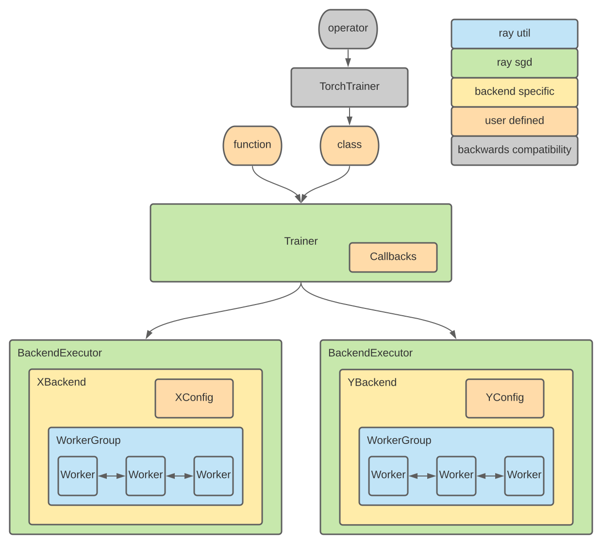

:orphan:

.. _sgd-arch:

Architecture
============

A diagram of the RaySGD architecture is provided below.

Trainer
-------

The Trainer is the main class that is exposed in the RaySGD API that users will interact with.

* The user will pass in a *function* which defines the training logic.
* The Trainer will create an :ref:`Executor <sgd-arch-executor>` to run the distributed training.
* The Trainer will handle callbacks based on the results from the BackendExecutor.

.. _sgd-arch-executor:

Executor
--------

The executor is an interface which handles execution of distributed training.

* The executor will handle the creation of an actor group and will be initialized in conjunction with a backend.
* Worker resources, number of workers, and placement strategy will be passed to the Worker Group.

Backend
-------

A backend is used in conjunction with the executor to initialize and manage framework-specific communication protocols.
Each communication library (Torch, Horovod, TensorFlow, etc.) will have a separate backend and will take a specific configuration value.

WorkerGroup
-----------

The WorkerGroup is a generic utility class for managing a group of Ray Actors.

* This is similar in concept to Fiber's `Ring <https://uber.github.io/fiber/experimental/ring/>`_.
