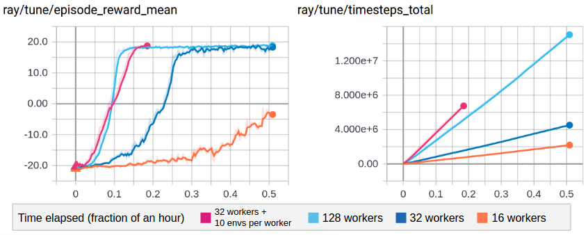
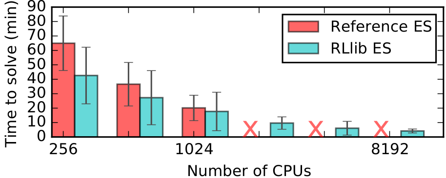

RLlib Algorithms
================

High-throughput architectures
~~~~~~~~~~~~~~~~~~~~~~~~~~~~~

Distributed Prioritized Experience Replay (Ape-X)
-------------------------------------------------
`[paper] <https://arxiv.org/abs/1803.00933>`__
`[implementation] <https://github.com/ray-project/ray/blob/master/python/ray/rllib/agents/dqn/apex.py>`__
Ape-X variations of DQN, DDPG, and QMIX (`APEX_DQN <https://github.com/ray-project/ray/blob/master/python/ray/rllib/agents/dqn/apex.py>`__, `APEX_DDPG <https://github.com/ray-project/ray/blob/master/python/ray/rllib/agents/ddpg/apex.py>`__, `APEX_QMIX <https://github.com/ray-project/ray/blob/master/python/ray/rllib/agents/qmix/apex.py>`__) use a single GPU learner and many CPU workers for experience collection. Experience collection can scale to hundreds of CPU workers due to the distributed prioritization of experience prior to storage in replay buffers.

Tuned examples: `PongNoFrameskip-v4 <https://github.com/ray-project/ray/blob/master/python/ray/rllib/tuned_examples/pong-apex.yaml>`__, `Pendulum-v0 <https://github.com/ray-project/ray/blob/master/python/ray/rllib/tuned_examples/pendulum-apex-ddpg.yaml>`__, `MountainCarContinuous-v0 <https://github.com/ray-project/ray/blob/master/python/ray/rllib/tuned_examples/mountaincarcontinuous-apex-ddpg.yaml>`__, `{BeamRider,Breakout,Qbert,SpaceInvaders}NoFrameskip-v4 <https://github.com/ray-project/ray/blob/master/python/ray/rllib/tuned_examples/atari-apex.yaml>`__.

**Atari results @10M steps**: `more details <https://github.com/ray-project/rl-experiments>`__

=============  ================================  ========================================
 Atari env     RLlib Ape-X 8-workers             Mnih et al Async DQN 16-workers
=============  ================================  ========================================
BeamRider      6134                              ~6000
Breakout       123                               ~50
Qbert          15302                             ~1200
SpaceInvaders  686                               ~600
=============  ================================  ========================================

**Scalability**:

=============  ================================  ========================================
 Atari env     RLlib Ape-X 8-workers @1 hour     Mnih et al Async DQN 16-workers @1 hour
=============  ================================  ========================================
BeamRider      4873                              ~1000
Breakout       77                                ~10
Qbert          4083                              ~500
SpaceInvaders  646                               ~300
=============  ================================  ========================================

.. figure:: apex.png

    Ape-X using 32 workers in RLlib vs vanilla DQN (orange) and A3C (blue) on PongNoFrameskip-v4.

**Ape-X specific configs** (see also `common configs <rllib-training.html#common-parameters>`__):

.. literalinclude:: ../../python/ray/rllib/agents/dqn/apex.py
   :language: python
   :start-after: __sphinx_doc_begin__
   :end-before: __sphinx_doc_end__

Importance Weighted Actor-Learner Architecture (IMPALA)
-------------------------------------------------------

`[paper] <https://arxiv.org/abs/1802.01561>`__
`[implementation] <https://github.com/ray-project/ray/blob/master/python/ray/rllib/agents/impala/impala.py>`__
In IMPALA, a central learner runs SGD in a tight loop while asynchronously pulling sample batches from many actor processes. RLlib's IMPALA implementation uses DeepMind's reference `V-trace code <https://github.com/deepmind/scalable_agent/blob/master/vtrace.py>`__. Note that we do not provide a deep residual network out of the box, but one can be plugged in as a `custom model <rllib-models.html#custom-models-tensorflow>`__. Multiple learner GPUs and experience replay are also supported.

Tuned examples: `PongNoFrameskip-v4 <https://github.com/ray-project/ray/blob/master/python/ray/rllib/tuned_examples/pong-impala.yaml>`__, `vectorized configuration <https://github.com/ray-project/ray/blob/master/python/ray/rllib/tuned_examples/pong-impala-vectorized.yaml>`__, `multi-gpu configuration <https://github.com/ray-project/ray/blob/master/python/ray/rllib/tuned_examples/pong-impala-fast.yaml>`__, `{BeamRider,Breakout,Qbert,SpaceInvaders}NoFrameskip-v4 <https://github.com/ray-project/ray/blob/master/python/ray/rllib/tuned_examples/atari-impala.yaml>`__

**Atari results @10M steps**: `more details <https://github.com/ray-project/rl-experiments>`__

=============  ==================================  ====================================
 Atari env     RLlib IMPALA 32-workers             Mnih et al A3C 16-workers
=============  ==================================  ====================================
BeamRider      2071                                ~3000
Breakout       385                                 ~150
Qbert          4068                                ~1000
SpaceInvaders  719                                 ~600
=============  ==================================  ====================================

**Scalability:**

=============  ===============================  =================================
 Atari env     RLlib IMPALA 32-workers @1 hour  Mnih et al A3C 16-workers @1 hour
=============  ===============================  =================================
BeamRider      3181                             ~1000
Breakout       538                              ~10
Qbert          10850                            ~500
SpaceInvaders  843                              ~300
=============  ===============================  =================================

   Multi-GPU IMPALA scales up to solve PongNoFrameskip-v4 in ~3 minutes using a pair of V100 GPUs and 128 CPU workers.
   The maximum training throughput reached is ~30k transitions per second (~120k environment frames per second).

**IMPALA-specific configs** (see also `common configs <rllib-training.html#common-parameters>`__):

.. literalinclude:: ../../python/ray/rllib/agents/impala/impala.py
   :language: python
   :start-after: __sphinx_doc_begin__
   :end-before: __sphinx_doc_end__

Asynchronous Proximal Policy Optimization (APPO)
------------------------------------------------

`[paper] <https://arxiv.org/abs/1707.06347>`__
`[implementation] <https://github.com/ray-project/ray/blob/master/python/ray/rllib/agents/ppo/appo.py>`__
We include an asynchronous variant of Proximal Policy Optimization (PPO) based on the IMPALA architecture. This is similar to IMPALA but using a surrogate policy loss with clipping. Compared to synchronous PPO, APPO is more efficient in wall-clock time due to its use of asynchronous sampling. Using a clipped loss also allows for multiple SGD passes, and therefore the potential for better sample efficiency compared to IMPALA. V-trace can also be enabled to correct for off-policy samples.

APPO is not always more efficient; it is often better to simply use `PPO <rllib-algorithms.html#proximal-policy-optimization-ppo>`__ or `IMPALA <rllib-algorithms.html#importance-weighted-actor-learner-architecture-impala>`__.

Tuned examples: `PongNoFrameskip-v4 <https://github.com/ray-project/ray/blob/master/python/ray/rllib/tuned_examples/pong-appo.yaml>`__

**APPO-specific configs** (see also `common configs <rllib-training.html#common-parameters>`__):

.. literalinclude:: ../../python/ray/rllib/agents/ppo/appo.py
   :language: python
   :start-after: __sphinx_doc_begin__
   :end-before: __sphinx_doc_end__

Gradient-based
~~~~~~~~~~~~~~

Advantage Actor-Critic (A2C, A3C)
---------------------------------
`[paper] <https://arxiv.org/abs/1602.01783>`__ `[implementation] <https://github.com/ray-project/ray/blob/master/python/ray/rllib/agents/a3c/a3c.py>`__
RLlib implements A2C and A3C using SyncSamplesOptimizer and AsyncGradientsOptimizer respectively for policy optimization. These algorithms scale to up to 16-32 worker processes depending on the environment. Both a TensorFlow (LSTM), and PyTorch version are available.

Tuned examples: `PongDeterministic-v4 <https://github.com/ray-project/ray/blob/master/python/ray/rllib/tuned_examples/pong-a3c.yaml>`__, `PyTorch version <https://github.com/ray-project/ray/blob/master/python/ray/rllib/tuned_examples/pong-a3c-pytorch.yaml>`__, `{BeamRider,Breakout,Qbert,SpaceInvaders}NoFrameskip-v4 <https://github.com/ray-project/ray/blob/master/python/ray/rllib/tuned_examples/atari-a2c.yaml>`__

.. tip::
    Consider using `IMPALA <#importance-weighted-actor-learner-architecture-impala>`__ for faster training with similar timestep efficiency.

**Atari results @10M steps**: `more details <https://github.com/ray-project/rl-experiments>`__

=============  ========================  ==============================
 Atari env     RLlib A2C 5-workers       Mnih et al A3C 16-workers
=============  ========================  ==============================
BeamRider      1401                      ~3000
Breakout       374                       ~150
Qbert          3620                      ~1000
SpaceInvaders  692                       ~600
=============  ========================  ==============================

**A3C-specific configs** (see also `common configs <rllib-training.html#common-parameters>`__):

.. literalinclude:: ../../python/ray/rllib/agents/a3c/a3c.py
   :language: python
   :start-after: __sphinx_doc_begin__
   :end-before: __sphinx_doc_end__

Deep Deterministic Policy Gradients (DDPG, TD3)
-----------------------------------------------
`[paper] <https://arxiv.org/abs/1509.02971>`__ `[implementation] <https://github.com/ray-project/ray/blob/master/python/ray/rllib/agents/ddpg/ddpg.py>`__
DDPG is implemented similarly to DQN (below). The algorithm can be scaled by increasing the number of workers, switching to AsyncGradientsOptimizer, or using Ape-X. The improvements from `TD3 <https://spinningup.openai.com/en/latest/algorithms/td3.html>`__ are available though not enabled by default.

Tuned examples: `Pendulum-v0 <https://github.com/ray-project/ray/blob/master/python/ray/rllib/tuned_examples/pendulum-ddpg.yaml>`__, `MountainCarContinuous-v0 <https://github.com/ray-project/ray/blob/master/python/ray/rllib/tuned_examples/mountaincarcontinuous-ddpg.yaml>`__, `HalfCheetah-v2 <https://github.com/ray-project/ray/blob/master/python/ray/rllib/tuned_examples/halfcheetah-ddpg.yaml>`__, `TD3 Pendulum-v0 <https://github.com/ray-project/ray/blob/master/python/ray/rllib/tuned_examples/pendulum-td3.yaml>`__, `TD3 InvertedPendulum-v2 <https://github.com/ray-project/ray/blob/master/python/ray/rllib/tuned_examples/invertedpendulum-td3.yaml>`__, `TD3 Mujoco suite (Ant-v2, HalfCheetah-v2, Hopper-v2, Walker2d-v2) <https://github.com/ray-project/ray/blob/master/python/ray/rllib/tuned_examples/mujoco-td3.yaml>`__.

**DDPG-specific configs** (see also `common configs <rllib-training.html#common-parameters>`__):

.. literalinclude:: ../../python/ray/rllib/agents/ddpg/ddpg.py
   :language: python
   :start-after: __sphinx_doc_begin__
   :end-before: __sphinx_doc_end__

Deep Q Networks (DQN, Rainbow, Parametric DQN)
----------------------------------------------
`[paper] <https://arxiv.org/abs/1312.5602>`__ `[implementation] <https://github.com/ray-project/ray/blob/master/python/ray/rllib/agents/dqn/dqn.py>`__
RLlib DQN is implemented using the SyncReplayOptimizer. The algorithm can be scaled by increasing the number of workers, using the AsyncGradientsOptimizer for async DQN, or using Ape-X. Memory usage is reduced by compressing samples in the replay buffer with LZ4. All of the DQN improvements evaluated in `Rainbow <https://arxiv.org/abs/1710.02298>`__ are available, though not all are enabled by default. See also how to use `parametric-actions in DQN <rllib-models.html#variable-length-parametric-action-spaces>`__.

Tuned examples: `PongDeterministic-v4 <https://github.com/ray-project/ray/blob/master/python/ray/rllib/tuned_examples/pong-dqn.yaml>`__, `Rainbow configuration <https://github.com/ray-project/ray/blob/master/python/ray/rllib/tuned_examples/pong-rainbow.yaml>`__, `{BeamRider,Breakout,Qbert,SpaceInvaders}NoFrameskip-v4 <https://github.com/ray-project/ray/blob/master/python/ray/rllib/tuned_examples/atari-basic-dqn.yaml>`__, `with Dueling and Double-Q <https://github.com/ray-project/ray/blob/master/python/ray/rllib/tuned_examples/atari-duel-ddqn.yaml>`__, `with Distributional DQN <https://github.com/ray-project/ray/blob/master/python/ray/rllib/tuned_examples/atari-dist-dqn.yaml>`__.

.. tip::
    Consider using `Ape-X <#distributed-prioritized-experience-replay-ape-x>`__ for faster training with similar timestep efficiency.

**Atari results @10M steps**: `more details <https://github.com/ray-project/rl-experiments>`__

=============  ========================  =============================  ==============================  ===============================
 Atari env     RLlib DQN                 RLlib Dueling DDQN             RLlib Dist. DQN                 Hessel et al. DQN              
=============  ========================  =============================  ==============================  ===============================
BeamRider      2869                      1910                           4447                            ~2000                          
Breakout       287                       312                            410                             ~150                           
Qbert          3921                      7968                           15780                           ~4000                          
SpaceInvaders  650                       1001                           1025                            ~500                           
=============  ========================  =============================  ==============================  ===============================

**DQN-specific configs** (see also `common configs <rllib-training.html#common-parameters>`__):

.. literalinclude:: ../../python/ray/rllib/agents/dqn/dqn.py
   :language: python
   :start-after: __sphinx_doc_begin__
   :end-before: __sphinx_doc_end__

Policy Gradients
----------------
`[paper] <https://papers.nips.cc/paper/1713-policy-gradient-methods-for-reinforcement-learning-with-function-approximation.pdf>`__ `[implementation] <https://github.com/ray-project/ray/blob/master/python/ray/rllib/agents/pg/pg.py>`__ We include a vanilla policy gradients implementation as an example algorithm in both TensorFlow and PyTorch. This is usually outperformed by PPO.

Tuned examples: `CartPole-v0 <https://github.com/ray-project/ray/blob/master/python/ray/rllib/tuned_examples/regression_tests/cartpole-pg.yaml>`__

**PG-specific configs** (see also `common configs <rllib-training.html#common-parameters>`__):

.. literalinclude:: ../../python/ray/rllib/agents/pg/pg.py
   :language: python
   :start-after: __sphinx_doc_begin__
   :end-before: __sphinx_doc_end__

Proximal Policy Optimization (PPO)
----------------------------------
`[paper] <https://arxiv.org/abs/1707.06347>`__ `[implementation] <https://github.com/ray-project/ray/blob/master/python/ray/rllib/agents/ppo/ppo.py>`__
PPO's clipped objective supports multiple SGD passes over the same batch of experiences. RLlib's multi-GPU optimizer pins that data in GPU memory to avoid unnecessary transfers from host memory, substantially improving performance over a naive implementation. RLlib's PPO scales out using multiple workers for experience collection, and also with multiple GPUs for SGD.

Tuned examples: `Humanoid-v1 <https://github.com/ray-project/ray/blob/master/python/ray/rllib/tuned_examples/humanoid-ppo-gae.yaml>`__, `Hopper-v1 <https://github.com/ray-project/ray/blob/master/python/ray/rllib/tuned_examples/hopper-ppo.yaml>`__, `Pendulum-v0 <https://github.com/ray-project/ray/blob/master/python/ray/rllib/tuned_examples/pendulum-ppo.yaml>`__, `PongDeterministic-v4 <https://github.com/ray-project/ray/blob/master/python/ray/rllib/tuned_examples/pong-ppo.yaml>`__, `Walker2d-v1 <https://github.com/ray-project/ray/blob/master/python/ray/rllib/tuned_examples/walker2d-ppo.yaml>`__, `HalfCheetah-v2 <https://github.com/ray-project/ray/blob/master/python/ray/rllib/tuned_examples/halfcheetah-ppo.yaml>`__, `{BeamRider,Breakout,Qbert,SpaceInvaders}NoFrameskip-v4 <https://github.com/ray-project/ray/blob/master/python/ray/rllib/tuned_examples/atari-ppo.yaml>`__

**Atari results**: `more details <https://github.com/ray-project/rl-experiments>`__

=============  ==============  ==============  ==================
 Atari env     RLlib PPO @10M  RLlib PPO @25M  Baselines PPO @10M
=============  ==============  ==============  ==================
BeamRider      2807            4480            ~1800
Breakout       104             201             ~250
Qbert          11085           14247           ~14000
SpaceInvaders  671             944             ~800
=============  ==============  ==============  ==================

**Scalability:** `more details <https://github.com/ray-project/rl-experiments>`__

=============  =========================  =============================
MuJoCo env     RLlib PPO 16-workers @ 1h  Fan et al PPO 16-workers @ 1h
=============  =========================  =============================
HalfCheetah    9664                       ~7700 
=============  =========================  =============================

.. figure:: ppo.png
   :width: 500px

   RLlib's multi-GPU PPO scales to multiple GPUs and hundreds of CPUs on solving the Humanoid-v1 task. Here we compare against a reference MPI-based implementation.

**PPO-specific configs** (see also `common configs <rllib-training.html#common-parameters>`__):

.. literalinclude:: ../../python/ray/rllib/agents/ppo/ppo.py
   :language: python
   :start-after: __sphinx_doc_begin__
   :end-before: __sphinx_doc_end__

Derivative-free
~~~~~~~~~~~~~~~

Augmented Random Search (ARS)
-----------------------------
`[paper] <https://arxiv.org/abs/1803.07055>`__ `[implementation] <https://github.com/ray-project/ray/blob/master/python/ray/rllib/agents/ars/ars.py>`__
ARS is a random search method for training linear policies for continuous control problems. Code here is adapted from https://github.com/modestyachts/ARS to integrate with RLlib APIs.

Tuned examples: `CartPole-v0 <https://github.com/ray-project/ray/blob/master/python/ray/rllib/tuned_examples/regression_tests/cartpole-ars.yaml>`__, `Swimmer-v2 <https://github.com/ray-project/ray/blob/master/python/ray/rllib/tuned_examples/swimmer-ars.yaml>`__

**ARS-specific configs** (see also `common configs <rllib-training.html#common-parameters>`__):

.. literalinclude:: ../../python/ray/rllib/agents/ars/ars.py
   :language: python
   :start-after: __sphinx_doc_begin__
   :end-before: __sphinx_doc_end__

Evolution Strategies
--------------------
`[paper] <https://arxiv.org/abs/1703.03864>`__ `[implementation] <https://github.com/ray-project/ray/blob/master/python/ray/rllib/agents/es/es.py>`__
Code here is adapted from https://github.com/openai/evolution-strategies-starter to execute in the distributed setting with Ray.

Tuned examples: `Humanoid-v1 <https://github.com/ray-project/ray/blob/master/python/ray/rllib/tuned_examples/humanoid-es.yaml>`__

**Scalability:**

   RLlib's ES implementation scales further and is faster than a reference Redis implementation on solving the Humanoid-v1 task.

**ES-specific configs** (see also `common configs <rllib-training.html#common-parameters>`__):

.. literalinclude:: ../../python/ray/rllib/agents/es/es.py
   :language: python
   :start-after: __sphinx_doc_begin__
   :end-before: __sphinx_doc_end__

QMIX Monotonic Value Factorisation (QMIX, VDN, IQN)
---------------------------------------------------
`[paper] <https://arxiv.org/abs/1803.11485>`__ `[implementation] <https://github.com/ray-project/ray/blob/master/python/ray/rllib/agents/qmix/qmix.py>`__ Q-Mix is a specialized multi-agent algorithm. Code here is adapted from https://github.com/oxwhirl/pymarl_alpha  to integrate with RLlib multi-agent APIs. To use Q-Mix, you must specify an agent `grouping <rllib-env.html#grouping-agents>`__ in the environment (see the `two-step game example <https://github.com/ray-project/ray/blob/master/python/ray/rllib/examples/twostep_game.py>`__). Currently, all agents in the group must be homogeneous. The algorithm can be scaled by increasing the number of workers or using Ape-X.

Q-Mix is implemented in `PyTorch <https://github.com/ray-project/ray/blob/master/python/ray/rllib/agents/qmix/qmix_policy.py>`__ and is currently *experimental*.

Tuned examples: `Two-step game <https://github.com/ray-project/ray/blob/master/python/ray/rllib/examples/twostep_game.py>`__

**QMIX-specific configs** (see also `common configs <rllib-training.html#common-parameters>`__):

.. literalinclude:: ../../python/ray/rllib/agents/qmix/qmix.py
   :language: python
   :start-after: __sphinx_doc_begin__
   :end-before: __sphinx_doc_end__

Advantage Re-Weighted Imitation Learning (MARWIL)
-------------------------------------------------

`[paper] <http://papers.nips.cc/paper/7866-exponentially-weighted-imitation-learning-for-batched-historical-data>`__ `[implementation] <https://github.com/ray-project/ray/blob/master/python/ray/rllib/agents/marwil/marwil.py>`__ MARWIL is a hybrid imitation learning and policy gradient algorithm suitable for training on batched historical data. When the ``beta`` hyperparameter is set to zero, the MARWIL objective reduces to vanilla imitation learning. MARWIL requires the `offline datasets API <rllib-offline.html>`__ to be used.

Tuned examples: `CartPole-v0 <https://github.com/ray-project/ray/blob/master/python/ray/rllib/examples/cartpole-marwil.py>`__

**MARWIL-specific configs** (see also `common configs <rllib-training.html#common-parameters>`__):

.. literalinclude:: ../../python/ray/rllib/agents/marwil/marwil.py
   :language: python
   :start-after: __sphinx_doc_begin__
   :end-before: __sphinx_doc_end__
