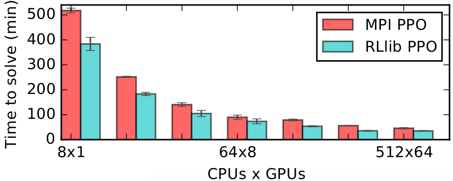

RLlib Algorithms
================

High-throughput architectures
~~~~~~~~~~~~~~~~~~~~~~~~~~~~~

Distributed Prioritized Experience Replay (Ape-X)
-------------------------------------------------
`[paper] <https://arxiv.org/abs/1803.00933>`__
`[implementation] <https://github.com/ray-project/ray/blob/master/python/ray/rllib/agents/dqn/apex.py>`__
Ape-X variations of DQN and DDPG (`APEX_DQN <https://github.com/ray-project/ray/blob/master/python/ray/rllib/agents/dqn/apex.py>`__, `APEX_DDPG <https://github.com/ray-project/ray/blob/master/python/ray/rllib/agents/ddpg/apex.py>`__ in RLlib) use a single GPU learner and many CPU workers for experience collection. Experience collection can scale to hundreds of CPU workers due to the distributed prioritization of experience prior to storage in replay buffers.

Tuned examples: `PongNoFrameskip-v4 <https://github.com/ray-project/ray/blob/master/python/ray/rllib/tuned_examples/pong-apex.yaml>`__, `Pendulum-v0 <https://github.com/ray-project/ray/blob/master/python/ray/rllib/tuned_examples/pendulum-apex-ddpg.yaml>`__, `MountainCarContinuous-v0 <https://github.com/ray-project/ray/blob/master/python/ray/rllib/tuned_examples/mountaincarcontinuous-apex-ddpg.yaml>`__

.. figure:: apex.png

    Ape-X using 32 workers in RLlib vs vanilla DQN (orange) and A3C (blue) on PongNoFrameskip-v4.

Importance Weighted Actor-Learner Architecture (IMPALA)
-------------------------------------------------------

`[paper] <https://arxiv.org/abs/1802.01561>`__
`[implementation] <https://github.com/ray-project/ray/blob/master/python/ray/rllib/agents/impala/impala.py>`__
In IMPALA, a central learner runs SGD in a tight loop while asynchronously pulling sample batches from many actor processes. RLlib's IMPALA implementation uses DeepMind's reference `V-trace code <https://github.com/deepmind/scalable_agent/blob/master/vtrace.py>`__. Note that we do not provide a deep residual network out of the box, but one can be plugged in as a `custom model <rllib-models.html#custom-models>`__.

Tuned examples: `PongNoFrameskip-v4 <https://github.com/ray-project/ray/blob/master/python/ray/rllib/tuned_examples/pong-impala.yaml>`__, `vectorized configuration <https://github.com/ray-project/ray/blob/master/python/ray/rllib/tuned_examples/pong-impala-vectorized.yaml>`__, `{BeamRider,Breakout,Qbert,SpaceInvaders}NoFrameskip-v4 <https://github.com/ray-project/ray/blob/master/python/ray/rllib/tuned_examples/atari-impala.yaml>`__, `Atari results <https://github.com/ray-project/rl-experiments>`__.

.. figure:: impala.png
   :align: center

   IMPALA solves Atari several times faster than A2C / A3C, with similar sample efficiency. Here IMPALA scales from 16 to 128 workers to solve PongNoFrameskip-v4 in ~8 minutes.

Gradient-based
~~~~~~~~~~~~~~

Advantage Actor-Critic (A2C, A3C)
---------------------------------
`[paper] <https://arxiv.org/abs/1602.01783>`__ `[implementation] <https://github.com/ray-project/ray/blob/master/python/ray/rllib/agents/a3c/a3c.py>`__
RLlib implements A2C and A3C using SyncSamplesOptimizer and AsyncGradientsOptimizer respectively for policy optimization. These algorithms scale to up to 16-32 worker processes depending on the environment. Both a TensorFlow (LSTM), and PyTorch version are available.

.. note::
    In most cases, `IMPALA <#importance-weighted-actor-learner-architecture-impala>`__ will outperform A2C / A3C. In `benchmarks <https://github.com/ray-project/rl-experiments>`__, IMPALA is almost 10x faster than A2C in wallclock time, with similar sample efficiency.

Tuned examples: `PongDeterministic-v4 <https://github.com/ray-project/ray/blob/master/python/ray/rllib/tuned_examples/pong-a3c.yaml>`__, `PyTorch version <https://github.com/ray-project/ray/blob/master/python/ray/rllib/tuned_examples/pong-a3c-pytorch.yaml>`__, `{BeamRider,Breakout,Qbert,SpaceInvaders}NoFrameskip-v4 <https://github.com/ray-project/ray/blob/master/python/ray/rllib/tuned_examples/atari-a2c.yaml>`__, `Atari results <https://github.com/ray-project/rl-experiments>`__.

Deep Deterministic Policy Gradients (DDPG)
------------------------------------------
`[paper] <https://arxiv.org/abs/1509.02971>`__ `[implementation] <https://github.com/ray-project/ray/blob/master/python/ray/rllib/agents/ddpg/ddpg.py>`__
DDPG is implemented similarly to DQN (below). The algorithm can be scaled by increasing the number of workers, switching to AsyncGradientsOptimizer, or using Ape-X.

Tuned examples: `Pendulum-v0 <https://github.com/ray-project/ray/blob/master/python/ray/rllib/tuned_examples/pendulum-ddpg.yaml>`__, `MountainCarContinuous-v0 <https://github.com/ray-project/ray/blob/master/python/ray/rllib/tuned_examples/mountaincarcontinuous-ddpg.yaml>`__, `HalfCheetah-v2 <https://github.com/ray-project/ray/blob/master/python/ray/rllib/tuned_examples/halfcheetah-ddpg.yaml>`__

Deep Q Networks (DQN, Rainbow)
------------------------------
`[paper] <https://arxiv.org/abs/1312.5602>`__ `[implementation] <https://github.com/ray-project/ray/blob/master/python/ray/rllib/agents/dqn/dqn.py>`__
RLlib DQN is implemented using the SyncReplayOptimizer. The algorithm can be scaled by increasing the number of workers, using the AsyncGradientsOptimizer for async DQN, or using Ape-X. Memory usage is reduced by compressing samples in the replay buffer with LZ4. All of the DQN improvements evaluated in `Rainbow <https://arxiv.org/abs/1710.02298>`__ are available, though not all are enabled by default. For more details, see these `DQN ablation experiments <https://github.com/ray-project/ray/pull/2701#issuecomment-415651381>`__.

Tuned examples: `PongDeterministic-v4 <https://github.com/ray-project/ray/blob/master/python/ray/rllib/tuned_examples/pong-dqn.yaml>`__, `Rainbow configuration <https://github.com/ray-project/ray/blob/master/python/ray/rllib/tuned_examples/pong-rainbow.yaml>`__

Policy Gradients
----------------
`[paper] <https://papers.nips.cc/paper/1713-policy-gradient-methods-for-reinforcement-learning-with-function-approximation.pdf>`__ `[implementation] <https://github.com/ray-project/ray/blob/master/python/ray/rllib/agents/pg/pg.py>`__ We include a vanilla policy gradients implementation as an example algorithm. This is usually outperformed by PPO.

Tuned examples: `CartPole-v0 <https://github.com/ray-project/ray/blob/master/python/ray/rllib/tuned_examples/regression_tests/cartpole-pg.yaml>`__

Proximal Policy Optimization (PPO)
----------------------------------
`[paper] <https://arxiv.org/abs/1707.06347>`__ `[implementation] <https://github.com/ray-project/ray/blob/master/python/ray/rllib/agents/ppo/ppo.py>`__
PPO's clipped objective supports multiple SGD passes over the same batch of experiences. RLlib's multi-GPU optimizer pins that data in GPU memory to avoid unnecessary transfers from host memory, substantially improving performance over a naive implementation. RLlib's PPO scales out using multiple workers for experience collection, and also with multiple GPUs for SGD.

Tuned examples: `Humanoid-v1 <https://github.com/ray-project/ray/blob/master/python/ray/rllib/tuned_examples/humanoid-ppo-gae.yaml>`__, `Hopper-v1 <https://github.com/ray-project/ray/blob/master/python/ray/rllib/tuned_examples/hopper-ppo.yaml>`__, `Pendulum-v0 <https://github.com/ray-project/ray/blob/master/python/ray/rllib/tuned_examples/pendulum-ppo.yaml>`__, `PongDeterministic-v4 <https://github.com/ray-project/ray/blob/master/python/ray/rllib/tuned_examples/pong-ppo.yaml>`__, `Walker2d-v1 <https://github.com/ray-project/ray/blob/master/python/ray/rllib/tuned_examples/walker2d-ppo.yaml>`__, `{BeamRider,Breakout,Qbert,SpaceInvaders}NoFrameskip-v4 <https://github.com/ray-project/ray/blob/master/python/ray/rllib/tuned_examples/atari-ppo.yaml>`__, `Atari results <https://github.com/ray-project/rl-experiments>`__.

   RLlib's multi-GPU PPO scales to multiple GPUs and hundreds of CPUs. Here we compare against a reference MPI-based implementation.

Derivative-free
~~~~~~~~~~~~~~~

Augmented Random Search (ARS)
-----------------------------
`[paper] <https://arxiv.org/abs/1803.07055>`__ `[implementation] <https://github.com/ray-project/ray/blob/master/python/ray/rllib/agents/ars/ars.py>`__
ARS is a random search method for training linear policies for continuous control problems. Code here is adapted from https://github.com/modestyachts/ARS to integrate with RLlib APIs.

Tuned examples: `CartPole-v0 <https://github.com/ray-project/ray/blob/master/python/ray/rllib/tuned_examples/regression_tests/cartpole-ars.yaml>`__, `Swimmer-v2 <https://github.com/ray-project/ray/blob/master/python/ray/rllib/tuned_examples/swimmer-ars.yaml>`__

Evolution Strategies
--------------------
`[paper] <https://arxiv.org/abs/1703.03864>`__ `[implementation] <https://github.com/ray-project/ray/blob/master/python/ray/rllib/agents/es/es.py>`__
Code here is adapted from https://github.com/openai/evolution-strategies-starter to execute in the distributed setting with Ray.

Tuned examples: `Humanoid-v1 <https://github.com/ray-project/ray/blob/master/python/ray/rllib/tuned_examples/humanoid-es.yaml>`__

.. figure:: es.png
   :width: 500px
   :align: center

   RLlib's ES implementation scales further and is faster than a reference Redis implementation.
